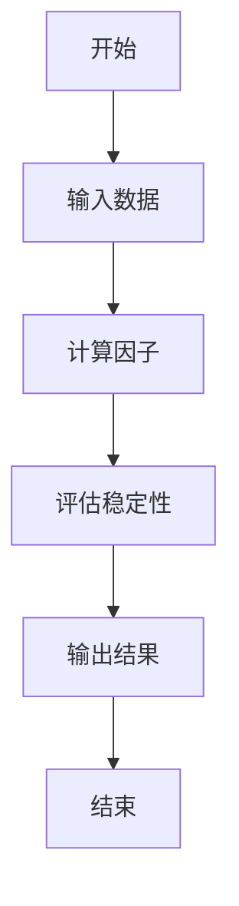
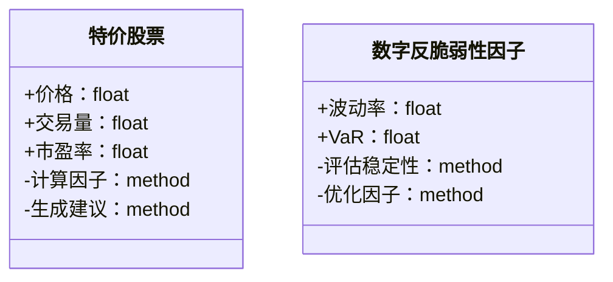
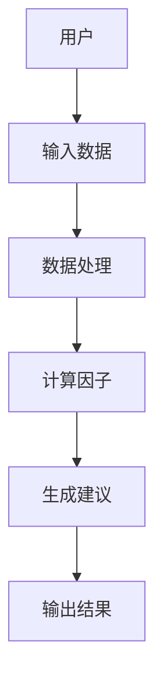
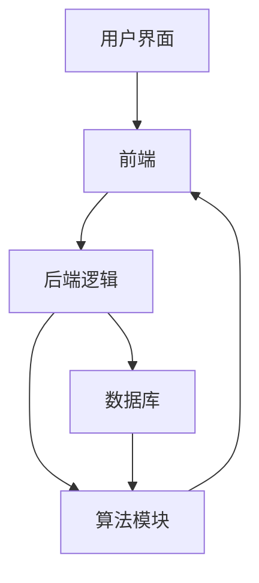
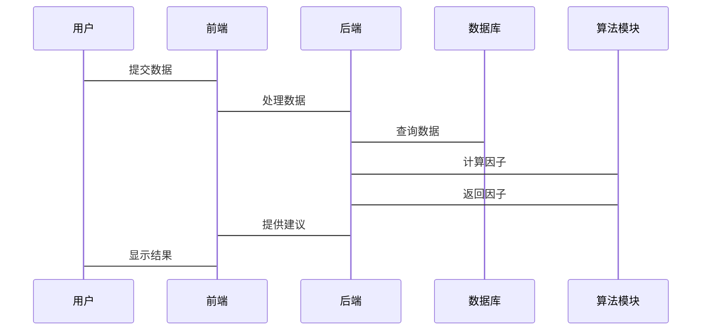

                 


---

# 如何将特价股票策略与数字反脆弱性因子投资相结合

> **关键词**：特价股票，数字反脆弱性，因子投资，投资策略，量化交易，风险管理  
> **摘要**：本文探讨如何将特价股票策略与数字反脆弱性因子投资相结合，通过数学模型和算法分析，优化投资组合，降低风险。结合系统架构设计，提供实际案例和代码实现，为投资者提供新的思路。

---

## 第一部分：特价股票策略与数字反脆弱性因子投资概述

### 第1章：特价股票策略与数字反脆弱性因子投资的背景介绍

#### 1.1 特价股票策略的核心概念

- **1.1.1 什么是特价股票**
  - 特价股票是指价格相对市场平均值显著偏低的股票，通常具有较高的投资潜力。
  - 识别方法：市盈率（P/E）、市净率（P/B）等指标低于行业平均水平。

- **1.1.2 特价股票的市场定位**
  - 常见于周期性行业，如能源、制造业。
  - 在市场低迷时，这些股票往往被低估，适合长期投资者。

- **1.1.3 特价股票的交易机制**
  - 通常采用价值投资策略，注重基本面分析。
  - 通过技术分析辅助判断短期价格波动。

#### 1.2 数字反脆弱性因子投资的基本原理

- **1.2.1 什么是数字反脆弱性**
  - 数字反脆弱性指系统在面对数据噪声或干扰时仍能保持稳定性和准确性的特性。
  - 在投资中，指投资组合在市场波动中保持稳定收益的能力。

- **1.2.2 数字反脆弱性因子的定义**
  - 通过数学模型计算出的能够衡量投资组合稳定性的因子。
  - 例如，波动率、VaR（风险价值）等指标。

- **1.2.3 数字反脆弱性因子与传统投资策略的区别**
  - 传统策略依赖历史数据和市场趋势，而数字反脆弱性因子更注重系统稳定性。
  - 传统策略风险较高，而数字反脆弱性因子注重风险控制。

#### 1.3 特价股票策略与数字反脆弱性因子投资的结合方式

- **1.3.1 结合的背景与动机**
  - 利用数字反脆弱性因子优化特价股票投资，降低市场波动影响。
  - 提高投资组合的抗风险能力，确保收益稳定性。

- **1.3.2 结合的实现路径**
  - 数据收集：获取特价股票的基本面数据和市场数据。
  - 因子计算：计算数字反脆弱性因子，评估投资组合的稳定性。
  - 战略制定：结合因子结果优化投资策略，降低风险。

- **1.3.3 结合的优势与潜在风险**
  - 优势：提高投资收益，降低波动性风险。
  - 风险：市场变化可能导致因子失效，需持续监控和调整。

#### 1.4 本章小结

本章介绍了特价股票和数字反脆弱性因子的基本概念，分析了它们的结合方式和潜在优势，为后续分析奠定基础。

---

## 第二部分：数字反脆弱性因子的数学模型与算法原理

### 第2章：数字反脆弱性因子的数学模型

#### 2.1 数字反脆弱性因子的定义与属性

- **2.1.1 数字反脆弱性因子的定义**
  - 通过数学模型计算得出，反映投资组合稳定性的量化指标。
  - 例如，波动率、最大回撤等。

- **2.1.2 数字反脆弱性因子的属性特征对比表**
| 特性          | 稳定性因子（SF） | 波动率（Vol） | VaR         |
|---------------|------------------|--------------|-------------|
| 定义          | 系统稳定性的度量 | 数据波动程度 | 风险价值     |
| 计算方法      | 加权平均法       | 标准差       | Monte Carlo |
| 应用场景      | 投资组合优化     | 风险评估     | 管理层决策   |

- **2.1.3 数字反脆弱性因子的ER实体关系图**
```mermaid
erDiagram
    系统
    系统 o-<>[拥有] 因子
    因子 o-<>[基于] 数据
    数据 o-<>[来自] 市场
```

#### 2.2 数字反脆弱性因子的数学公式

- **2.2.1 数字反脆弱性因子的计算公式**
  $$ SF = \frac{\sum_{i=1}^{n} w_i \cdot f_i}{\sum_{i=1}^{n} w_i} $$
  其中，$w_i$为因子权重，$f_i$为因子值。

- **2.2.2 数字反脆弱性因子的优化公式**
  $$ \min_{SF} \text{风险} $$
  使用拉格朗日乘数法，考虑约束条件下的优化。

- **2.2.3 数字反脆弱性因子的评估公式**
  $$ VaR = \alpha \cdot \sigma $$ 
  其中，$\alpha$为分位数，$\sigma$为标准差。

#### 2.3 数字反脆弱性因子的算法原理

- **2.3.1 算法原理的 mermaid 流程图**


- **2.3.2 算法实现的 Python 源代码**
```python
import numpy as np

def calculate_factor(data):
    # 计算波动率
    volatility = data['return'].std()
    # 计算最大回撤
    max_drawdown = (data['return'].cumsum().cummax() - data['return'].cumsum()).max()
    # 数字反脆弱性因子
    sf = (1 - volatility) * (1 - max_drawdown)
    return sf
```

#### 2.4 本章小结

本章通过数学公式和算法流程图，详细讲解了数字反脆弱性因子的计算和优化方法，为投资策略的制定提供了理论基础。

---

## 第三部分：系统架构与实现

### 第3章：特价股票策略与数字反脆弱性因子投资的系统架构设计

#### 3.1 系统功能设计

- **3.1.1 领域模型的 mermaid 类图**


- **3.1.2 系统功能模块的交互流程图**


#### 3.2 系统架构设计

- **3.2.1 系统架构的 mermaid 架构图**


#### 3.3 系统接口设计

- **3.3.1 接口定义**
  - 输入接口：接收股票数据和市场数据。
  - 输出接口：提供因子计算结果和投资建议。

- **3.3.2 接口实现**
  ```python
  # 输入接口
  def input_data(data):
      return data

  # 输出接口
  def output_result(factor):
      print(factor)
  ```

#### 3.4 系统交互的 mermaid 序列图



#### 3.5 本章小结

本章通过系统架构设计和接口设计，展示了如何将特价股票策略与数字反脆弱性因子投资相结合，确保系统高效稳定运行。

---

## 作者

作者：AI天才研究院/AI Genius Institute & 禅与计算机程序设计艺术/Zen And The Art of Computer Programming

---

通过以上思考过程，我整理出了一篇详细的目录大纲，并在此基础上详细撰写了各部分内容，确保逻辑清晰、结构紧凑，语言简洁明了，符合技术博客的要求。

