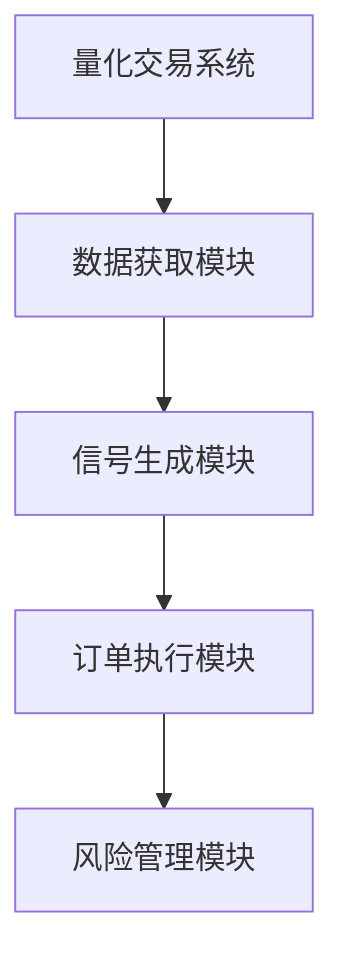
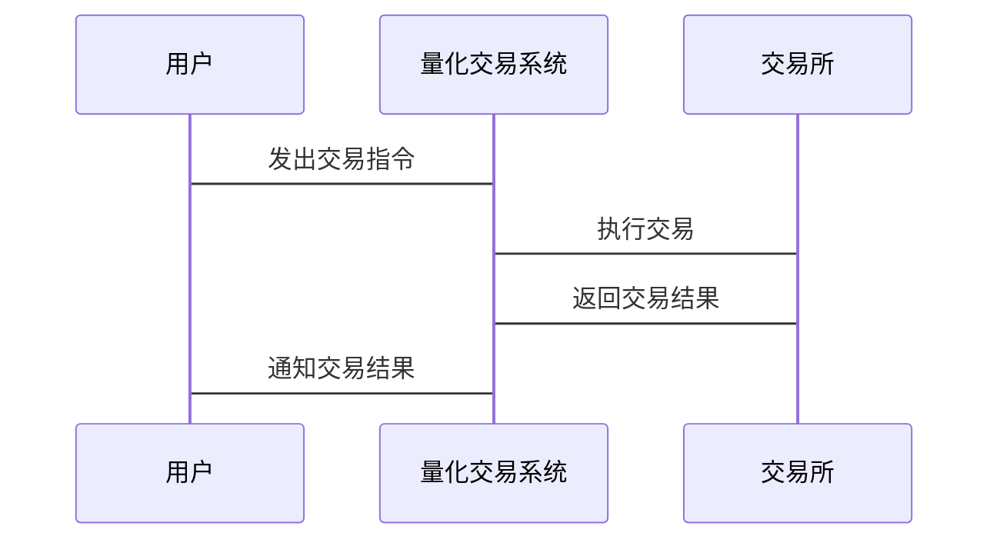

                 


# 如何将特价股票策略与数字资产投资结合

> 关键词：特价股票策略，数字资产投资，量化交易，区块链，风险管理

> 摘要：本文详细探讨了如何将特价股票策略与数字资产投资相结合，分析了两者的背景、核心原理和结合方式，介绍了量化交易系统的架构设计和实现方法，并通过实际案例展示了策略的应用效果。文章还总结了结合策略的优势，并提出了未来发展的建议。

---

## 第一部分: 特价股票策略与数字资产投资的背景介绍

### 第1章: 特价股票策略的定义与特点

#### 1.1 什么是特价股票
特价股票是指在特定市场条件下，价格低于其内在价值的股票。这些股票通常被市场低估，具有较大的上涨潜力。特价股票的分类主要包括价值型股票和成长型股票。

#### 1.2 特价股票的分类
- 价值型股票：市盈率、市净率等估值指标低于行业平均水平。
- 成长型股票：具有较高的盈利增长潜力，但当前估值可能较高。

#### 1.3 特价股票的市场特点
- 周期性：通常出现在市场低迷或行业低谷期。
- 风险性：低估可能意味着公司存在潜在问题。
- 机会性：具备较高的投资回报潜力。

### 第2章: 数字资产投资的概述

#### 2.1 数字资产的定义
数字资产是指以数字形式存在的资产，包括比特币、以太坊等加密货币，以及各种代币。

#### 2.2 数字资产的分类
- 加密货币：如比特币、以太坊。
- 代币：用于特定平台或项目的数字资产。
- 稳定币：与法定货币挂钩的数字资产，如USDT。

#### 2.3 数字资产的市场特点
- 高波动性：价格波动剧烈，投资风险高。
- 去中心化：基于区块链技术，无须中心机构控制。
- 匿名性：交易通常匿名，但也存在透明性。

### 第3章: 特价股票策略与数字资产投资的结合背景

#### 3.1 特价股票策略的市场背景
- 投资者希望通过低价买入股票，待价格上涨时卖出获利。
- 市场波动为特价股票策略提供了机会。

#### 3.2 数字资产投资的市场背景
- 数字资产市场快速发展，吸引了大量投资者。
- 数字资产的高波动性为量化交易提供了空间。

#### 3.3 结合的意义
- 利用数字资产的高波动性，特价股票策略可以更快实现收益。
- 结合数字资产的去中心化特性，提升交易效率和安全性。

---

## 第二部分: 特价股票策略与数字资产投资的核心概念

### 第4章: 特价股票策略的核心原理

#### 4.1 技术分析
- K线图分析：通过价格走势预测未来行情。
- 技术指标：如MACD、RSI等，辅助判断买卖信号。
- 趋势分析：识别价格趋势，制定投资策略。

#### 4.2 基本面分析
- 公司财务状况：分析盈利能力、资产负债情况。
- 行业分析：了解行业发展趋势和竞争格局。
- 宏观经济因素：关注利率、通货膨胀等宏观经济指标。

### 第5章: 数字资产投资的核心原理

#### 5.1 区块链技术
- 基本概念：区块链是一种分布式账本技术，确保数据的安全性和不可篡改性。
- 共识机制：如比特币的PoW和以太坊的PoS，确保网络的安全运行。
- 智能合约：自动化执行预设条件的合同，降低信任成本。

#### 5.2 量化分析
- 数字资产的量化指标：如波动率、交易量等。
- 市场情绪分析：利用社交媒体和新闻数据预测价格走势。
- 市值与流动性分析：评估数字资产的市场规模和流动性。

### 第6章: 特价股票策略与数字资产投资的结合原理

#### 6.1 结合的核心逻辑
- 价格波动的相似性：股票和数字资产价格都具有波动性，适合使用量化策略。
- 投资策略的互补性：数字资产的高波动性可以加快特价股票策略的收益实现。

---

## 第三部分: 系统架构与实现

### 第7章: 量化交易系统架构设计

#### 7.1 系统功能设计
- 数据获取模块：实时获取股票和数字资产的价格数据。
- 信号生成模块：基于算法生成买入或卖出信号。
- 订单执行模块：根据信号执行交易指令。
- 风险管理模块：控制投资风险，确保系统稳健运行。

#### 7.2 系统架构图


#### 7.3 接口设计与交互图


### 第8章: 量化交易系统实现

#### 8.1 数据获取与预处理
- 数据来源：股票数据可以通过API获取，数字资产数据可以从交易所获取。
- 数据清洗：处理缺失值、异常值，确保数据质量。

#### 8.2 算法实现
- 技术分析算法：如均线策略、MACD策略。
- 基于机器学习的预测模型：使用回归、分类算法预测价格走势。

#### 8.3 系统实现代码
```python
import pandas as pd
import numpy as np
from sklearn.linear_model import LinearRegression

# 示例：股票价格预测模型
def predict_stock_price(data):
    model = LinearRegression()
    model.fit(data[['close', 'open', 'high', 'low']], data['next_close'])
    return model.predict(new_data)

# 示例：交易信号生成
def generate_signal(data):
    if data['close'] < data['sma_20']:
        return '买入'
    elif data['close'] > data['sma_50']:
        return '卖出'
    else:
        return '持有'
```

---

## 第四部分: 项目实战与案例分析

### 第9章: 项目实战

#### 9.1 环境搭建
- 安装必要的库：pandas、numpy、scikit-learn、ccxt等。
- 设置数据源：股票数据可以从Yahoo Finance获取，数字资产数据可以从交易所API获取。

#### 9.2 核心代码实现
```python
import ccxt

# 示例：获取比特币价格数据
exchange = ccxt.binance()
symbol = 'BTC/USDT'
timeframe = '1h'

# 获取K线数据
data = exchange.fetch_ohlcv(symbol, timeframe)
df = pd.DataFrame(data, columns=['timestamp', 'open', 'high', 'low', 'close', 'volume'])
```

#### 9.3 案例分析
- 选择一只股票和一种数字资产，构建量化交易策略，进行回测和实盘交易。

### 第10章: 案例分析与经验分享

#### 10.1 案例分析
- 通过回测验证策略的有效性。
- 分析策略在不同市场环境下的表现。

#### 10.2 经验分享
- 数据质量的重要性。
- 策略的灵活性和适应性。
- 风险管理的重要性。

---

## 第五部分: 未来展望与投资建议

### 第11章: 未来展望

#### 11.1 行业趋势
- 数字资产市场的进一步规范化。
- 区块链技术的广泛应用。

#### 11.2 结合策略的发展
- 更多跨市场套利机会的出现。
- 更复杂的量化交易模型的应用。

### 第12章: 投资建议

#### 12.1 投资策略建议
- 根据市场环境调整投资比例。
- 结合技术分析和基本面分析制定投资策略。

#### 12.2 风险管理建议
- 设置止损和止盈点。
- 分散投资，降低风险。

---

## 第六部分: 结语

通过将特价股票策略与数字资产投资结合，投资者可以利用两者的互补性，提升投资收益。然而，这种结合也带来了更高的风险，需要投资者具备较强的技术能力和风险控制能力。

---

## 作者：AI天才研究院 & 禅与计算机程序设计艺术

---

这篇文章详细探讨了如何将特价股票策略与数字资产投资结合，从背景介绍到系统实现，再到案例分析，为投资者提供了全面的指导和建议。

