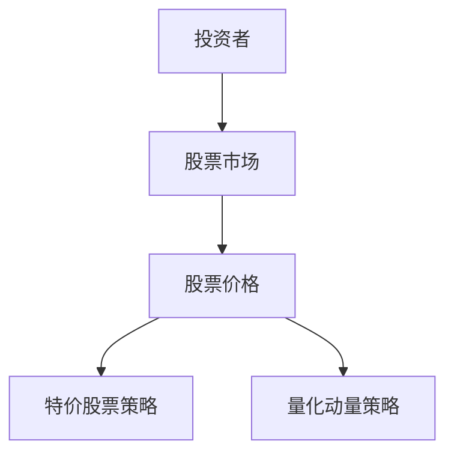
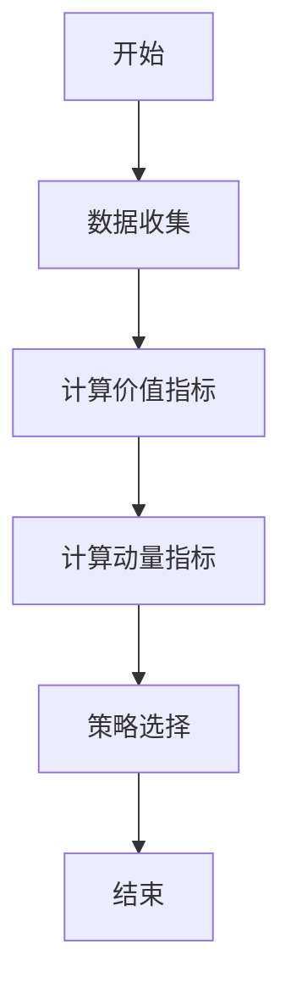
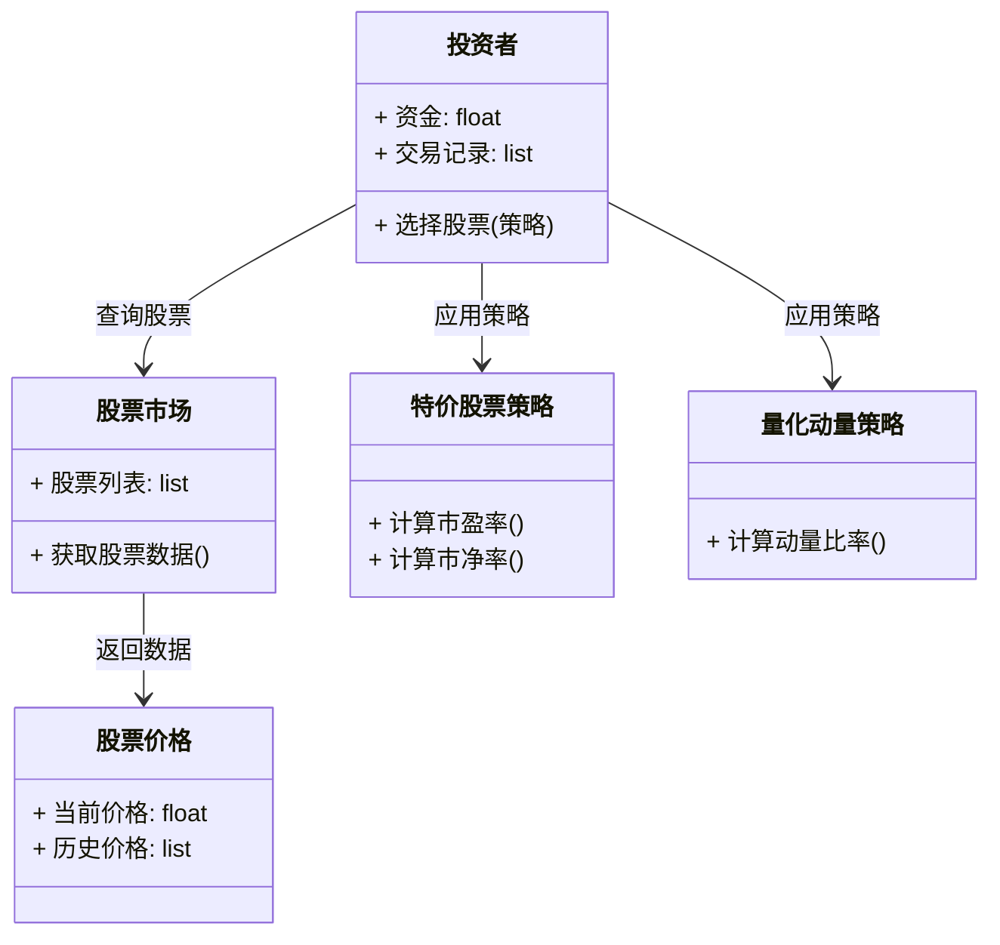

                 


# 如何将特价股票策略与量化动量策略相结合

> **关键词：** 特价股票策略, 量化动量策略, 策略结合, 投资组合优化, 算法实现

> **摘要：**  
本文系统地探讨了如何将特价股票策略与量化动量策略相结合，通过理论分析、数学建模和算法实现，揭示了两者结合的优势和应用场景。文章首先介绍了两种策略的核心概念和特点，然后通过数学模型和算法流程图详细阐述了结合策略的实现方法，最后通过实际案例分析验证了策略的有效性。

---

## 第一部分: 特价股票策略与量化动量策略结合概述

### 第1章: 特价股票策略与量化动量策略的背景介绍

#### 1.1 问题背景
- **特价股票策略的定义与特点**  
  特价股票策略是一种基于基本面分析的投资策略，旨在通过寻找被市场低估的股票，以低于其内在价值的价格买入。其核心在于分析公司的财务指标，如市盈率（P/E）、市净率（P/B）等，以识别具有投资潜力的股票。该策略通常适用于长期投资，风险相对较低，但需要较强的选股能力和对市场估值的理解。

- **量化动量策略的定义与特点**  
  量化动量策略是一种基于价格动量效应的投资策略，通过技术分析寻找价格趋势，捕捉短期价格波动带来的收益。其核心在于利用动量效应，即价格会沿趋势延续一段时间。量化动量策略通常适用于短期交易，风险较高，但收益潜力大。

- **结合两种策略的必要性与优势**  
  特价股票策略和量化动量策略在目标和时间跨度上存在差异，但结合两者可以互补优势。例如，利用特价策略筛选出具有低估潜力的股票，再通过动量策略捕捉其上涨趋势，可以在控制风险的同时提高收益。

#### 1.2 核心概念与联系
- **特价股票策略的核心要素**  
  1. 基于基本面分析，寻找被低估的股票。
  2. 关注长期价值，注重公司财务健康状况。
  3. 适合稳健型投资者。

- **量化动量策略的核心要素**  
  1. 基于技术分析，寻找价格趋势。
  2. 短期交易为主，注重价格动量效应。
  3. 适合风险承受能力较强的投资者。

- **两者的关联与协同效应**  
  特价股票策略提供了选股的标准，而量化动量策略提供了交易时机的选择。结合两者可以在选出优质股票的同时，抓住最佳买入和卖出时机，优化投资组合的收益和风险比。

---

## 第二部分: 特价股票策略与量化动量策略的核心概念对比

### 第2章: 核心概念对比

#### 2.1 核心概念原理
- **特价股票策略的数学模型**  
  - 市盈率（P/E）计算公式：
    $$ P/E = \frac{\text{股价}}{\text{每股收益}} $$
  - 市净率（P/B）计算公式：
    $$ P/B = \frac{\text{股价}}{\text{每股净资产}} $$
  - 筛选标准：选择P/E和P/B低于行业平均水平的股票。

- **量化动量策略的数学模型**  
  - 动量比率计算公式：
    $$ \text{动量比率} = \frac{\text{近期价格} - \text{近期成本}}{\text{近期价格}} $$
  - 筛选标准：选择动量比率较高的股票，表明价格近期有上涨趋势。

#### 2.2 概念属性对比表格
| 特价股票策略 | 量化动量策略 |
|--------------|--------------|
| 侧重低价买入 | 侧重价格动量 |
| 长期持有     | 短期趋势交易 |
| 风险较低     | 风险较高     |
| 适合稳健型投资者 | 适合激进型投资者 |

#### 2.3 ER实体关系图


---

## 第三部分: 特价股票策略与量化动量策略的数学模型与算法

### 第3章: 数学模型与算法

#### 3.1 特价股票策略的数学模型
- **案例分析**  
  假设某股票的市盈率为15，行业平均水平为20，则该股票的P/E比行业低，具有低估潜力。

#### 3.2 量化动量策略的数学模型
- **案例分析**  
  某股票近期价格为100元，近期成本为90元，则动量比率为：
  $$ \text{动量比率} = \frac{100 - 90}{100} = 0.1 \text{或} 10\% $$

#### 3.3 算法流程图


---

## 第四部分: 特价股票策略与量化动量策略的系统分析与架构设计

### 第4章: 系统分析与架构

#### 4.1 问题场景介绍
- 投资者希望在市场中找到具有低估潜力且价格趋势向上的股票。

#### 4.2 系统功能设计


---

## 第五部分: 特价股票策略与量化动量策略的项目实战

### 第5章: 项目实战

#### 5.1 环境安装
- Python环境
- 安装必要的库：
  ```bash
  pip install pandas numpy matplotlib
  ```

#### 5.2 核心代码实现
```python
import pandas as pd
import numpy as np

# 数据获取
def get_stock_data(ticker):
    # 从数据源获取股票数据
    pass

# 特价股票策略
def calculate_pe(stock_data):
    pe = stock_data['股价'] / stock_data['每股收益']
    return pe

def calculate_pb(stock_data):
    pb = stock_data['股价'] / stock_data['每股净资产']
    return pb

# 量化动量策略
def calculate_momentum(stock_data, window=10):
    momentum = stock_data['股价'].rolling(window).mean()
    return momentum

# 策略结合
def combined_strategy(stock_data):
    pe = calculate_pe(stock_data)
    pb = calculate_pb(stock_data)
    momentum = calculate_momentum(stock_data)
    # 筛选标准：pe < 行业平均，pb < 行业平均，动量 > 行业平均
    selected = stock_data[(pe < pe.mean()) & (pb < pb.mean()) & (momentum > momentum.mean())]
    return selected

# 示例
stock_data = get_stock_data("AAPL")
selected_stocks = combined_strategy(stock_data)
print(selected_stocks)
```

---

## 第六部分: 最佳实践、小结、注意事项和拓展阅读

### 6.1 最佳实践
- **数据源选择**：确保数据的准确性和及时性。
- **策略参数调整**：根据市场环境调整策略参数，如动量窗口大小。
- **风险管理**：结合止损和止盈机制，控制投资风险。

### 6.2 小结
通过将特价股票策略与量化动量策略相结合，投资者可以在选择股票时兼顾价值和趋势，从而优化投资组合的收益和风险比。

### 6.3 注意事项
- 策略的有效性依赖于市场环境和数据质量。
- 需要定期监控和调整策略参数。

### 6.4 拓展阅读
- 建议进一步学习相关书籍，如《量化交易入门》和《股票投资策略》。

---

## 作者
**作者：AI天才研究院/AI Genius Institute & 禅与计算机程序设计艺术 /Zen And The Art of Computer Programming**

