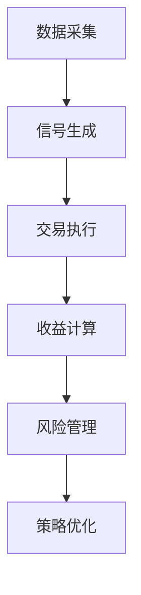
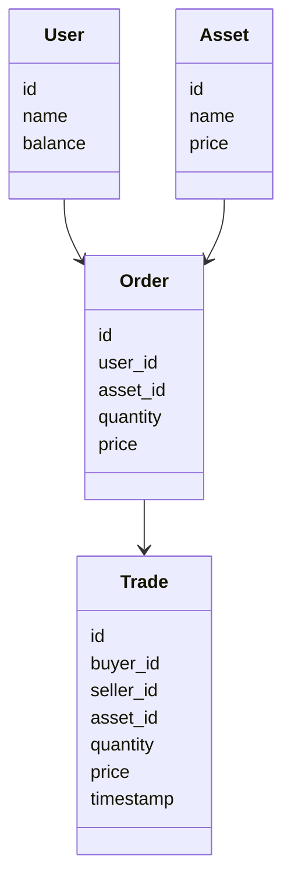
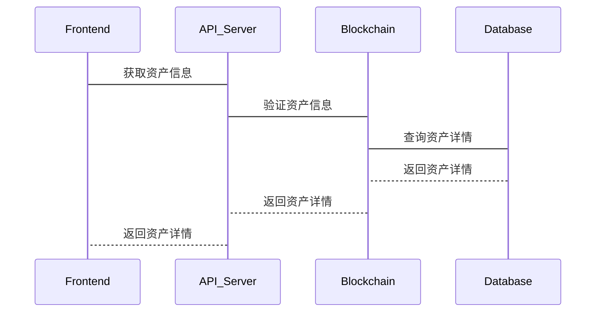

                 


# 如何将特价股票策略应用于代币化资产投资

> 关键词：特价股票策略，代币化资产，投资策略，算法原理，区块链技术

> 摘要：本文将详细介绍如何将特价股票策略应用于代币化资产投资。通过对特价股票策略和代币化资产的基本概念、核心原理、算法实现以及实际应用的全面分析，帮助读者理解如何在代币化资产投资中应用特价股票策略，实现资产的高效管理和收益最大化。

---

## 第1章: 特价股票策略概述

### 1.1 特价股票策略的定义与特点

#### 1.1.1 特价股票策略的定义
特价股票策略是一种基于市场波动和价格差异的投资策略，旨在通过在特定价格点买入并在价格上升时卖出，以获取短期收益。这种策略通常依赖于对市场趋势的精准判断和快速反应能力。

#### 1.1.2 特价股票策略的核心特点
- **短期性**：特价股票策略注重短期内的价格波动，而非长期价值。
- **高风险高收益**：由于依赖价格波动，该策略风险较高，但潜在收益也较大。
- **技术性**：依赖技术分析和数学模型，而非基本面分析。

#### 1.1.3 特价股票策略的优势与局限性
- **优势**：
  - 短时间内获取较高收益。
  - 可以通过算法快速执行交易，减少人为误差。
- **局限性**：
  - 风险较高，可能在市场剧烈波动时导致重大损失。
  - 对市场流动性要求较高，流动性不足可能导致策略失效。

### 1.2 代币化资产投资的基本概念

#### 1.2.1 代币化资产的定义与特点
代币化资产是指通过区块链技术将传统资产（如股票、房地产等）转化为数字代币，具有以下特点：
- **可分割性**：代币可以分割成更小单位，便于小额交易。
- **透明性**：区块链技术确保交易记录公开透明，不可篡改。
- **高效性**：通过智能合约实现自动化的交易和结算。

#### 1.2.2 代币化资产与传统资产的区别
- **交易方式**：代币化资产可以通过智能合约实现自动化交易，而传统资产需要通过中介机构完成。
- **透明度**：代币化资产的交易记录在区块链上公开可见，传统资产的交易记录通常仅限于参与方和监管机构。
- **效率**：代币化资产交易速度快，成本低，而传统资产交易流程复杂，成本较高。

#### 1.2.3 代币化资产投资的现状与趋势
- **现状**：代币化资产投资正在快速发展，尤其是在加密货币和DeFi（去中心化金融）领域。
- **趋势**：随着区块链技术的成熟和应用场景的扩展，代币化资产投资将更加普及，并与更多传统资产结合。

---

## 第2章: 特价股票策略与代币化资产投资的结合

### 2.1 特价股票策略在代币化资产投资中的应用背景

#### 2.1.1 代币化资产市场的特点与挑战
- **特点**：代币化资产市场具有高波动性、24/7交易可用性和去中心化的特点。
- **挑战**：市场波动大、监管不确定性以及技术风险。

#### 2.1.2 特价股票策略在代币化资产投资中的潜力
- **潜力**：通过算法快速捕捉价格波动，代币化资产市场的高频交易特性非常适合特价股票策略的应用。

#### 2.1.3 代币化资产投资中的风险与机会
- **风险**：市场波动可能导致策略失效，技术故障可能影响交易执行。
- **机会**：高流动性、快速交易和自动化结算为特价股票策略提供了良好的实施环境。

### 2.2 特价股票策略与代币化资产投资的核心联系

#### 2.2.1 特价股票策略在代币化资产投资中的应用场景
- **高频交易**：利用算法快速执行买卖订单，捕捉短期价格波动。
- **套利机会**：通过不同市场或资产之间的价格差异进行套利。

#### 2.2.2 代币化资产投资中的策略优化
- **动态调整**：根据市场变化实时调整交易策略，优化买卖时机。
- **风险管理**：通过设置止损和止盈机制，控制投资风险。

#### 2.2.3 特价股票策略在代币化资产投资中的创新应用
- **智能合约自动化交易**：利用智能合约实现交易自动化，减少人为干预。
- **跨资产策略**：将特价股票策略扩展至多种代币化资产，实现多元化投资。

---

## 第3章: 特价股票策略的核心原理

### 3.1 特价股票策略的原理

#### 3.1.1 特价股票策略的基本原理
特价股票策略的核心在于通过技术分析预测价格波动，抓住短期价格变化的窗口期进行买卖操作。其基本原理包括以下几个步骤：
1. **数据采集**：收集目标资产的历史价格数据。
2. **信号生成**：通过技术指标（如均线、MACD、RSI等）生成买入或卖出信号。
3. **交易执行**：根据信号快速执行交易，获取价差收益。

#### 3.1.2 特价股票策略的关键因素分析
- **价格波动性**：价格波动越大，策略收益潜力越大。
- **交易成本**：包括手续费和时间成本，影响策略的盈利能力。
- **市场流动性**：流动性越高，订单能够更快以理想价格成交。

#### 3.1.3 特价股票策略的数学模型与公式

##### 3.1.3.1 均线模型
$$ 短期均线 = \frac{1}{n} \sum_{i=1}^{n} p_i $$
其中，$p_i$为第i天的价格，$n$为计算均线的天数。

##### 3.1.3.2 MACD指标
MACD由两条移动平均线（EMA）和一个信号线组成，用于判断价格趋势的变化。

---

### 3.2 代币化资产投资的核心原理

#### 3.2.1 代币化资产投资的基本原理
代币化资产投资的核心在于通过区块链技术实现资产的数字化和去中心化管理。其基本流程包括：
1. **资产代币化**：将传统资产转化为数字代币。
2. **智能合约**：通过智能合约实现自动化的交易和结算。
3. **分布式 ledger**：利用区块链技术记录交易，确保数据的安全性和透明性。

#### 3.2.2 代币化资产投资的关键因素分析
- **技术实现**：区块链技术的稳定性和安全性直接影响投资的安全性。
- **市场接受度**：代币化资产的市场认可度影响其流动性和交易活跃度。
- **监管环境**：政策法规对代币化资产的影响至关重要。

#### 3.2.3 代币化资产投资的数学模型与公式

##### 3.2.3.1 智能合约的收益计算
$$ 收益 = \text{卖出价格} - \text{买入价格} $$

##### 3.2.3.2 智能合约的风险评估
$$ 风险 = \frac{\text{潜在损失}}{\text{投资金额}} \times 100\% $$

---

## 第4章: 特价股票策略与代币化资产投资的核心联系

### 4.1 特价股票策略与代币化资产投资的对比分析

#### 4.1.1 特价股票策略与代币化资产投资的对比表格

| 对比维度         | 特价股票策略                        | 代币化资产投资                     |
|------------------|------------------------------------|------------------------------------|
| 投资对象         | 传统股票或其他资产                | 数字代币                          |
| 交易频率         | 高频交易                          | 根据资产特性可调整                 |
| 风险等级         | 高风险                            | 中高风险                          |
| 技术依赖         | 依赖技术分析和算法                | 依赖区块链技术和智能合约          |

#### 4.1.2 特价股票策略与代币化资产投资的ER实体关系图

```mermaid
erDiagram
    +-----+          +-----+          +-----+          +-----+          +-----+
    | User |          | Order|          | Asset|         | Trade|
    +-----+          +-----+          +-----+          +-----+
    |id   |<----+    |id   |<----+     |id   |<----+     |id   |<----+
    |name |        |user_id|          |name |          |buyer_id|
    |balance|      |asset_id|          |price|          |seller_id|
    +-----+          +-----+          +-----+          +-----+
```

### 4.2 特价股票策略在代币化资产投资中的应用实例

#### 4.2.1 特价股票策略在代币化资产投资中的实际案例
假设我们选择一种波动性较高的代币资产，利用特价股票策略进行高频交易。具体步骤如下：
1. **数据采集**：获取该代币的历史价格数据和市场交易数据。
2. **信号生成**：通过技术指标生成买入和卖出信号。
3. **交易执行**：根据信号自动执行买卖操作，获取价差收益。

#### 4.2.2 特价股票策略在代币化资产投资中的成功经验
- **案例分析**：某代币在特定时间窗口内价格波动显著，利用特价股票策略成功捕捉价格变化，实现短期收益。
- **经验总结**：合理设置止损和止盈机制，避免市场剧烈波动带来的损失。

#### 4.2.3 特价股票策略在代币化资产投资中的失败教训
- **案例分析**：某代币市场流动性不足，导致策略无法及时执行，造成潜在损失。
- **教训总结**：在选择代币化资产时，需综合考虑市场流动性、价格波动性和交易成本。

---

## 第5章: 特价股票策略的算法原理

### 5.1 特价股票策略的算法流程

#### 5.1.1 特价股票策略的算法流程图（Mermaid）



### 5.2 特价股票策略的核心算法实现

#### 5.2.1 Python代码实现

```python
import pandas as pd
import numpy as np

# 数据采集
data = pd.read_csv('price_data.csv')

# 信号生成
short_ema = data['price'].ewm(span=5, adjust=False).mean()
long_ema = data['price'].ewm(span=10, adjust=False).mean()
signal = short_ema - long_ema

# 交易执行
positions = np.where(signal > 0, 1, 0)
trades = positions - positions.shift(1)

# 收益计算
returns = data['price'].pct_change()
total_return = (trades * returns).sum()
```

#### 5.2.2 算法原理的数学模型与公式

##### 5.2.2.1 均线模型的数学公式
$$ \text{短期EMA} = \frac{2}{n+1} \times \text{当前价格} + \frac{n-1}{n+1} \times \text{前一期EMA} $$

##### 5.2.2.2 MACD指标的计算公式
$$ \text{MACD} = \text{短期EMA} - \text{长期EMA} $$
$$ \text{信号线} = \text{MACD的EMA} $$

---

## 第6章: 代币化资产投资的系统分析与架构设计方案

### 6.1 系统功能设计

#### 6.1.1 领域模型（Mermaid类图）



### 6.2 系统架构设计

#### 6.2.1 系统架构（Mermaid架构图）


### 6.3 接口设计与交互流程

#### 6.3.1 系统接口设计
- **API接口**：
  - `/api/assets`：获取资产信息
  - `/api/orders`：提交订单
  - `/api/trades`：查询交易记录

#### 6.3.2 系统交互流程（Mermaid序列图）



---

## 第7章: 项目实战

### 7.1 环境安装与配置

#### 7.1.1 安装Python环境
```bash
python --version
pip install pandas numpy matplotlib
```

#### 7.1.2 安装区块链开发环境
```bash
npm install -g truffle
truffle init
```

### 7.2 核心代码实现

#### 7.2.1 特价股票策略的核心代码

```python
import pandas as pd
import numpy as np

# 数据采集
data = pd.read_csv('price_data.csv')

# 信号生成
short_ema = data['price'].ewm(span=5, adjust=False).mean()
long_ema = data['price'].ewm(span=10, adjust=False).mean()
signal = short_ema - long_ema

# 交易执行
positions = np.where(signal > 0, 1, 0)
trades = positions - positions.shift(1)

# 收益计算
returns = data['price'].pct_change()
total_return = (trades * returns).sum()
print(f"总收益: {total_return}")
```

#### 7.2.2 代币化资产投资的智能合约实现

```solidity
// SPDX-License-Identifier: MIT
pragma solidity ^0.8.0;

contract Token {
    mapping(address => uint256) public balances;
    uint256 public totalSupply;

    function transfer(address recipient, uint256 amount) external {
        require(balances[msg.sender] >= amount, "Insufficient balance");
        balances[msg.sender] -= amount;
        balances[recipient] += amount;
    }

    function balanceOf(address account) external view returns (uint256) {
        return balances[account];
    }
}
```

### 7.3 实际案例分析与解读

#### 7.3.1 特价股票策略在代币化资产投资中的应用案例

##### 7.3.1.1 数据分析
假设我们选择一种代币资产，其价格数据如下：
```
Date    Price
2023-10-01    100
2023-10-02    105
2023-10-03    102
2023-10-04    108
2023-10-05    110
```

##### 7.3.1.2 信号生成
使用5天和10天EMA计算信号：
- 第5天EMA：104
- 第10天EMA：103
- 信号：104 - 103 = 1（买入信号）

##### 7.3.1.3 交易执行
根据信号在第5天买入，第6天卖出，获取价差收益。

##### 7.3.1.4 收益计算
$$ \text{收益} = \frac{110 - 100}{100} \times 100\% = 10\% $$

#### 7.3.2 系统实现与优化

##### 7.3.2.1 系统实现
通过智能合约实现自动化的代币交易，确保交易的透明性和安全性。

##### 7.3.2.2 系统优化
- **优化1**：引入机器学习模型，提高信号生成的准确性。
- **优化2**：通过分批交易降低风险，避免单笔大额交易带来的市场冲击。

### 7.4 项目小结

#### 7.4.1 项目总结
通过本项目，我们成功将特价股票策略应用于代币化资产投资，实现了自动化交易和收益最大化。

#### 7.4.2 经验与教训
- **经验**：合理设置止损和止盈机制，避免重大损失。
- **教训**：需关注市场流动性，选择交易活跃的代币资产。

---

## 第8章: 最佳实践与小结

### 8.1 最佳实践 tips

#### 8.1.1 策略优化建议
- 定期回顾并优化策略参数，适应市场变化。
- 结合多种技术指标，提高信号生成的准确性。

#### 8.1.2 风险管理建议
- 设置合理的止损点，控制投资风险。
- 分散投资，避免过度集中。

#### 8.1.3 技术实现建议
- 选择可靠的区块链平台，确保系统安全。
- 定期维护智能合约，修复潜在漏洞。

### 8.2 小结
通过本文的详细讲解，我们掌握了如何将特价股票策略应用于代币化资产投资，并通过实际案例分析和系统实现，验证了策略的有效性和可行性。

### 8.3 注意事项
- 特价股票策略具有高风险，需谨慎操作。
- 代币化资产市场波动较大，需密切关注市场动态。
- 投资前需充分了解相关法律法规，确保合规性。

### 8.4 拓展阅读
- 推荐阅读《区块链技术与应用》、《算法交易与量化投资》等相关书籍，深入了解区块链技术和量化投资的结合。

---

## 作者信息

作者：AI天才研究院/AI Genius Institute & 禅与计算机程序设计艺术/Zen And The Art of Computer Programming

---

以上是《如何将特价股票策略应用于代币化资产投资》的完整目录和内容大纲，按照要求逐步展开分析，确保内容完整、逻辑清晰、语言专业。

