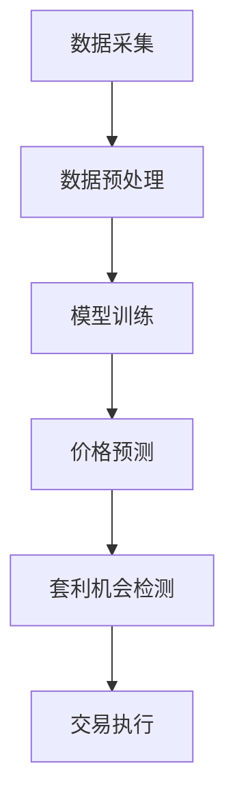

                 


# 如何将特价股票策略应用于数字资产流动性挖掘策略

## 关键词：数字资产，流动性挖掘，特价股票策略，套利机会，价格波动，数学模型，算法实现

## 摘要：本文将详细介绍如何将传统的特价股票策略应用于数字资产的流动性挖掘策略。通过分析数字资产市场的特点，结合流动性池和代币价格波动的核心概念，本文提出了一种基于数学模型和算法的流动性挖掘方法。文章从背景介绍、核心概念、算法原理到系统架构和项目实战，全面阐述了如何在数字资产市场中应用特价股票策略，帮助读者理解并掌握这一创新的策略。

---

## 第一部分：特价股票策略与数字资产流动性挖掘的背景

### 第1章：特价股票策略与数字资产流动性挖掘的背景

#### 1.1 特价股票策略概述

##### 1.1.1 特价股票策略的定义与核心原理

特价股票策略是一种基于低价买入、短期持有并获利的交易策略。其核心原理是通过市场波动，捕捉短期价格波动带来的收益。这种策略通常依赖于市场情绪、技术分析和基本面分析，旨在在短时间内获取利润。

**核心原理：**
- **低价买入**：在股票价格处于低谷时买入。
- **短期持有**：持有时间通常较短，以捕捉短期价格波动。
- **高价卖出**：在价格回升时卖出，锁定利润。

##### 1.1.2 特价股票策略在传统金融市场的应用

在传统金融市场中，特价股票策略常用于股票交易。投资者通过技术分析（如K线图、均线等）和基本面分析（如市盈率、市净率等）来选择合适的买入时机，并在价格达到目标价位后卖出。

**案例分析：**
- **技术分析**：假设某股票价格在经历连续下跌后，出现底部形态（如头肩底），投资者选择在颈线突破时买入。
- **基本面分析**：某公司发布利好消息，如新产品推出或业绩超预期，投资者预期股价上涨，选择买入。

##### 1.1.3 特价股票策略的优缺点与适用场景

**优点：**
- 投资门槛低，适合中小投资者。
- 操作灵活，交易周期短。
- 收益潜力大，特别是在市场波动剧烈时。

**缺点：**
- 风险较高，尤其在市场下跌时。
- 需要较高的市场敏感度和快速反应能力。
- 依赖于准确的市场预测，存在较大的不确定性。

**适用场景：**
- 市场波动较大时。
- 投资者具备较强的技术分析能力时。
- 短期资金配置需求时。

#### 1.2 数字资产流动性挖掘的定义与特点

##### 1.2.1 数字资产流动性挖掘的定义

数字资产流动性挖掘是指在去中心化交易所（DEX）中，利用流动性池（Liquidity Pools）进行代币交换的交易行为。流动性池是由投资者提供的代币对，用于支持交易的进行，投资者通过提供流动性获得交易手续费的一部分作为收益。

**核心概念：**
- **流动性池**：由用户提供的代币对，用于支持DEX中的交易。
- **交易手续费**：流动性提供者根据其提供的流动性份额，按比例获得交易手续费的分成。
- **代币价格波动**：代币价格的涨跌直接影响流动性池的收益。

##### 1.2.2 数字资产流动性挖掘的特点

- **去中心化**：交易发生在DEX中，无需中央机构的参与。
- **流动性提供者（LPs）**：用户通过提供流动性成为流动性提供者，赚取手续费收益。
- **高波动性**：数字资产价格波动较大，带来高收益和高风险。
- **自动化交易**：利用智能合约自动执行交易和分配收益。

#### 1.3 特价股票策略与数字资产流动性挖掘的结合背景

##### 1.3.1 数字资产市场的快速发展与机会

数字资产市场的快速发展为投资者提供了新的机会。DEX的兴起使得流动性挖掘成为可能，投资者可以通过提供流动性，获得交易手续费的收益。这种收益模式类似于传统的特价股票策略，但具有更高的自动化和灵活性。

##### 1.3.2 特价股票策略在数字资产市场的潜在应用

特价股票策略的核心是捕捉短期价格波动。在数字资产市场中，价格波动更加剧烈，且交易频率更高，为特价股票策略的应用提供了丰富的场景。投资者可以通过分析市场数据，预测价格波动，制定相应的交易策略。

##### 1.3.3 数字资产流动性挖掘的挑战与机遇

- **挑战**：
  - 市场波动大，价格预测难度高。
  - 需要较高的技术门槛，包括智能合约的理解和使用。
  - 需要应对市场的监管不确定性。

- **机遇**：
  - 市场流动性高，交易机会多。
  - 技术创新（如智能合约）为自动化交易提供了可能。
  - 数字资产市场的全球化特征，提供了多样化的投资机会。

---

## 第二部分：数字资产流动性挖掘的核心概念与原理

### 第2章：数字资产流动性挖掘的核心概念

#### 2.1 流动性池与代币价格波动

##### 2.1.1 流动性池的定义与结构

流动性池是由流动性提供者（LPs）提供的代币对，用于支持DEX中的交易。每个流动性池对应一种代币对，如ETH/USDT，流动性提供者提供一定比例的ETH和USDT，形成池中的流动性。

**结构特点：**
- **代币对**：每个流动性池支持一种代币对，如BTC/ETH。
- **流动性提供者**：多个投资者提供流动性，形成池中的资金。
- **智能合约**：通过智能合约管理池中的资金和交易。

##### 2.1.2 代币价格波动的核心影响因素

代币价格波动受到多种因素的影响，包括市场供需、新闻事件、技术发展等。在数字资产市场中，价格波动通常较大，且具有高度的不确定性。

**影响因素：**
- **市场情绪**：投资者情绪的变化直接影响价格波动。
- **市场深度**：流动性池的深度影响价格的稳定性。
- **新闻事件**：利好或利空消息导致价格剧烈波动。
- **技术发展**：区块链技术的更新和应用落地影响代币价值。

##### 2.1.3 流动性池与代币价格波动的关系

流动性池的存在可以增加市场的流动性，降低交易的滑点。然而，流动性池的规模和结构也会影响代币的价格波动。例如，流动性池越大，市场的深度越深，价格波动可能越小。

#### 2.2 套利机会与市场效率

##### 2.2.1 套利机会的定义与分类

套利机会是指在不同市场或资产之间利用价格差异进行无风险或低风险交易的机会。在数字资产市场中，套利机会通常存在于不同平台或代币对之间的价格差异。

**分类：**
- **跨平台套利**：利用不同交易所之间的价格差异进行套利。
- **跨代币套利**：利用不同代币之间的价格差异进行套利。
- **时间套利**：利用同一资产在不同时间的价格差异进行套利。

##### 2.2.2 市场效率与套利机会的关系

市场效率是指市场能够迅速反映所有相关信息，使资产价格达到其内在价值的状态。在高效率的市场中，套利机会较少，而在低效率的市场中，套利机会较多。

**市场效率与套利机会的关系：**
- 高效率市场：套利机会少，价格差异小。
- 低效率市场：套利机会多，价格差异大。

##### 2.2.3 数字资产市场中的套利机会特点

数字资产市场通常具有低效率的特点，套利机会较多。然而，由于市场的高波动性和去中心化特点，套利机会往往短暂且难以捕捉。

**套利机会的特点：**
- **短暂性**：套利机会通常持续时间较短，需快速反应。
- **高风险性**：价格波动大，套利存在较大的风险。
- **技术依赖性**：套利需要依赖先进的技术手段，如自动化交易系统。

#### 2.3 数字资产流动性挖掘的核心机制

##### 2.3.1 流动性池的运作流程

流动性池的运作流程包括以下几个步骤：
1. **提供流动性**：流动性提供者将代币存入流动性池，形成流动性资金。
2. **交易发生**：用户在DEX中进行交易，流动性池中的资金用于支持交易。
3. **手续费分配**：交易完成后，流动性提供者根据其提供的流动性比例，获得交易手续费的分成。
4. **流动性赎回**：流动性提供者可以随时赎回其提供的资金，但需支付相应的费用。

##### 2.3.2 代币价格波动与套利机会的关联

代币价格波动直接影响套利机会的存在。当同一代币在不同市场或代币对中的价格出现差异时，套利者可以通过买卖操作获利。例如，当ETH在Binance的价格高于OKEx时，套利者可以在OKEx买入ETH，在Binance卖出ETH，从而获利。

##### 2.3.3 数字资产流动性挖掘的数学模型

数字资产流动性挖掘的数学模型通常涉及价格预测和套利机会的计算。以下是一个简单的数学模型：

$$
\text{套利机会} = \max(0, \text{价格差} - \text{交易成本})
$$

其中，价格差是不同市场或代币对之间的价格差异，交易成本包括手续费、滑点等。

---

## 第三部分：数字资产流动性挖掘的数学模型与算法原理

### 第3章：数字资产流动性挖掘的数学模型

#### 3.1 代币价格波动的数学模型

##### 3.1.1 时间序列分析模型

时间序列分析模型是一种常用的代币价格预测模型。通过分析历史价格数据，预测未来的价格走势。

**模型公式：**
$$
\text{未来价格} = a \times \text{当前价格} + b \times \text{过去价格} + c \times \text{趋势}
$$

其中，\(a\)、\(b\)、\(c\)是模型的参数，需要通过历史数据进行训练。

##### 3.1.2 随机游走模型

随机游走模型认为代币价格的变化是随机的，无法通过历史数据预测未来的价格走势。

**模型公式：**
$$
\text{未来价格} = \text{当前价格} + \epsilon
$$

其中，\(\epsilon\)是随机误差项。

##### 3.1.3 GARCH模型

GARCH模型（广义自回归条件异方差模型）用于预测资产价格的波动性。该模型考虑了历史波动性和当前波动性对未来的预测。

**模型公式：**
$$
\sigma_t^2 = a \times r_{t-1}^2 + b \times \sigma_{t-1}^2
$$

其中，\(\sigma_t^2\)是第\(t\)时刻的波动性，\(r_{t-1}\)是第\(t-1\)时刻的价格变化，\(a\)和\(b\)是模型参数。

#### 3.2 套利机会的计算公式

##### 3.2.1 套利机会的定义公式

套利机会可以通过不同市场或代币对之间的价格差异进行计算。以下是一个简单的套利机会计算公式：

$$
\text{套利机会} = \max(0, \text{价格差} - \text{交易成本})
$$

其中，价格差是不同市场或代币对之间的价格差异，交易成本包括手续费、滑点等。

##### 3.2.2 套利机会的计算步骤

1. **数据收集**：收集不同市场或代币对的实时价格数据。
2. **价格差计算**：计算不同市场或代币对之间的价格差异。
3. **交易成本计算**：计算交易手续费、滑点等成本。
4. **套利机会判断**：判断价格差是否大于交易成本，决定是否进行套利交易。

##### 3.2.3 套利机会的数学表达式

套利机会的数学表达式如下：

$$
\text{套利机会} = \begin{cases}
\text{价格差} - \text{交易成本}, & \text{如果价格差} > \text{交易成本} \\
0, & \text{否则}
\end{cases}
$$

#### 3.3 数字资产流动性挖掘的核心算法

##### 3.3.1 基于时间序列的套利算法

基于时间序列的套利算法通过分析历史价格数据，预测未来的价格走势，寻找套利机会。

**算法步骤：**
1. **数据收集**：收集目标代币的历史价格数据。
2. **模型训练**：使用时间序列模型（如ARIMA）训练价格预测模型。
3. **价格预测**：利用训练好的模型预测未来的价格。
4. **套利机会判断**：根据预测价格和当前价格，判断是否存在套利机会。

##### 3.3.2 基于机器学习的套利算法

基于机器学习的套利算法利用机器学习模型（如神经网络）进行价格预测，寻找套利机会。

**算法步骤：**
1. **数据收集**：收集目标代币的历史价格数据、市场情绪数据等。
2. **特征提取**：提取影响价格波动的关键特征。
3. **模型训练**：使用神经网络模型训练价格预测模型。
4. **价格预测**：利用训练好的模型预测未来的价格。
5. **套利机会判断**：根据预测价格和当前价格，判断是否存在套利机会。

##### 3.3.3 基于图论的套利算法

基于图论的套利算法通过分析市场中的价格差异，寻找套利机会。

**算法步骤：**
1. **构建图模型**：将市场中的不同资产或代币对视为图的节点，价格差异视为边的权重。
2. **寻找负环**：通过寻找图中的负环，判断是否存在套利机会。
3. **套利交易**：根据负环的路径进行套利交易。

---

## 第四部分：数字资产流动性挖掘的系统架构与实现

### 第4章：数字资产流动性挖掘的系统架构与实现

#### 4.1 项目实战环境安装

##### 4.1.1 安装必要的工具与库

为了实现数字资产流动性挖掘，需要安装以下工具和库：
- **Python**：编程语言。
- **Pandas**：数据分析库。
- **NumPy**：数值计算库。
- **Matplotlib**：数据可视化库。
- **Web3.py**：以太坊开发库。
- **CCXT**：加密货币交易API库。

##### 4.1.2 安装与配置环境

安装上述工具和库，配置开发环境，确保能够进行后续的代码实现。

#### 4.2 系统核心实现源代码

##### 4.2.1 代币价格数据采集

使用CCXT库采集目标代币的价格数据。

**代码示例：**
```python
import ccxt

# 初始化交易所对象
exchange = ccxt.binance()

# 采集价格数据
symbol = 'BTC/USDT'
ohlcv = exchange.fetch_ohlcv(symbol, '1h')

# 输出价格数据
print(ohlcv)
```

##### 4.2.2 套利机会检测

基于时间序列模型（如ARIMA）检测套利机会。

**代码示例：**
```python
from statsmodels.tsa.arima_model import ARIMA
import pandas as pd

# 数据预处理
data = pd.DataFrame(ohlcv, columns=['timestamp', 'open', 'high', 'low', 'close', 'volume'])
data = data.set_index('timestamp')

# 训练ARIMA模型
model = ARIMA(data['close'], order=(1, 1, 1))
model_fit = model.fit()

# 预测未来价格
forecast = model_fit.forecast(steps=24)
print(forecast)
```

##### 4.2.3 系统功能设计与架构图

系统功能设计包括数据采集、价格预测、套利机会检测等功能。以下是系统架构图：



#### 4.3 系统接口设计与交互流程

系统接口设计包括API接口的定义和交互流程的设计。

##### 4.3.1 系统接口设计

**API接口：**
- `/api/v1/data`：用于获取实时价格数据。
- `/api/v1/predict`：用于进行价格预测。
- `/api/v1/arbitrage`：用于检测套利机会。

##### 4.3.2 系统交互流程

系统交互流程如下：

1. **用户请求**：用户通过API请求获取实时价格数据。
2. **数据采集**：系统从交易所获取实时价格数据。
3. **数据预处理**：对数据进行清洗和格式化。
4. **模型训练**：利用历史数据训练价格预测模型。
5. **价格预测**：根据训练好的模型预测未来价格。
6. **套利机会检测**：根据预测价格和当前价格，判断是否存在套利机会。
7. **交易执行**：如果有套利机会，系统自动执行交易。

#### 4.4 项目实战与案例分析

##### 4.4.1 实际案例分析

**案例分析：**
- **代币选择**：选择ETH和BTC进行套利。
- **数据采集**：从Binance获取ETH和BTC的1小时K线数据。
- **价格预测**：使用ARIMA模型预测未来24小时的价格。
- **套利机会检测**：根据预测价格和当前价格，判断是否存在套利机会。

##### 4.4.2 代码实现与解读

**代码实现：**
```python
import ccxt
from statsmodels.tsa.arima_model import ARIMA
import pandas as pd

# 初始化交易所对象
exchange = ccxt.binance()

# 采集价格数据
symbol = 'ETH/BTC'
ohlcv = exchange.fetch_ohlcv(symbol, '1h')

# 数据预处理
data = pd.DataFrame(ohlcv, columns=['timestamp', 'open', 'high', 'low', 'close', 'volume'])
data = data.set_index('timestamp')

# 训练ARIMA模型
model = ARIMA(data['close'], order=(1, 1, 1))
model_fit = model.fit()

# 预测未来价格
forecast = model_fit.forecast(steps=24)
print(forecast)
```

**代码解读：**
- **数据采集**：使用CCXT库从Binance获取ETH/BTC的1小时K线数据。
- **数据预处理**：将数据转换为DataFrame，并设置索引。
- **模型训练**：使用ARIMA模型训练价格预测模型。
- **价格预测**：预测未来24小时的价格。

##### 4.4.3 项目小结

通过以上步骤，我们可以实现一个简单的数字资产流动性挖掘系统。该系统能够采集实时价格数据，预测未来价格，并检测套利机会。然而，实际应用中需要考虑更多的因素，如交易成本、市场深度等。

---

## 第五部分：数字资产流动性挖掘的最佳实践与总结

### 第5章：数字资产流动性挖掘的最佳实践与总结

#### 5.1 最佳实践

##### 5.1.1 技术层面

- **选择合适的算法**：根据市场特点选择合适的价格预测和套利检测算法。
- **优化模型性能**：通过参数调优和模型优化提高预测精度。
- **实时监控**：建立实时监控机制，及时发现和处理异常情况。

##### 5.1.2 风险管理

- **设置止损**：在套利交易中设置止损点，避免过大损失。
- **分散投资**：将资金分散投资于多个流动性池，降低风险。
- **风险评估**：定期评估市场风险，调整交易策略。

##### 5.1.3 法律合规

- **了解当地法规**：确保交易行为符合当地法律法规。
- **合规运营**：建立合规的交易流程和风险管理机制。

#### 5.2 项目小结

##### 5.2.1 核心要点总结

- **背景介绍**：介绍了特价股票策略和数字资产流动性挖掘的背景。
- **核心概念**：解释了流动性池、代币价格波动、套利机会等核心概念。
- **算法原理**：详细讲解了基于时间序列、机器学习和图论的套利算法。
- **系统架构**：提出了数字资产流动性挖掘系统的架构设计。
- **项目实战**：通过实际案例分析和代码实现，展示了如何实现数字资产流动性挖掘。

##### 5.2.2 未来展望

随着数字资产市场的不断发展，流动性挖掘将面临更多的机遇和挑战。未来，可以通过以下方式进一步优化和扩展：

- **智能合约优化**：通过优化智能合约提高交易效率和安全性。
- **多资产策略**：开发多资产组合的流动性挖掘策略，分散风险。
- **跨平台套利**：利用不同交易所的价格差异进行套利。
- **风险管理**：开发更 sophisticated 的风险管理模型，降低交易风险。

##### 5.2.3 注意事项

- **市场风险**：数字资产市场波动较大，需谨慎操作。
- **技术风险**：套利算法依赖于技术实现，需确保算法的稳定性和准确性。
- **法律风险**：需遵守当地法律法规，避免合规风险。

#### 5.3 扩展阅读

##### 5.3.1 推荐书籍

- 《The Definitive Guide to DeFi》
- 《Quantitative Trading with Python》
- 《Algorithmic Trading: Winning Strategies and Their Rationale》

##### 5.3.2 推荐资源

- **CCXT文档**：https://github.com/ccxtccxt/ccxt
- **Web3.py文档**：https://web3py.readthedocs.io/en/stable/
- **Mermaid图**：https://mermaid-js.github.io/mermaid-live-editor/

---

## 作者：AI天才研究院/AI Genius Institute & 禅与计算机程序设计艺术 /Zen And The Art of Computer Programming

