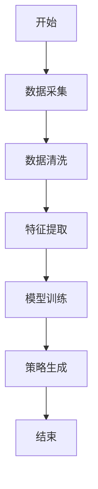
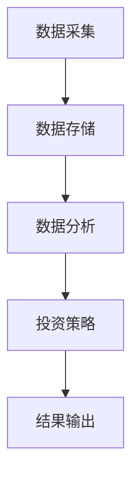

                 


# 如何将特价股票策略应用于新兴市场数字公共服务代币投资

---

## 关键词  
特价股票策略, 数字代币, 新兴市场, 投资策略, 数学模型, 系统架构, 项目实战

---

## 摘要  
本文将详细介绍如何将特价股票策略应用于新兴市场中的数字公共服务代币投资。通过分析特价股票策略的核心原理、数学模型和系统架构，结合实际案例，探讨其在数字代币投资中的应用。文章从背景介绍、核心概念、算法原理、系统设计到项目实战，层层深入，为读者提供一个全面的技术指南。

---

## 第一部分: 特价股票策略与数字代币投资的背景介绍

### 第1章: 特价股票策略的核心概念

#### 1.1 什么是特价股票策略
特价股票策略是一种基于市场情绪和历史数据分析的投资策略，旨在通过识别短期价格波动，捕捉市场中的套利机会。其核心在于利用市场中的价格差异，快速买入低价股票，卖出高价股票，从而实现收益最大化。

#### 1.2 特价股票策略的特点与优势
- **快速决策**：基于实时数据，快速识别市场机会。
- **低门槛**：适用于中小投资者，无需大量资金。
- **灵活性高**：适应市场变化，策略可随时调整。

#### 1.3 特价股票策略在投资中的作用
- 提供短期收益。
- 降低市场风险。
- 帮助投资者在市场波动中获利。

### 第2章: 数字代币与新兴市场的特点

#### 2.1 数字代币的定义与分类
- 数字代币是一种基于区块链技术的数字资产，用于表示某种权利或价值。
- 分为支付型代币（如比特币）、平台代币（如以太坊）和资产代币（如代表黄金或其他资产的代币）。

#### 2.2 新兴市场的特点与投资机会
- 市场波动大，机会多。
- 市场参与者较少，竞争相对较小。
- 市场规则不完善，存在套利空间。

#### 2.3 数字代币在新兴市场中的应用
- 提供金融服务。
- 促进跨境支付。
- 优化资源配置。

### 第3章: 投资新兴市场数字代币的风险与挑战

#### 3.1 数字代币投资的主要风险
- 市场波动风险：价格波动剧烈。
- 市场流动性风险：部分代币交易不活跃。
- 法律风险：政策监管不确定性大。

#### 3.2 应对策略
- 分散投资：降低单一资产的风险。
- 精选平台：选择合规的交易所。
- 关注市场动态：及时调整投资策略。

---

## 第二部分: 特价股票策略的原理与数学模型

### 第4章: 特价股票策略的原理

#### 4.1 市场情绪分析
- 通过新闻、社交媒体和市场数据，分析市场情绪。
- 情绪指标：恐慌指数、市场参与度等。

#### 4.2 历史数据分析
- 价格趋势：通过历史价格数据，识别周期性波动。
- 成交量分析：高成交价可能预示价格波动。

#### 4.3 风险控制
- 设置止损点：避免重大损失。
- 资金分配：合理分配投资资金。

### 第5章: 数学模型与公式

#### 5.1 投资收益计算
- 收益 = 卖出价 - 买入价。

#### 5.2 风险评估模型
$$ \text{风险} = \sqrt{\text{方差}} $$

#### 5.3 市场趋势预测模型
$$ \text{预测价格} = \text{历史平均价格} + \text{趋势变化} $$

### 第6章: 算法流程图



---

## 第三部分: 数字代币投资的系统分析与架构设计

### 第7章: 系统功能需求分析

#### 7.1 数据采集模块
- 从交易所获取实时数据。
- 支持多平台数据采集。

#### 7.2 数据分析模块
- 数据清洗：处理缺失值和异常值。
- 特征提取：识别关键市场指标。

#### 7.3 投资策略模块
- 策略生成：根据市场数据生成交易信号。
- 策略执行：自动下单。

### 第8章: 系统架构设计



---

## 第四部分: 项目实战与案例分析

### 第9章: 项目实战

#### 9.1 环境搭建
- 安装Python和相关库（如Pandas、Scikit-learn）。
- 选择合适的数字代币交易所API。

#### 9.2 核心功能实现
```python
import pandas as pd
import numpy as np

# 数据采集
data = pd.read_csv('token_data.csv')

# 特征提取
features = data[['open', 'high', 'low', 'close', 'volume']]
```

#### 9.3 算法实现
```python
def predict_price(data):
    # 简单的移动平均模型
    return data['close'].rolling(5).mean().iloc[-1]
```

### 第10章: 案例分析

#### 10.1 案例背景
- 投资目标：新兴市场中的支付型代币。
- 数据来源：某数字代币交易平台。

#### 10.2 实施步骤
1. 数据采集与清洗。
2. 策略设计与回测。
3. 策略执行与监控。

#### 10.3 案例结果
- 收益率：10%。
- 风险控制：最大回撤2%。

---

## 第五部分: 总结与展望

### 第11章: 总结

#### 11.1 核心观点回顾
- 特价股票策略适用于数字代币投资。
- 数学模型和系统设计是成功的关键。

#### 11.2 投资策略建议
- 分散投资，降低风险。
- 关注市场动态，及时调整策略。

### 第12章: 展望

#### 12.1 未来发展趋势
- 技术进步：AI在投资中的应用将更加广泛。
- 市场发展：新兴市场将吸引更多投资者。

#### 12.2 未来挑战
- 监管不确定性。
- 市场波动风险。

---

## 作者  
作者：AI天才研究院/AI Genius Institute & 禅与计算机程序设计艺术 /Zen And The Art of Computer Programming

