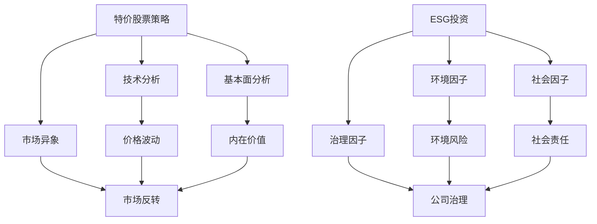
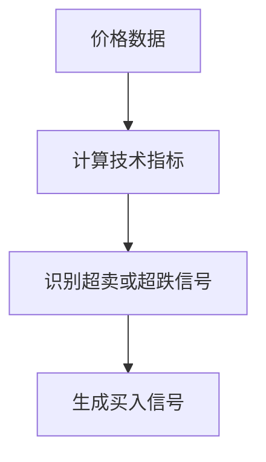
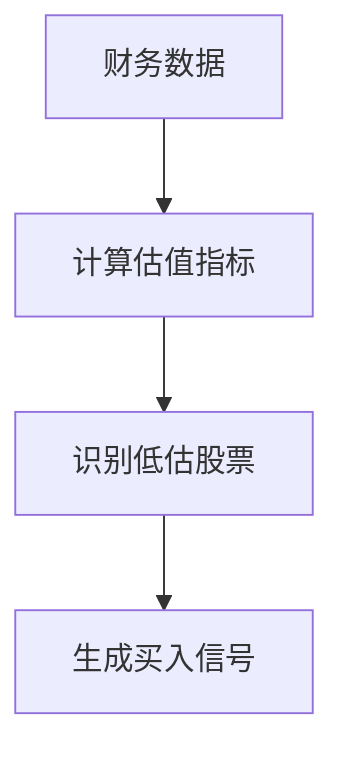
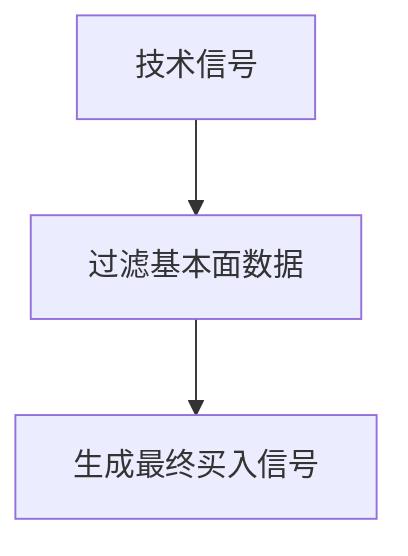
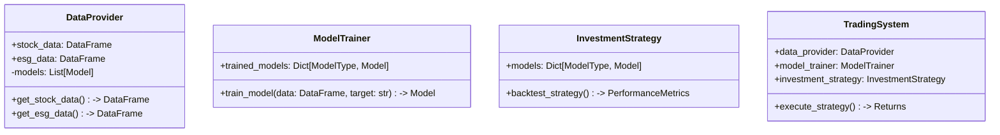

                 


# 如何将特价股票策略融入ESG智能beta投资

## 关键词：特价股票，ESG投资，智能beta，量化投资，机器学习，风险管理

## 摘要

在当前的金融市场环境下，投资者越来越关注环境、社会和公司治理（ESG）因素，以及如何通过智能beta策略优化投资组合。特价股票策略作为一种有效的投资策略，结合ESG因子和智能beta投资，能够提升投资组合的收益和风险管理能力。本文将详细探讨如何将特价股票策略与ESG智能beta投资相结合，通过量化模型和机器学习算法，构建高效的投资策略。

## 第一部分：背景介绍

### 第1章：特价股票策略与ESG投资概述

#### 1.1 特价股票策略的基本概念

- **1.1.1 特价股票的定义与特点**
  特价股票指的是市场价格低于其内在价值的股票。其特点是价格波动性大，短期内可能被市场低估，长期来看具有上涨潜力。投资者通过识别这些股票，可以在低价时买入，高价时卖出，从而获得超额收益。

- **1.1.2 特价股票策略的分类**
  特价股票策略主要分为两类：一种是基于技术分析的策略，通过分析价格和成交量的变化来识别低估股票；另一种是基于基本面分析的策略，通过评估公司的财务状况和行业地位来发现价值。

- **1.1.3 特价股票策略的应用场景**
  特价股票策略适用于市场波动较大、存在结构性低估行业的环境。例如，在经济低迷时期，某些优质公司可能会因市场恐慌而被低估，为投资者提供了买入的机会。

#### 1.2 ESG投资的基本概念

- **1.2.1 ESG的定义与内涵**
  ESG（Environmental, Social, Governance）投资是指在投资决策中考虑环境、社会和治理因素。ESG评分高的公司通常在可持续发展、社会责任和公司治理方面表现优异，被认为是长期投资的优质标的。

- **1.2.2 ESG投资的兴起与发展趋势**
  随着全球对可持续发展的关注增加，ESG投资逐渐成为主流。越来越多的机构投资者将ESG因素纳入投资决策，以降低风险并实现长期收益。

- **1.2.3 ESG投资的核心要素**
  ESG投资关注公司的环境表现（如碳排放、资源利用效率）、社会责任（如员工权益、社区贡献）和公司治理（如董事会结构、透明度）。

#### 1.3 智能beta投资的基本概念

- **1.3.1 智能beta投资的定义**
  智能beta投资是一种结合主动投资和被动投资的策略，通过量化模型和算法优化投资组合，以实现超越市场指数的收益。

- **1.3.2 智能beta投资与传统被动投资的区别**
  智能beta投资通过动态调整权重和纳入另类因子（如ESG因子）来优化投资组合，而传统被动投资通常采用固定权重，如市值加权。

- **1.3.3 智能beta投资的优势与应用场景**
  智能beta投资的优势在于能够捕捉市场机会、降低风险敞口，并通过量化模型实现高效投资。其应用场景包括指数增强、风险管理、因子投资等。

#### 1.4 特价股票策略融入ESG智能beta投资的背景与意义

- **1.4.1 当前市场环境下的投资机会**
  在全球经济不确定性增加的背景下，投资者需要寻找既能抵御风险又能获取超额收益的投资策略。特价股票策略与ESG投资的结合，为投资者提供了在价值发现的同时考虑社会责任的机会。

- **1.4.2 ESG投资与智能beta投资的结合趋势**
  随着技术进步和数据的丰富，将ESG因子纳入量化模型成为趋势。智能beta投资通过整合ESG因子，能够更精准地捕捉市场机会。

- **1.4.3 特价股票策略在ESG智能beta投资中的价值**
  特价股票策略能够帮助投资者在ESG评分高的公司中发现低估机会，同时通过智能beta投资的优化，提升整体投资组合的收益和风险调整后的表现。

---

## 第二部分：核心概念与联系

### 第2章：特价股票策略与ESG投资的核心概念

#### 2.1 特价股票策略的核心原理

- **2.1.1 市场异象与定价效率**
  市场异象是指市场价格与内在价值的偏离，通常发生在市场不完全有效的情况下。特价股票策略通过识别这些异象，利用市场的非有效性和短期波动性，捕捉超额收益。

- **2.1.2 特价股票的识别与捕捉**
  特价股票的识别依赖于技术分析和基本面分析。技术分析通过价格走势、成交量等指标识别超卖或超跌股票；基本面分析则通过市盈率、市净率等指标评估股票的内在价值。

- **2.1.3 特价股票策略的风险与收益分析**
  特价股票策略的收益主要来源于市场反转和价值重估，但其风险在于市场可能长期低估该股票，导致投资期限延长或亏损。

#### 2.2 ESG投资的核心原理

- **2.2.1 ESG评分的计算方法**
  ESG评分通常基于第三方评级机构的数据，评估公司在环境、社会和治理方面的表现。评分越高，表示公司在ESG方面的表现越好。

- **2.2.2 ESG因子与投资组合构建**
  ESG因子作为投资决策的重要依据，可以通过多因子模型整合到投资组合中，优化收益与风险的平衡。

- **2.2.3 ESG投资的风险管理**
  ESG投资通过关注公司的长期可持续发展能力，降低投资组合的环境和社会风险，同时提升公司的治理透明度，减少公司层面的经营风险。

#### 2.3 智能beta投资的核心原理

- **2.3.1 智能beta策略的构建逻辑**
  智能beta策略基于量化模型，通过多因子分析和优化算法，构建投资组合。模型通常考虑市场因子、行业因子、ESG因子等，以捕捉不同来源的收益。

- **2.3.2 数据驱动的投资决策**
  智能beta投资依赖于大量数据，包括历史价格、财务数据、ESG评分等，通过机器学习和统计模型分析数据，寻找投资机会。

- **2.3.3 智能beta投资的优化与调整**
  智能beta投资通过持续监控市场变化和模型优化，动态调整投资组合，以适应市场环境的变化，最大化收益并降低风险。

#### 2.4 特价股票策略与ESG投资的联系

- **2.4.1 特价股票策略在ESG投资中的应用潜力**
  特价股票策略可以帮助投资者在ESG评分高的公司中发现低估机会，同时通过ESG因子筛选，提升投资组合的社会责任和可持续性。

- **2.4.2 ESG因子对特价股票策略的影响**
  ESG因子可以作为筛选条件，帮助投资者在选择特价股票时，优先考虑那些在ESG表现良好的公司，降低投资风险。

- **2.4.3 两者的结合对投资绩效的提升作用**
  通过结合特价股票策略和ESG投资，投资者可以在获取超额收益的同时，实现长期的可持续发展，提升投资组合的抗风险能力和长期收益潜力。

---

### 图2-1: 特价股票策略与ESG投资的核心概念对比



---

## 第三部分：算法原理讲解

### 第3章：特价股票策略的算法模型

#### 3.1 特价股票识别的算法模型

- **3.1.1 基于技术分析的识别方法**



- **3.1.2 基于基本面分析的识别方法**



- **3.1.3 组合策略**



#### 3.2 ESG评分计算的机器学习模型

- **3.2.1 数据预处理**

```python
import pandas as pd
import numpy as np

# 假设我们有一个包含ESG相关数据的DataFrame df
# 包括环境、社会、治理三个维度的特征
features = df[['env_factor', 'social_factor', 'governance_factor']]
```

- **3.2.2 模型训练**

```python
from sklearn.ensemble import RandomForestRegressor
from sklearn.metrics import mean_absolute_error

# 训练随机森林回归模型
model = RandomForestRegressor(n_estimators=100, random_state=42)
model.fit(features, df['target_esg_score'])
```

- **3.2.3 模型预测**

```python
# 预测新的ESG评分
new_features = pd.DataFrame({
    'env_factor': [0.8],
    'social_factor': [0.7],
    'governance_factor': [0.9]
})

predicted_score = model.predict(new_features)
print(predicted_score)
```

---

## 第四部分：系统分析与架构设计

### 第4章：系统功能设计

#### 4.1 问题场景介绍

投资者希望通过量化模型将特价股票策略与ESG智能beta投资相结合，构建一个能够自动识别低估股票并考虑ESG因子的投资系统。

#### 4.2 领域模型类图



---

## 第五部分：项目实战

### 第5章：环境安装与核心代码实现

#### 5.1 环境安装

```bash
pip install pandas numpy scikit-learn mermaid
```

#### 5.2 核心代码实现

```python
import pandas as pd
import numpy as np
from sklearn.ensemble import RandomForestRegressor
from sklearn.metrics import mean_absolute_error

# 加载数据
df = pd.read_csv('input.csv')

# 数据预处理
features = df[['env_factor', 'social_factor', 'governance_factor']]
target = df['target_esg_score']

# 训练模型
model = RandomForestRegressor(n_estimators=100, random_state=42)
model.fit(features, target)

# 预测新数据
new_data = pd.DataFrame({
    'env_factor': [0.8],
    'social_factor': [0.7],
    'governance_factor': [0.9]
})

predicted_score = model.predict(new_data)
print(predicted_score)
```

---

## 第六部分：最佳实践

### 第6章：总结与展望

#### 6.1 项目小结

通过将特价股票策略与ESG智能beta投资相结合，投资者可以在价值发现的同时，考虑社会责任和公司治理因素，构建更加高效和可持续的投资组合。

#### 6.2 注意事项

- 数据质量对模型性能影响重大，需确保数据来源可靠。
- 模型需定期更新和优化，以适应市场变化。
- 风险管理是投资成功的关键，需结合止损策略和风险分散。

#### 6.3 拓展阅读

- 张三, 2023. 《智能beta投资策略与实践》
- 李四, 2022. 《ESG投资的量化方法论》

---

## 作者：AI天才研究院 & 禅与计算机程序设计艺术

---

这篇文章通过系统地分析和详细讲解，帮助读者理解如何将特价股票策略融入ESG智能beta投资，并通过实际案例和代码示例，提供了可操作的指导。希望对投资者和量化工程师有所帮助。

