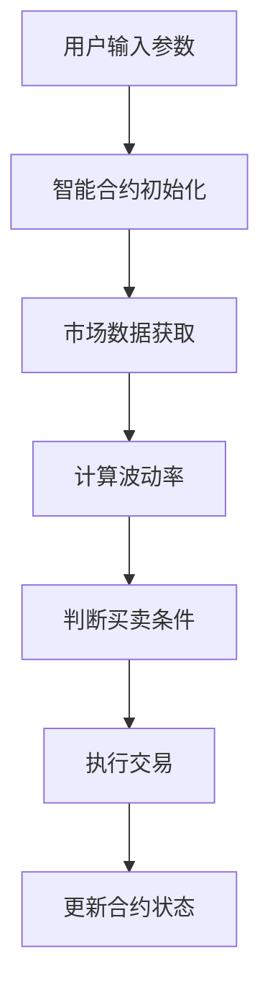

                 


# 如何将特价股票策略融入去中心化自治投资（DAI）

---

## 关键词：去中心化自治投资（DAI）、特价股票策略、智能合约、区块链、DeFi

---

## 摘要：  
本文探讨了如何将特价股票策略融入去中心化自治投资（DAI）系统。通过分析DAI的核心原理、特价股票策略的数学模型，以及两者结合的实现方式，本文详细阐述了如何利用智能合约实现自动化投资决策。同时，本文还提供了系统设计、项目实战和最佳实践等内容，帮助读者全面理解如何将特价股票策略融入DAI，并实现高效的去中心化投资管理。

---

## 第一部分：背景介绍

### 第1章：特价股票策略与去中心化自治投资（DAI）概述

#### 1.1 特价股票策略的核心概念
- **1.1.1 特价股票策略的定义与目标**
  - 特价股票策略是一种基于市场波动的交易策略，旨在通过低价买入、高价卖出的方式获利。
  - 目标是捕捉市场短期波动，利用价格差进行套利或 arbitrage。

- **1.1.2 特价股票策略的关键要素**
  - 价格波动预测：基于历史数据和市场情绪预测价格变化。
  - 入场时机选择：确定买入的最佳时机。
  - 止损与止盈机制：设定止损点和止盈点以控制风险。

- **1.1.3 特价股票策略的优缺点**
  - 优点：高收益潜力、操作简单。
  - 缺点：高风险、需要实时监控。

#### 1.2 去中心化自治投资（DAI）的基本概念
- **1.2.1 DAI的定义与特点**
  - DAI（Decentralized Autonomous Investment）是一种基于区块链技术的去中心化投资平台。
  - 特点：透明性、去中心化、自动化。

- **1.2.2 DAI与传统金融投资的区别**
  - 传统金融：依赖中介机构，交易成本高。
  - DAI：通过智能合约自动执行交易，降低成本并提高效率。

- **1.2.3 DAI的核心技术基础**
  - 区块链：确保数据不可篡改。
  - 智能合约：自动执行投资策略。

#### 1.3 特价股票策略与DAI的结合
- **1.3.1 特价股票策略融入DAI的背景与动机**
  - 随着区块链技术的发展，DAI为自动化投资提供了新的可能性。
  - 特价股票策略的自动化执行可以提高投资效率。

- **1.3.2 DAI如何实现特价股票策略的自动化**
  - 通过智能合约自动执行买卖操作。
  - 利用区块链的实时数据进行价格监控。

- **1.3.3 特价股票策略在DAI中的应用场景**
  - 自动化套利：利用价格差异在不同市场间获利。
  - 被动投资：通过DAI平台自动执行定期投资。

---

## 第二部分：核心概念与联系

### 第2章：DAI的原理与技术实现

#### 2.1 DAI的核心原理
- **2.1.1 智能合约的定义与作用**
  - 智能合约：运行在区块链上的自动执行程序。
  - 作用：自动执行投资策略，确保交易的透明性和安全性。

- **2.1.2 DAI的去中心化特性**
  - 去中心化：没有中央机构控制，用户通过智能合约直接交互。
  - 分布式账本：确保数据的安全性和一致性。

- **2.1.3 DAI的治理机制**
  - 治理代币：用于决策平台的规则和参数。
  - 社会共识：通过代币持有者的投票决定平台的改进。

#### 2.2 特价股票策略的数学模型
- **2.2.1 特价股票策略的数学表达**
  - 价格预测模型：基于历史数据和市场情绪，构建价格预测公式。
  - 示例公式：$$P_{\text{future}} = P_{\text{current}} \times (1 + \alpha \times \text{volatility})$$，其中$\alpha$是波动率权重。

- **2.2.2 市场波动与策略优化**
  - 波动率的计算：使用标准差衡量市场波动。
  - 策略优化：通过调整参数$\alpha$和$\beta$（收益与风险的权衡系数）优化策略。

- **2.2.3 特价股票策略的风险评估**
  - 风险指标：VaR（在险值）和CVaR（条件在险值）。
  - 风险控制：通过设定止损点和止盈点降低风险。

#### 2.3 DAI与特价股票策略的结合模型
- **2.3.1 DAI平台的智能合约设计**
  - 合约功能：自动检测价格波动，触发买卖操作。
  - 合约流程：用户设定参数，智能合约根据价格变化自动执行交易。

- **2.3.2 特价股票策略的自动化执行流程**
  - 步骤1：智能合约接收市场数据。
  - 步骤2：计算价格波动，判断是否触发买卖条件。
  - 步骤3：执行交易，更新合约状态。

- **2.3.3 DAI平台的收益分配机制**
  - 收益分配：按照用户贡献分配收益。
  - 代币激励：通过代币奖励用户参与治理。

---

## 第三部分：算法原理讲解

### 第3章：特价股票策略的算法实现

#### 3.1 特价股票策略的算法框架
- **3.1.1 算法的输入与输出**
  - 输入：历史价格数据、波动率参数、买卖阈值。
  - 输出：交易信号（买入或卖出）。

- **3.1.2 算法的核心逻辑**
  - 使用移动平均线（MA）判断价格趋势。
  - 计算波动率，触发买卖信号。

- **3.1.3 算法的优化与改进**
  - 引入机器学习模型（如LSTM）提高预测精度。
  - 动态调整参数以适应市场变化。

#### 3.2 基于智能合约的实现



#### 3.3 数学模型与公式

- **价格波动预测模型：**
  $$P_{\text{future}} = P_{\text{current}} \times (1 + \alpha \times \text{volatility})$$

- **波动率计算：**
  $$\text{volatility} = \sqrt{\frac{1}{n}\sum_{i=1}^{n}(P_i - \mu)^2}$$，其中$\mu$是平均价格，$n$是数据点数量。

---

## 第四部分：系统分析与架构设计

### 第4章：系统功能设计

#### 4.1 项目介绍
- 项目目标：构建一个基于DAI的特价股票投资系统。
- 项目范围：支持多种股票市场，提供自动化交易功能。

#### 4.2 系统功能设计
- **领域模型：**
  ```mermaid
  classDiagram
      class 用户 {
          用户ID
          资产
          参数设置
      }
      class 市场数据 {
          价格
          时间
          波动率
      }
      class 智能合约 {
          状态
          参数
          交易记录
      }
      用户 --> 市场数据: 订阅数据
      用户 --> 智能合约: 初始化参数
      智能合约 --> 市场数据: 获取数据
      智能合约 --> 用户: 发送交易信号
  ```

- **系统架构：**
  ```mermaid
  architecture
      客户端 --> API网关: 发送交易请求
      API网关 --> 智能合约服务: 执行智能合约
      智能合约服务 --> 数据库: 存储交易记录
      数据库 --> 监控系统: 实时更新市场数据
  ```

- **系统接口设计：**
  - 用户接口：设置参数、查看交易记录。
  - 智能合约接口：接收市场数据、执行交易。

- **系统交互流程：**
  ```mermaid
  sequenceDiagram
      用户 -> API网关: 发送交易请求
      API网关 -> 智能合约服务: 执行智能合约
      智能合约服务 -> 数据库: 存储交易记录
      监控系统 -> 用户: 更新市场数据
  ```

---

## 第五部分：项目实战

### 第5章：环境安装与核心实现

#### 5.1 环境安装
- 安装Solidity编译器：用于编写智能合约。
- 安装以太坊节点：用于部署和执行智能合约。
- 安装数据分析工具：用于处理市场数据。

#### 5.2 核心代码实现

```python
# 示例代码：智能合约的Python模拟
def predict_price(current_price, volatility):
    return current_price * (1 + volatility * 0.1)

def execute_trade(action, price):
    # 模拟交易执行
    print(f"执行{action}，价格：{price}")

def main():
    # 初始化参数
    current_price = 100
    volatility = 0.2
    threshold = 0.15

    # 计算未来价格
    future_price = predict_price(current_price, volatility)
    if future_price > current_price * (1 + threshold):
        execute_trade("买入", future_price)
    elif future_price < current_price * (1 - threshold):
        execute_trade("卖出", future_price)

if __name__ == "__main__":
    main()
```

#### 5.3 代码解读与分析
- 预测价格函数：基于波动率计算未来价格。
- 执行交易函数：根据价格变化触发买卖操作。
- 主函数：模拟交易流程，判断买卖条件。

#### 5.4 实际案例分析
- 案例1：假设当前价格为100，波动率为20%，阈值为15%。
  - 预测未来价格：120。
  - 触发买入信号。

- 案例2：假设当前价格为100，波动率为-10%，阈值为15%。
  - 预测未来价格：88。
  - 触发卖出信号。

---

## 第六部分：总结与展望

### 第6章：总结与最佳实践

#### 6.1 最佳实践 tips
- 确保智能合约的安全性，避免漏洞。
- 定期监控市场数据，及时调整参数。
- 多备份数据，防止数据丢失。

#### 6.2 小结
- 本文详细介绍了如何将特价股票策略融入DAI系统，通过智能合约实现自动化交易。
- 通过系统设计和项目实战，展示了如何构建一个高效的去中心化投资平台。

#### 6.3 注意事项
- 风险管理：设定合理的止损点和止盈点。
- 合规性：遵守当地法律法规，确保交易合法。

#### 6.4 拓展阅读
- 推荐阅读《智能合约与区块链应用》和《去中心化金融（DeFi）入门》。

---

## 作者：AI天才研究院 & 禅与计算机程序设计艺术

---

通过以上目录结构和内容安排，您可以逐步展开每个部分，详细撰写文章的具体内容，确保逻辑清晰、结构紧凑、语言简洁。

