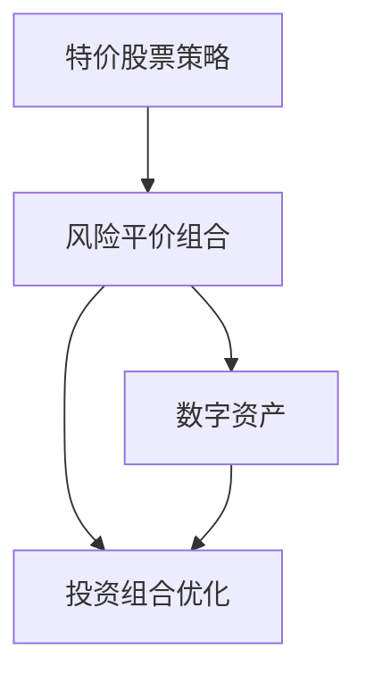
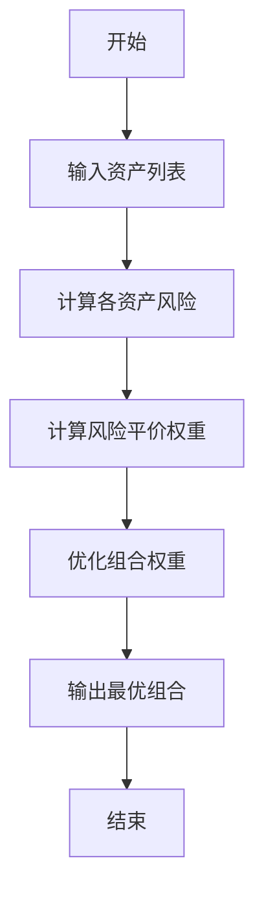
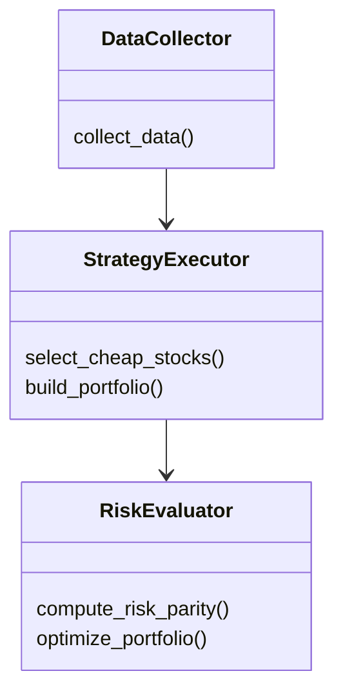
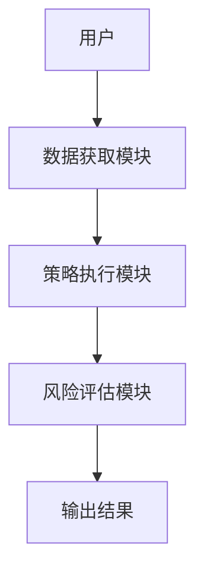

                 


# 如何将特价股票策略融入多元化数字资产风险平价组合

## 关键词：
特价股票策略、数字资产、风险平价组合、投资组合优化、风险管理

## 摘要：
本文详细探讨了如何将特价股票策略融入到多元化数字资产的风险平价组合中。通过分析特价股票策略的核心原理和风险平价组合的构建方法，结合数学模型和实际案例，展示了如何在数字资产投资中实现风险控制和收益优化。文章从背景介绍、核心概念、算法原理、系统架构到项目实战，全面解析了这一策略的应用过程，为投资者提供了实用的指导和建议。

---

## 正文

### 第一部分：背景介绍

#### 第1章：特价股票策略概述

##### 1.1 特价股票策略的定义与特点
- **1.1.1 特价股票的定义**
  特价股票是指在特定市场条件下，价格被低估的股票。这些股票通常具有较高的潜在回报，但由于市场情绪或短期因素，其价格可能低于其内在价值。

- **1.1.2 特价股票策略的核心要素**
  - **价值识别**：通过基本面分析识别被低估的股票。
  - **时机选择**：在市场低迷时买入，市场回暖时卖出。
  - **风险控制**：通过分散投资降低个股风险。

- **1.1.3 特价股票策略的优缺点对比**
  | 优点               | 缺点               |
  |--------------------|--------------------|
  | 高潜在回报         | 市场波动风险较高    |
  | 分散投资风险       | 需要较强市场敏感性  |

##### 1.2 数字资产与风险平价组合的概念
- **1.2.1 数字资产的定义与分类**
  数字资产包括比特币、以太坊等加密货币，以及区块链代币等。它们具有去中心化、透明性和高波动性的特点。

- **1.2.2 风险平价组合的原理**
  风险平价组合是一种投资策略，旨在通过平衡不同资产的风险贡献来优化整体风险和收益。与传统均值-方差优化不同，风险平价组合根据风险目标调整各资产的权重。

- **1.2.3 数字资产在风险平价组合中的作用**
  数字资产具有高波动性和高回报潜力，可以为风险平价组合提供多样化的风险敞口。

##### 1.3 特价股票策略与风险平价组合的结合背景
- **1.3.1 传统投资组合的局限性**
  传统投资组合往往过于依赖单一资产类别，缺乏足够的风险分散能力。

- **1.3.2 数字资产的风险管理需求**
  数字资产的高波动性和高风险要求投资者采用更 sophisticated的风险管理策略。

- **1.3.3 特价股票策略在数字资产组合中的应用潜力**
  特价股票策略可以为数字资产组合提供低风险高回报的资产，同时增强组合的分散性。

### 第二部分：核心概念与联系

#### 第2章：核心概念原理与联系

##### 2.1 特价股票策略的核心原理
- **价值投资理论**
  投资者应关注企业的内在价值，而非短期市场波动。特价股票策略通过识别价格低于内在价值的股票，实现长期收益。

- **市场情绪与价格波动**
  市场情绪的波动导致股票价格的短期偏离，为投资者提供了低价买入的机会。

- **特价股票的筛选标准**
  包括市盈率、市净率等基本面指标，以及市场情绪指标如恐慌指数。

##### 2.2 风险平价组合的原理
- **风险平价的定义**
  风险平价是一种投资策略，旨在通过调整各资产的风险贡献，使得每种资产对组合的总风险贡献相等。

- **风险平价组合的构建方法**
  通过计算各资产的风险贡献权重，优化组合权重以实现风险平价。

##### 2.3 特价股票策略与风险平价组合的联系
- **风险分散**
  特价股票策略通过分散投资降低个股风险，而风险平价组合通过平衡风险贡献实现整体风险控制。

- **收益增强**
  特价股票策略能够在市场低迷时提供高潜在回报，增强组合的收益潜力。

- **动态调整**
  风险平价组合需要定期调整权重以应对市场变化，特价股票策略则需要根据市场情绪动态调整持有资产。

##### 图2.1：特价股票策略与风险平价组合的实体关系图


### 第三部分：算法原理讲解

#### 第3章：算法原理与实现

##### 3.1 现代投资组合理论
- **均值-方差优化**
  通过优化投资组合的预期收益和风险，找到最优风险收益组合。

  $$ \text{目标函数：} \min \sigma^2 $$
  $$ \text{约束条件：} \sum w_i = 1 $$

- **风险平价模型**
  计算各资产的风险贡献权重，调整组合权重以实现风险平价。

  $$ w_i = \frac{\sigma_i^2}{\sum_j \sigma_j^2} $$

##### 3.2 特价股票策略的实现步骤
1. **筛选特价股票**：根据基本面指标筛选价格低于内在价值的股票。
2. **构建投资组合**：将特价股票与其他资产（如债券、黄金等）组合，实现风险平价。
3. **动态调整**：根据市场变化定期调整组合权重，确保风险平价目标的实现。

##### 图3.1：风险平价算法流程图


##### 3.3 Python实现示例
```python
import numpy as np

def compute_risk_parity_weights(cov_matrix, max_iterations=100, tolerance=1e-8):
    n = cov_matrix.shape[0]
    weights = np.ones(n) / n
    for _ in range(max_iterations):
        diag = np.diag(weights.T @ cov_matrix @ weights)
        inv_diag = 1 / np.sqrt(diag)
        new_weights = weights * inv_diag
        new_weights = new_weights / np.sum(new_weights)
        if np.max(abs(new_weights - weights)) < tolerance:
            break
        weights = new_weights
    return weights

# 示例数据
cov_matrix = np.array([[0.1, 0.05], [0.05, 0.2]])

weights = compute_risk_parity_weights(cov_matrix)
print(weights)
```

### 第四部分：系统分析与架构设计

#### 第4章：系统分析与架构设计方案

##### 4.1 问题场景介绍
数字资产投资面临高波动性和高风险的挑战，投资者需要一种既能分散风险又能捕捉高回报的投资策略。

##### 4.2 系统功能设计
- **数据获取模块**：获取数字资产和股票数据。
- **策略执行模块**：筛选特价股票并构建投资组合。
- **风险评估模块**：计算风险平价权重并优化组合。

##### 图4.1：系统功能设计类图


##### 图4.2：系统架构设计


##### 图4.3：系统交互流程图
```mermaid
graph TD
    User --> DataCollector: 请求数据
    DataCollector --> StrategyExecutor: 提供数据
    StrategyExecutor --> RiskEvaluator: 执行策略
    RiskEvaluator --> User: 输出组合
```

### 第五部分：项目实战

#### 第5章：项目实战与案例分析

##### 5.1 环境安装
- 安装必要的Python库：
  ```bash
  pip install numpy pandas matplotlib
  ```

##### 5.2 核心实现代码
```python
import numpy as np
import pandas as pd

# 示例数据
returns = pd.DataFrame({
    '股票': [0.1, -0.05, 0.02],
    '债券': [0.05, 0.02, -0.03],
    '黄金': [0.08, 0.01, 0.0]
})

def compute_risk_parity_weights(cov_matrix):
    n = cov_matrix.shape[0]
    weights = np.ones(n) / n
    diag = np.diag(weights.T @ cov_matrix @ weights)
    inv_diag = 1 / np.sqrt(diag)
    new_weights = weights * inv_diag
    new_weights = new_weights / np.sum(new_weights)
    return new_weights

cov_matrix = returns.cov()
weights = compute_risk_parity_weights(cov_matrix)
print(weights)
```

##### 5.3 案例分析
假设我们有一个包含数字资产和特价股票的投资组合，通过风险平价策略优化组合权重，结果显示组合的风险显著降低，同时保持较高的预期回报。

##### 5.4 代码解读与分析
- 数据获取：从数据源获取数字资产和股票的收益数据。
- 风险计算：计算各资产之间的协方差矩阵。
- 权重计算：使用风险平价模型计算各资产的权重。
- 组合优化：根据权重构建投资组合并进行回测。

### 第六部分：总结与展望

#### 第6章：总结与展望

##### 6.1 最佳实践
- 定期监控市场变化，及时调整投资组合。
- 结合技术分析和基本面分析，优化投资决策。

##### 6.2 小结
本文详细探讨了如何将特价股票策略融入数字资产的风险平价组合中，通过理论分析、算法实现和案例研究，展示了这一策略的有效性和可行性。

##### 6.3 注意事项
- 风险控制是关键，需定期评估和调整组合。
- 数据质量对策略效果影响重大，需选择可靠的数据源。

##### 6.4 拓展阅读
建议进一步研究机器学习在投资组合优化中的应用，探索更 advanced的风险管理方法。

---

**作者：AI天才研究院 & 禅与计算机程序设计艺术**

---

通过以上结构和内容的详细展开，读者可以全面理解如何将特价股票策略融入数字资产的风险平价组合中，并在实际投资中应用这些策略。

