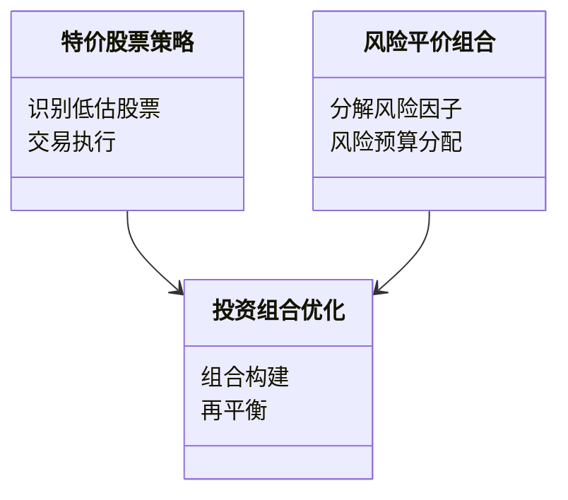

                 


# 如何将特价股票策略融入多元化风险平价组合

## 关键词：特价股票，风险平价，投资组合，资产配置，风险管理

## 摘要：本文详细探讨了如何将特价股票策略与风险平价组合相结合，构建一个高效、稳定的多元化投资组合。通过分析特价股票策略的核心要素和风险平价组合的原理，本文提出了一个优化的资产配置方法，旨在在控制风险的同时提高投资收益。

---

# 第一部分: 特价股票策略与风险平价组合的背景与基础

## 第1章: 特价股票策略与风险平价组合概述

### 1.1 特价股票策略的背景与意义

#### 1.1.1 特价股票的定义与特点
特价股票是指那些由于市场波动或其他因素导致价格暂时低于其内在价值的股票。其特点包括高波动性、低估值和潜在的反弹机会。

#### 1.1.2 特价股票策略的核心目标
通过识别市场低估的股票，利用短期价格波动，获取超额收益。这种策略通常适用于短期投资，需要快速决策和执行。

#### 1.1.3 特价股票策略在投资组合中的作用
- 提供短期收益机会
- 增加组合的多样性
- 降低整体投资风险

### 1.2 风险平价组合的定义与特点

#### 1.2.1 风险平价的定义
风险平价是一种资产配置方法，旨在将投资组合中各资产的风险贡献平均化，以达到风险分散的目的。

#### 1.2.2 风险平价组合的优势
- 降低尾部风险
- 提高组合的稳定性
- 优化风险调整后收益

#### 1.2.3 风险平价与传统资产配置的区别
| 特性 | 风险平价 | 传统资产配置 |
|------|----------|---------------|
| 基础 | 风险贡献 | 期望收益       |
| 优化目标 | 最小化风险贡献 | 最大化预期收益     |

### 1.3 特价股票策略与风险平价组合的结合意义

#### 1.3.1 提高投资组合的收益风险比
通过将特价股票策略融入风险平价组合，可以在保持较低风险的同时，捕捉市场低估的机会，提高整体收益。

#### 1.3.2 降低市场波动对组合的影响
风险平价组合的分散性可以有效抵消特价股票策略的高波动性，从而降低整体投资组合的波动性。

#### 1.3.3 优化资产配置的灵活性
结合特价股票策略的风险平价组合可以根据市场变化动态调整资产配置，提高组合的灵活性和适应性。

## 第2章: 特价股票策略的核心概念与原理

### 2.1 特价股票策略的核心要素

#### 2.1.1 市场微观结构分析
分析市场中的买卖价差、订单簿深度等因素，识别短期交易机会。

#### 2.1.2 交易机会识别
通过技术分析或基本面分析，识别那些价格被低估的股票。

#### 2.1.3 交易执行策略
制定高效的交易执行策略，包括订单类型选择和交易时机把握。

### 2.2 风险平价组合的核心要素

#### 2.2.1 风险因子分解
将市场风险分解为多个因子，如市值、价值、动量等，构建多因子风险模型。

#### 2.2.2 风险预算分配
根据各资产的风险贡献，分配风险预算，确保各资产的风险暴露均衡。

#### 2.2.3 组合再平衡机制
定期调整投资组合，以维持风险平价目标，应对市场变化。

### 2.3 特价股票策略与风险平价组合的结合原理

#### 2.3.1 风险与收益的平衡
通过风险平价方法，平衡特价股票的高收益潜力与高风险特性，降低整体投资组合的风险。

#### 2.3.2 组合优化的数学模型
利用数学优化模型，将特价股票策略纳入风险平价组合，实现最优资产配置。

#### 2.3.3 策略执行的动态调整
根据市场变化，动态调整特价股票的权重和风险预算，保持组合的稳定性。

---

## 第3章: 风险平价组合的数学模型与算法

### 3.1 现代投资组合理论基础

#### 3.1.1 均值-方差优化模型
目标函数：
$$ \min \sigma^2 $$
约束条件：
$$ \mathbf{w}^T \mathbf{r} = \mu $$

#### 3.1.2 风险平价的数学表达
风险平价条件：
$$ w_i = \frac{\sigma_i}{\sum_j \sigma_j} $$

### 3.2 风险平价组合的构建算法

#### 3.2.1 现代投资组合理论的改进
改进后的优化模型：
$$ \min \sum_{i=1}^n \lambda_i w_i^2 $$
其中，$\lambda_i$ 是风险平价因子。

#### 3.2.2 风险平价组合的优化步骤
1. 估计各资产的风险因子。
2. 计算各资产的风险贡献。
3. 根据风险平价目标调整各资产的权重。
4. 实现组合优化。

---

## 第4章: 系统分析与架构设计

### 4.1 系统功能设计

#### 4.1.1 领域模型（Mermaid 类图）


#### 4.1.2 系统架构设计（Mermaid 架构图）


---

## 第5章: 项目实战

### 5.1 环境安装
- Python 3.8+
- NumPy, Pandas, Scipy
- Mermaid, Plotly

### 5.2 核心实现代码

#### 5.2.1 风险平价算法实现
```python
import numpy as np

def risk_parity Allocation(cov_matrix, target_risk):
    n = len(cov_matrix)
    # 初始化权重向量
    w = np.ones(n) / n
    # 迭代计算风险平价权重
    while True:
        risk_contribution = w * (cov_matrix @ w)
        sum_rc = np.sum(risk_contribution)
        w_new = risk_contribution / sum_rc
        if np.allclose(w, w_new, rtol=1e-4, atol=1e-4):
            break
        w = w_new
    return w
```

#### 5.2.2 特价股票策略实现
```python
import pandas as pd

def find_dollar_cost_averaging_stocks(portfolio, target_weights):
    # 计算当前权重
    current_weights = portfolio.value * portfolio.weights
    # 计算偏离
    deviations = target_weights - current_weights
    # 返回需要调整的股票列表
    return deviations[deviations != 0].index
```

### 5.3 案例分析

#### 5.3.1 案例介绍
构建一个包含10只股票的风险平价组合，其中部分股票采用特价股票策略。

#### 5.3.2 代码实现
```python
import numpy as np

# 示例数据：协方差矩阵和目标风险
cov_matrix = np.array([[0.02, 0.01, 0.01],
                        [0.01, 0.03, 0.02],
                        [0.01, 0.02, 0.03]])
target_risk = [0.3, 0.3, 0.4]

# 调用风险平价算法
weights = risk_parity_Allocation(cov_matrix, target_risk)
print("权重:", weights)
```

### 5.4 小结

---

## 第6章: 最佳实践与总结

### 6.1 小结
通过将特价股票策略融入风险平价组合，可以在控制风险的同时，捕捉市场低估的机会，实现投资收益的最大化。

### 6.2 注意事项
- 定期监控和调整组合
- 选择合适的特价股票筛选方法
- 严格控制交易成本和滑点

### 6.3 未来研究方向
- 研究更高效的优化算法
- 探索更多元化的资产类别
- 开发实时交易系统

### 6.4 扩展阅读
- 《投资学》（作者：某专家）
- 《风险管理与对冲》（作者：某专家）

---

## 作者：AI天才研究院/AI Genius Institute & 禅与计算机程序设计艺术 /Zen And The Art of Computer Programming

