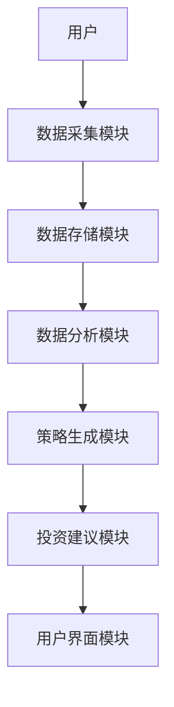

                 


# 如何将特价股票策略融入家庭财务规划

> 关键词：特价股票策略、家庭财务规划、股票投资、风险管理、资产配置

> 摘要：本文详细探讨如何将特价股票策略融入家庭财务规划，从理论到实践，结合算法与系统设计，为读者提供全面的指导。

---

## 第1章: 特价股票策略概述

### 1.1 特价股票的定义与特点

#### 1.1.1 什么是特价股票
特价股票是指市场价格低于其内在价值的股票。这种股票通常因为市场波动、投资者情绪或公司特定情况导致其价格被低估。

#### 1.1.2 特价股票的核心特征
| 特征 | 描述 |
|------|------|
| 低估值 | 市盈率、市净率等指标低于行业平均水平 |
| 高股息率 | 相对于股票价格，股息收益较高 |
| 高流动性 | 交易量大，买卖价差小 |

#### 1.1.3 特价股票与普通股票的区别
- **价值驱动**：特价股票注重内在价值，普通股票注重市场趋势。
- **风险偏好**：特价股票适合风险承受能力较高的投资者，普通股票风险相对较低。

### 1.2 家庭财务规划的基本概念

#### 1.2.1 家庭财务规划的定义
家庭财务规划是通过分析家庭的收入、支出、资产和负债，制定合理的财务目标和计划，以实现财务安全和财富增长。

#### 1.2.2 家庭财务规划的主要目标
- **财务安全**：确保家庭的基本生活需求和应急资金。
- **财富增长**：通过投资实现资产增值。
- **风险管理**：降低财务风险，如失业、疾病等。

#### 1.2.3 家庭财务规划的实施步骤
1. **评估现状**：分析家庭的收入、支出、资产和负债。
2. **设定目标**：明确短期和长期财务目标。
3. **制定计划**：根据目标选择合适的投资策略。
4. **执行计划**：分配资产，开始投资。
5. **监控调整**：定期评估并调整计划。

### 1.3 特价股票策略在家庭财务规划中的作用

#### 1.3.1 特价股票策略的优势
- **高回报潜力**：低估股票有较大的增值空间。
- **分散投资风险**：通过多样化投资降低风险。

#### 1.3.2 特价股票策略的风险与挑战
- **市场波动**：股价可能因市场变化大幅波动。
- **选股难度**：需要专业知识和技能来识别低估股票。

#### 1.3.3 特价股票策略与家庭财务规划的结合点
- **资产配置**：将部分资产配置为特价股票，平衡风险与收益。
- **长期规划**：特价股票适合长期持有，与财务规划的长期目标一致。

### 1.4 本章小结
特价股票策略通过低估值和高回报潜力，为家庭财务规划提供了有效的投资工具。然而，需要结合风险管理，确保财务安全。

---

## 第2章: 特价股票策略的核心概念与联系

### 2.1 特价股票策略的原理

#### 2.1.1 市场定价与价值分析
- **市场定价**：股票价格由市场供需决定。
- **价值分析**：通过基本面分析确定股票的内在价值。

#### 2.1.2 基本面分析与技术分析
- **基本面分析**：研究公司财务状况、行业地位等。
- **技术分析**：通过价格走势预测未来趋势。

#### 2.1.3 特价股票的识别标准
- **低市盈率（P/E）**：市盈率低于行业平均水平。
- **低市净率（P/B）**：市净率低于行业平均水平。
- **高股息率**：股息收益率高于行业平均水平。

### 2.2 特价股票与家庭财务规划的关系

#### 2.2.1 特价股票在资产配置中的地位
- **核心资产**：作为资产配置的一部分，提供高回报。
- **分散风险**：与其他资产如债券、房地产等搭配，降低整体风险。

#### 2.2.2 特价股票对家庭财务安全的影响
- **潜在收益**：通过股价上涨实现财富增长。
- **风险控制**：通过精选个股降低投资风险。

#### 2.2.3 特价股票策略与家庭财务目标的协调
- **短期目标**：如应急资金，不宜配置过多特价股票。
- **长期目标**：如子女教育、退休储备，适合长期持有特价股票。

### 2.3 特价股票策略的核心要素

#### 2.3.1 市场周期分析
- **周期波动**：识别市场周期，选择低估阶段介入。

#### 2.3.2 个股估值模型
- **内在价值计算**：使用DCF模型等方法估算股票价值。

#### 2.3.3 风险管理策略
- **止损设置**：设定止损点，避免重大损失。
- **仓位控制**：合理分配资金，避免过度集中。

### 2.4 本章小结
通过基本面和技术分析，结合市场周期和个人财务目标，可以有效识别和配置特价股票，实现家庭财务规划的优化。

---

## 第3章: 特价股票策略的算法原理与数学模型

### 3.1 特价股票识别的算法原理

#### 3.1.1 基于价值的股票筛选算法
- **筛选标准**：市盈率、市净率、股息率等指标。
- **排序与选择**：根据综合评分选择低估股票。

#### 3.1.2 市场情绪分析算法
- **情绪指标**：使用VIX指数等衡量市场波动。
- **情绪周期**：识别市场恐慌期，寻找低估股票。

#### 3.1.3 风险评估算法
- **风险评分**：结合行业风险、公司财务状况等评估个股风险。

### 3.2 特价股票识别的数学模型

#### 3.2.1 市盈率模型
- **公式**：市盈率 = 股价 / 每股收益
- **应用**：识别市盈率低于行业平均的股票。

#### 3.2.2 市净率模型
- **公式**：市净率 = 股价 / 每股净资产
- **应用**：识别市净率低于行业平均的股票。

#### 3.2.3 股息率模型
- **公式**：股息率 = 每股股息 / 股价
- **应用**：识别股息率高于行业平均的股票。

### 3.3 算法实现的代码示例

#### 3.3.1 Python代码实现
```python
import pandas as pd
import yfinance as yf

# 下载股票数据
tickers = ['AAPL', 'MSFT', 'GOOGL']
data = yf.download(tickers, start='2020-01-01', end='2023-12-31')

# 计算市盈率
data['PE'] = data['Close'] / data['EPS']
data['PB'] = data['Close'] / data['Book Value per Share']
data['Div Yield'] = data['Div Yield']  # 假设数据中已有股息率列
```

#### 3.3.2 数据处理与可视化
- **数据清洗**：处理缺失值和异常值。
- **可视化分析**：使用折线图或柱状图展示市盈率、市净率等指标。

#### 3.3.3 算法优化与测试
- **回测分析**：测试策略在历史数据中的表现。
- **参数调整**：优化筛选标准，提高策略的有效性。

### 3.4 本章小结
通过算法和数学模型，可以系统地识别特价股票，为家庭财务规划提供科学依据。

---

## 第4章: 特价股票策略的系统分析与架构设计

### 4.1 系统分析

#### 4.1.1 问题场景介绍
- **目标**：开发一个基于特价股票策略的家庭财务规划系统。
- **用户**：家庭投资者，希望优化资产配置。

#### 4.1.2 项目目标与范围
- **目标**：帮助用户识别低估股票，制定投资计划。
- **范围**：涵盖数据采集、分析、策略执行等模块。

#### 4.1.3 系统功能需求
- **数据采集**：获取股票数据。
- **数据分析**：计算市盈率、市净率等指标。
- **策略执行**：根据策略生成投资建议。

### 4.2 系统架构设计

#### 4.2.1 系统架构图


#### 4.2.2 数据流设计
- **数据流入**：用户输入查询条件，系统接收数据。
- **数据处理**：数据采集、清洗、分析。
- **数据流出**：生成投资建议，反馈给用户。

#### 4.2.3 模块划分与职责
| 模块 | 职责 |
|------|------|
| 数据采集模块 | 采集股票数据 |
| 数据存储模块 | 存储和管理数据 |
| 数据分析模块 | 分析数据，识别低估股票 |
| 策略生成模块 | 根据分析结果生成投资策略 |

### 4.3 系统接口设计

#### 4.3.1 数据接口规范
- **输入接口**：用户输入筛选条件。
- **输出接口**：系统输出投资建议。

#### 4.3.2 用户接口设计
- **用户界面**：友好的GUI，方便用户操作。
- **交互流程**：用户输入需求，系统处理并反馈结果。

### 4.4 本章小结
通过系统架构设计，可以高效地实现特价股票策略，为家庭财务规划提供技术支持。

---

## 第5章: 特价股票策略的项目实战

### 5.1 环境安装与配置

#### 5.1.1 Python环境安装
- **工具**：Anaconda或虚拟环境。
- **依赖库**：Pandas、NumPy、Matplotlib、yfinance。

#### 5.1.2 数据分析库安装
```bash
pip install pandas numpy matplotlib yfinance
```

#### 5.1.3 数据源获取与处理
- **数据源**：Yahoo Finance等平台。
- **数据清洗**：处理缺失值和异常值。

### 5.2 系统核心实现

#### 5.2.1 数据采集模块
```python
import yfinance as yf

# 下载数据
data = yf.download(tickers, start=start_date, end=end_date)
```

#### 5.2.2 数据分析模块
```python
# 计算指标
data['PE'] = data['Close'] / data['EPS']
data['PB'] = data['Close'] / data['Book Value per Share']
```

#### 5.2.3 策略执行模块
```python
# 识别低估股票
selected_stocks = data[(data['PE'] < data['PE'].mean()) & (data['PB'] < data['PB'].mean())]
```

### 5.3 代码实现与解读

#### 5.3.1 数据处理代码
```python
import pandas as pd

# 数据清洗
data.dropna(inplace=True)
data = data[~data['Volume'].isnull()]
```

#### 5.3.2 策略实现代码
```python
# 筛选低估股票
selected_stocks = data[data['PE'] < data['PE'].quantile(0.25)]
```

#### 5.3.3 测试与验证
- **回测分析**：验证策略在历史数据中的表现。
- **参数调整**：优化筛选标准，提高策略的有效性。

### 5.4 实际案例分析

#### 5.4.1 案例背景介绍
- **目标**：配置家庭资产，增加投资收益。
- **预算**：10万元可投资金。

#### 5.4.2 数据分析与策略制定
- **筛选指标**：市盈率低于行业平均，股息率高于行业平均。
- **候选股票**：选出5只符合条件的股票。

#### 5.4.3 策略实施与结果分析
- **投资组合**：将资金分配到3只股票，每只3-4万元。
- **风险控制**：设定止损点，定期评估组合表现。

### 5.5 本章小结
通过项目实战，读者可以掌握如何将特价股票策略应用于家庭财务规划，实现资产增值。

---

## 第6章: 总结与展望

### 6.1 本章小结
- **总结**：特价股票策略通过低估值和高回报潜力，为家庭财务规划提供了有效的投资工具。
- **挑战**：需要结合风险管理，确保财务安全。

### 6.2 未来展望
- **智能投顾**：结合人工智能，提供个性化的投资建议。
- **量化投资**：通过算法优化，提高投资效率。

### 6.3 最佳实践 tips
- **持续学习**：关注市场变化和公司动态。
- **分散投资**：避免过度集中，降低风险。
- **长期持有**：耐心持有低估股票，等待价值回归。

---

## 作者：AI天才研究院/AI Genius Institute & 禅与计算机程序设计艺术 /Zen And The Art of Computer Programming

---

以上是《如何将特价股票策略融入家庭财务规划》的技术博客文章的完整目录和内容框架，希望对您有所帮助！如果需要进一步细化某个部分或添加更多内容，请随时告诉我。

