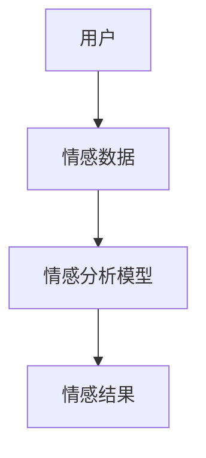
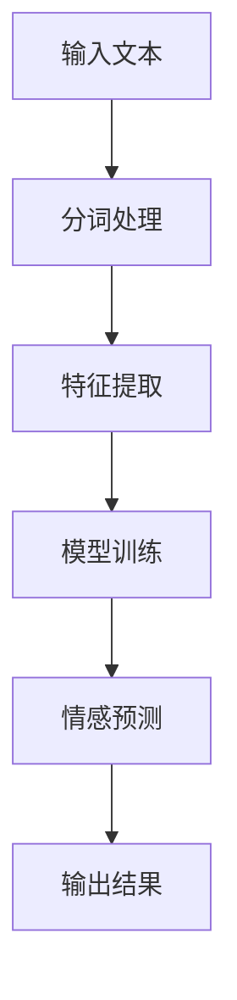
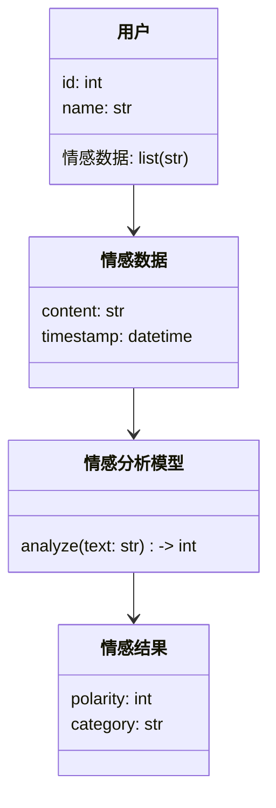
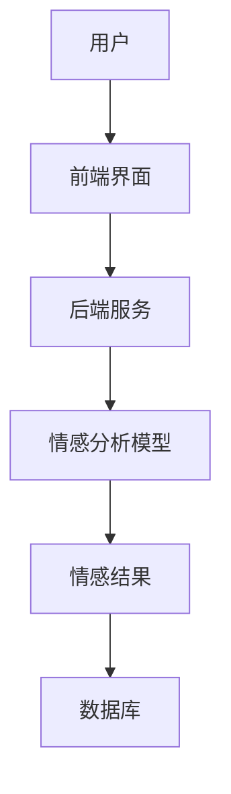
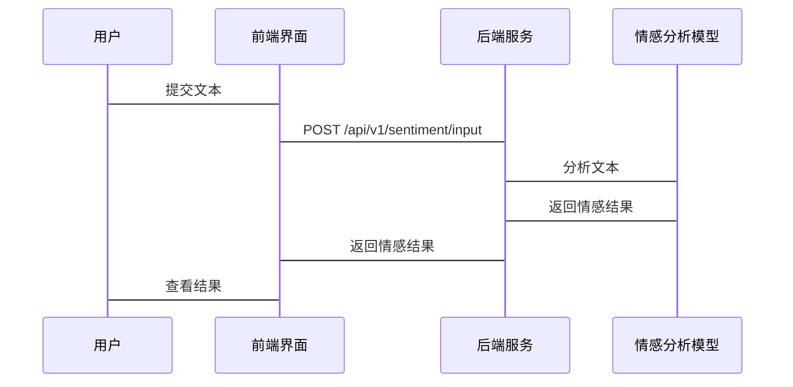

                 


# 如何评估企业的AI驱动的情感计算技术

## 关键词：情感计算, AI技术, 企业应用, 算法评估, 技术实现

## 摘要：本文详细探讨了如何评估企业中的AI驱动情感计算技术，从核心概念、算法原理到系统架构、项目实战等多维度进行了全面分析。通过对比不同算法、设计系统架构、解读数学模型，帮助读者全面理解情感计算技术的评估方法和实现细节。

---

# 第1章 情感计算技术的背景与概念

## 1.1 情感计算的定义与核心概念

### 1.1.1 情感计算的定义

情感计算（Affective Computing），又称为情感智能或情感分析，是指通过计算机技术对人类情感、情绪和心理状态进行识别、理解和计算的过程。情感计算的核心目标是将情感因素融入到人机交互中，使计算机能够理解并响应用户的情感状态。

### 1.1.2 情感计算的核心概念

情感计算的核心概念包括以下几个方面：
1. **情感数据**：包括文本、语音、图像等多模态数据，用于捕捉用户的情感状态。
2. **情感分析**：通过对情感数据的处理和分析，识别出情感极性（如正面、负面、中性）或更细粒度的情感类别（如愤怒、快乐、悲伤等）。
3. **情感模型**：用于表示和计算情感状态的数学模型，包括统计模型和深度学习模型。
4. **情感反馈**：基于情感计算的结果，生成相应的反馈，以优化人机交互体验。

### 1.1.3 情感计算的边界与外延

情感计算的边界在于如何准确地捕捉和理解情感数据，同时避免过度泛化。其外延则包括多模态情感计算、情感推理、情感记忆等高级功能。

---

## 1.2 企业中情感计算技术的应用场景

### 1.2.1 客户情感分析

在企业中，情感计算技术可以用于分析客户对产品、服务或品牌的评价。例如，通过分析客户的社交媒体评论、客服对话记录等，帮助企业了解客户满意度和情感倾向。

### 1.2.2 员工情感分析

情感计算技术也可以用于分析员工的情感状态，例如通过分析员工的邮件、聊天记录等，帮助企业识别员工的负面情绪，及时采取措施改善员工体验。

### 1.2.3 产品与服务优化

通过情感计算技术，企业可以识别客户对产品或服务的痛点和需求，从而优化产品设计和服务流程。

---

## 1.3 情感计算技术的评估重要性

### 1.3.1 企业为什么要评估情感计算技术

在企业中，情感计算技术可以帮助企业更好地理解客户和员工的需求，提升客户满意度和员工幸福感，从而提高企业的竞争力。

### 1.3.2 情感计算技术对企业决策的影响

情感计算技术可以通过分析客户情感数据，为企业提供数据支持，帮助企业在产品设计、市场推广等方面做出更科学的决策。

### 1.3.3 情感计算技术的潜在价值

情感计算技术可以挖掘客户的深层需求，为企业创造更多的商业价值。

---

## 1.4 情感计算技术的关键指标

### 1.4.1 准确率

准确率是情感计算模型在测试数据集上的正确分类比例。

$$ \text{准确率} = \frac{\text{正确分类的数量}}{\text{总分类数量}} $$

### 1.4.2 召回率

召回率是情感计算模型正确识别为正面、负面或中性情感的数量占实际情感数量的比例。

$$ \text{召回率} = \frac{\text{正确识别的情感数量}}{\text{实际情感数量}} $$

### 1.4.3 F1分数

F1分数是准确率和召回率的调和平均数，用于衡量模型的综合性能。

$$ F1 = \frac{2 \times \text{准确率} \times \text{召回率}}{\text{准确率} + \text{召回率}} $$

---

## 1.5 本章小结

本章从情感计算的定义、核心概念、应用场景和评估指标等方面进行了详细探讨，为后续章节的分析奠定了基础。

---

# 第2章 情感计算技术的核心概念与联系

## 2.1 情感计算的核心原理

### 2.1.1 情感数据的采集与处理

情感数据的采集可以通过多种方式，例如文本数据（如社交媒体评论）、语音数据（如客服电话录音）和图像数据（如面部表情识别）。数据处理包括分词、特征提取等步骤。

### 2.1.2 情感分析模型的构建

情感分析模型的构建可以基于传统的机器学习算法（如SVM、随机森林）或深度学习算法（如LSTM、BERT）。

### 2.1.3 情感计算的输出结果

情感计算的输出结果可以是情感极性（如正面、负面、中性）或更细粒度的情感类别（如愤怒、快乐、悲伤等）。

---

## 2.2 情感计算的核心概念对比表

| 情感计算 | 文本挖掘 | 自然语言处理 | 机器学习 |
|----------|----------|--------------|----------|
| 目标     | 发现文本中的情感信息 | 从文本中提取结构化信息 | 预测情感极性 |
| 方法     | 基于规则或机器学习 | 基于统计或深度学习 | 基于特征工程和模型训练 |

---

## 2.3 情感计算的ER实体关系图



---

## 2.4 本章小结

本章通过对比分析和ER图展示了情感计算技术的核心概念及其与其他技术的联系，为后续章节的算法实现提供了理论基础。

---

# 第3章 情感计算技术的算法原理

## 3.1 情感计算的主流算法

### 3.1.1 基于规则的分类算法

基于规则的分类算法通过预定义的规则（如关键词匹配）来判断文本的情感极性。

### 3.1.2 基于机器学习的情感分析算法

基于机器学习的情感分析算法包括SVM、随机森林等算法，通过训练数据学习情感分类的特征。

### 3.1.3 基于深度学习的情感分析算法

基于深度学习的情感分析算法包括LSTM、BERT等模型，能够捕捉文本的上下文信息，提高情感分析的准确性。

---

## 3.2 情感计算的算法流程图



---

## 3.3 情感计算的Python实现

### 3.3.1 基于机器学习的情感分析实现

```python
from sklearn.svm import SVC
from sklearn.feature_extraction.text import TfidfVectorizer

# 数据预处理
texts = ["This is a great product!", "I hate this service!", "It's okay."]
labels = [1, 0, -1]

# 特征提取
vectorizer = TfidfVectorizer()
X = vectorizer.fit_transform(texts)

# 模型训练
model = SVC()
model.fit(X, labels)

# 情感预测
test_texts = ["This product is amazing!", "I love it!"]
test_X = vectorizer.transform(test_texts)
predictions = model.predict(test_X)
print("预测结果：", predictions)
```

### 3.3.2 基于深度学习的情感分析实现

```python
import tensorflow as tf
from tensorflow.keras import layers

# 数据预处理
train_texts = ["This is a great product!", "I hate this service!", "It's okay."]
train_labels = [1, 0, -1]

# 特征提取
tokenizer = tf.keras.preprocessing.text.Tokenizer(num_words=1000)
tokenizer.fit_on_texts(train_texts)
train_sequences = tokenizer.texts_to_sequences(train_texts)
train_sequences = tf.keras.preprocessing.sequence.pad_sequences(train_sequences, maxlen=10)

# 模型训练
model = tf.keras.Sequential()
model.add(layers.Embedding(input_dim=1000, output_dim=10))
model.add(layers.LSTM(64))
model.add(layers.Dense(3, activation='softmax'))

model.compile(loss='sparse_categorical_crossentropy', optimizer='adam', metrics=['accuracy'])
model.fit(train_sequences, train_labels, epochs=10, batch_size=32)
```

---

## 3.4 情感计算的数学模型

### 3.4.1 情感极性计算公式

$$ \text{情感极性} = \frac{\sum_{i=1}^{n} w_i \times \text{词情感值}}{\sum_{i=1}^{n} w_i} $$

其中，\( w_i \) 是词的重要性权重，\( \text{词情感值} \) 是词语的情感值（如1表示正面，-1表示负面）。

---

## 3.5 本章小结

本章详细介绍了情感计算技术的主流算法及其实现方法，通过代码示例和数学公式帮助读者理解情感计算的核心原理。

---

# 第4章 情感计算技术的系统分析与架构设计

## 4.1 问题场景介绍

企业需要一个能够实时分析客户情感状态的系统，以便及时调整客户服务策略。

---

## 4.2 系统功能设计

### 4.2.1 领域模型类图



### 4.2.2 系统架构图



---

## 4.3 系统接口设计

### 4.3.1 API接口设计

1. **输入接口**：`POST /api/v1/sentiment/input`
   - 请求体：`{ "text": "This is a great product!" }`
2. **输出接口**：`GET /api/v1/sentiment/output`
   - 响应体：`{ "polarity": 1, "category": "positive" }`

### 4.3.2 序列图



---

## 4.4 本章小结

本章通过系统分析和架构设计，展示了如何将情感计算技术应用于企业级系统中。

---

# 第5章 情感计算技术的项目实战

## 5.1 环境安装

### 5.1.1 安装Python和相关库

```bash
pip install numpy scikit-learn tensorflow pandas
```

---

## 5.2 核心代码实现

### 5.2.1 基于机器学习的情感分析模型

```python
from sklearn.feature_extraction.text import TfidfVectorizer
from sklearn.svm import SVC

# 数据预处理
texts = ["This is a great product!", "I hate this service!", "It's okay."]
labels = [1, 0, -1]

# 特征提取
vectorizer = TfidfVectorizer()
X = vectorizer.fit_transform(texts)

# 模型训练
model = SVC()
model.fit(X, labels)

# 情感预测
test_texts = ["This product is amazing!", "I love it!"]
test_X = vectorizer.transform(test_texts)
predictions = model.predict(test_X)
print("预测结果：", predictions)
```

---

## 5.3 代码解读与分析

### 5.3.1 基于机器学习的情感分析代码解读

1. 数据预处理：将文本数据向量化，提取TF-IDF特征。
2. 模型训练：使用SVM算法对特征数据进行训练。
3. 情感预测：对测试文本进行情感预测，并输出结果。

---

## 5.4 实际案例分析

### 5.4.1 案例背景

某电商平台希望分析客户的评论数据，以优化客户服务策略。

### 5.4.2 数据处理

客户评论数据如下：

```python
comments = [
    "This product is great!", "I love it!", "It's okay.", "I hate it!", "This is terrible!"
]
labels = [1, 1, 0, -1, -1]
```

### 5.4.3 模型训练

```python
vectorizer = TfidfVectorizer()
X = vectorizer.fit_transform(comments)
model = SVC()
model.fit(X, labels)
```

### 5.4.4 情感预测

```python
test_comment = ["This is wonderful!"]
test_X = vectorizer.transform([test_comment[0]])
prediction = model.predict(test_X)
print("预测结果：", prediction)
```

---

## 5.5 项目小结

通过本章的项目实战，读者可以掌握情感计算技术的实现方法，并能够在实际项目中应用这些技术。

---

# 第6章 总结与最佳实践

## 6.1 本章总结

本文从背景介绍、核心概念、算法原理、系统架构到项目实战，全面探讨了如何评估企业中的AI驱动情感计算技术。

---

## 6.2 情感计算技术的评估建议

1. **选择合适的算法**：根据具体需求选择基于规则、机器学习或深度学习的算法。
2. **数据质量**：确保情感数据的准确性和完整性。
3. **模型优化**：通过调参和数据增强提高模型性能。
4. **实时性考虑**：在实际应用中，需要考虑系统的实时性和响应速度。

---

## 6.3 情感计算技术的注意事项

1. **数据隐私**：在处理客户和员工数据时，需要注意数据隐私和合规性。
2. **模型解释性**：在实际应用中，需要确保模型的可解释性，以便更好地理解和优化模型。
3. **多模态融合**：在实际应用中，可以尝试将文本、语音和图像等多种模态的数据进行融合，以提高情感计算的准确性。

---

## 6.4 情感计算技术的未来趋势

1. **多模态情感计算**：结合文本、语音、图像等多种模态数据进行情感计算。
2. **情感推理**：从简单的极性分类扩展到更复杂的情感推理和情感记忆。
3. **个性化情感计算**：针对不同用户的情感需求，提供个性化的服务和反馈。

---

## 6.5 拓展阅读

1. **《自然语言处理实战：基于Python的机器学习和深度学习》**
2. **《深度学习入门：基于Python的卷积神经网络和循环神经网络》**
3. **《情感计算：人工智能中的情感智能》**

---

## 作者：AI天才研究院/AI Genius Institute & 禅与计算机程序设计艺术 /Zen And The Art of Computer Programming

