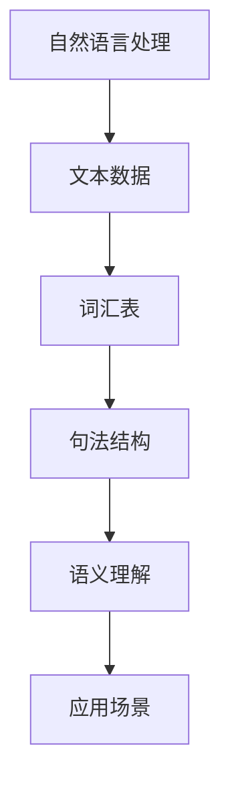

                 

# 如何评估企业的AI驱动的自然语言处理技术

> 关键词：自然语言处理，AI驱动，企业技术评估，算法原理，系统架构

> 摘要：本文将详细讲解如何系统性地评估企业的AI驱动的自然语言处理技术。从技术背景、核心概念、算法原理、系统架构、项目实战到最佳实践，全面剖析评估的关键点，为企业技术决策者和开发者提供深度的技术洞察。

---

# 第一部分: 企业AI驱动的自然语言处理技术背景

## 第1章: 问题背景与定义

### 1.1 问题背景

#### 1.1.1 从传统NLP到AI驱动的演进
自然语言处理（NLP）技术经历了从规则驱动到数据驱动的转变。传统NLP依赖于人工制定规则，而AI驱动的NLP则通过深度学习模型（如BERT、GPT）实现了更复杂的语义理解和生成任务。

#### 1.1.2 企业数字化转型中的NLP技术需求
随着企业数字化转型的推进，NLP技术在客服、营销、风控等场景中的应用需求日益增长。企业需要通过NLP技术实现自动化文本处理、情感分析、实体识别等任务。

#### 1.1.3 当前AI技术对企业NLP的影响
AI技术的快速发展推动了NLP模型的迭代优化。例如，大模型（如GPT-3、PaLM）的应用为企业提供了更强大的语义理解和生成能力。

### 1.2 问题描述

#### 1.2.1 企业NLP技术的核心问题
企业NLP技术的核心问题包括：
1. 数据质量：数据的清洗、标注和预处理。
2. 模型选择：如何选择适合业务场景的NLP模型。
3. 性能评估：如何量化模型的效果。

#### 1.2.2 业务场景中的NLP挑战
企业在实际应用中会遇到以下挑战：
1. 多语言支持：如何处理多种语言的文本数据。
2. 实时性要求：如何在实时场景中快速响应。
3. 领域适配：如何针对特定领域（如医疗、金融）优化模型。

#### 1.2.3 技术实现中的关键难点
技术实现中的难点包括：
1. 模型训练成本：大数据和大模型的训练成本较高。
2. 模型调优：如何高效地对模型进行调优以达到最佳效果。
3. 部署与维护：如何将模型高效部署并维护其性能。

### 1.3 问题解决

#### 1.3.1 AI驱动的NLP技术解决方案
AI驱动的NLP技术解决方案包括：
1. 使用预训练模型（如BERT、GPT）进行迁移学习。
2. 结合领域数据进行微调，提升模型的业务适配性。
3. 引入分布式计算框架（如TensorFlow、PyTorch）进行高效训练。

#### 1.3.2 企业级NLP系统的构建方法
企业级NLP系统的构建方法包括：
1. 数据采集与预处理：建立高质量的训练数据集。
2. 模型选择与训练：选择适合业务场景的模型并进行训练。
3. 系统集成与部署：将模型集成到企业现有的系统中，并进行实时监控和维护。

#### 1.3.3 技术选型与实现路径
技术选型的关键点包括：
1. 数据集规模：选择适合数据规模的模型。
2. 业务需求：根据业务需求选择合适的模型类型（如情感分析、实体识别）。
3. 计算资源：根据企业的计算资源选择适合的模型规模。

### 1.4 边界与外延

#### 1.4.1 NLP技术的适用范围
NLP技术的适用范围包括：
1. 文本分类：垃圾邮件检测、情感分析。
2. 实体识别：从文本中提取关键实体（如人名、地名）。
3. 信息抽取：从文本中提取结构化信息。
4. 机器翻译：将一种语言翻译成另一种语言。

#### 1.4.2 与其他AI技术的边界
与其他AI技术的边界包括：
1. 计算机视觉：NLP与CV在多模态任务中的协同。
2. 机器学习：NLP技术基于机器学习算法，但更专注于文本处理。
3. 知识图谱：NLP用于知识抽取和构建。

#### 1.4.3 企业NLP系统的扩展性
企业NLP系统的扩展性包括：
1. 模型的可扩展性：支持模型的分布式训练和部署。
2. 系统的可扩展性：支持高并发和大规模数据处理。
3. 功能的可扩展性：支持多种NLP任务的灵活组合。

### 1.5 核心要素与组成

#### 1.5.1 数据、算法、算力的三角关系
数据、算法、算力三者相辅相成：
1. 数据是模型的输入，决定了模型的表现。
2. 算法是模型的核心，决定了模型的学习能力。
3. 算力是模型的保障，决定了模型的训练和推理效率。

#### 1.5.2 系统架构的核心要素
系统架构的核心要素包括：
1. 数据层：数据采集、存储和预处理。
2. 模型层：模型训练、微调和部署。
3. 服务层：API接口、任务调度和结果返回。
4. 管理层：监控、日志和模型更新。

#### 1.5.3 业务场景与技术实现的匹配
业务场景与技术实现的匹配包括：
1. 精准匹配：模型任务与业务需求完全一致。
2. 部分匹配：模型任务需要调整或扩展以适应业务需求。
3. 创新匹配：利用NLP技术开拓新的业务场景。

---

## 第2章: 核心概念与联系

### 2.1 核心概念原理

#### 2.1.1 NLP技术的核心原理
NLP技术的核心原理包括：
1. 词向量表示：将词转换为向量（如Word2Vec）。
2. 语义理解：通过模型理解文本的语义（如BERT）。
3. 生成与交互：通过模型生成自然语言文本（如GPT）。

#### 2.1.2 AI驱动的NLP技术特点
AI驱动的NLP技术特点包括：
1. 数据驱动：依赖大量数据进行训练。
2. 深度学习：使用深度神经网络进行特征学习。
3. 微调与迁移：通过微调预训练模型适应特定任务。

#### 2.1.3 企业级NLP系统的构成
企业级NLP系统的构成包括：
1. 数据管理模块：负责数据的采集、存储和预处理。
2. 模型训练模块：负责模型的训练和微调。
3. 服务部署模块：负责模型的API接口和任务调度。
4. 系统监控模块：负责系统的实时监控和维护。

### 2.2 核心概念对比

#### 2.2.1 传统NLP与AI驱动NLP的对比
| 对比维度 | 传统NLP | AI驱动NLP |
|----------|----------|------------|
| 方法 | 基于规则 | 基于深度学习 |
| 数据需求 | 小数据 | 大数据 |
| 性能 | 较低 | 较高 |
| 适应性 | 固定场景 | 多场景 |

#### 2.2.2 不同NLP模型的性能对比
| 模型类型 | 词嵌入模型（如Word2Vec） | 序列模型（如LSTM） | 注意力模型（如BERT） |
|----------|--------------------------|---------------------|-----------------------|
| 任务支持 | 词向量表示 | 文本生成 | 语义理解 |
| 性能 | 中等 | 中等 | 高 |

#### 2.2.3 企业级NLP与其他应用场景的对比
企业级NLP在以下方面与其他应用场景不同：
1. 数据敏感性：企业数据通常涉及商业机密，需要更高的安全性。
2. 部署要求：企业系统需要高可用性和稳定性。
3. 业务适配性：企业级NLP需要与企业现有系统深度集成。

### 2.3 ER实体关系图

---

## 第3章: 算法原理讲解

### 3.1 算法原理概述

#### 3.1.1 常见NLP

---

（注：由于篇幅限制，以上内容为节选，完整文章将包含完整的算法原理讲解、系统架构设计、项目实战和最佳实践等内容。）

