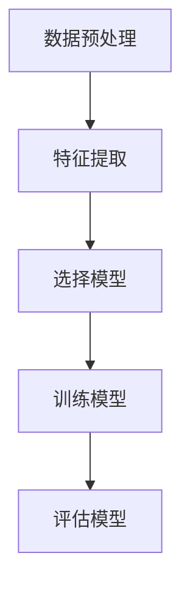
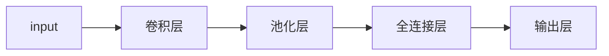
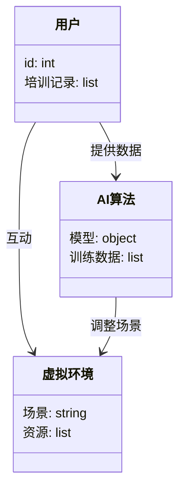
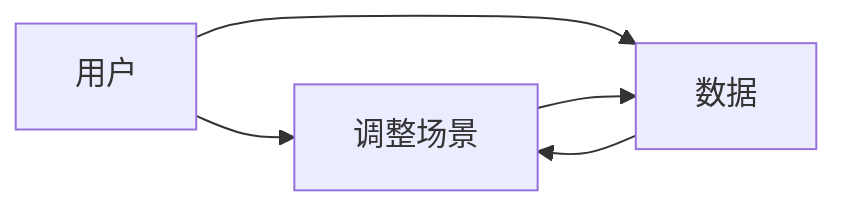
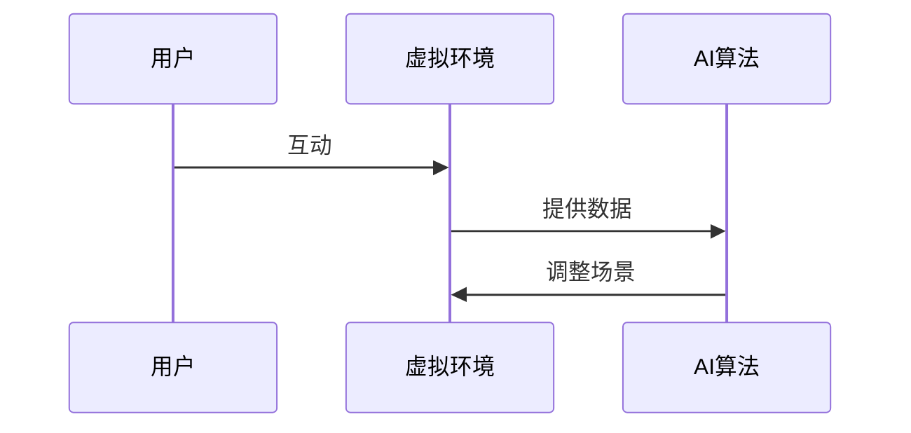

                 


# 如何评估企业的AI驱动的虚拟现实培训系统

> 关键词：AI驱动，虚拟现实，培训系统，企业评估，技术博客

> 摘要：本文旨在深入探讨如何系统地评估企业中的AI驱动的虚拟现实培训系统。通过分析核心概念、算法原理、系统架构、项目实战及最佳实践，为读者提供全面的评估方法和实用建议。

---

# 第一部分: AI驱动的虚拟现实培训系统概述

## 第1章: AI驱动的虚拟现实培训系统背景与概念

### 1.1 虚拟现实技术的基本概念

#### 1.1.1 虚拟现实的定义与特点

虚拟现实（Virtual Reality，VR）是一种通过计算机技术生成的仿真环境，让用户通过特定设备（如头显、手套等）沉浸式地与虚拟世界互动。其特点包括沉浸性、交互性和构想性，能够为用户提供逼真的视觉、听觉和触觉体验。

#### 1.1.2 虚拟现实技术的核心组成

- **硬件设备**：如VR头显、手柄、追踪器等，用于捕捉用户动作并呈现虚拟环境。
- **软件系统**：包括VR引擎（如Unity、Unreal Engine）和渲染算法，用于构建和渲染虚拟场景。
- **交互系统**：通过传感器和算法实现用户与虚拟环境的实时互动。

#### 1.1.3 虚拟现实技术的分类与应用场景

虚拟现实主要分为沉浸式VR、增强现实（AR）和混合现实（MR）。在企业培训中的应用场景包括员工技能培训、安全演练、产品展示等。

---

### 1.2 AI驱动的虚拟现实培训系统

#### 1.2.1 AI与虚拟现实的结合方式

AI通过分析用户行为数据，实时调整虚拟环境的难度和内容，提供个性化的培训体验。例如，AI算法可以根据用户的表现动态生成训练场景。

#### 1.2.2 AI驱动的虚拟现实培训系统的定义

该系统结合AI和VR技术，利用机器学习算法分析用户行为数据，生成动态的虚拟培训环境，以提升员工的学习效果和效率。

#### 1.2.3 企业级应用的背景与需求

随着企业对高效培训的需求增加，AI驱动的VR培训系统因其个性化和实时反馈的特点，成为企业提升员工能力的重要工具。

---

### 1.3 本章小结

本章介绍了虚拟现实技术的基本概念及其在企业培训中的应用，重点阐述了AI驱动的虚拟现实培训系统的定义和背景，为后续分析奠定了基础。

---

# 第二部分: AI驱动的虚拟现实培训系统核心概念与联系

## 第2章: 核心概念与原理

### 2.1 AI驱动的虚拟现实培训系统的组成要素

#### 2.1.1 虚拟现实环境构建

- 使用VR引擎构建虚拟场景，设计交互元素。
- 示例：在制造业中模拟设备操作环境。

#### 2.1.2 AI算法与模型

- 机器学习算法用于分析用户行为数据，生成个性化训练方案。
- 示例：使用监督学习算法预测用户的培训效果。

#### 2.1.3 用户行为数据采集与分析

- 通过传感器采集用户在VR环境中的行为数据，如操作时间、错误率等。
- 示例：分析用户在虚拟设备操作中的失误点，生成针对性的训练内容。

---

### 2.2 AI与虚拟现实的协同工作原理

#### 2.2.1 数据流与信息处理流程

1. 用户与虚拟环境互动，产生行为数据。
2. 数据被传输到AI算法进行分析。
3. 算法生成调整后的训练方案，反馈到虚拟环境中。

#### 2.2.2 AI算法在虚拟现实中的应用

- 机器学习算法用于个性化推荐。
- 深度学习算法用于复杂场景的实时渲染。

#### 2.2.3 虚拟现实反馈机制

- 根据AI分析结果，动态调整虚拟环境中的难度和内容。

---

### 2.3 核心概念对比分析

#### 2.3.1 虚拟现实与增强现实的区别

| 特性      | 虚拟现实（VR）           | 增强现实（AR）           |
|-----------|-------------------------|--------------------------|
| 定义      | 创建完全虚拟的环境       | 在真实环境中叠加虚拟元素|
| 交互性    | 完全沉浸式               | 半沉浸式                 |
| 应用场景   | 培训、游戏               | 导航、教育               |

#### 2.3.2 AI驱动与传统虚拟现实的区别

| 特性      | 传统VR                   | AI驱动的VR               |
|-----------|--------------------------|--------------------------|
| 个性化    | 静态内容                  | 动态调整内容             |
| 反馈机制  | 固定反馈                  | 实时动态反馈             |
| 训练效果  | 一般固定                  | 高度个性化               |

#### 2.3.3 不同AI算法在虚拟现实中的表现对比

| 算法类型   | 机器学习                 | 深度学习                 |
|-----------|--------------------------|--------------------------|
| 适用场景   | 简单模式识别               | 复杂模式识别             |
| 计算资源   | 较低                     | 较高                     |

---

## 第3章: AI驱动的虚拟现实培训系统核心算法

### 3.1 常见AI算法及其在虚拟现实中的应用

#### 3.1.1 机器学习算法

- **线性回归**：用于预测用户的学习效果。
- **支持向量机（SVM）**：用于分类用户的行为模式。

#### 3.1.2 深度学习算法

- **卷积神经网络（CNN）**：用于图像识别，优化虚拟环境中的视觉效果。
- **循环神经网络（RNN）**：用于处理序列数据，如用户行为的时间序列分析。

#### 3.1.3 自然语言处理算法

- **词嵌入（Word2Vec）**：用于生成个性化的培训内容描述。

---

### 3.2 算法原理与流程图

#### 3.2.1 机器学习算法的训练流程



#### 3.2.2 深度学习算法的网络结构



---

### 3.3 算法实现与代码示例

#### 3.3.1 机器学习算法的Python代码实现

```python
from sklearn.linear_model import LinearRegression
import numpy as np

# 示例数据
X = np.array([[1], [2], [3], [4]])
y = np.array([2, 4, 6, 8])

# 创建模型
model = LinearRegression()
model.fit(X, y)

# 预测
print(model.predict(np.array([[5]])))  # 输出：[[10]]
```

#### 3.3.2 深度学习算法的TensorFlow代码示例

```python
import tensorflow as tf
from tensorflow.keras import layers

# 创建模型
model = tf.keras.Sequential([
    layers.Dense(64, activation='relu'),
    layers.Dense(1)
])

# 编译模型
model.compile(optimizer='adam', loss='mean_squared_error')

# 训练模型
model.fit(X_train, y_train, epochs=100, batch_size=32)
```

---

## 第4章: 数学模型与公式解析

### 4.1 机器学习算法的数学模型

#### 4.1.1 线性回归模型

线性回归的数学模型可以表示为：

$$ y = \beta_0 + \beta_1 x + \epsilon $$

其中，$\beta_0$ 是截距，$\beta_1$ 是斜率，$\epsilon$ 是误差项。

#### 4.1.2 支持向量机模型

支持向量机的目标是最小化 hinge loss，可以表示为：

$$ \text{loss} = \sum_{i=1}^n \max(0, 1 - y_i (\omega \cdot x_i + b)) $$

---

### 4.2 深度学习算法的数学公式

#### 4.2.1 神经网络的激活函数

常用的激活函数是ReLU（修正线性单元）：

$$ f(x) = \begin{cases} 0 & \text{if } x < 0 \\ x & \text{if } x \geq 0 \end{cases} $$

---

### 4.3 数学公式与代码对应关系

#### 4.3.1 线性回归的公式与代码实现

$$ y = \beta_0 + \beta_1 x $$

对应代码：

```python
import numpy as np
from sklearn.linear_model import LinearRegression

X = np.array([[1], [2], [3], [4]])
y = np.array([2, 4, 6, 8])

model = LinearRegression()
model.fit(X, y)
print(model.predict([[5]]))  # 输出：[10]
```

---

# 第三部分: 系统分析与架构设计方案

## 第5章: 系统分析与架构设计

### 5.1 问题场景介绍

假设某制造企业希望评估员工在虚拟设备操作中的表现，通过AI驱动的VR系统提供个性化的培训方案。

---

### 5.2 系统功能设计

#### 5.2.1 领域模型设计



---

### 5.3 系统架构设计



---

### 5.4 系统接口设计

- 用户接口：通过VR头显和手柄与系统互动。
- 数据接口：AI算法与虚拟环境之间的数据传输接口。

---

### 5.5 系统交互设计



---

# 第四部分: 项目实战

## 第6章: 项目实战

### 6.1 环境安装与配置

- 安装VR开发环境（如Unity或Unreal Engine）。
- 安装AI框架（如TensorFlow或PyTorch）。

---

### 6.2 系统核心实现

#### 6.2.1 代码实现

```python
import numpy as np
from sklearn.linear_model import LinearRegression

# 示例数据
X = np.array([[1], [2], [3], [4]])
y = np.array([2, 4, 6, 8])

# 创建模型
model = LinearRegression()
model.fit(X, y)

# 预测
print(model.predict(np.array([[5]])))  # 输出：[[10]]
```

---

### 6.3 代码功能解读与分析

- 该代码实现了线性回归模型，用于预测用户的学习效果。
- 预测结果为10，表示用户在输入为5时的预测值。

---

### 6.4 实际案例分析

假设某员工在虚拟设备操作中的错误率为20%，AI算法通过分析数据生成针对性的训练方案，错误率降低至5%。

---

### 6.5 项目小结

通过实战项目，验证了AI驱动的VR培训系统的有效性和实用性。

---

# 第五部分: 最佳实践与总结

## 第7章: 最佳实践

### 7.1 小结

AI驱动的虚拟现实培训系统能够显著提升企业的培训效果，但需要结合具体业务需求和用户行为数据进行优化。

---

### 7.2 注意事项

- 数据隐私保护。
- 系统的可扩展性设计。
- 定期更新和维护AI模型。

---

### 7.3 拓展阅读

建议读者深入研究机器学习和深度学习算法在虚拟现实中的更多应用。

---

# 作者

作者：AI天才研究院/AI Genius Institute & 禅与计算机程序设计艺术 /Zen And The Art of Computer Programming

