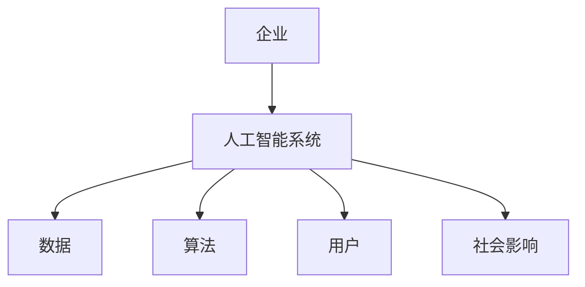
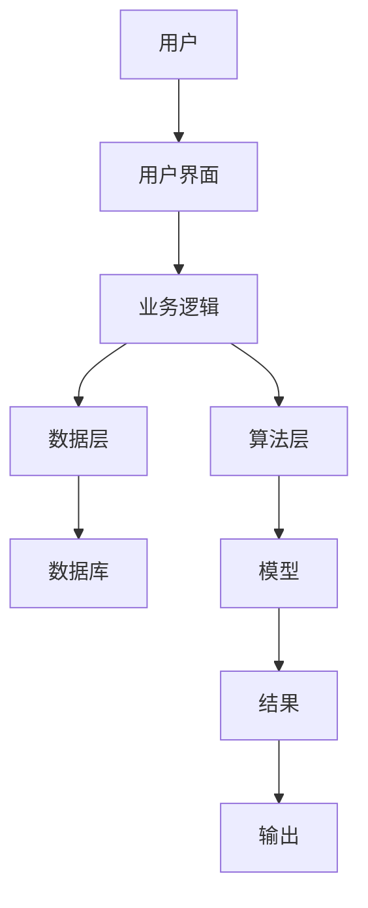
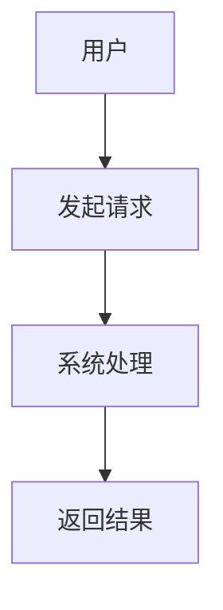

                 


# 如何评估企业的人工智能伦理标准

> 关键词：人工智能、伦理标准、企业评估、技术实现、法律合规、社会影响

> 摘要：本文将系统地介绍如何评估企业的人工智能伦理标准，涵盖从基本概念到技术实现的各个方面。文章首先分析人工智能伦理的背景和核心概念，接着探讨评估方法，包括定性和定量分析，最后结合法律、社会和实际案例进行深入分析，提供最佳实践和小结。

---

# 第1章：人工智能伦理的基本概念

## 1.1 人工智能伦理的背景与问题背景

### 1.1.1 人工智能技术的快速发展

人工智能（AI）技术近年来取得了突飞猛进的发展，从简单的规则引擎到复杂的深度学习模型，AI已经渗透到我们生活的方方面面。企业的AI应用也逐渐普及，从智能客服到自动化决策系统，AI正在改变企业的运作方式。然而，随着AI应用的深入，伦理问题也随之浮现。

### 1.1.2 人工智能应用中的伦理问题

在AI应用的过程中，伦理问题主要集中在以下几个方面：
- **数据隐私**：AI系统通常需要大量的数据进行训练和推理，这些数据可能包含用户的个人信息，如何保护这些数据不被滥用是一个重要的伦理问题。
- **算法偏见**：AI算法可能会因为训练数据中的偏见而导致决策的不公平性，例如在招聘中的性别偏见。
- **透明度与可解释性**：复杂的AI模型通常缺乏透明度，用户和企业很难理解AI的决策过程，这导致了信任问题。
- **责任与问责**：当AI系统出现问题时，责任归属不明确，企业和开发者都可能成为问责的对象。

### 1.1.3 企业人工智能伦理标准的重要性

企业作为AI技术的主要应用者，有责任确保其AI系统的伦理合规性。建立明确的伦理标准可以帮助企业避免法律风险，提升品牌形象，同时也能确保AI技术的健康发展。

---

## 1.2 人工智能伦理的定义与问题描述

### 1.2.1 人工智能伦理的核心概念

人工智能伦理是指在设计、开发和应用AI系统时，应当遵循的道德准则和伦理规范。这些准则旨在确保AI系统的决策和行为符合人类社会的价值观和法律法规。核心概念包括但不限于：
- **公平性**：确保AI系统的决策不偏袒特定群体。
- **透明性**：让用户能够理解AI的决策过程。
- **隐私保护**：保护用户的个人数据不被滥用。
- **可问责性**：当AI系统出现问题时，能够追责。

### 1.2.2 人工智能伦理问题的多维度分析

人工智能伦理问题涉及多个维度，包括技术、法律、社会和伦理等方面。以下是几个关键维度的分析：

- **技术维度**：AI系统的复杂性和不透明性是伦理问题的主要来源。复杂的算法使得决策过程难以被解释，这导致用户和企业的不信任。
- **法律维度**：不同国家和地区对AI的法律规制存在差异，企业需要遵守当地的法律法规，确保AI系统的合规性。
- **社会维度**：AI系统的应用可能对社会产生深远的影响，例如就业市场的变化、社会福利的分配等。
- **伦理维度**：AI系统的行为必须符合伦理规范，避免对人类社会造成负面影响。

### 1.2.3 企业人工智能伦理标准的边界与外延

企业人工智能伦理标准的边界和外延需要明确界定。以下是几个关键点：
- **边界**：企业AI系统的伦理标准主要关注系统的决策和行为，不涉及企业的其他业务领域。
- **外延**：AI伦理标准不仅涵盖技术层面，还包括数据管理、用户隐私、社会责任等多个方面。

---

## 1.3 人工智能伦理标准的核心要素

### 1.3.1 伦理原则与核心要素

人工智能伦理标准的核心要素包括以下几个方面：
- **数据隐私**：确保数据的收集、存储和使用符合相关法律法规。
- **算法公平性**：通过算法设计和数据清洗，消除偏见，确保决策的公平性。
- **透明性与可解释性**：让用户能够理解AI的决策过程。
- **责任与问责**：明确AI系统出现问题时的责任归属，确保能够及时追责和解决问题。

### 1.3.2 标准的制定与实施

制定和实施企业人工智能伦理标准需要考虑以下几个方面：
- **标准制定**：企业需要结合自身的业务特点和行业特点，制定适合自己的伦理标准。
- **标准实施**：通过技术手段和管理措施，确保标准的贯彻落实。

### 1.3.3 标准与企业战略的关系

企业人工智能伦理标准不仅仅是技术问题，更是企业战略的重要组成部分。以下是几个关键点：
- **战略一致性**：企业AI伦理标准应当与企业的整体战略保持一致，确保技术发展与企业目标同步。
- **风险管理**：通过制定和实施伦理标准，企业可以有效降低AI技术应用中的风险，包括法律风险和社会风险。
- **品牌价值**：符合伦理标准的AI系统可以提升企业的品牌形象，增强用户的信任感。

---

## 第2章：人工智能伦理框架与核心概念

## 2.1 人工智能伦理框架的原理

### 2.1.1 伦理框架的构建逻辑

人工智能伦理框架的构建需要遵循一定的逻辑和方法论。以下是几个关键步骤：
1. **问题识别**：识别企业在AI应用中可能面临的伦理问题。
2. **目标设定**：明确伦理框架的目标，例如确保数据隐私、算法公平性等。
3. **框架设计**：设计伦理框架的结构和内容，包括伦理原则、评估方法等。
4. **实施与监控**：将伦理框架应用于实际场景，并持续监控和优化。

### 2.1.2 核心概念的属性特征对比

人工智能伦理框架中的核心概念包括数据、算法、用户和系统。以下是这些核心概念的属性特征对比：

| **概念** | **属性**                     | **特征**                                                                 |
|----------|----------------------------|--------------------------------------------------------------------------|
| 数据     | 隐私性、完整性、可用性       | 数据的隐私性要求高，必须确保数据不被滥用；数据的完整性要求真实可靠，数据的可用性要求易于访问和处理。 |
| 算法     | 公平性、可解释性、鲁棒性     | 算法的公平性要求消除偏见，确保决策的公平性；算法的可解释性要求用户能够理解算法的决策过程；算法的鲁棒性要求在面对异常输入时仍能正常工作。 |
| 用户     | 隐私权、知情权、参与权       | 用户的隐私权要求数据不被滥用；用户的知情权要求了解AI系统的决策过程；用户的参与权要求用户能够对AI系统的决策进行反馈和控制。 |
| 系统     | 透明性、可问责性、合规性     | 系统的透明性要求用户能够理解系统的决策过程；系统的可问责性要求在出现问题时能够追责；系统的合规性要求符合相关法律法规。 |

### 2.1.3 ER实体关系图架构

以下是人工智能伦理框架的ER实体关系图：



---

## 2.2 人工智能伦理框架的系统分析

### 2.2.1 系统功能设计

人工智能系统的功能设计需要考虑伦理框架的要求。以下是几个关键功能模块：
- **数据管理模块**：负责数据的收集、存储和处理，确保数据的隐私性和完整性。
- **算法设计模块**：负责算法的设计和优化，确保算法的公平性和可解释性。
- **用户交互模块**：负责与用户的交互，确保用户的知情权和参与权。
- **监控与优化模块**：负责实时监控系统的运行状态，及时发现和解决伦理问题。

### 2.2.2 系统架构设计

以下是人工智能系统的系统架构图：



---

## 2.3 人工智能伦理框架的系统实现

### 2.3.1 系统接口设计

人工智能系统的接口设计需要考虑伦理框架的要求。以下是几个关键接口：
- **数据接口**：负责数据的输入和输出，确保数据的隐私性和完整性。
- **算法接口**：负责算法的调用和优化，确保算法的公平性和可解释性。
- **用户接口**：负责与用户的交互，确保用户的知情权和参与权。

### 2.3.2 系统交互设计

以下是人工智能系统的交互设计图：



---

## 第3章：人工智能伦理标准的评估方法

## 3.1 人工智能伦理评估的核心算法

### 3.1.1 评估算法的原理

人工智能伦理评估的核心算法通常包括以下几个步骤：
1. **数据预处理**：对数据进行清洗和归一化处理，确保数据的可用性和一致性。
2. **模型训练**：利用训练数据训练伦理评估模型，通常采用监督学习或无监督学习的方法。
3. **评估指标设计**：设计评估指标，例如公平性指标、透明性指标等。
4. **评估实施**：将模型应用于实际数据，计算评估指标，得出评估结果。

### 3.1.2 评估算法的实现

以下是评估算法的实现代码示例：

```python
def calculate_ethics_score(features, weights):
    return sum(w * f for w, f in zip(weights, features))
```

---

## 3.2 评估算法的数学模型与公式

### 3.2.1 伦理评分公式

伦理评分公式如下：

$$
\text{伦理评分} = \sum_{i=1}^{n} w_i \cdot f_i
$$

其中，$w_i$ 是第 $i$ 个特征的权重，$f_i$ 是第 $i$ 个特征的评分。

---

## 3.3 人工智能伦理评估的综合方法

### 3.3.1 定性分析与定量分析的结合

人工智能伦理评估需要结合定性分析和定量分析。以下是两种方法的对比：

| **方法** | **特点**                     | **应用场景**                     |
|----------|------------------------------|----------------------------------|
| 定性分析 | 通过专家判断和案例分析进行评估 | 适用于伦理问题的定性分析，例如公平性、透明性等。 |
| 定量分析 | 通过数学模型和数据统计进行评估 | 适用于伦理问题的定量分析，例如算法偏见、数据隐私等。 |

### 3.3.2 综合评估方法

综合评估方法是一种结合定性分析和定量分析的方法。以下是综合评估方法的步骤：
1. **确定评估指标**：根据伦理框架的要求，确定评估指标。
2. **数据收集与处理**：收集相关数据，并进行预处理。
3. **模型训练与评估**：利用训练数据训练评估模型，并对模型进行评估。
4. **结果分析与优化**：根据评估结果进行分析，并对模型进行优化。

---

## 第4章：人工智能伦理标准的技术实现

## 4.1 人工智能伦理技术实现的背景

### 4.1.1 技术实现的必要性

人工智能伦理技术实现的必要性主要体现在以下几个方面：
- **数据隐私保护**：通过技术手段确保数据的隐私性和安全性。
- **算法公平性优化**：通过算法优化消除偏见，确保决策的公平性。
- **系统透明性增强**：通过技术手段提高系统的透明性和可解释性。

### 4.1.2 技术实现的目标

技术实现的目标是通过技术创新解决人工智能伦理问题，包括：
- **数据隐私保护**：通过加密技术和数据脱敏技术保护数据隐私。
- **算法公平性优化**：通过算法优化和数据清洗消除偏见。
- **系统透明性增强**：通过可视化技术和日志记录技术提高系统的透明性和可解释性。

---

## 4.2 人工智能伦理技术实现的核心算法

### 4.2.1 数据隐私保护算法

数据隐私保护算法的主要目的是保护用户的个人隐私。以下是几种常用的数据隐私保护算法：
1. **加密算法**：通过加密技术保护数据的安全性。
2. **数据脱敏算法**：通过数据脱敏技术将敏感数据进行匿名化处理。

### 4.2.2 算法公平性优化算法

算法公平性优化算法的主要目的是消除算法中的偏见，确保决策的公平性。以下是几种常用的算法公平性优化算法：
1. **重新采样算法**：通过重新采样技术平衡数据分布。
2. **对抗训练算法**：通过对抗训练技术消除算法偏见。

### 4.2.3 系统透明性增强算法

系统透明性增强算法的主要目的是提高系统的透明性和可解释性。以下是几种常用的系统透明性增强算法：
1. **可视化技术**：通过可视化技术展示算法的决策过程。
2. **日志记录技术**：通过日志记录技术记录系统的运行状态。

---

## 4.3 人工智能伦理技术实现的代码示例

### 4.3.1 数据隐私保护代码示例

以下是数据隐私保护的代码示例：

```python
import hashlib

def encrypt_data(data):
    return hashlib.md5(data.encode()).hexdigest()
```

### 4.3.2 算法公平性优化代码示例

以下是算法公平性优化的代码示例：

```python
from sklearn.ensemble import RandomForestClassifier
from imblearn.over_sampling import SMOTE

def train_model(X, y):
    smote = SMOTE(random_state=42)
    X_res, y_res = smote.fit_resample(X, y)
    model = RandomForestClassifier(random_state=42)
    model.fit(X_res, y_res)
    return model
```

---

## 第5章：人工智能伦理标准的法律与合规

## 5.1 人工智能伦理标准的法律框架

### 5.1.1 全球主要的AI法律法规

全球主要的AI法律法规包括：
- **欧盟《通用数据保护条例》（GDPR）**：要求企业保护用户的个人数据。
- **美国《加州消费者隐私法》（CCPA）**：要求企业保护消费者的个人数据。
- **中国《个人信息保护法》（PIPL）**：要求企业保护个人信息。

### 5.1.2 企业AI系统的合规要求

企业AI系统的合规要求包括：
- **数据隐私合规**：确保数据的收集、存储和使用符合相关法律法规。
- **算法合规**：确保算法的公平性和透明性，避免算法偏见。
- **信息披露合规**：向用户明示AI系统的决策过程和使用目的。

---

## 5.2 人工智能伦理标准的合规管理

### 5.2.1 合规管理的流程与方法

合规管理的流程与方法包括以下几个步骤：
1. **合规需求分析**：分析企业的合规需求，明确合规目标。
2. **合规策略制定**：制定合规策略，包括合规原则、合规框架等。
3. **合规实施**：将合规策略应用于实际场景，确保合规目标的实现。
4. **合规监控与优化**：持续监控合规实施情况，及时发现和解决问题。

---

## 第6章：人工智能伦理标准的社会影响

## 6.1 人工智能伦理标准的社会影响分析

### 6.1.1 社会公平与算法偏见

人工智能系统的算法偏见可能导致社会不公平现象的加剧。例如，在招聘中使用AI系统可能会因为算法偏见导致某些群体的就业机会减少。

### 6.1.2 社会信任与系统透明性

系统的透明性是社会信任的重要基础。如果用户无法理解AI系统的决策过程，他们可能会对AI系统产生不信任感，从而影响企业的品牌形象和社会声誉。

---

## 6.2 人工智能伦理标准的社会责任

### 6.2.1 企业社会责任的内涵

企业社会责任（CSR）是指企业在追求经济效益的同时，还需要承担对社会、环境和利益相关者的责任。人工智能伦理标准是企业社会责任的重要组成部分。

### 6.2.2 企业社会责任的实践

企业可以通过以下方式实践社会责任：
- **数据隐私保护**：通过技术手段保护用户的个人隐私。
- **算法公平性优化**：通过算法优化消除偏见，确保决策的公平性。
- **社会公益项目**：积极参与社会公益项目，提升企业的社会形象。

---

## 第7章：总结与展望

## 7.1 人工智能伦理标准评估的核心要点

人工智能伦理标准评估的核心要点包括：
- **数据隐私保护**：确保数据的隐私性和安全性。
- **算法公平性优化**：消除算法偏见，确保决策的公平性。
- **系统透明性增强**：提高系统的透明性和可解释性。
- **法律合规**：确保AI系统的合规性，避免法律风险。
- **社会责任**：积极参与社会公益项目，提升企业的社会形象。

---

## 7.2 人工智能伦理标准的未来发展趋势

人工智能伦理标准的未来发展趋势包括：
- **技术进步**：随着技术的进步，人工智能伦理标准将更加精细和科学。
- **法律完善**：全球范围内的AI法律法规将不断完善，为企业提供更加明确的合规指导。
- **社会责任增强**：企业将更加注重社会责任，积极参与社会公益项目，提升企业的社会形象。

---

## 小结

人工智能伦理标准的评估是一个复杂而重要的任务，需要企业在技术、法律和社会等多个方面进行综合考虑。通过制定和实施人工智能伦理标准，企业可以有效降低AI技术应用中的风险，提升企业的品牌形象和社会声誉。未来，随着技术的进步和法规的完善，人工智能伦理标准将更加精细和科学，为企业和社会创造更多的价值。

---

## 作者

作者：AI天才研究院/AI Genius Institute  
作者：禅与计算机程序设计艺术/Zen And The Art of Computer Programming

