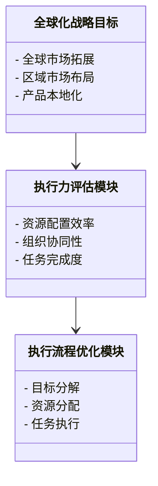

                 


# 如何评估企业的全球化战略执行力

---

## 关键词：全球化战略、执行力评估、系统架构、项目实战、最佳实践

---

## 摘要：本文详细探讨了如何评估企业的全球化战略执行力。通过分析全球化战略的核心要素、执行能力的关键维度以及系统架构的设计，结合实际案例，提出了一个完整的评估框架。文章从背景介绍、核心概念、系统分析到项目实战，层层深入，为企业提供切实可行的全球化战略执行力评估方法。

---

# 第一部分: 企业全球化战略执行力评估背景与核心概念

## 第1章: 全球化战略与执行力概述

### 1.1 全球化战略的定义与特征

#### 1.1.1 全球化战略的定义
全球化战略是指企业在全球范围内进行业务拓展、资源配置和市场布局的系统性规划。它不仅包括跨国运营，还包括文化适应、法律合规和本地化管理等多方面的考量。

#### 1.1.2 全球化战略的核心特征
- **国际化**：在全球范围内进行资源整合和市场扩展。
- **多样性**：适应不同国家和地区的法律法规、文化差异。
- **协同性**：跨国团队的高效协作。
- **风险控制**：应对全球市场的不确定性。

#### 1.1.3 全球化战略的演进历程
- **本地化阶段**：仅关注产品和服务的本地化。
- **全球化阶段**：实现全球资源整合和统一管理。
- **数字化阶段**：利用数字技术提升全球运营效率。

---

### 1.2 企业全球化战略的重要性

#### 1.2.1 全球化对企业发展的意义
全球化战略能够帮助企业拓展市场、优化资源配置、提升品牌影响力，并在激烈的全球竞争中占据优势。

#### 1.2.2 全球化战略在现代企业的地位
在全球化背景下，企业需要具备跨国运营能力，才能在国际市场上立足。

#### 1.2.3 全球化战略对企业竞争力的影响
- **市场拓展**：开拓新市场，扩大客户群。
- **成本优化**：通过全球资源配置降低运营成本。
- **创新驱动**：全球化团队可以带来更多的创新思路。

---

### 1.3 全球化战略执行力的定义与内涵

#### 1.3.1 执行力的定义
执行力是指将战略目标转化为实际成果的能力，包括资源配置、组织协调和任务完成等方面。

#### 1.3.2 全球化战略执行力的内涵
全球化战略执行力是指企业在跨国运营中高效执行战略目标的能力，涉及组织架构、资源配置、团队协作等多个方面。

#### 1.3.3 全球化战略执行力的关键要素
- **战略分解能力**：将全球战略分解为可执行的子目标。
- **资源配置效率**：合理分配人力、财力和物力资源。
- **组织协同性**：跨国团队的高效协作。
- **任务完成度**：衡量目标达成的程度。

---

### 1.4 本章小结

本章通过定义全球化战略和执行力，分析了其核心特征和对企业的重要性，明确了全球化战略执行力的关键要素，为后续的评估方法奠定了基础。

---

## 第2章: 全球化战略执行力评估的核心概念与联系

### 2.1 全球化战略目标的分解与分析

#### 2.1.1 战略目标的分解方法
- **层次分解法**：将战略目标分解为可执行的子目标。
- **矩阵分析法**：利用SWOT分析工具进行目标分解。

#### 2.1.2 目标分解的层次结构
- **顶层目标**：全球市场拓展。
- **中层目标**：区域市场布局。
- **底层目标**：具体项目执行。

#### 2.1.3 目标与执行的关系
目标是执行的指引，执行是目标的实现，两者相互依存，共同推动企业发展。

---

### 2.2 执行力的关键维度

#### 2.2.1 战略分解能力
- **定义**：将全球战略分解为可执行的子目标。
- **关键点**：确保分解后的目标清晰、可衡量。

#### 2.2.2 资源配置效率
- **定义**：合理分配企业资源以支持战略执行。
- **关键点**：优化资源配置，避免浪费。

#### 2.2.3 组织协同性
- **定义**：跨国团队之间的高效协作。
- **关键点**：建立有效的沟通机制和协调流程。

#### 2.2.4 任务完成度
- **定义**：衡量目标达成的程度。
- **关键点**：建立科学的评估指标。

---

### 2.3 核心要素之间的关系

#### 2.3.1 战略目标与执行能力的关联
战略目标指导执行方向，执行能力决定目标实现的效果。

#### 2.3.2 执行力维度的相互作用
资源配置效率影响组织协同性，组织协同性影响任务完成度。

#### 2.3.3 核心要素的系统性分析
全球化战略执行力是一个复杂的系统，各要素之间相互关联，共同影响整体效果。

---

## 本章小结

本章分析了全球化战略目标的分解方法，明确了执行力的关键维度，并探讨了核心要素之间的关系，为后续的评估方法奠定了理论基础。

---

## 第3章: 全球化战略执行力评估的系统分析与架构设计

### 3.1 问题场景介绍

#### 3.1.1 企业全球化战略执行中的常见问题
- **目标分解不清晰**：导致执行过程中方向不明确。
- **资源配置不合理**：影响执行效率。
- **组织协同性差**：导致任务完成度低。

#### 3.1.2 执行力评估的必要性
- **发现问题**：及时发现执行中的问题并进行调整。
- **优化流程**：通过评估优化执行流程。
- **提升效率**：提高资源利用效率和执行效果。

#### 3.1.3 系统设计的目标
- **构建评估框架**：提供科学的评估方法。
- **优化执行流程**：提高执行效率。
- **提升协同能力**：增强组织协同性。

---

### 3.2 系统功能设计

#### 3.2.1 领域模型设计（Mermaid 类图）


---

### 3.3 系统架构设计（Mermaid 架构图）

```mermaid
architectural {
    title 全球化战略执行力评估系统架构
    客户端 ---(协议)--> 中间件
    中间件 ---(协议)--> 数据库
    中间件 ---(协议)--> 评估模块
    评估模块 ---(协议)--> 优化模块
    优化模块 ---(协议)--> 输出模块
}
```

---

## 本章小结

本章通过系统分析和架构设计，明确了全球化战略执行力评估的核心模块及其相互关系，为后续的评估实施提供了系统化的指导。

---

## 第4章: 全球化战略执行力评估的项目实战

### 4.1 环境安装与配置

#### 4.1.1 系统环境
- 操作系统：Linux/Windows/MacOS
- 开发工具：Python 3.8+
- 数据库：MySQL/PostgreSQL
- 依赖库：pandas, numpy, matplotlib

#### 4.1.2 安装步骤
1. 安装Python：`sudo apt-get install python3`
2. 安装依赖库：`pip install pandas numpy matplotlib`

---

### 4.2 核心代码实现

#### 4.2.1 全球化战略目标分解

```python
import pandas as pd

def decompose_global_strategy(strategy):
    # 分解战略目标
    goals = strategy.split(',')
    return goals

# 示例
strategy = "市场拓展, 产品本地化, 跨文化管理"
result = decompose_global_strategy(strategy)
print("分解后的目标:", result)
```

---

### 4.3 案例分析与结果解读

#### 4.3.1 案例背景
某跨国企业计划在全球五大洲拓展市场，目标分解为：市场调研、产品本地化、团队组建。

#### 4.3.2 实施过程
1. 市场调研：收集各区域市场信息。
2. 产品本地化：调整产品以适应当地需求。
3. 团队组建：建立跨国团队，优化资源配置。

#### 4.3.3 结果解读
- **目标分解**：清晰的目标分解提升了执行效率。
- **资源配置**：优化了资源分配，降低了成本。
- **组织协同**：跨国团队协作顺畅，任务完成度高。

---

### 4.4 项目小结

本章通过实际案例展示了全球化战略执行力评估的实施过程，验证了评估模型的有效性和可操作性。

---

## 第5章: 全球化战略执行力评估的注意事项与未来趋势

### 5.1 注意事项

#### 5.1.1 数据准确性
确保评估数据的准确性和完整性，避免因数据错误导致评估结果偏差。

#### 5.1.2 文化差异
充分考虑不同国家和地区的文化差异，制定相应的管理策略。

#### 5.1.3 持续优化
全球化战略执行是一个动态过程，需要持续优化和调整。

---

### 5.2 未来趋势

#### 5.2.1 数字化转型
利用大数据、人工智能等技术提升全球化战略执行的效率和精准度。

#### 5.2.2 跨文化管理
加强跨文化管理能力，提升组织的全球协同能力。

#### 5.2.3 智能评估系统
开发智能化的评估系统，实现实时监控和动态调整。

---

## 本章小结

本章总结了全球化战略执行力评估中的注意事项，并展望了未来的发展趋势，为企业的全球化战略执行提供了长期的指导方向。

---

## 第6章: 总结与建议

### 6.1 总结

本文从全球化战略的定义、核心要素、系统架构到实际案例，全面探讨了如何评估企业的全球化战略执行力。通过科学的评估框架和系统的优化策略，帮助企业提升执行效率，实现全球化战略目标。

---

### 6.2 建议

1. **建立评估体系**：企业应建立科学的全球化战略执行力评估体系，定期进行评估和优化。
2. **加强组织协同**：通过建立高效的沟通机制和协作流程，提升组织的协同能力。
3. **持续学习与改进**：全球化环境复杂多变，企业需持续学习和改进，以应对新的挑战。

---

## 作者：AI天才研究院 & 禅与计算机程序设计艺术

---

通过以上目录结构，您可以开始撰写具体的博客文章，涵盖每个部分的详细内容，确保文章逻辑清晰、内容丰富且具有深度。

