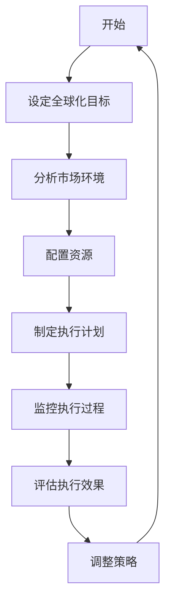
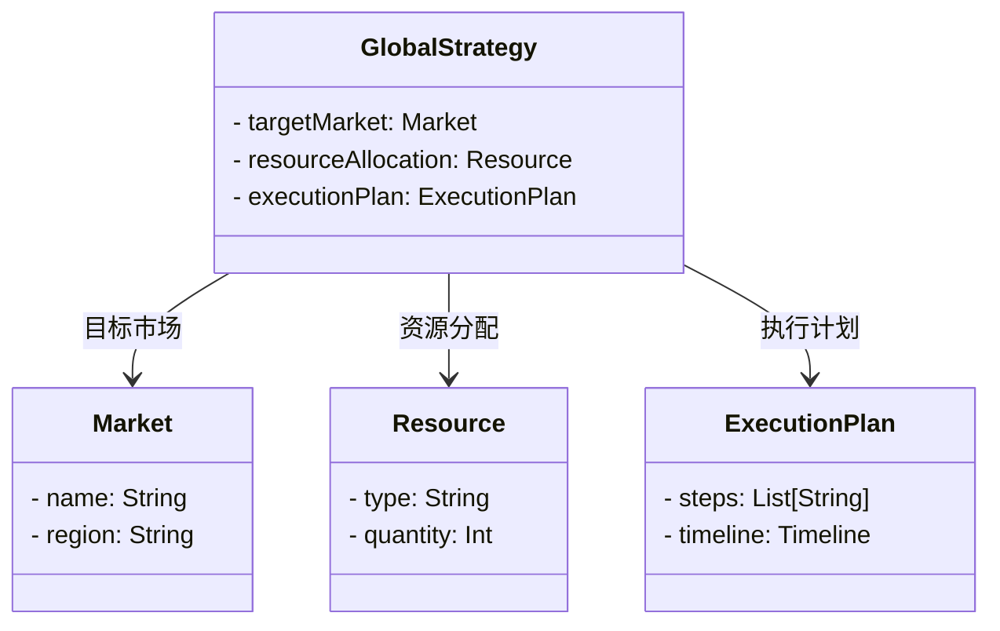

                 


# 如何评估企业的全球化战略执行力

## 关键词：全球化战略、执行力、企业战略、跨国经营、资源配置、风险管理

## 摘要：在全球化竞争日益激烈的今天，企业的全球化战略执行力成为决定企业成败的关键因素。本文通过分析全球化战略的核心要素，构建评估模型和框架，探讨如何通过系统化的评估方法提升企业的全球化战略执行力，实现跨国经营的成功。

---

## 第一部分：全球化战略执行力的背景与核心概念

### 第1章：全球化战略执行力的背景与问题背景

#### 1.1 全球化战略的定义与重要性
全球化战略是指企业在全球范围内配置资源、拓展市场、建立业务的策略。它是企业从本地化经营向跨国化经营转型的核心指导方针。全球化战略的重要性体现在以下几个方面：
- **市场扩展**：通过全球化战略，企业可以进入新的市场，拓展客户群体，提升销售额。
- **资源优化**：在全球范围内配置资源，降低生产成本，提高效率。
- **竞争优势**：通过全球化布局，企业可以在技术研发、供应链管理等方面形成竞争优势。

#### 1.2 企业全球化战略执行力的定义
全球化战略执行力是指企业在实现全球化战略目标的过程中，将战略转化为具体行动的能力。它包括战略目标的分解、资源配置的效率、组织架构的合理性、文化整合的有效性等多个方面。

#### 1.3 当前全球化战略执行的主要挑战
企业在执行全球化战略时面临诸多挑战：
- **市场复杂性**：不同国家的法律法规、文化差异、消费习惯各不相同，增加了管理难度。
- **资源配置效率**：如何在全球范围内高效配置资源，避免重复建设和浪费，是企业面临的重要问题。
- **文化整合**：跨国并购或合作时，文化差异可能导致组织冲突，影响执行力。
- **风险管理**：全球化经营涉及的政治、经济、法律风险需要有效应对。

#### 1.4 全球化战略执行力的边界与外延
全球化战略执行力的边界主要体现在以下几个方面：
- **范围界定**：全球化战略执行力不仅包括战略的制定，还包括战略的分解、执行、监控和调整。
- **核心特征**：高效性、协同性、适应性。
- **与相关概念的对比**：与国际化战略相比，全球化战略更具系统性和长期性。

---

### 第2章：全球化战略执行力的核心概念与联系

#### 2.1 全球化战略执行力的核心要素
全球化战略执行力的核心要素包括：
- **战略目标设定**：明确的全球化目标是执行的基础。
- **资源配置效率**：资源的合理分配直接影响执行效果。
- **组织架构与文化整合**：组织结构和文化适应性是执行力的关键保障。
- **风险管理与应对机制**：有效应对全球化过程中的各种风险。

#### 2.2 全球化战略执行力的核心原理
全球化战略执行力的核心原理可以总结为：
- **战略目标与资源配置的匹配性**：资源分配应围绕战略目标展开。
- **组织架构与文化整合的影响**：高效的组织架构和良好的文化整合是执行力的重要保障。
- **风险管理与战略执行的互动关系**：风险管理贯穿于战略执行的全过程。

#### 2.3 全球化战略执行力的核心概念对比表
以下是全球化战略执行力与其他相关概念的对比：

| 比较维度 | 全球化战略执行力 | 国际化战略 | 本地化战略 |
|----------|------------------|------------|------------|
| 目标     | 全球市场布局     | 拓展国际市场 | 本地市场深耕 |
| 范围     | 全球范围         | 国际范围    | 单一市场    |
| 管理复杂度 | 高              | 较高        | 较低        |

#### 2.4 全球化战略执行力的ER实体关系图
以下是全球化战略执行力的ER实体关系图：

```mermaid
erDiagram
    customer[客户] {
        code : INT
        name : STRING
        address : STRING
    }
    market[市场] {
        id : INT
        name : STRING
        region : STRING
    }
    resource[资源] {
        id : INT
        type : STRING
        quantity : INT
    }
    strategy[战略] {
        id : INT
        name : STRING
        target : STRING
    }
    execution[执行] {
        id : INT
        status : STRING
        result : STRING
    }
    customer -| market: 属于
    market -| strategy: 对应的战略
    strategy -| execution: 执行结果
    resource -| execution: 所需资源
```

---

## 第二部分：全球化战略执行力的评估模型与框架

### 第3章：全球化战略执行力的评估维度与指标

#### 3.1 全球化战略目标的实现程度
全球化战略目标的实现程度是评估执行力的重要维度。常见的评估指标包括：
- **市场渗透率**：企业在目标市场的占有率。
- **品牌影响力**：品牌在全球市场的认知度和美誉度。
- **销售额增长**：全球化战略对企业销售额的贡献。

#### 3.2 全球化资源配置的效率
资源配置效率是全球化战略执行力的关键指标。评估方法包括：
- **资源分配的合理性**：资源分配是否与战略目标匹配。
- **资源利用效率**：单位资源投入产出比。

#### 3.3 组织架构与文化整合
组织架构和文化整合直接影响全球化战略的执行效果。评估指标包括：
- **组织架构的合理性**：是否建立高效的跨国组织架构。
- **文化整合的效果**：是否形成统一的企业文化，减少文化冲突。

#### 3.4 风险管理与应对机制
有效的风险管理是全球化战略执行的重要保障。评估指标包括：
- **风险识别的全面性**：是否识别了主要风险。
- **风险应对的有效性**：是否制定了有效的应对措施。

---

### 第4章：全球化战略执行力的算法原理与数学模型

#### 4.1 全球化战略执行力的算法原理
以下是全球化战略执行力的算法原理流程图：



#### 4.2 全球化战略执行力的数学模型
全球化战略执行力的评估可以使用线性回归模型：

$$ Y = \beta_0 + \beta_1X_1 + \beta_2X_2 + \epsilon $$

其中：
- \( Y \) 表示全球化战略执行效果
- \( X_1 \) 表示资源配置效率
- \( X_2 \) 表示组织架构合理性
- \( \epsilon \) 表示误差项

---

### 第5章：全球化战略执行力的系统分析与架构设计

#### 5.1 全球化战略执行系统的功能设计
以下是全球化战略执行系统的功能设计类图：



#### 5.2 全球化战略执行系统的架构设计
以下是全球化战略执行系统的架构设计图：


---

### 第6章：全球化战略执行力的项目实战

#### 6.1 项目环境与工具安装
- **环境要求**：稳定的网络环境，支持多语言开发。
- **工具安装**：安装Python、Jupyter Notebook、Mermaid CLI。

#### 6.2 系统核心实现源代码
以下是全球化战略执行力评估系统的Python代码示例：

```python
import pandas as pd
import numpy as np

# 数据预处理
data = pd.read_csv('global_strategy.csv')
data = data.dropna()
data = (data - data.mean()) / data.std()

# 构建模型
from sklearn.linear_model import LinearRegression
model = LinearRegression()
model.fit(data[['resource_allocation', 'organization_structure']], data['execution_effect'])

# 评估模型
print(model.score(data[['resource_allocation', 'organization_structure']], data['execution_effect']))
```

#### 6.3 项目小结
通过实际项目的实施，我们可以看到全球化战略执行力评估系统在企业中的应用价值。通过数据驱动的方法，企业可以更高效地制定和执行全球化战略。

---

## 结语
全球化战略执行力是企业在跨国经营中成功的关键。通过系统的评估和优化，企业可以更好地应对全球化挑战，实现战略目标。

---

## 作者：AI天才研究院/AI Genius Institute & 禅与计算机程序设计艺术/Zen And The Art of Computer Programming

