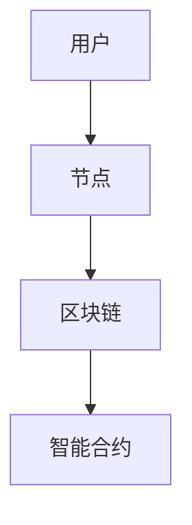
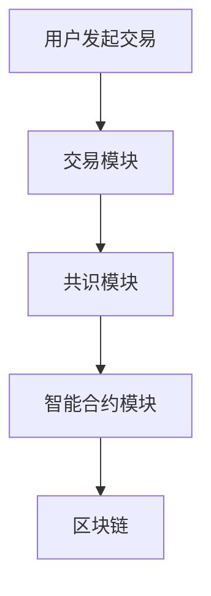
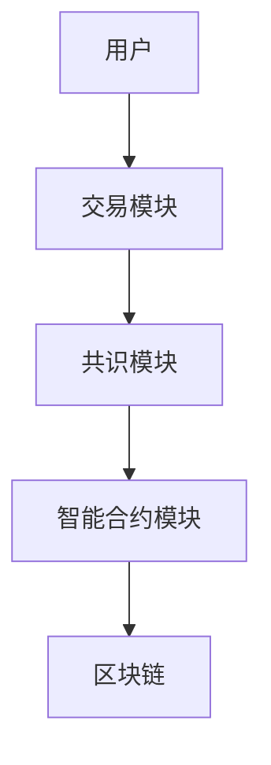

                 


```markdown
# 如何评估企业的分布式账本技术应用

## 关键词：分布式账本技术、区块链、共识机制、智能合约、系统架构、评估指标

## 摘要：
本文将详细介绍如何评估企业中的分布式账本技术应用。从核心概念到实际应用，从技术原理到系统架构，本文将全面解析分布式账本技术的关键要素，并提供具体的评估方法和工具。通过实际案例分析和最佳实践分享，帮助企业更好地应用和优化分布式账本技术。

---

# 第一部分: 分布式账本技术的背景与核心概念

## 第1章: 分布式账本技术概述

### 1.1 分布式账本技术的起源与演进

#### 1.1.1 分布式账本的定义与特点
分布式账本技术是一种通过去中心化的方式记录和管理数据的技术，其核心特点包括去中心化、不可篡改性和透明性。

- **去中心化**：数据不依赖于单一中心节点，而是分布在多个节点上，确保数据的可靠性和安全性。
- **不可篡改性**：通过加密算法和共识机制，确保数据在链上无法被篡改。
- **透明性**：所有交易记录公开透明，参与者可以实时查看链上数据。

#### 1.1.2 区块链技术的起源与发展
区块链技术起源于比特币的白皮书，最初用于去中心化的数字货币系统。随着技术的发展，区块链逐渐扩展到金融、供应链、医疗等多个领域。

#### 1.1.3 分布式账本技术在企业中的应用背景
企业采用分布式账本技术的主要目的是为了提升数据的透明性、安全性和效率。通过去中心化的特性，企业可以减少中间环节，降低运营成本。

### 1.2 分布式账本技术的核心概念

#### 1.2.1 区块链的基本结构
区块链由一系列区块组成，每个区块包含以下内容：
- **区块头**：包含当前区块的哈希值、时间戳、交易计数等信息。
- **区块体**：包含具体的交易数据。
- **链式结构**：通过哈希指针连接前后区块，确保数据的完整性和一致性。

#### 1.2.2 分布式账本的去中心化特性
去中心化是分布式账本技术的核心特征，通过多个节点共同维护数据的完整性，避免单点故障。

#### 1.2.3 智能合约的定义与作用
智能合约是一种自动执行的程序，用于在区块链上自动执行和管理合同条款。它能够自动验证和执行交易，减少人工干预。

### 1.3 分布式账本技术的应用场景

#### 1.3.1 金融领域的应用
- **支付与结算**：通过区块链技术实现快速、安全的跨境支付。
- **证券交易**：利用智能合约自动执行股票交易，提高效率。

#### 1.3.2 供应链管理的应用
- **物流追踪**：通过区块链记录商品的物流信息，确保供应链透明化。
- **库存管理**：实时追踪库存变化，避免数据篡改。

#### 1.3.3 版权保护与数据共享的应用
- **数字版权**：通过区块链技术保护创作者的版权，确保作品的合法使用。
- **数据共享**：在不同机构之间共享数据，同时确保数据的安全性和隐私性。

## 第2章: 分布式账本技术的核心原理

### 2.1 区块链的共识机制

#### 2.1.1 工作量证明机制（PoW）
工作量证明机制要求节点通过解决复杂的数学问题来验证交易。该机制通过消耗计算资源来防止恶意攻击，但效率较低。

- **数学模型**：
  - 矿工通过计算找到满足特定哈希值的随机数。
  - 计算过程涉及大量的哈希运算，确保数据的安全性。

- **mermaid图示**：
  ```mermaid
  graph TD
    A[交易发生] --> B[节点开始计算哈希值]
    B --> C[找到满足条件的哈希]
    C --> D[区块被加入链中]
    D --> E[其他节点验证区块]
  ```

#### 2.1.2 权益证明机制（PoS）
权益证明机制通过持有代币的数量来决定节点的权益，从而减少对计算资源的消耗。

- **数学模型**：
  - 每个节点的权益与其持有的代币数量成正比。
  - 节点通过随机算法被选中进行区块验证。

- **mermaid图示**：
  ```mermaid
  graph TD
    A[交易发生] --> B[节点根据权益被选中]
    B --> C[验证交易并生成区块]
    C --> D[区块被加入链中]
    D --> E[其他节点验证区块]
  ```

#### 2.1.3 共识机制的选择与评估
在选择共识机制时，需要考虑以下因素：
- **安全性**：机制是否能够有效防止恶意攻击。
- **效率**：机制是否能够快速达成共识。
- **成本**：机制是否需要大量计算资源。

### 2.2 区块链的区块结构

#### 2.2.1 区块头与区块体的组成
- **区块头**：包含区块的唯一标识、时间戳、交易计数等信息。
- **区块体**：包含具体的交易数据。

#### 2.2.2 指针与哈希值的作用
- **指针**：用于连接前后区块，确保链的完整性和一致性。
- **哈希值**：用于验证数据的完整性，防止数据篡改。

#### 2.2.3 区块链的不可篡改性
通过哈希指针和共识机制，确保每个区块的哈希值无法被篡改，从而保证数据的安全性。

### 2.3 智能合约的执行原理

#### 2.3.1 智能合约的定义与编译
智能合约是一种运行在区块链上的程序，通过编译器将代码转换为目标平台的字节码。

- **编译过程**：
  ```mermaid
  graph TD
    A[智能合约源代码] --> B[编译器] --> C[字节码]
  ```

#### 2.3.2 智能合约的部署与执行
智能合约部署到区块链后，通过触发条件自动执行交易。

- **部署流程**：
  ```mermaid
  graph TD
    A[开发者] --> B[编译智能合约] --> C[部署到区块链]
    C --> D[智能合约执行]
  ```

#### 2.3.3 智能合约的安全性与风险
智能合约的安全性取决于代码的质量和运行环境的安全性。由于代码一旦部署就无法修改，因此需要严格测试和审查。

---

# 第二部分: 企业分布式账本技术的评估指标与方法论

## 第3章: 评估指标与维度

### 3.1 技术维度

#### 3.1.1 网络性能（吞吐量、延迟）
- **吞吐量**：每秒处理的交易数量。
- **延迟**：交易从发起到确认的时间。

#### 3.1.2 安全性（抗攻击能力、权限管理）
- **抗攻击能力**：机制是否能够有效防止恶意攻击。
- **权限管理**：是否支持细粒度的权限控制。

#### 3.1.3 可扩展性（节点数量、数据规模）
- **节点数量**：系统能够支持的节点规模。
- **数据规模**：系统能够处理的最大数据量。

### 3.2 业务维度

#### 3.2.1 业务场景的匹配度
- **场景适配性**：技术是否能够满足业务需求。
- **业务流程优化**：是否能够简化业务流程，提高效率。

#### 3.2.2 业务流程的优化程度
- **流程简化**：是否能够通过分布式账本技术减少中间环节。
- **效率提升**：是否能够提高业务处理速度。

#### 3.2.3 业务合规性与监管要求
- **合规性**：是否符合相关法律法规。
- **监管要求**：是否能够满足监管部门的要求。

### 3.3 经济维度

#### 3.3.1 成本分析（开发、运维、交易费用）
- **开发成本**：开发和集成分布式账本技术所需的人力和资源。
- **运维成本**：日常运维和维护所需的成本。
- **交易费用**：每笔交易产生的费用。

#### 3.3.2 收益与投入比
- **收益**：通过技术应用带来的经济效益。
- **投入比**：投入与收益的比值。

### 3.4 用户体验维度

#### 3.4.1 系统易用性
- **界面友好性**：用户界面是否友好，易于操作。
- **操作便捷性**：用户是否能够方便地进行交易和管理。

#### 3.4.2 用户满意度
- **用户反馈**：用户对系统的满意度。
- **问题解决效率**：用户遇到问题时，系统能否快速响应并解决问题。

## 第4章: 评估方法与工具

### 4.1 技术评估方法

#### 4.1.1 性能测试
- **吞吐量测试**：通过压力测试评估系统的吞吐量。
- **延迟测试**：通过模拟高并发场景测试系统的延迟。

#### 4.1.2 安全性评估
- **漏洞扫描**：通过自动化工具扫描系统漏洞。
- **渗透测试**：模拟攻击者进行渗透测试，评估系统的安全性。

#### 4.1.3 可扩展性测试
- **负载测试**：通过增加节点数量和数据规模测试系统的扩展性。
- **压力测试**：通过模拟极端负载测试系统的稳定性。

### 4.2 业务评估方法

#### 4.2.1 业务流程分析
- **流程梳理**：对现有业务流程进行梳理，识别可以优化的环节。
- **流程模拟**：通过模拟流程运行，评估技术应用后的效果。

#### 4.2.2 业务场景匹配度评估
- **场景适配性分析**：分析技术是否能够满足业务需求。
- **业务流程优化建议**：提出优化业务流程的具体建议。

### 4.3 经济评估方法

#### 4.3.1 成本收益分析
- **成本估算**：估算开发、运维和交易费用。
- **收益预测**：预测技术应用后的收益。

#### 4.3.2 投资回报分析
- **ROI计算**：计算投资回报率。
- **成本效益分析**：分析成本与收益的比值。

### 4.4 工具推荐

#### 4.4.1 技术评估工具
- **区块链测试框架**：如JMeter、LoadRunner等。
- **安全评估工具**：如OWASP ZAP、Burp Suite等。

#### 4.4.2 业务评估工具
- **流程建模工具**：如Lucidchart、Draw.io等。
- **数据分析工具**：如Excel、Tableau等。

## 第5章: 系统架构与设计

### 5.1 系统架构设计

#### 5.1.1 分布式账本系统的组成
- **节点**：系统中的多个节点，每个节点负责处理交易和存储数据。
- **区块链**：系统的数据存储结构，包含多个区块。
- **智能合约**：系统中的自动执行程序。

#### 5.1.2 系统架构图


### 5.2 系统功能设计

#### 5.2.1 功能模块划分
- **交易模块**：负责处理用户的交易请求。
- **共识模块**：负责节点间的共识机制。
- **智能合约模块**：负责执行智能合约。

#### 5.2.2 功能流程图


### 5.3 系统接口设计

#### 5.3.1 接口定义
- **API接口**：定义系统对外提供的API接口，如交易接口、查询接口等。
- **协议规范**：定义系统使用的通信协议，如HTTP、WebSocket等。

#### 5.3.2 接口交互图


## 第6章: 项目实战

### 6.1 环境搭建

#### 6.1.1 开发环境
- **操作系统**：Windows、Linux或macOS。
- **开发工具**：如VS Code、IntelliJ IDEA等。
- **区块链框架**：如Ethereum、Hyperledger等。

#### 6.1.2 运行环境
- **节点部署**：在云服务器上部署多个节点。
- **区块链网络**：搭建一个测试的区块链网络。

### 6.2 核心实现

#### 6.2.1 智能合约实现
- **智能合约编写**：使用Solidity语言编写智能合约。
- **智能合约部署**：将智能合约部署到区块链网络。

#### 6.2.2 交易处理实现
- **交易发起**：用户发起交易请求。
- **交易验证**：节点验证交易合法性。
- **交易记录**：交易记录到区块链中。

### 6.3 数据分析与优化

#### 6.3.1 数据收集
- **交易数据**：收集用户的交易数据。
- **性能数据**：收集系统的性能数据，如吞吐量、延迟等。

#### 6.3.2 数据分析
- **性能分析**：分析系统的性能瓶颈。
- **优化建议**：提出优化系统性能的具体建议。

## 第7章: 最佳实践与小结

### 7.1 最佳实践

#### 7.1.1 技术选型
- **选择合适的区块链框架**：根据业务需求选择适合的区块链框架。
- **优化共识机制**：根据系统的特性选择合适的共识机制。

#### 7.1.2 代码规范
- **代码审查**：定期进行代码审查，确保代码质量。
- **文档编写**：编写详细的开发文档，方便团队协作。

### 7.2 小结

本文详细介绍了如何评估企业的分布式账本技术应用，从核心概念到实际应用，从技术原理到系统架构，全面解析了分布式账本技术的关键要素，并提供了具体的评估方法和工具。通过实际案例分析和最佳实践分享，帮助企业更好地应用和优化分布式账本技术。

---

## 作者：AI天才研究院/AI Genius Institute & 禅与计算机程序设计艺术 /Zen And The Art of Computer Programming
```

