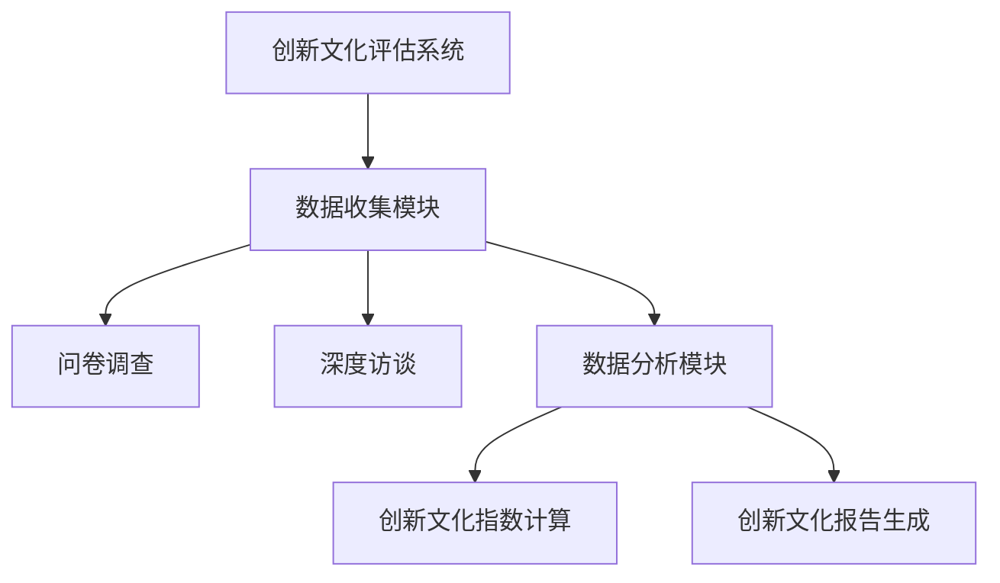
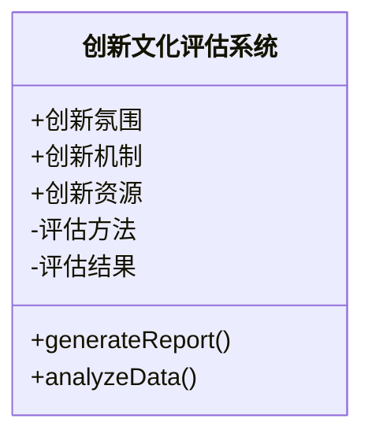

                 


# 如何评估企业的创新文化

## 文章关键词  
创新文化, 企业文化评估, 创新机制, 创新氛围, 企业文化建设  

## 摘要  
本文旨在探讨如何系统地评估企业的创新文化。通过分析创新文化的定义、核心要素、理论模型、评估方法以及实际案例，为读者提供一套全面的评估框架。文章从背景、理论、方法、系统架构到实战案例，层层递进，帮助读者理解如何在企业中识别和改进创新文化，从而促进企业的持续创新能力。

---

# 如何评估企业的创新文化

## 第一部分：创新文化概述

### 第1章：创新文化的核心概念

#### 1.1 什么是创新文化
- 创新文化是指企业在内部营造的一种鼓励员工提出新想法、尝试新方法、解决问题并推动变革的氛围。
- 创新文化的核心在于激发员工的创造力和主动性，使企业能够快速适应市场变化并保持竞争力。
- 创新文化与企业的绩效密切相关，研究表明，创新能力强的企业更有可能在市场中占据领先地位。

#### 1.2 创新文化的核心要素
- 创新氛围：员工是否感到可以自由表达想法，是否被鼓励冒险和尝试新事物。
- 创新机制：企业是否有明确的流程和制度支持创新，例如研发部门、创新激励机制等。
- 创新资源：企业是否为创新活动提供足够的资源，包括资金、时间和人力资源。

---

## 第二部分：创新文化评估的理论基础

### 第2章：创新文化的理论模型

#### 2.1 创新文化的经典模型
- **双钻石模型**：由英国文化协会提出，认为创新文化由“创意生成”和“创意实现”两个阶段组成，每个阶段都需要特定的文化支持。
- **OECD的三维模型**：从知识、能力和动力三个方面定义创新文化。
- **Google的五要素模型**：Google提出创新文化由“目标、授权、明确性、资源和评估”五个要素组成。

#### 2.2 各种模型的优缺点对比
| 模型名称       | 优点                     | 缺点                     |
|----------------|--------------------------|--------------------------|
| 双钻石模型     | 突出创新的动态过程         | 缺乏具体的评估指标         |
| OECD的三维模型 | 综合性强，涵盖知识、能力和动力 | 理论化程度高，实际操作性较弱 |
| Google五要素模型 | 结合实际，操作性强       | 过于简化，忽视文化动态性   |

---

## 第三部分：创新文化评估的方法

### 第3章：创新文化评估的定性方法

#### 3.1 文化评估工具
- **问卷调查**：设计一份包含创新文化相关问题的问卷，例如：
  - 你是否感到可以自由表达自己的创新想法？
  - 你是否认为公司支持冒险和尝试新事物？
- **深度访谈**：与员工、管理者进行一对一访谈，了解他们对创新文化的看法。
- **观察法**：通过观察员工的行为和团队合作模式，判断创新文化的氛围。

#### 3.2 创新文化评估的定量方法
- **数据分析法**：通过分析企业的创新成果（如新产品数量、专利申请数等）来评估创新文化。
- **指数评估法**：将创新文化的核心要素转化为量化指标，构建一个综合指数。

---

## 第四部分：创新文化评估的系统架构

### 第4章：系统分析与架构设计

#### 4.1 创新文化评估系统架构


#### 4.2 领域模型类图


---

## 第五部分：创新文化评估的项目实战

### 第5章：项目实战

#### 5.1 项目背景与目标
- **项目背景**：某科技公司希望评估其创新文化，以提升员工的创新能力和企业的市场竞争力。
- **项目目标**：通过评估创新文化，识别瓶颈，提出改进建议。

#### 5.2 系统设计与实现
- **系统设计**：
  - 设计一份包含30个问题的创新文化评估问卷，涵盖创新氛围、创新机制和创新资源三个维度。
  - 与员工和管理者进行深度访谈，收集反馈。
- **系统实现**：
  - 使用Python编写数据分析脚本，计算创新文化指数。
  - 生成创新文化评估报告，提出改进建议。

#### 5.3 代码示例
```python
import pandas as pd

# 读取问卷数据
df = pd.read_csv('innovation_culture_survey.csv')

# 计算创新氛围指数
culture_index = df['创新氛围'].mean()

# 计算创新机制指数
mechanism_index = df['创新机制'].mean()

# 计算创新资源指数
resource_index = df['创新资源'].mean()

# 输出综合创新文化指数
total_index = (culture_index + mechanism_index + resource_index) / 3
print(f"综合创新文化指数：{total_index}")
```

---

## 第六部分：最佳实践与小结

### 第6章：最佳实践与小结

#### 6.1 创新文化评估的关键点
- 领导的作用：领导者需要以身作则，支持创新并为员工提供资源。
- 员工参与的重要性：鼓励员工参与创新活动，增强他们的主人翁意识。

#### 6.2 创新文化评估的注意事项
- 数据隐私保护：在收集员工反馈时，必须确保数据的隐私和安全。
- 持续改进：创新文化是一个动态过程，企业需要定期评估并持续改进。

---

# 结语

创新文化是企业成功的关键因素之一。通过系统地评估创新文化，企业可以识别自身的优劣势，制定有效的改进策略。本文从理论到实践，为读者提供了全面的评估框架和工具，帮助企业在竞争激烈的市场中保持创新活力。

---

# 作者：AI天才研究院/AI Genius Institute & 禅与计算机程序设计艺术 /Zen And The Art of Computer Programming

