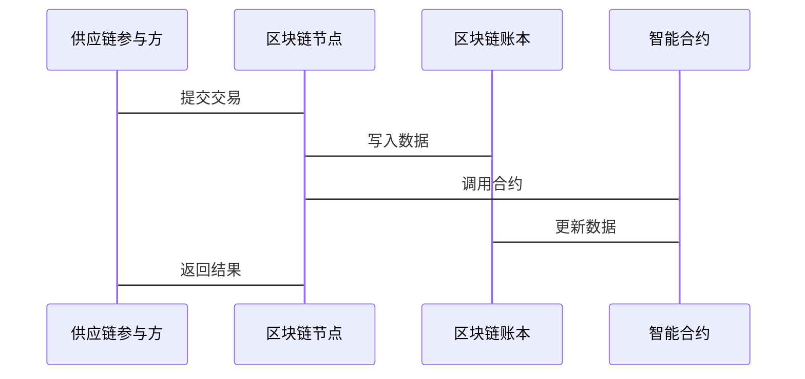

                 


# 如何评估企业的区块链供应链应用

## 关键词：
- 区块链
- 供应链
- 应用评估
- 企业应用
- 技术实现

## 摘要：
随着区块链技术的快速发展，越来越多的企业开始尝试将区块链应用于供应链管理中。然而，如何科学、系统地评估这些区块链供应链应用的性能和效果，成为企业面临的重要挑战。本文从区块链供应链应用的核心概念、评估指标、算法原理、系统架构设计、项目实战以及最佳实践等多个维度，详细分析了如何全面评估企业的区块链供应链应用。通过本文的分析，读者可以掌握一套完整的评估方法，从而在实际应用中做出更明智的决策。

---

# 第一部分: 区块链供应链应用的背景与核心概念

## 第1章: 区块链与供应链的基本概念

### 1.1 区块链的基本概念

#### 1.1.1 区块链的定义与特点
区块链是一种分布式账本技术，通过去中心化的共识机制，确保数据的安全性和不可篡改性。其特点包括：
- **去中心化**：数据分布在网络中的多个节点上，不存在单一的控制中心。
- **不可篡改**：通过密码学技术，确保数据一旦写入区块链，无法被修改。
- **可追溯**：每个数据块都包含时间戳和前一个数据块的哈希值，可以追溯数据的来源。
- **透明性**：所有参与方都可以查看区块链上的数据，但只有授权方可以进行修改。

#### 1.1.2 区块链的核心技术原理
区块链的核心技术包括：
- **共识机制**：如比特币使用的PoW（工作量证明）和以太坊使用的PoS（权益证明）。
- **区块结构**：每个区块包含交易数据、时间戳、哈希值等信息。
- **智能合约**：一种自动执行的代码，用于在区块链上实现复杂的业务逻辑。

#### 1.1.3 区块链的分类与应用场景
区块链主要分为公链、私链和联盟链。公链（如比特币、以太坊）面向公众开放，私链（如Hyperledger）用于企业内部，联盟链（如 Corda）用于特定组织之间的协作。在供应链管理中，区块链主要用于追踪商品来源、验证产品真伪、优化库存管理和提高透明度。

### 1.2 供应链的基本概念

#### 1.2.1 供应链的定义与组成
供应链是指从原材料采购到最终产品交付给消费者的整个过程，包括供应商、制造商、分销商、零售商和消费者等多个环节。供应链的核心目标是优化资源分配，降低成本，提高效率。

#### 1.2.2 供应链的运作流程
供应链的运作流程包括：
- **采购**：从供应商处获取原材料。
- **生产**：将原材料加工成产品。
- **物流**：将产品从生产地运送到销售点。
- **销售**：将产品卖给消费者。
- **反馈**：收集消费者反馈，优化供应链流程。

#### 1.2.3 供应链管理的挑战与优化方向
供应链管理的挑战包括信息孤岛、数据不透明、效率低下等问题。优化方向包括引入区块链技术、物联网（IoT）设备和大数据分析，以提高供应链的透明度和效率。

## 第2章: 区块链在供应链中的应用背景

### 2.1 传统供应链管理的痛点

#### 2.1.1 信息孤岛问题
传统供应链中，各参与方使用不同的系统，数据难以共享，导致信息不一致和协作效率低下。

#### 2.1.2 数据篡改与不透明问题
由于数据分散在多个系统中，容易被篡改或伪造，导致供应链中的信任缺失。

#### 2.1.3 供应链效率低下问题
由于缺乏高效的协作机制，供应链中的订单处理、物流跟踪等环节耗时长、成本高。

### 2.2 区块链技术如何解决供应链问题

#### 2.2.1 提高供应链透明度
区块链通过共享账本，确保所有参与方都能查看同一数据源，从而提高供应链的透明度。

#### 2.2.2 保证数据不可篡改性
区块链的不可篡改性确保了数据的真实性，防止数据被恶意修改或伪造。

#### 2.2.3 提升供应链效率
通过区块链技术，可以实现自动化的订单处理、智能合约的执行和实时物流跟踪，从而提高供应链效率。

### 2.3 区块链供应链应用的边界与外延

#### 2.3.1 区块链供应链的应用范围
区块链供应链的应用范围包括：
- 商品溯源：记录商品从生产到销售的全过程。
- 库存管理：实时跟踪库存情况，优化库存分配。
- 供应链金融：通过区块链实现应收账款的融资。

#### 2.3.2 区块链供应链的局限性
区块链供应链的局限性包括：
- 技术复杂性：区块链技术的实施需要较高的技术门槛。
- 成本问题：区块链的运行需要大量计算资源，可能导致成本较高。
- 政策法规：区块链的应用需要符合相关法律法规，特别是在数据隐私和合规性方面。

#### 2.3.3 区块链与供应链的结合点
区块链与供应链的结合点在于：
- 数据共享：通过区块链实现供应链各参与方的数据共享。
- 贸易融资：利用区块链技术优化供应链金融。
- 质量追踪：通过区块链实现产品质量的可追溯性。

## 第3章: 区块链供应链应用的核心概念与联系

### 3.1 区块链供应链的核心要素

#### 3.1.1 区块链节点
区块链节点是区块链网络中的参与者，负责验证和传播交易数据。在供应链中，每个节点可以代表供应链中的一个参与方，如供应商、制造商、分销商等。

#### 3.1.2 区块链账本
区块链账本是记录所有交易数据的分布式账本，每个节点都有一份完整的账本副本。账本中的数据是不可篡改的，确保了数据的真实性和一致性。

#### 3.1.3 智能合约
智能合约是部署在区块链上的自动执行代码，用于在满足特定条件时自动执行操作。在供应链中，智能合约可以用于自动触发订单处理、支付结算和物流跟踪等操作。

#### 3.1.4 供应链参与方
供应链参与方包括供应商、制造商、分销商、零售商和消费者。在区块链供应链中，每个参与方都可以通过区块链节点访问和修改区块链账本。

### 3.2 核心概念的属性特征对比

#### 3.2.1 区块链节点与传统中心节点的对比
| 特性                | 区块链节点            | 传统中心节点        |
|---------------------|----------------------|--------------------|
| 控制权              | 分散在多个节点       | 集中在中心节点       |
| 可靠性              | 去中心化，抗单点故障   | 单点故障风险较高     |
| 信任基础            | 基于密码学和共识机制  | 基于信任和合同       |

#### 3.2.2 区块链账本与传统数据库的对比
| 特性                | 区块链账本            | 传统数据库          |
|---------------------|----------------------|--------------------|
| 数据一致性          | � 强一致性，不可篡改    | 可能存在一致性问题   |
| 数据访问权限        |  受限于区块链权限设置  | 可自由设置访问权限   |
| 数据存储结构        |  每个区块包含交易数据  | 行、列结构           |

#### 3.2.3 智能合约与传统合同的对比
| 特性                | 智能合约              | 传统合同            |
|---------------------|----------------------|--------------------|
| 自动执行            |  是                   |  否                 |
| 执行环境            |  区块链上             |  线下               |
| 修改方式            |  需通过共识机制修改   |  双方协商后修改      |

### 3.3 ER实体关系图架构
```mermaid
erd
  entity 区块链节点 {
    id
    公钥
    地址
  }
  
  entity 区块链账本 {
    区块高度
    哈希值
    时间戳
  }
  
  entity 智能合约 {
    合约地址
    合约代码
    合约状态
  }
  
  entity 供应链参与方 {
    参与方ID
    名称
    联系方式
  }
  
  区块链节点 --> 区块链账本
  区块链节点 --> 智能合约
  区块链账本 --> 智能合约
  供应链参与方 --> 区块链节点
```

---

# 第二部分: 区块链供应链应用的评估指标与方法

## 第4章: 区块链供应链应用的评估指标

### 4.1 数据完整性与一致性

#### 4.1.1 数据完整性的重要性
数据完整性是指数据的完整性和一致性。在供应链中，数据完整性对于确保产品质量和供应链的透明度至关重要。

#### 4.1.2 数据一致性的实现方式
数据一致性可以通过以下方式实现：
- **共识机制**：通过共识机制确保所有节点的数据一致。
- **区块结构**：通过区块链的区块结构确保数据的不可篡改性和一致性。

#### 4.1.3 数据完整性的评估标准
数据完整性的评估标准包括：
- 数据的全生命周期记录。
- 数据的可追溯性和可验证性。
- 数据的实时更新和同步。

### 4.2 透明度与可追溯性

#### 4.2.1 透明度的定义与评估方法
透明度是指供应链中的数据对所有参与方公开可见。评估透明度的方法包括：
- 检查数据是否对所有参与方公开。
- 检查数据是否实时更新。

#### 4.2.2 可追溯性的实现机制
可追溯性是指能够追溯商品的来源和流向。实现可追溯性的机制包括：
- 在区块链上记录商品的每个交易信息。
- 通过智能合约实现自动化的交易记录。

#### 4.2.3 透明度与可追溯性的对比分析
透明度关注数据的公开性，而可追溯性关注数据的来源和流向。两者相辅相成，共同确保供应链的透明性和可追溯性。

### 4.3 供应链效率提升

#### 4.3.1 效率提升的定义与评估指标
效率提升是指通过区块链技术优化供应链的运作流程，提高整体效率。评估指标包括：
- 订单处理时间。
- 物流时间。
- 成本降低幅度。

#### 4.3.2 区块链对供应链效率的影响
区块链通过自动化流程、智能合约和实时数据同步，显著提高了供应链的效率。

#### 4.3.3 效率提升的实现路径
效率提升的实现路径包括：
- 优化订单处理流程。
- 自动化物流跟踪。
- 提高库存管理的准确性。

## 第5章: 区块链供应链应用的评估方法

### 5.1 评估模型构建

#### 5.1.1 评估模型的构建思路
评估模型的构建思路包括：
- 确定评估指标。
- 确定指标权重。
- 设计评分标准。

#### 5.1.2 评估模型的组成要素
评估模型的组成要素包括：
- 数据完整性。
- 透明度。
- 可追溯性。
- 系统效率。
- 安全性。

#### 5.1.3 评估模型的权重分配
根据重要性，数据完整性占40%，透明度占30%，可追溯性占20%，系统效率占10%。

### 5.2 评估方法的具体实施

#### 5.2.1 定量评估方法
定量评估方法包括：
- 计算系统响应时间。
- 计算交易吞吐量。
- 计算成本降低幅度。

#### 5.2.2 定性评估方法
定性评估方法包括：
- 访谈供应链参与方，收集反馈意见。
- 检查系统文档和设计。

#### 5.2.3 综合评估方法
综合评估方法结合定量和定性评估方法，确保评估结果的全面性和准确性。

---

# 第三部分: 区块链供应链应用的算法原理与系统架构设计

## 第6章: 区块链供应链应用的算法原理

### 6.1 共识机制的实现原理

#### 6.1.1 共识机制的分类与选择
共识机制的分类包括：
- PoW（工作量证明）。
- PoS（权益证明）。
- DPoS（ delegated proof of stake）。
- BFT（拜占庭容错）。

在供应链中，通常选择BFT或DPoS，因为它们更适合企业级应用。

#### 6.1.2 共识机制的实现流程
共识机制的实现流程包括：
1. 提交交易。
2. 节点验证交易。
3. 节点达成共识。
4. 区块被添加到区块链上。

#### 6.1.3 共识机制的优缺点对比
| 特性                | PoW               | PoS               | BFT                | DPoS               |
|---------------------|-------------------|-------------------|-------------------|-------------------|
| 优点                | 安全性高，去中心化 | 能耗低，适合大企业 | 速度快，适合联盟链 | 民主化，适合社区治理 |
| 缺点                | 能耗高             | 去中心化程度低     | 对网络依赖较高     | 易受恶意节点攻击   |

### 6.2 智能合约的实现原理

#### 6.2.1 智能合约的定义与实现流程
智能合约是一种部署在区块链上的自动执行代码。实现流程包括：
1. 编写智能合约代码。
2. 部署智能合约到区块链。
3. 调用智能合约进行操作。

#### 6.2.2 智能合约的优缺点
优点：
- 自动化执行，减少人为干预。
- 提高效率，降低成本。

缺点：
- 智能合约一旦部署，难以修改。
- 智能合约的安全性依赖于代码的正确性。

---

## 第7章: 区块链供应链应用的系统架构设计

### 7.1 系统功能设计

#### 7.1.1 系统功能模块划分
系统功能模块包括：
- 数据采集模块：采集供应链中的数据。
- 数据存储模块：将数据存储在区块链上。
- 数据分析模块：分析区块链上的数据。
- 用户界面模块：供用户查看和操作数据。

#### 7.1.2 系统功能的交互流程
数据采集模块将数据传输到数据存储模块，数据存储模块将数据写入区块链，数据分析模块对区块链上的数据进行分析，用户界面模块将分析结果展示给用户。

### 7.2 系统架构设计

#### 7.2.1 系统架构的组成
系统架构包括：
- 区块链节点：负责验证和传播交易数据。
- 区块链账本：记录所有交易数据。
- 智能合约：部署在区块链上的自动执行代码。
- 供应链参与方：供应链中的各个参与方。

#### 7.2.2 系统架构的优缺点
优点：
- 去中心化，抗单点故障。
- 数据不可篡改，确保数据安全。
- 自动化执行智能合约，提高效率。

缺点：
- 技术复杂性较高。
- 对网络依赖较高，可能面临网络拥堵问题。

### 7.3 系统接口设计

#### 7.3.1 系统接口的定义
系统接口包括：
- 提交交易接口。
- 查询数据接口。
- 调用智能合约接口。

#### 7.3.2 系统接口的实现
提交交易接口通过区块链节点提交交易，查询数据接口通过区块链节点查询数据，调用智能合约接口通过智能合约进行操作。

### 7.4 系统交互流程图



---

## 第8章: 区块链供应链应用的项目实战

### 8.1 项目环境安装

#### 8.1.1 环境需求
- 操作系统：Linux/Windows/MacOS。
- 区块链框架：Hyperledger Fabric。
- 开发工具：Visual Studio Code。
- 区块链节点：需要安装Hyperledger Fabric的必要组件。

#### 8.1.2 安装步骤
1. 安装Docker和Docker Compose。
2. 下载Hyperledger Fabric的源码。
3. 安装Go语言开发环境。
4. 启动Hyperledger Fabric网络。

### 8.2 系统核心代码实现

#### 8.2.1 区块链节点代码
```python
# blockchain_node.py
class BlockchainNode:
    def __init__(self, node_id):
        self.node_id = node_id
        self.blockchain = Blockchain()
    
    def submit_transaction(self, transaction):
        self.blockchain.submit_transaction(transaction)
```

#### 8.2.2 区块链账本代码
```python
# blockchain.py
class Blockchain:
    def __init__(self):
        self.chain = []
        self.transactions = []
    
    def submit_transaction(self, transaction):
        self.transactions.append(transaction)
        self.chain.append(self.create_block())
    
    def create_block(self):
        block = {
            'index': len(self.chain),
            'timestamp': time.time(),
            'transactions': self.transactions.copy()
        }
        return block
```

#### 8.2.3 智能合约代码
```python
# smart_contract.py
class SmartContract:
    def __init__(self, contract_address):
        self.contract_address = contract_address
    
    def execute(self, function_name, *args):
        # 调用智能合约的相应函数
        pass
```

### 8.3 代码应用解读与分析

#### 8.3.1 区块链节点代码解读
区块链节点代码实现了区块链节点的基本功能，包括提交交易和管理区块链账本。

#### 8.3.2 区块链账本代码解读
区块链账本代码实现了区块链的基本功能，包括提交交易和创建新区块。

#### 8.3.3 智能合约代码解读
智能合约代码实现了智能合约的基本功能，包括调用合约函数。

### 8.4 实际案例分析与详细讲解

#### 8.4.1 案例背景
假设我们有一个食品供应链，需要记录食品从生产到销售的全过程。

#### 8.4.2 案例分析
通过区块链技术，可以实现食品的溯源，确保食品的安全性和可追溯性。

#### 8.4.3 详细讲解
1. 供应商提交食品信息到区块链节点。
2. 区块链节点验证交易并提交到区块链账本。
3. 智能合约自动触发食品的溯源信息更新。

### 8.5 项目小结
通过本项目的实战，我们可以看到区块链技术在供应链管理中的巨大潜力。区块链的不可篡改性和可追溯性为供应链管理提供了新的解决方案。

---

## 第9章: 区块链供应链应用的最佳实践

### 9.1 最佳实践 tips

#### 9.1.1 选择合适的区块链框架
在选择区块链框架时，需要考虑系统的去中心化程度、性能需求和安全性。

#### 9.1.2 确保系统的安全性
区块链供应链系统的安全性至关重要，需要采取多种措施，如访问控制和加密技术。

#### 9.1.3 优化系统的性能
通过优化共识机制和数据存储方式，可以提高系统的性能和效率。

### 9.2 小结

#### 9.2.1 本文的核心内容总结
本文从区块链供应链应用的核心概念、评估指标、算法原理、系统架构设计、项目实战等多个维度，详细分析了如何评估企业的区块链供应链应用。

#### 9.2.2 评估结果的意义
通过科学的评估，企业可以识别区块链供应链应用的优势和不足，优化其供应链管理。

### 9.3 注意事项

#### 9.3.1 技术风险
区块链技术的实施需要较高的技术门槛，企业在实施过程中需要充分考虑技术风险。

#### 9.3.2 数据隐私
区块链供应链应用需要处理大量的数据，数据隐私问题需要特别关注。

#### 9.3.3 合规性
区块链供应链应用需要符合相关法律法规，特别是在数据隐私和合规性方面。

### 9.4 拓展阅读

#### 9.4.1 区块链技术的前沿发展
区块链技术的前沿发展包括：
- **Layer 2 扩展方案**：如Rollup和Sidechain，用于提高区块链的交易吞吐量。
- **可编程资产**：通过智能合约实现更复杂的资产管理和交易。

#### 9.4.2 供应链管理的未来趋势
供应链管理的未来趋势包括：
- **智能化供应链**：通过人工智能和大数据分析优化供应链管理。
- **绿色供应链**：关注环境保护，推动可持续发展。

---

# 第四部分: 总结

## 第10章: 总结

### 10.1 本文的核心内容总结
本文从多个维度详细分析了如何评估企业的区块链供应链应用，包括核心概念、评估指标、算法原理、系统架构设计、项目实战和最佳实践。

### 10.2 未来研究方向
未来的研究方向包括：
- 区块链技术的进一步优化。
- 供应链管理的智能化和自动化。
- 区块链与物联网（IoT）的结合。

### 10.3 致谢
感谢读者的耐心阅读，感谢所有参与区块链供应链应用开发和研究的人员。

---

# 作者信息

作者：AI天才研究院/AI Genius Institute & 禅与计算机程序设计艺术 /Zen And The Art of Computer Programming

