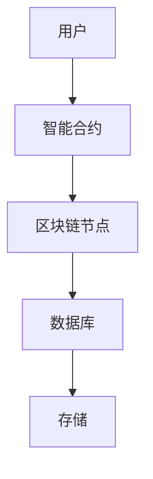

                 


# 如何评估企业的区块链供应链溯源平台

## 关键词：区块链，供应链，溯源平台，评估指标，技术实现，系统架构，安全隐私

## 摘要：  
区块链供应链溯源平台通过区块链技术实现对供应链数据的透明化、可追溯性和不可篡改性，从而提高企业供应链管理的效率和安全性。本文从技术实现、系统架构、功能模块、数据安全、性能评估等多个维度，详细分析企业区块链供应链溯源平台的关键评估指标，并结合实际案例进行深入剖析，为企业的平台建设和优化提供指导。

---

# 第1章: 区块链供应链溯源平台的背景与意义

## 1.1 供应链管理的现状与挑战  
### 1.1.1 传统供应链管理的痛点  
- 数据孤岛问题：不同供应链参与方之间的数据不互通，信息传递效率低。  
- 数据篡改问题：供应链数据在传递过程中可能被篡改，导致信息不准确。  
- 信任缺失问题：供应链上下游企业之间的信任不足，难以实现高效协作。  

### 1.1.2 区块链技术如何解决供应链问题  
- 提供数据的不可篡改性：区块链的分布式账本特性确保数据的一致性和真实性。  
- 实现数据透明共享：区块链的去中心化特性支持多参与方的数据共享和协作。  
- 提高供应链效率：通过智能合约自动化处理供应链中的交易和流程，减少人为干预。  

### 1.1.3 供应链溯源的重要性  
- 溯源是供应链管理的核心需求，特别是在食品、医药、奢侈品等行业，溯源可以保障产品质量和消费者信任。  
- 区块链的不可篡改性和可追溯性为供应链溯源提供了技术保障。  

## 1.2 区块链技术的核心优势  
### 1.2.1 区块链的基本概念  
- 区块链：一种分布式账本技术，通过密码学和共识机制确保数据的安全性和一致性。  
- 区块链特点：去中心化、不可篡改、可追溯、透明性。  

### 1.2.2 区块链的去中心化特性  
- 去中心化：区块链不依赖于单个中心节点，数据分布在网络中的多个节点上，提高了系统的抗攻击能力。  
- 节点角色：区块链中的节点可以分为全节点、轻节点和观察节点。  

### 1.2.3 区块链的不可篡改性  
- 数据一旦写入区块链，除非通过共识机制达成一致，否则无法修改。  
- 每个区块都包含时间戳和哈希值，确保数据的完整性和不可篡改性。  

## 1.3 区块链供应链溯源的行业应用  
### 1.3.1 零售行业的应用案例  
- 某大型零售商通过区块链技术实现商品的全生命周期溯源，消费者可以通过扫描商品二维码查看商品的生产、运输和销售信息。  

### 1.3.2 制造业的应用案例  
- 某汽车制造企业通过区块链技术实现零部件的供应链溯源，确保每个零部件的来源可追溯，提高产品质量和供应链透明度。  

### 1.3.3 农业的应用案例  
- 某农产品企业通过区块链技术实现农产品的种植、加工、运输和销售的全流程溯源，消费者可以追溯农产品的生产过程，增强信任感。  

## 1.4 本章小结  
本章从供应链管理的现状与挑战出发，分析了区块链技术在供应链管理中的优势，特别是其在供应链溯源中的应用价值。接下来的章节将深入探讨区块链供应链溯源平台的核心概念与技术实现。

---

# 第2章: 区块链供应链溯源平台的核心概念与联系

## 2.1 区块链的核心原理  
### 2.1.1 区块链的区块结构  
- 区块链由多个区块组成，每个区块包含以下内容：  
  - 头（Header）：包含区块的哈希值、时间戳、版本号等信息。  
  - 交易（Transactions）：区块中包含的所有交易数据。  
  - 汞块（Merkle Tree）：用于验证区块中交易数据的完整性。  

### 2.1.2 区块链的共识机制  
- 共识机制是区块链的核心组成部分，用于确保所有节点对区块链的状态达成一致。  
- 常见的共识机制包括：  
  - 工作量证明（PoW）：通过计算哈希值来验证区块的有效性，常见于比特币网络。  
  - 权益证明（PoS）：通过持有代币的数量来决定节点的权重，常见于以太坊的Eth2网络。  
  - 桉树协议（PBFT）：适用于高性能区块链网络，支持快速共识。  

### 2.1.3 区块链的智能合约  
- 智能合约是区块链上的自动执行程序，可以实现供应链中的自动化流程，例如自动结算、自动通知等。  
- 智能合约的特点：  
  - 自动执行：智能合约一旦部署，就会按照预设的逻辑自动执行。  
  - 不可篡改：智能合约的代码一旦部署，无法被修改或删除。  
  - 可编程性：智能合约可以通过编写代码实现复杂的业务逻辑。  

## 2.2 供应链溯源的实体关系分析  
### 2.2.1 供应链参与方的实体关系  
- 供应链参与方包括：  
  - 供应商：提供原材料或零部件的企业。  
  - 制造商：负责生产产品的企业。  
  - 分销商：负责分销产品的中间商。  
  - 零售商：直接面向消费者的销售终端。  
  - 消费者：最终购买产品的个人或企业。  

### 2.2.2 数据流的实体关系  
- 数据流包括：  
  - 供应商提供原材料信息。  
  - 制造商记录生产过程信息。  
  - 分销商记录物流信息。  
  - 零售商记录销售信息。  
  - 消费者查询产品信息。  

### 2.2.3 交易的实体关系  
- 供应链中的交易包括：  
  - 原材料采购交易：供应商向制造商提供原材料。  
  - 生产加工交易：制造商将原材料加工成成品。  
  - 分销交易：制造商将成品分销给分销商或零售商。  
  - 零售交易：零售商将产品销售给消费者。  

## 2.3 区块链供应链溯源的系统架构  
### 2.3.1 系统架构的组成  
- 区块链节点：负责维护区块链账本，处理交易数据。  
- 智能合约：实现供应链中的自动化流程。  
- 用户界面：供用户查询和操作的界面，例如Web界面或移动端App。  

### 2.3.2 数据流向的架构图  


## 2.4 本章小结  
本章详细讲解了区块链供应链溯源平台的核心概念，包括区块链的基本原理、共识机制、智能合约，以及供应链参与方的实体关系和数据流向的架构图。接下来的章节将从技术实现的角度，探讨如何构建和评估区块链供应链溯源平台。

---

# 第3章: 区块链供应链溯源平台的关键技术

## 3.1 区块链共识机制的选择与实现  
### 3.1.1 共识机制的分类  
- 常见的共识机制：  
  - 工作量证明（PoW）：适用于比特币等加密货币。  
  - 权益证明（PoS）：适用于以太坊等高性能区块链。  
  - 桉树协议（PBFT）：适用于企业级区块链。  

### 3.1.2 共识机制的选择标准  
- 网络规模：大规模网络需要高性能共识机制。  
- 安全性：高安全性的场景需要选择抗攻击能力强的共识机制。  
- 延迟要求：实时性要求高的场景需要选择低延迟的共识机制。  

### 3.1.3 共识机制的实现流程  
1. **初始化阶段**：所有节点达成初始共识，建立信任关系。  
2. **交易广播阶段**：交易发起方将交易数据广播给所有节点。  
3. **共识达成阶段**：节点通过共识算法验证交易数据，达成一致。  
4. **区块生成阶段**：节点将达成共识的交易数据打包成区块，添加到区块链中。  

## 3.2 智能合约的编写与部署  
### 3.2.1 智能合约的定义  
- 智能合约是区块链上的自动执行程序，用于实现供应链中的自动化流程。  

### 3.2.2 智能合约的编写规范  
- 使用Solidity语言编写智能合约代码。  
- 合约代码需要经过严格的测试和审核，确保逻辑正确。  

### 3.2.3 智能合约的部署流程  
1. **编译阶段**：将Solidity代码编译成 bytecode。  
2. **部署阶段**：将bytecode部署到区块链网络中。  
3. **初始化阶段**：设置智能合约的初始参数，例如参与方的地址。  

### 3.2.4 智能合约的代码示例  
```solidity
// SPDX-License-Identifier: MIT
pragma solidity ^0.8.0;

contract SupplyChain {
    struct Product {
        string name;
        uint price;
        address supplier;
        address manufacturer;
        address distributor;
        address retailer;
    }

    Product[] public products;

    function addProduct(string memory name, uint price, address supplier, address manufacturer, address distributor, address retailer) public {
        Product memory product = Product({
            name = name,
            price = price,
            supplier = supplier,
            manufacturer = manufacturer,
            distributor = distributor,
            retailer = retailer
        });
        products.push(product);
    }
}
```

## 3.3 数据加密与隐私保护  
### 3.3.1 数据加密技术的选择  
- 常见的加密算法：  
  - 对称加密算法：AES、DES等。  
  - 非对称加密算法：RSA、ECDSA等。  

### 3.3.2 数据隐私保护的实现  
- 使用零知识证明（ZKP）实现数据隐私保护。  
- 在区块链网络中实现权限控制，确保只有授权方可以查看敏感数据。  

### 3.3.3 数据安全的注意事项  
- 定期进行安全审计，发现并修复系统漏洞。  
- 确保智能合约的逻辑安全，防止被恶意攻击。  

## 3.4 本章小结  
本章详细讲解了区块链供应链溯源平台的关键技术，包括共识机制的选择与实现、智能合约的编写与部署，以及数据加密与隐私保护。接下来的章节将从系统架构的角度，探讨如何设计和优化区块链供应链溯源平台。

---

# 第4章: 区块链供应链溯源平台的系统分析与架构设计

## 4.1 系统功能分析  
### 4.1.1 系统功能模块划分  
- 供应商模块：负责录入原材料信息。  
- 制造商模块：负责记录生产过程信息。  
- 分销商模块：负责记录物流信息。  
- 零售商模块：负责记录销售信息。  
- 消费者查询模块：供消费者查询产品信息。  

### 4.1.2 功能模块的交互流程  
1. 供应商录入原材料信息，提交到区块链平台。  
2. 制造商接收原材料信息，记录生产过程信息，提交到区块链平台。  
3. 分销商接收生产完成的产品信息，记录物流信息，提交到区块链平台。  
4. 零售商接收物流信息，记录销售信息，提交到区块链平台。  
5. 消费者通过查询模块查看产品信息，实现溯源。  

### 4.1.3 功能模块的实现方式  
- 使用区块链平台提供的API接口实现模块之间的交互。  
- 使用智能合约实现模块之间的数据同步和验证。  

## 4.2 系统架构设计  
### 4.2.1 系统架构的分层设计  
- **数据层**：负责存储区块链账本和相关数据。  
- **逻辑层**：负责处理业务逻辑，例如智能合约的执行。  
- **接口层**：负责与其他系统或模块进行交互，例如与ERP系统对接。  
- **用户层**：负责与用户的交互，例如Web界面或移动端App。  

### 4.2.2 系统架构的组件设计  
- 区块链节点：负责维护区块链账本，处理交易数据。  
- 智能合约：实现供应链中的自动化流程。  
- 用户界面：供用户查询和操作的界面，例如Web界面或移动端App。  

### 4.2.3 系统架构的扩展性设计  
- 支持多种共识机制的切换。  
- 支持多链架构，实现高性能扩展。  

## 4.3 系统架构的Mermaid图  


## 4.4 本章小结  
本章从系统架构的角度，详细分析了区块链供应链溯源平台的系统功能和架构设计。接下来的章节将从项目实战的角度，探讨如何搭建和实现区块链供应链溯源平台。

---

# 第5章: 区块链供应链溯源平台的项目实战

## 5.1 环境搭建  
### 5.1.1 搭建区块链开发环境  
- 使用以太坊测试网（如Ropsten、Kovan、Rinkeby）进行开发。  
- 安装以太坊钱包（如MetaMask）和以太坊命令行工具（如ethers.js）。  

### 5.1.2 安装智能合约开发工具  
- 使用Solidity编译器（如Remix IDE）编写智能合约代码。  
- 使用Truffle框架进行智能合约的部署和测试。  

### 5.1.3 配置供应链数据  
- 收集供应链相关的数据，例如原材料信息、生产过程信息、物流信息等。  

## 5.2 核心代码实现  
### 5.2.1 智能合约的实现  
```solidity
// SPDX-License-Identifier: MIT
pragma solidity ^0.8.0;

contract SupplyChain {
    struct Product {
        string name;
        uint price;
        address supplier;
        address manufacturer;
        address distributor;
        address retailer;
    }

    Product[] public products;

    function addProduct(string memory name, uint price, address supplier, address manufacturer, address distributor, address retailer) public {
        Product memory product = Product({
            name = name,
            price = price,
            supplier = supplier,
            manufacturer = manufacturer,
            distributor = distributor,
            retailer = retailer
        });
        products.push(product);
    }

    function getProduct(uint index) public view returns (string memory, uint, address, address, address, address) {
        Product memory p = products[index];
        return (p.name, p.price, p.supplier, p.manufacturer, p.distributor, p.retailer);
    }
}
```

### 5.2.2 智能合约的部署与测试  
1. **编译合约**：使用Remix IDE将Solidity代码编译成bytecode。  
2. **部署合约**：将bytecode部署到区块链网络中。  
3. **调用合约**：通过MetaMask或Web3.js调用合约的函数，测试合约的逻辑是否正确。  

### 5.2.3 供应链数据的录入与查询  
1. **录入数据**：供应商、制造商、分销商和零售商分别录入相关数据。  
2. **查询数据**：消费者通过查询模块查看产品信息，实现溯源。  

## 5.3 案例分析与详细讲解  
### 5.3.1 实际案例分析  
- 某企业通过区块链供应链溯源平台实现商品的全生命周期管理，提升了供应链的透明度和效率。  

### 5.3.2 详细讲解  
- 通过智能合约实现供应链中的自动化流程，例如自动结算、自动通知等。  
- 通过区块链节点实现数据的分布式存储和共享，确保数据的完整性和安全性。  

## 5.4 本章小结  
本章通过项目实战的方式，详细讲解了如何搭建和实现区块链供应链溯源平台。接下来的章节将从评估指标的角度，探讨如何衡量区块链供应链溯源平台的性能和效果。

---

# 第6章: 区块链供应链溯源平台的评估指标与方法

## 6.1 评估指标的分类  
### 6.1.1 数据完整性评估  
- 数据完整性是指供应链平台中的数据是否完整和一致。  
- 评估指标包括：数据的覆盖范围、数据的准确性、数据的及时性等。  

### 6.1.2 系统性能评估  
- 系统性能是指供应链平台的处理能力和响应速度。  
- 评估指标包括：交易处理速度、网络延迟、系统可用性等。  

### 6.1.3 安全性评估  
- 安全性是指供应链平台抵御攻击和数据泄露的能力。  
- 评估指标包括：漏洞数量、攻击抵抗能力、数据加密强度等。  

## 6.2 评估方法的选择  
### 6.2.1 数据完整性评估方法  
- 数据完整性评估可以通过检查区块链账本的完整性来实现。  
- 使用区块链的Merkle树结构验证数据的完整性。  

### 6.2.2 系统性能评估方法  
- 使用压力测试工具（如JMeter）对系统进行性能测试。  
- 通过监控系统资源使用情况（如CPU、内存）评估系统的负载能力。  

### 6.2.3 安全性评估方法  
- 进行安全审计，发现并修复系统漏洞。  
- 使用第三方安全测试工具对系统进行渗透测试。  

## 6.3 优化策略  
### 6.3.1 数据完整性优化  
- 定期进行数据备份和恢复，确保数据的完整性和可恢复性。  
- 使用区块链的分片技术（Sharding）提高数据存储效率。  

### 6.3.2 系统性能优化  
- 使用高效的共识机制（如PBFT）提高交易处理速度。  
- 优化智能合约的代码，减少不必要的计算和资源消耗。  

### 6.3.3 安全性优化  
- 使用零知识证明（ZKP）保护敏感数据的隐私。  
- 定期更新系统软件和智能合约，修复已知的安全漏洞。  

## 6.4 本章小结  
本章从评估指标和方法的角度，详细分析了如何衡量区块链供应链溯源平台的性能和效果。接下来的章节将总结全书内容，并展望未来的发展方向。

---

# 第7章: 总结与展望

## 7.1 全书内容回顾  
- 本书从区块链供应链溯源平台的背景与意义出发，详细讲解了其核心概念、关键技术、系统架构和项目实战。  
- 通过实际案例分析和详细的技术实现，帮助读者全面理解区块链供应链溯源平台的构建和优化。  

## 7.2 未来展望  
- 随着区块链技术的不断发展，供应链溯源平台将更加智能化和自动化。  
- 区块链与人工智能（AI）的结合将为供应链管理带来新的可能性，例如智能预测、智能决策等。  

## 7.3 注意事项与Tips  
- 在实际应用中，需要根据具体需求选择合适的区块链技术方案。  
- 定期进行系统维护和安全审计，确保系统的稳定性和安全性。  
- 在数据隐私保护方面，需要遵守相关法律法规，确保数据的合法性和合规性。  

## 7.4 本章小结  
本书从理论到实践，全面分析了区块链供应链溯源平台的关键技术和发展趋势。希望本书能够为企业的平台建设和优化提供有价值的参考和指导。

---

# 作者：AI天才研究院/AI Genius Institute & 禅与计算机程序设计艺术 /Zen And The Art of Computer Programming

