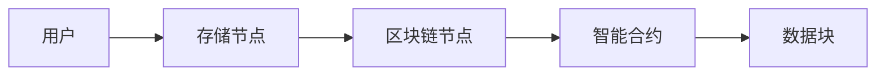
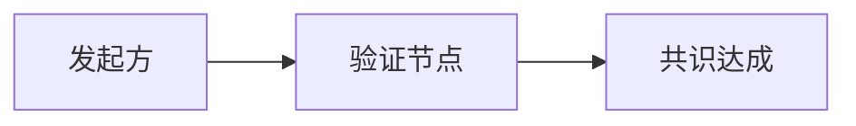
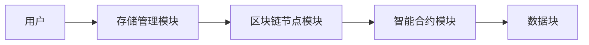
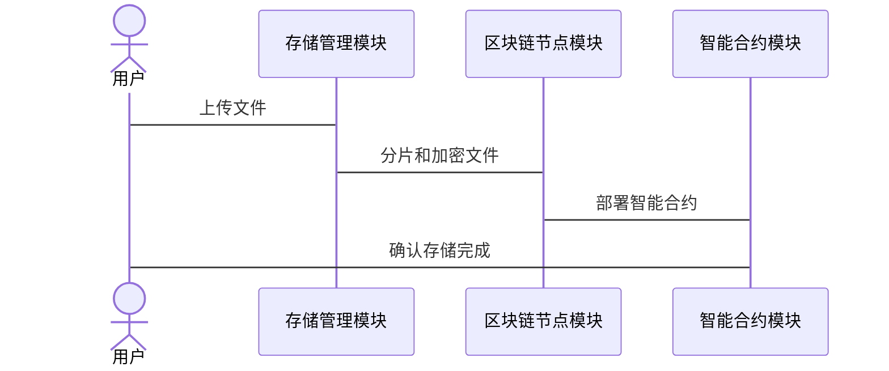

                 


# 如何评估企业的区块链去中心化云存储平台

> 关键词：区块链，去中心化云存储，评估方法，分布式系统，企业应用

> 摘要：本文详细探讨了如何评估企业的区块链去中心化云存储平台，从技术原理、系统架构、性能指标、安全性、可扩展性等多方面进行分析，提供了一套完整的评估框架和方法，帮助企业更好地选择和优化适合的去中心化云存储解决方案。

---

# 第一部分：区块链去中心化云存储平台概述

## 第1章：区块链与去中心化云存储概述

### 1.1 区块链技术基础

#### 1.1.1 区块链的定义与核心原理
区块链是一种分布式账本技术，通过去中心化的方式记录数据，确保数据的不可篡改性和可追溯性。区块链的核心原理包括去中心化、共识机制、区块结构和哈希指针等。

#### 1.1.2 区块链的共识机制
共识机制是区块链的核心，确保所有节点达成一致。常见的共识机制包括：
- **工作量证明（PoW）**：比特币采用的机制，通过计算哈希值来验证区块。
- **权益证明（PoS）**：通过持有代币的数量来决定验证权力。
- ** delegated Proof of Stake (DPoS)**：通过选举代表节点进行验证。

#### 1.1.3 区块链的激励机制
激励机制是区块链的重要组成部分，用于激励节点参与网络的维护和扩展。常见的激励机制包括交易费用、区块奖励和代币发行等。

### 1.2 去中心化存储的概念与特点

#### 1.2.1 去中心化存储的定义
去中心化存储是指数据不依赖于单一中心服务器，而是分散存储在多个节点上，通过分布式网络实现数据的存储和访问。

#### 1.2.2 去中心化存储的优势
- **数据冗余**：数据存储在多个节点，提高了数据的可用性和容灾能力。
- **抗审查性**：数据存储在全球多个节点，难以被单方面审查或删除。
- **隐私保护**：通过加密和权限控制，确保数据的安全性和隐私性。

#### 1.2.3 去中心化存储的挑战
- **数据一致性**：如何保证分布式节点上的数据一致性是一个难题。
- **存储成本**：相比中心化存储，去中心化存储的存储成本可能更高。
- **性能优化**：分布式存储可能会面临网络延迟和带宽限制，影响整体性能。

### 1.3 区块链与去中心化云存储的结合

#### 1.3.1 区块链在云存储中的应用
区块链可以为云存储提供信任机制，确保数据的完整性和不可篡改性。通过智能合约，可以实现自动化的存储和支付。

#### 1.3.2 去中心化云存储的必要性
随着企业对数据安全和隐私保护的需求增加，去中心化云存储为企业提供了更高的数据控制权和安全性。

#### 1.3.3 企业级应用的潜力
区块链去中心化云存储在企业中的应用潜力巨大，特别是在金融、医疗、法律等领域，数据的安全性和隐私保护至关重要。

### 1.4 本章小结
本章主要介绍了区块链技术和去中心化存储的基本概念，并探讨了两者结合的必要性和潜力。

---

## 第2章：区块链去中心化云存储的核心概念

### 2.1 区块链去中心化存储的实体关系图



### 2.2 区块链共识机制的原理



### 2.3 去中心化存储的文件分片与加密

#### 2.3.1 文件分片的原理
文件被分割成多个小块，每个块存储在不同的节点上，通过哈希值进行标识和定位。

#### 2.3.2 加密算法的应用
使用对称加密算法（如AES）对文件进行加密，确保只有拥有密钥的用户才能解密数据。

#### 2.3.3 分片存储的优化
通过冗余存储和地理位置分散存储，提高数据的可用性和抗毁性。

### 2.4 本章小结
本章通过图表和流程图详细介绍了区块链去中心化存储的核心概念和技术实现。

---

## 第3章：区块链去中心化云存储的评估指标

### 3.1 性能评估指标

#### 3.1.1 存储容量
平台能够支持的最大存储空间，通常以PB或EB为单位。

#### 3.1.2 读写速度
数据的读写速度是衡量平台性能的重要指标，通常以每秒处理的IOPS（输入输出操作次数）为单位。

#### 3.1.3 并发处理能力
平台能够同时处理的最大并发请求数，反映系统的扩展性和负载能力。

### 3.2 安全性评估指标

#### 3.2.1 数据完整性
数据在存储和传输过程中是否完整，可以通过哈希值验证。

#### 3.2.2 系统安全性
系统是否具备防止攻击和漏洞的能力，包括加密算法的安全性、权限管理的严密性等。

#### 3.2.3 用户隐私保护
平台是否能够有效保护用户的隐私，防止数据泄露和滥用。

### 3.3 可扩展性评估指标

#### 3.3.1 网络扩展性
平台是否能够支持更多的节点加入，扩展网络规模。

#### 3.3.2 节点扩展性
平台是否能够支持更多的存储节点，提高存储容量和性能。

#### 3.3.3 性能扩展性
平台是否能够通过增加节点或优化算法来提高整体性能。

### 3.4 本章小结
本章详细列举了评估区块链去中心化云存储平台的主要指标，包括性能、安全性、可扩展性等方面。

---

## 第4章：区块链去中心化云存储的算法原理

### 4.1 区块链共识算法的实现


### 4.2 去中心化存储的文件分片算法

#### 4.2.1 分片算法的数学模型
$$ \text{分片数} = \left\lceil \frac{\text{文件大小}}{\text{块大小}} \right\rceil $$

### 4.3 加密算法的实现

#### 4.3.1 哈希函数的应用
哈希函数用于生成数据块的唯一标识，确保数据的完整性和一致性。

#### 4.3.2 加密密钥的管理
密钥通常存储在加密的密钥管理服务中，确保只有授权用户能够访问。

#### 4.3.3 解密过程的验证
解密过程需要通过多重验证，确保数据的安全性和合法性。

### 4.4 本章小结
本章通过数学模型和流程图详细介绍了区块链去中心化云存储的算法原理。

---

## 第5章：区块链去中心化云存储的系统架构设计

### 5.1 系统功能模块设计

#### 5.1.1 存储管理模块
负责数据的分片、加密和存储位置分配。

#### 5.1.2 区块链节点模块
负责验证数据块的合法性和维护区块链的完整性。

#### 5.1.3 智能合约模块
通过智能合约实现存储的自动化管理，包括计费、权限控制等。

### 5.2 系统架构设计



### 5.3 系统接口设计

#### 5.3.1 用户接口
用户通过API或Web界面进行文件上传、下载和删除操作。

#### 5.3.2 节点接口
节点之间通过P2P协议进行数据同步和通信。

### 5.4 系统交互流程



### 5.5 本章小结
本章详细介绍了区块链去中心化云存储系统的架构设计和交互流程。

---

## 第6章：区块链去中心化云存储的项目实战

### 6.1 环境搭建

#### 6.1.1 安装必要的工具
- 安装Python和相关开发库。
- 安装区块链框架（如Ethereum或IPFS）。

#### 6.1.2 配置存储环境
- 配置分布式存储节点。
- 配置区块链网络。

### 6.2 核心代码实现

#### 6.2.1 文件分片与加密

```python
import hashlib

def file_shard(file_path, chunk_size):
    with open(file_path, 'rb') as f:
        while True:
            chunk = f.read(chunk_size)
            if not chunk:
                break
            yield chunk

def file_encrypt(chunk, key):
    cipher = AES.new(key, AES.MODE_ECB)
    return cipher.encrypt(chunk)
```

#### 6.2.2 区块链智能合约

```solidity
contract StorageContract {
    function store(bytes data, bytes32 hash) public returns (bool) {
        // 存储数据并返回哈希
        return true;
    }
}
```

#### 6.2.3 测试与优化
- 测试文件的上传、下载和删除功能。
- 优化分片算法和加密算法，提高性能。

### 6.3 本章小结
本章通过实际案例展示了如何搭建和实现一个区块链去中心化云存储平台。

---

## 第7章：区块链去中心化云存储的最佳实践

### 7.1 评估与优化

#### 7.1.1 性能优化
- 使用更高效的分片算法和加密算法。
- 优化网络传输协议，减少延迟。

#### 7.1.2 安全性优化
- 定期审计系统漏洞。
- 强化权限管理，防止未授权访问。

#### 7.1.3 可扩展性优化
- 增加存储节点，提高存储容量。
- 优化共识机制，提高网络性能。

### 7.2 小结
本章总结了评估和优化区块链去中心化云存储平台的关键点。

### 7.3 注意事项
- 在实际应用中，需考虑法律法规和数据隐私问题。
- 定期备份数据，防止数据丢失。

### 7.4 扩展阅读
- 推荐阅读相关技术书籍和论文，深入学习区块链和分布式系统的知识。

---

## 作者信息

作者：AI天才研究院/AI Genius Institute & 禅与计算机程序设计艺术 /Zen And The Art of Computer Programming

---

通过以上详细的思考过程，我们可以系统地评估企业的区块链去中心化云存储平台，从技术原理、系统架构、性能指标、安全性、可扩展性等多个方面进行全面分析，帮助企业更好地选择和优化适合的去中心化云存储解决方案。

