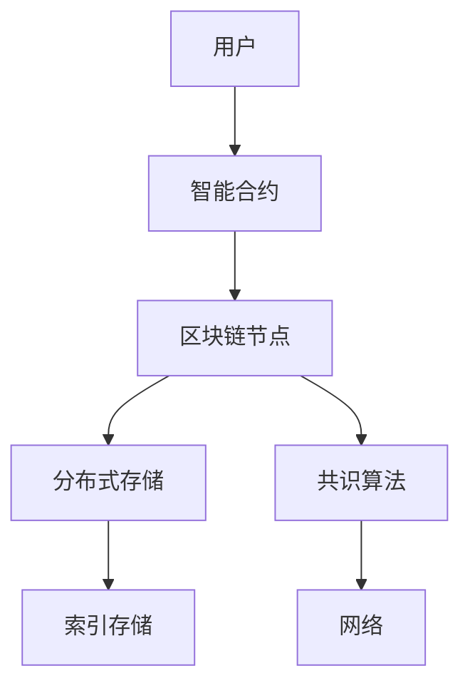
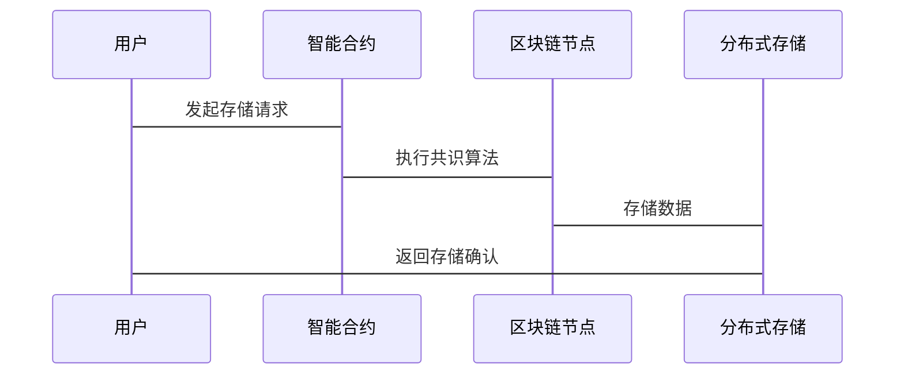

                 


# 如何评估企业的区块链去中心化存储平台

> 关键词：区块链，去中心化存储，平台评估，系统架构，企业应用

> 摘要：本文将详细介绍如何评估企业区块链去中心化存储平台，涵盖区块链与去中心化存储的核心概念、评估指标、系统架构设计、项目实战案例以及最佳实践等，帮助企业在选择和实施区块链去中心化存储平台时做出明智决策。

---

## 第1章: 区块链去中心化存储平台的背景与核心概念

### 1.1 区块链技术的基本原理

#### 1.1.1 区块链的定义与特点
区块链是一种去中心化的分布式账本技术，通过链式数据结构和加密算法确保数据的安全性和不可篡改性。其特点包括去中心化、去信任化、透明性和抗篡改性。

#### 1.1.2 区块链的核心技术原理
区块链通过共识算法（如PoW、PoS）实现分布式节点的一致性，通过区块链式结构存储数据，并利用哈希函数保证数据的完整性和安全性。

#### 1.1.3 区块链的分类与应用场景
区块链分为公链、私链和联盟链，应用场景包括金融、供应链、医疗和版权保护等领域。

### 1.2 去中心化存储的定义与特点

#### 1.2.1 去中心化存储的基本概念
去中心化存储通过分布式网络存储数据，避免单点故障，提高数据冗余度和可用性。

#### 1.2.2 去中心化存储的核心优势
去中心化存储具有抗审查性、数据冗余性和高可用性，能够有效防止数据丢失和篡改。

#### 1.2.3 去中心化存储的实现方式
去中心化存储可通过区块链技术实现，通过智能合约和分布式网络确保数据的安全性和可访问性。

### 1.3 区块链去中心化存储的结合与创新

#### 1.3.1 区块链与去中心化存储的结合
区块链为去中心化存储提供数据可信性和不可篡改性，而去中心化存储为区块链提供数据存储和分发能力。

#### 1.3.2 区块链去中心化存储的独特优势
区块链去中心化存储结合了区块链的可信性和去中心化存储的高可用性，能够有效解决传统存储的安全性和性能问题。

#### 1.3.3 区块链去中心化存储的应用场景
区块链去中心化存储广泛应用于数据存证、供应链管理、医疗数据共享和智能合约存储等领域。

---

## 第2章: 区块链去中心化存储的核心要素

### 2.1 区块链去中心化存储的核心要素

#### 2.1.1 数据存储机制
数据通过分片、冗余和分布式存储确保数据的高可用性和安全性。

#### 2.1.2 加密技术
利用对称加密和非对称加密技术保护数据隐私，确保只有授权用户可以访问数据。

#### 2.1.3 智能合约
智能合约用于自动化执行存储和访问权限控制，确保数据操作的透明性和可信性。

### 2.2 区块链去中心化存储的属性特征对比

#### 2.2.1 数据存储的可扩展性
通过分片和并行处理提升存储系统的可扩展性，支持海量数据存储和快速访问。

#### 2.2.2 数据安全性的对比
对比中心化存储和去中心化存储的安全性，分析区块链去中心化存储在数据完整性、抗攻击性和隐私保护方面的优势。

#### 2.2.3 系统去中心化的程度
根据系统架构和节点分布，评估系统的去中心化程度，选择适合企业需求的存储方案。

### 2.3 区块链去中心化存储的ER实体关系图

```mermaid
erDiagram
    actor 用户
    actor 管理员
    actor 区块链节点
    actor 数据提供者
    actor 数据消费者
    database 区块链数据库
    database 分片存储
    database 索引存储
    database 日志存储
    participant "区块链网络" as 网络
    participant "智能合约" as 合约
    participant "共识算法" as 共识
    participant "加密模块" as 加密
    用户 --> 合约 : 发起存储请求
    用户 --> 合约 : 查询数据
    管理员 --> 合约 : 管理权限
    区块链节点 --> 网络 : 参与共识
    加密 --> 数据库 : 数据加密
    分片存储 --> 网络 : 分片存储
    索引存储 --> 网络 : 数据索引
    日志存储 --> 网络 : 操作日志
```

### 2.4 本章小结
本章详细讲解了区块链去中心化存储的核心要素，包括数据存储机制、加密技术和智能合约，并通过ER实体关系图展示了系统的结构和交互关系。

---

## 第3章: 区块链去中心化存储平台的评估指标

### 3.1 评估指标的分类

#### 3.1.1 性能指标
- 响应时间：数据存储和查询的延迟
- 吞吐量：单位时间内处理的交易量
- 并发能力：支持的并发用户数

#### 3.1.2 安全性指标
- 数据完整性：数据存储的正确性
- 抗攻击性：抵抗DDoS和恶意攻击的能力
- 隐私保护：数据加密和访问控制的有效性

#### 3.1.3 可扩展性指标
- 存储容量：支持的最大数据量
- 网络性能：节点扩展的能力
- 系统可用性：故障恢复能力

### 3.2 评估指标的权重分配

#### 3.2.1 指标的权重定义
根据企业需求和行业特点，为各评估指标分配权重，例如性能指标占40%，安全性指标占30%，可扩展性指标占30%。

#### 3.2.2 指标的权重计算
通过层次分析法（AHP）计算各指标的权重，确保权重分配的科学性和合理性。

#### 3.2.3 指标的权重调整
根据实际测试结果和企业需求，动态调整各指标的权重，优化评估策略。

### 3.3 评估指标的对比分析

#### 3.3.1 性能对比
通过基准测试对比不同平台的性能指标，选择适合企业需求的存储方案。

#### 3.3.2 安全性对比
分析不同平台的安全机制，评估其抵御攻击和数据泄露的能力。

#### 3.3.3 可扩展性对比
通过压力测试评估平台的扩展能力，确保其能够支持企业未来的发展需求。

### 3.4 本章小结
本章详细介绍了区块链去中心化存储平台的评估指标，并通过权重分配和对比分析，帮助企业制定合理的评估策略。

---

## 第4章: 区块链去中心化存储平台的系统分析与架构设计

### 4.1 系统需求分析

#### 4.1.1 功能需求
- 数据存储与检索
- 数据加密与解密
- 智能合约执行
- 用户权限管理

#### 4.1.2 性能需求
- 高可用性和低延迟
- 高吞吐量和高并发处理能力

#### 4.1.3 安全需求
- 数据隐私保护
- 系统抗攻击能力
- 安全审计和日志记录

### 4.2 系统功能设计

#### 4.2.1 数据存储与检索
通过分布式存储和索引技术实现高效的数据存储和快速查询。

#### 4.2.2 数据加密与解密
采用对称加密和非对称加密技术，确保数据在存储和传输过程中的安全性。

#### 4.2.3 智能合约执行
通过区块链平台执行智能合约，自动化处理数据存储和访问权限控制。

### 4.3 系统架构设计

#### 4.3.1 系统架构图


#### 4.3.2 关键组件说明
- 用户：发起数据存储和查询请求
- 智能合约：定义数据存储和访问规则
- 区块链节点：参与共识和数据存储
- 分布式存储：实现数据的冗余和高可用性
- 共识算法：确保数据一致性和系统安全性

### 4.4 系统接口设计

#### 4.4.1 API接口
- 数据存储接口：`POST /api/v1/storage/upload`
- 数据查询接口：`GET /api/v1/storage/query`
- 用户认证接口：`POST /api/v1/authenticate`

#### 4.4.2 接口交互流程


### 4.5 本章小结
本章详细分析了区块链去中心化存储平台的系统需求和架构设计，展示了系统的组件结构和接口交互流程。

---

## 第5章: 项目实战：企业区块链去中心化存储平台评估案例

### 5.1 项目背景
某企业需要选择一个适合其业务需求的区块链去中心化存储平台，以确保数据的安全性和高可用性。

### 5.2 项目需求分析

#### 5.2.1 功能需求
- 数据存证和查询
- 数据隐私保护
- 用户权限管理

#### 5.2.2 性能需求
- 响应时间小于1秒
- 吞吐量达到每秒1000次交易
- 支持1000并发用户

### 5.3 项目实施过程

#### 5.3.1 环境搭建
- 安装区块链平台（以太坊、IPFS等）
- 配置分布式存储环境
- 部署智能合约

#### 5.3.2 核心实现
- 数据存储与加密
- 智能合约编写与部署
- 区块链节点配置与测试

#### 5.3.3 测试与优化
- 性能测试：使用JMeter进行压力测试
- 安全测试：模拟攻击测试系统安全性
- 优化调整：根据测试结果优化系统性能和安全性

### 5.4 项目小结
通过实际案例，展示了如何评估和选择适合企业的区块链去中心化存储平台，强调了系统架构设计和性能优化的重要性。

---

## 第6章: 最佳实践与注意事项

### 6.1 最佳实践

#### 6.1.1 选择适合的平台
根据企业需求和行业特点选择适合的区块链去中心化存储平台，确保系统的安全性和可扩展性。

#### 6.1.2 系统架构设计
注重系统的可扩展性和高可用性，采用分布式架构和冗余设计，确保系统的稳定性和可靠性。

#### 6.1.3 安全性保障
加强数据加密和访问控制，确保数据的隐私性和系统安全性，防止数据泄露和恶意攻击。

### 6.2 注意事项

#### 6.2.1 系统性能瓶颈
在设计系统时需充分考虑性能瓶颈，通过分片、并行处理等技术提升系统吞吐量。

#### 6.2.2 数据一致性
确保分布式存储系统中的数据一致性，采用适当的共识算法和数据同步机制。

#### 6.2.3 系统维护与监控
建立完善的系统监控和维护机制，及时发现和处理系统故障，确保系统的稳定运行。

### 6.3 未来展望

随着区块链技术和分布式存储技术的不断发展，区块链去中心化存储平台将为企业提供更加安全、高效和可靠的存储解决方案。

---

## 作者：AI天才研究院/AI Genius Institute & 禅与计算机程序设计艺术 /Zen And The Art of Computer Programming

---

以上是完整的文章目录和内容概要。每一章的内容都需要根据实际需求进行详细展开，包括技术细节、代码实现和实际案例分析，以确保文章的深度和实用性。

