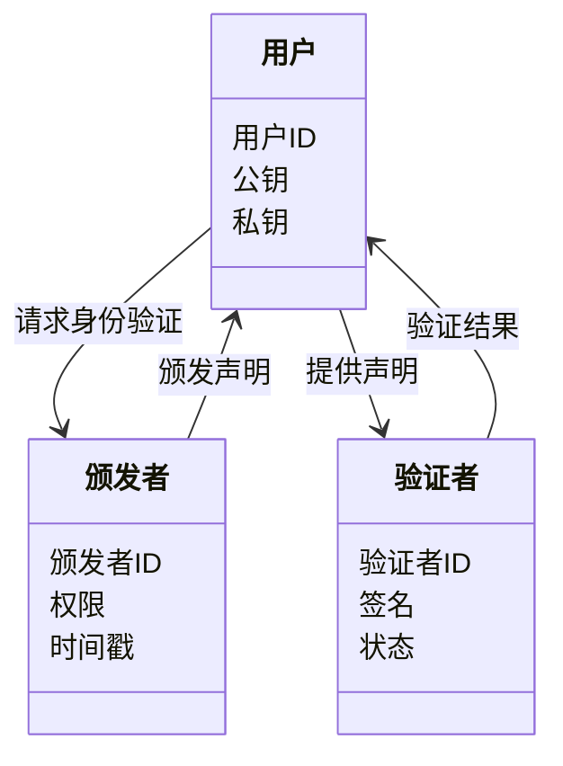

                 


# 如何评估企业的区块链去中心化身份验证平台

> 关键词：区块链，去中心化身份验证，零知识证明，系统架构，身份验证平台，企业安全

> 摘要：本文详细探讨了评估企业区块链去中心化身份验证平台的核心方法，从背景介绍到系统架构，再到项目实战，全面分析了该平台的关键技术和应用场景，旨在为企业技术决策者和开发人员提供深度指导。

---

## 第一部分：区块链去中心化身份验证平台的背景介绍

### 第1章：问题背景与问题描述

#### 1.1 问题背景
- **1.1.1 当前企业身份验证面临的挑战**
  传统的身份验证系统依赖于中心化的数据库，容易成为攻击目标。数据泄露事件频发，导致用户隐私和企业数据面临巨大风险。此外，不同系统间的身份验证不兼容，增加了管理复杂性。

- **1.1.2 区块链技术如何解决身份验证问题**
  区块链的去中心化特性、不可篡改性和透明性为身份验证提供了新的解决方案。通过区块链，可以实现去中心化的身份管理，减少数据泄露风险，提高系统的抗审查性。

- **1.1.3 去中心化身份验证的核心优势**
  用户无需依赖第三方机构，拥有对自己身份的完全控制权。通过智能合约自动执行验证流程，降低了人为干预的风险，提高了系统的安全性和效率。

#### 1.2 问题描述
- **1.2.1 传统身份验证系统的局限性**
  集中式系统存在单点故障，容易遭受黑客攻击。用户身份信息集中存储，一旦被攻破，可能导致大规模数据泄露。

- **1.2.2 区块链去中心化身份验证的目标**
  构建一个去中心化的身份验证系统，用户可以自主管理身份信息，同时确保信息的安全性和隐私性。

- **1.2.3 企业应用场景中的具体问题**
  在企业内部，不同部门和系统需要共享身份信息，传统的集中式系统难以实现高效的跨系统身份验证。而去中心化身份验证可以实现跨系统的无缝集成。

#### 1.3 问题解决与边界
- **1.3.1 区块链去中心化身份验证的解决方案**
  使用区块链技术构建分布式身份验证系统，通过智能合约实现自动化的身份验证流程。用户通过私钥控制自己的身份信息，颁发者通过区块链记录和验证声明。

- **1.3.2 系统的边界与外延**
  系统边界包括用户、颁发者和验证者。外延部分涉及区块链网络的搭建、智能合约的部署以及与现有系统的集成。

- **1.3.3 核心要素与组成结构**
  核心要素包括用户私钥、区块链网络、智能合约和验证逻辑。系统由用户、颁发者、验证者和区块链网络四个部分组成，通过智能合约实现身份验证的自动化流程。

---

## 第二部分：核心概念与联系

### 第2章：去中心化身份验证的核心原理

#### 2.1 去中心化身份验证的原理
- **2.1.1 分布式身份存储**
  用户的身份信息分散存储在区块链网络中，每个节点都保存一份完整的记录，确保数据的不可篡改性。

- **2.1.2 自主权与隐私保护**
  用户通过私钥控制自己的身份信息，可以选择性地分享部分信息，确保隐私安全。颁发者和验证者仅验证声明的真实性，而不持有用户的私钥。

- **2.1.3 可扩展性与安全性**
  区块链的分布式特性确保了系统的可扩展性，能够支持大量的并发请求。通过密码学算法和智能合约的自动执行，提升了系统的安全性。

#### 2.2 核心概念属性对比
| **属性**         | **去中心化身份验证** | **集中式身份验证** |
|------------------|---------------------|---------------------|
| 数据存储方式     | 分布式存储          | 集中式存储          |
| 控制权           | 用户自主控制        | 第三方机构控制      |
| 数据安全性       | 高                  | 中                  |
| 隐私保护         | 强                  | 弱                  |
| 可扩展性         | 高                  | 低                  |
| 成本             | 较低                | 较高                |

#### 2.3 ER实体关系图
```mermaid
erDiagram
    user [用户] {
        用户ID
        公钥
        私钥
    }
    issuer [颁发者] {
        颁发者ID
        权限
        时间戳
    }
    verifier [验证者] {
        验证者ID
        签名
        状态
    }
    user --> issuer : 请求身份验证
    issuer --> user : 颁发声明
    user --> verifier : 提供声明
    verifier --> user : 验证结果
```

---

## 第三部分：算法原理讲解

### 第3章：零知识证明的原理与实现

#### 3.1 零知识证明的核心原理
零知识证明是一种密码学技术，允许一方（证明者）向另一方（验证者）证明自己拥有某种信息，而无需透露该信息本身。在区块链去中心化身份验证中，用户可以通过零知识证明验证自己的身份，而无需透露私钥。

#### 3.2 零知识证明的数学模型
零知识证明基于交互式协议，通过多次交互证明知识的正确性，同时防止验证者获取任何关于证明者信息的额外信息。数学模型通常涉及哈希函数和椭圆曲线加密。

#### 3.3 零知识证明的实现步骤
1. **初始化**：用户生成一对公钥和私钥。
2. **颁发声明**：颁发者在区块链上记录用户的声明，并附上时间戳和权限。
3. **身份验证**：用户向验证者提交零知识证明，证明自己持有正确的私钥，而无需透露私钥本身。
4. **验证结果**：验证者通过区块链上的智能合约验证声明的真实性，并返回验证结果。

#### 3.4 零知识证明的Python实现示例
```python
def verify zk-snark Proof(givenProof, publicParameters):
    # 在此处实现zk-snark验证逻辑
    pass
```

---

## 第四部分：系统分析与架构设计

### 第4章：系统功能设计

#### 4.1 系统功能模块
- **用户模块**：用户注册、登录、管理身份信息。
- **颁发者模块**：颁发声明、设置权限、记录时间戳。
- **验证者模块**：验证请求、返回验证结果。
- **区块链网络**：存储声明、执行智能合约。

#### 4.2 系统功能设计图


#### 4.3 系统架构设计
- **分层架构**：系统分为数据层、业务逻辑层和应用层，通过智能合约实现跨层交互。
- **区块链网络**：采用联盟链架构，确保系统的高性能和高安全性。
- **智能合约**：实现身份验证的核心逻辑，确保系统的自动执行和不可篡改性。

---

## 第五部分：项目实战

### 第5章：区块链去中心化身份验证平台的实现

#### 5.1 环境安装
- 安装Python、区块链框架（如Solidity）、智能合约编译工具和区块链节点。

#### 5.2 核心代码实现
```python
def verify_identity(user_id, public_key, signature):
    # 验证签名是否有效
    return verify_signature(public_key, user_id, signature)
```

#### 5.3 代码应用解读
- **用户模块**：用户通过私钥签名请求，提交到区块链网络。
- **颁发者模块**：颁发声明并记录在区块链上。
- **验证者模块**：通过智能合约验证声明的真实性，并返回验证结果。

#### 5.4 实际案例分析
- **案例分析**：医疗数据共享平台，用户通过零知识证明验证身份，确保数据隐私和安全。

#### 5.5 项目小结
通过实际项目实现，验证了区块链去中心化身份验证平台的可行性和高效性。系统在安全性、隐私保护和可扩展性方面表现优异。

---

## 第六部分：最佳实践与注意事项

### 第6章：区块链去中心化身份验证平台的最佳实践

#### 6.1 小结
本文详细探讨了区块链去中心化身份验证平台的核心技术和实现方法，为企业提供了全面的评估和实施指南。

#### 6.2 注意事项
- 确保系统的安全性，防止私钥泄露。
- 合理选择区块链网络架构，确保系统的高性能和高可用性。
- 定期更新智能合约，修复潜在的安全漏洞。

#### 6.3 拓展阅读
推荐进一步阅读关于零知识证明、区块链安全和智能合约开发的相关资料，深入理解去中心化身份验证的最新技术动态。

---

## 附录：工具与参考资料

### 附录A：常用工具

- **Solidity**：智能合约开发语言。
- **Web3.py**：Python区块链开发库。
- **ganache**：区块链开发和测试工具。

### 附录B：参考资料

- [零知识证明技术详解](#)
- [区块链去中心化身份验证白皮书](#)
- [智能合约开发最佳实践](#)

---

## 作者信息

作者：AI天才研究院/AI Genius Institute & 禅与计算机程序设计艺术 /Zen And The Art of Computer Programming

---

通过本文的系统讲解，读者可以全面了解区块链去中心化身份验证平台的核心技术和评估方法，为企业技术决策和实施提供有力支持。

