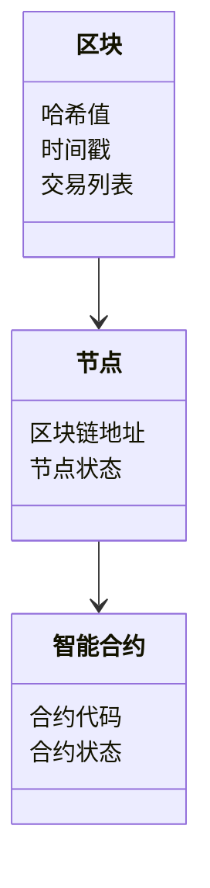
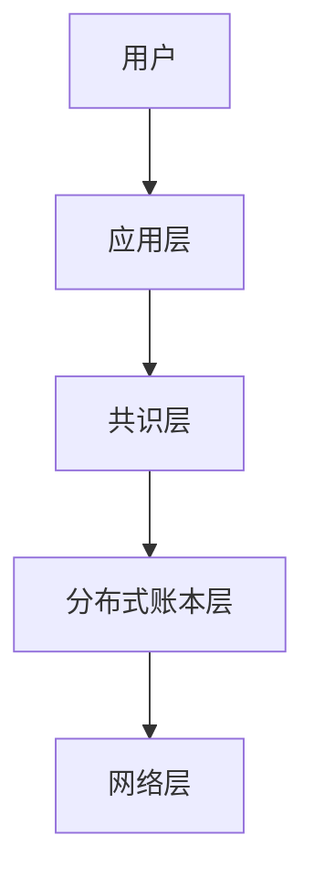
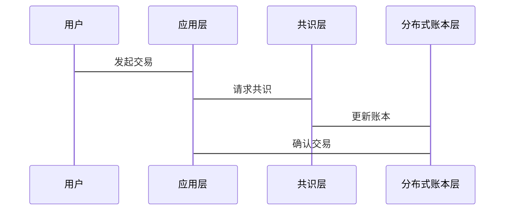

                 


# 如何评估企业的区块链应用能力

> 关键词：区块链技术、企业应用能力、分布式账本、共识机制、智能合约、系统架构设计、安全性评估

> 摘要：随着区块链技术的快速发展，越来越多的企业开始尝试将区块链技术应用于自身的业务场景中。然而，如何准确评估企业的区块链应用能力，成为企业在数字化转型过程中面临的重要挑战。本文从区块链技术的核心概念出发，结合企业区块链应用的实际需求，系统性地分析了企业区块链应用能力的评估框架，并通过具体的案例分析，帮助读者更好地理解和掌握如何评估企业的区块链应用能力。

---

## 第一部分: 区块链技术与企业应用能力评估概述

### 第1章: 区块链技术与企业应用能力评估的背景介绍

#### 1.1 区块链技术的核心概念

##### 1.1.1 从传统系统到区块链的演进
传统信息系统的核心是中心化数据库，数据的存储和管理依赖于单一的中心节点。然而，这种方式存在数据单点故障、信任依赖中心节点、数据孤岛等问题。区块链通过去中心化的设计，将数据分散存储在网络中的多个节点上，形成了分布式账本的特性。

##### 1.1.2 区块链技术的特点与优势
区块链技术的核心特点包括去中心化、不可篡改、透明性和安全性。这些特点使得区块链在金融、供应链管理、医疗健康等领域展现出独特的优势。

##### 1.1.3 企业区块链应用的必要性
企业区块链应用的必要性主要体现在以下几个方面：
1. **提高业务效率**：通过区块链技术，企业可以实现业务流程的自动化和智能化，减少人工干预，提高效率。
2. **增强数据安全性**：区块链的去中心化和不可篡改特性，使得数据更加安全可靠。
3. **降低信任成本**：区块链通过技术手段实现信任的传递，减少了企业之间的信任成本。

#### 1.2 区块链在企业中的应用现状

##### 1.2.1 区块链技术的行业分布
目前，区块链技术已经在金融、供应链管理、医疗健康、版权保护等领域得到了广泛应用。例如，在金融领域，区块链技术被用于跨境支付、供应链金融等场景。

##### 1.2.2 企业区块链应用的典型案例
以供应链管理为例，区块链技术可以实现供应链上的数据共享和透明化，提高供应链的效率和透明度。例如，沃尔玛通过区块链技术实现了食品供应链的溯源，确保了食品的安全性。

##### 1.2.3 区块链技术的未来趋势
未来，区块链技术将更加智能化和平台化，企业将更加注重区块链技术的深度应用和生态建设。

#### 1.3 企业区块链应用能力评估的重要性

##### 1.3.1 评估企业区块链能力的意义
评估企业区块链应用能力，可以帮助企业明确自身的技术优势和短板，为后续的技术选型和应用落地提供依据。

##### 1.3.2 区块链能力评估的边界与外延
区块链能力评估的边界包括技术能力、业务能力和安全性能力。外延则包括企业对区块链技术的理解、应用能力和对区块链生态的影响力。

##### 1.3.3 企业区块链能力评估的核心要素
企业区块链能力评估的核心要素包括技术能力、业务能力、安全能力和生态能力。

#### 1.4 本章小结
本章从区块链技术的核心概念出发，分析了区块链在企业中的应用现状，并探讨了企业区块链应用能力评估的重要性。

---

## 第二部分: 区块链核心概念与企业能力评估框架

### 第2章: 区块链核心概念与企业能力的关联

#### 2.1 区块链技术的核心原理

##### 2.1.1 分布式账本的实现机制
分布式账本是区块链的核心数据结构，通过多个节点共同维护一个不可篡改的账本，确保数据的一致性和完整性。

##### 2.1.2 共识机制的原理与类型
共识机制是区块链的核心技术之一，用于确保分布式账本的一致性。常见的共识机制包括工作量证明（PoW）、权益证明（PoS）等。

##### 2.1.3 智能合约的工作流程
智能合约是区块链上的自动执行程序，用于实现业务逻辑的自动化。智能合约的执行流程包括部署、触发、执行和终止。

#### 2.2 企业区块链能力的核心要素

##### 2.2.1 技术能力：区块链平台的搭建与维护
企业需要具备搭建和维护区块链平台的能力，包括选择合适的区块链框架、配置网络参数、管理节点等。

##### 2.2.2 业务能力：区块链应用场景的设计与实现
企业需要具备设计和实现区块链应用场景的能力，包括业务流程的设计、智能合约的编写等。

##### 2.2.3 安全能力：区块链系统的安全性保障
企业需要具备保障区块链系统安全的能力，包括防范攻击、数据加密、访问控制等。

#### 2.3 区块链核心概念的对比分析

##### 2.3.1 分布式账本与传统数据库的对比
| 对比维度 | 分布式账本 | 传统数据库 |
|----------|------------|------------|
| 数据存储 | 分布式存储 | 中心化存储 |
| 数据一致性 | 弱一致性 | 强一致性 |
| 系统复杂性 | 高 | 低 |

##### 2.3.2 共识机制的优缺点对比
| 共识机制 | 优点 | 缺点 |
|----------|------|------|
| PoW | 安全性高 | 能耗高 |
| PoS | 能耗低 | 安全性相对较低 |

##### 2.3.3 智能合约的实现方式对比
| 实现方式 | 特点 | 适用场景 |
|----------|------|----------|
| 嵌入式智能合约 | 高度定制化 | 适用于特定业务场景 |
| 平台化智能合约 | 可扩展性高 | 适用于多业务场景 |

#### 2.4 企业区块链能力评估框架

##### 2.4.1 技术能力评估维度
- 技术团队能力：技术人员的数量和能力
- 技术选型：选择的区块链框架是否合适
- 技术实现：区块链平台的搭建和维护能力

##### 2.4.2 业务能力评估维度
- 业务场景适配性：区块链技术是否适合企业的业务场景
- 业务流程设计：是否能够实现业务流程的自动化
- 业务价值：区块链应用是否能够为企业创造价值

##### 2.4.3 安全能力评估维度
- 数据安全性：是否能够防范数据泄露和攻击
- 系统稳定性：系统是否能够稳定运行
- 风险控制：是否能够有效控制区块链应用的风险

#### 2.5 本章小结
本章详细分析了区块链技术的核心原理，并结合企业区块链能力评估框架，探讨了企业区块链能力的核心要素。

---

## 第三部分: 区块链技术原理与企业能力评估的数学模型

### 第3章: 区块链技术原理的数学模型

#### 3.1 区块链共识机制的数学模型

##### 3.1.1 工作量证明机制（PoW）的数学模型
工作量证明机制通过计算哈希值的难度来确定矿工的记账权。数学模型如下：
$$
H = \text{Hash}(M + N)
$$
其中，$H$ 是哈希值，$M$ 是区块头，$N$ 是随机数。

##### 3.1.2 权益证明机制（PoS）的数学模型
权益证明机制通过质押代币的数量来确定记账权。数学模型如下：
$$
P = \frac{A_i}{\sum A_j}
$$
其中，$P$ 是节点$i$的记账概率，$A_i$ 是节点$i$的质押代币数量，$\sum A_j$ 是所有节点的质押代币总和。

#### 3.2 区块链加密算法的数学模型

##### 3.2.1 哈希函数的数学模型
哈希函数将输入数据映射到一个固定长度的哈希值。数学模型如下：
$$
H(x) = f(x) \mod n
$$
其中，$f(x)$ 是哈希函数，$n$ 是哈希值的长度。

##### 3.2.2 数字签名的数学模型
数字签名通过公钥和私钥的加密解密来实现数据的完整性验证。数学模型如下：
$$
S = \text{Sign}(K_{\text{priv}}, M)
$$
其中，$S$ 是签名，$K_{\text{priv}}$ 是私钥，$M$ 是待签名的消息。

#### 3.3 区块链智能合约的数学模型

##### 3.3.1 智能合约的执行流程
智能合约的执行流程包括部署、触发、执行和终止四个阶段。数学模型如下：
$$
E = \text{Deploy}(C) \rightarrow \text{Trigger}(E, M) \rightarrow \text{Execute}(E, M) \rightarrow \text{Terminate}(E)
$$
其中，$C$ 是智能合约代码，$E$ 是智能合约实例，$M$ 是输入参数。

#### 3.4 企业区块链能力评估的数学模型

##### 3.4.1 技术能力评估的数学模型
技术能力评估的数学模型如下：
$$
T = \alpha \cdot T_{\text{team}} + \beta \cdot T_{\text{tech}} + \gamma \cdot T_{\text{impl}}
$$
其中，$T$ 是技术能力评估值，$\alpha, \beta, \gamma$ 是权重系数，$T_{\text{team}}$ 是技术团队能力，$T_{\text{tech}}$ 是技术选型，$T_{\text{impl}}$ 是技术实现能力。

##### 3.4.2 业务能力评估的数学模型
业务能力评估的数学模型如下：
$$
B = \alpha \cdot B_{\text{scenario}} + \beta \cdot B_{\text{design}} + \gamma \cdot B_{\text{value}}
$$
其中，$B$ 是业务能力评估值，$\alpha, \beta, \gamma$ 是权重系数，$B_{\text{scenario}}$ 是业务场景适配性，$B_{\text{design}}$ 是业务流程设计能力，$B_{\text{value}}$ 是业务价值。

##### 3.4.3 综合能力评估的数学模型
综合能力评估的数学模型如下：
$$
C = \alpha \cdot T + \beta \cdot B + \gamma \cdot S
$$
其中，$C$ 是综合能力评估值，$\alpha, \beta, \gamma$ 是权重系数，$T$ 是技术能力评估值，$B$ 是业务能力评估值，$S$ 是安全性评估值。

#### 3.5 本章小结
本章通过数学模型的形式，详细分析了区块链技术的核心原理，并结合企业区块链能力评估框架，提出了技术能力、业务能力和综合能力的数学评估模型。

---

## 第四部分: 区块链系统分析与架构设计

### 第4章: 区块链系统分析与架构设计

#### 4.1 区块链系统的功能模块分析

##### 4.1.1 分布式账本模块
分布式账本模块负责存储和管理区块链上的数据，包括区块头、区块体和链式结构。

##### 4.1.2 共识机制模块
共识机制模块负责确保分布式账本的一致性，包括PoW、PoS等共识算法的实现。

##### 4.1.3 智能合约模块
智能合约模块负责执行区块链上的智能合约，实现业务逻辑的自动化。

#### 4.2 区块链系统的架构设计

##### 4.2.1 领域模型类图
以下是区块链系统的领域模型类图：



##### 4.2.2 系统架构图
以下是区块链系统的架构图：



##### 4.2.3 系统交互图
以下是区块链系统的交互图：



#### 4.3 本章小结
本章从系统分析的角度，详细分析了区块链系统的功能模块、架构设计和系统交互流程。

---

## 第五部分: 区块链项目实战与最佳实践

### 第5章: 区块链项目实战与最佳实践

#### 5.1 区块链项目实战

##### 5.1.1 环境搭建
以下是区块链开发环境搭建的步骤：
1. 安装Python 3.8及以上版本。
2. 安装以太坊钱包：`pip install eth_wallet`.
3. 配置以太坊节点：`geth --network ropsten`.

##### 5.1.2 核心功能实现

###### 智能合约实现
以下是智能合约的实现代码：
```python
# 合约代码
def multiply(x, y):
    return x * y

def main():
    x = 5
    y = 6
    result = multiply(x, y)
    print(f"5 * 6 = {result}")
```

###### 区块链网络配置
以下是区块链网络配置的代码：
```python
from web3 import Web3
from web3.auto import wauto

# 连接到以太坊测试网
w3 = Web3(wauto.HTTPProvider("https://ropsten.infura.io/v3/YOUR_API_KEY"))
```

##### 5.1.3 代码解读与分析
1. 智能合约代码：通过定义`multiply`函数，实现简单的乘法运算。
2. 区块链网络配置代码：通过连接到以太坊测试网，实现智能合约的部署和测试。

##### 5.1.4 实际案例分析
以供应链管理为例，通过区块链技术实现供应链上的数据共享和透明化。

#### 5.2 最佳实践

##### 5.2.1 小结
区块链项目开发需要注重技术选型、业务场景适配和安全性保障。

##### 5.2.2 注意事项
1. 确保区块链系统的安全性，防范数据泄露和攻击。
2. 合理选择共识机制，确保系统性能和安全性之间的平衡。
3. 注重智能合约的代码审查，避免逻辑错误。

##### 5.2.3 拓展阅读
推荐阅读《区块链技术与应用》和《加密货币与区块链》等书籍，深入理解区块链技术的核心原理和应用场景。

#### 5.3 本章小结
本章通过具体的项目实战，详细讲解了区块链项目的开发过程，并提出了最佳实践建议。

---

## 第六部分: 结语

### 6.1 作者总结
企业区块链应用能力的评估是一个复杂而系统的过程，需要从技术、业务和安全等多个维度进行全面考虑。通过本文的分析，读者可以更好地理解和掌握如何评估企业的区块链应用能力。

### 6.2 作者信息
作者：AI天才研究院/AI Genius Institute & 禅与计算机程序设计艺术/Zen And The Art of Computer Programming

--- 

以上是《如何评估企业的区块链应用能力》的完整目录和内容框架，希望对您有所帮助！

