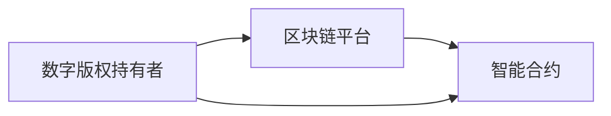
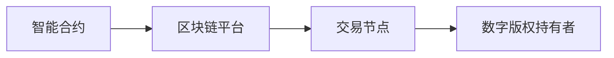
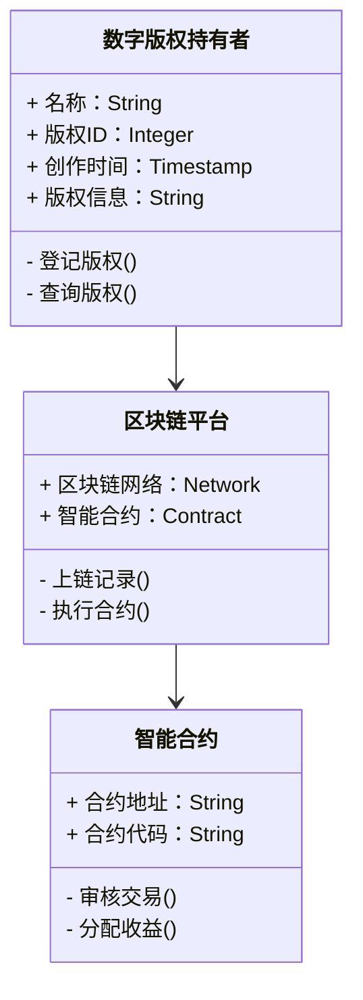
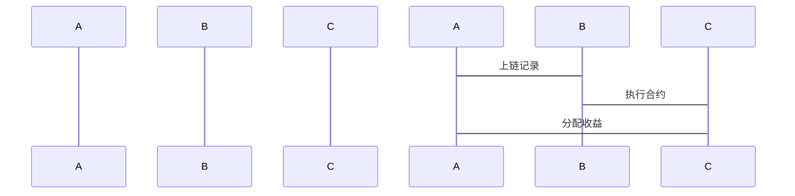

                 


# 如何评估企业的区块链数字版权交易平台

> **关键词**：区块链、数字版权、智能合约、共识机制、分布式系统、版权交易  
> **摘要**：本文详细探讨如何评估企业级区块链数字版权交易平台，涵盖平台背景、核心概念、算法原理、系统架构、项目实战及最佳实践等方面，帮助读者全面理解并掌握评估方法。

---

## 第1章：区块链数字版权交易平台的背景与核心概念

### 1.1 数字版权的基本概念

#### 1.1.1 数字版权的定义
数字版权指的是数字内容（如音乐、视频、软件、文学作品等）的所有者对其作品享有的法律权利。数字版权的核心在于保护创作者的权益，防止未经授权的复制、分发和修改。

#### 1.1.2 数字版权的保护需求
在数字时代，数字内容易于复制和传播，传统的版权保护手段（如法律手段）往往难以应对快速变化的互联网环境。因此，需要一种更高效、更安全的技术手段来保护数字版权。

#### 1.1.3 区块链技术在数字版权保护中的作用
区块链技术通过去中心化、不可篡改和可追溯的特性，为数字版权保护提供了新的解决方案。区块链可以记录数字内容的创作、分发和使用过程，确保版权信息的真实性和不可篡改性。

---

### 1.2 区块链技术的核心特点

#### 1.2.1 区块链的基本原理
区块链是一种分布式账本技术，通过去中心化的节点网络记录数据，并通过共识机制确保数据的一致性和安全性。区块链的核心在于去中心化、不可篡改和可追溯。

#### 1.2.2 区块链的去中心化特性
去中心化意味着没有单个中心机构控制整个系统。数据分布在多个节点上，通过点对点网络进行通信和数据同步。这种特性使得区块链具有抗审查性和抗单点故障的特性。

#### 1.2.3 区块链的安全性和不可篡改性
区块链的安全性依赖于密码学技术和共识机制。每个区块通过哈希指针连接，确保数据无法被篡改。同时，共识机制（如PoW、PoS）确保所有节点达成一致，防止恶意节点的攻击。

---

### 1.3 区块链数字版权交易平台的定义

#### 1.3.1 平台的定义与功能
区块链数字版权交易平台是一个基于区块链技术的平台，用于数字内容的版权登记、交易和分发。平台的主要功能包括：
- 版权登记：将数字内容的元数据（如作者、创作时间、版权信息）记录在区块链上。
- 交易审核：通过智能合约自动审核交易的合法性和合规性。
- 权益分配：根据交易记录自动分配收益。

#### 1.3.2 平台的核心目标
区块链数字版权交易平台的核心目标是：
- 提供一个安全、透明、高效的数字版权交易环境。
- 确保数字内容的版权信息不可篡改，防止盗版和侵权行为。
- 实现版权的自动分发和收益分配。

#### 1.3.3 平台的边界与外延
平台的边界包括：
- 数字内容的创作者、买家和卖家。
- 区块链节点和智能合约的执行环境。
- 第三方服务（如法律机构、支付平台）。

平台的外延包括：
- 数字内容的分发渠道（如应用商店、流媒体平台）。
- 版权保护的法律框架和政策支持。

---

### 1.4 本章小结

- 本章主要介绍了数字版权的基本概念和区块链技术的核心特点，强调了区块链在数字版权保护中的重要性。
- 下一章将详细分析区块链数字版权交易平台的核心概念与联系，包括实体关系图（ER图）和区块链技术的数学模型。

---

## 第2章：区块链数字版权交易平台的核心概念与联系

### 2.1 核心概念的定义与属性对比

#### 2.1.1 数字版权持有者
数字版权持有者是拥有数字内容版权的个人或组织。他们可以通过区块链平台将自己的内容上链，确保版权信息的透明性和不可篡改性。

#### 2.1.2 区块链平台
区块链平台是数字版权交易的核心基础设施。它通过分布式账本记录交易信息，并通过智能合约自动执行交易逻辑。

#### 2.1.3 智能合约
智能合约是区块链平台上的自动执行程序，用于定义和执行交易规则。它可以在区块链上自动审核交易的合法性和合规性，并自动分配收益。

---

### 2.2 实体关系图（ER图）



解释：
- 数字版权持有者（A）通过区块链平台（B）进行版权登记和交易。
- 区块链平台（B）通过智能合约（C）执行交易逻辑和自动分配收益。
- 智能合约（C）与数字版权持有者（A）直接交互，确保交易的透明性和公平性。

---

### 2.3 本章小结

- 本章通过实体关系图展示了区块链数字版权交易平台的核心概念及其之间的关系。
- 下一章将详细讲解区块链数字版权交易平台的算法原理，包括共识机制和智能合约的工作原理。

---

## 第3章：区块链数字版权交易平台的算法原理

### 3.1 区块链共识机制

#### 3.1.1 共识机制的定义
共识机制是区块链系统中用于确保所有节点达成一致的算法。它通过某种规则，确保所有节点对区块链上的数据达成一致。

#### 3.1.2 常见共识算法（如PoW、PoS）

##### 工作量证明（PoW）
工作量证明是一种通过计算特定数学问题来证明计算有效性的机制。在比特币中，矿工通过解决哈希难题来生成新区块，并获得奖励。

##### 股权证明（PoS）
股权证明是一种基于节点持有的代币数量来决定记账权的机制。与PoW不同，PoS不依赖于计算能力，而是依赖于节点持有的代币数量。

#### 3.1.3 共识机制在数字版权中的应用
共识机制确保区块链上的数据一致性，防止恶意节点的攻击。在数字版权交易中，共识机制可以确保交易的透明性和不可篡改性。

---

### 3.2 智能合约的工作原理

#### 3.2.1 智能合约的定义
智能合约是区块链上的自动执行程序，用于定义和执行交易规则。它可以根据预设的条件自动触发相应的操作。

#### 3.2.2 智能合约的执行流程



解释：
- 智能合约（A）通过区块链平台（B）与交易节点（C）交互。
- 交易节点（C）通过智能合约与数字版权持有者（D）交互，确保交易的透明性和公平性。

#### 3.2.3 智能合约的数学模型

智能合约的执行过程可以用状态机模型表示：

$$
\text{状态转换} = \{s' \mid s' = f(s, input)\}
$$

其中：
- $s$ 是当前状态。
- $f$ 是状态转换函数。
- $input$ 是输入参数。

---

### 3.3 本章小结

- 本章详细讲解了区块链共识机制和智能合约的工作原理，重点分析了PoW和PoS两种共识算法。
- 下一章将从系统分析与架构设计的角度，详细探讨区块链数字版权交易平台的实现方案。

---

## 第4章：区块链数字版权交易平台的系统分析与架构设计

### 4.1 问题场景介绍

数字版权交易平台的常见问题包括：
- 版权信息的透明性和不可篡改性。
- 交易的安全性和效率。
- 收益分配的公平性和透明性。

---

### 4.2 系统功能设计

#### 4.2.1 领域模型（Mermaid类图）



---

#### 4.2.2 系统架构设计（Mermaid架构图）

```mermaid
context 区块链数字版权交易平台 {
    participant 数字版权持有者
    participant 区块链平台
    participant 智能合约
    数字版权持有者 -> 区块链平台: 上链记录
    区块链平台 -> 智能合约: 执行合约
    智能合约 -> 数字版权持有者: 分配收益
}
```

---

### 4.3 接口设计与交互流程

#### 4.3.1 接口设计

1. 登记版权接口：
   - 请求参数：版权信息（如名称、版权ID、创作时间）。
   - 返回结果：版权上链确认。

2. 交易审核接口：
   - 请求参数：交易信息（如交易金额、交易时间）。
   - 返回结果：交易审核确认。

3. 收益分配接口：
   - 请求参数：收益信息（如收益金额、收益时间）。
   - 返回结果：收益分配确认。

---

#### 4.3.2 交互流程（Mermaid序列图）



---

### 4.4 本章小结

- 本章详细分析了区块链数字版权交易平台的系统功能设计和架构设计。
- 下一章将从项目实战的角度，详细讲解如何实现一个区块链数字版权交易平台。

---

## 第5章：区块链数字版权交易平台的项目实战

### 5.1 环境安装

1. 安装以太坊钱包（如MetaMask）。
2. 安装Solidity编译器（用于编写智能合约）。
3. 安装以太坊区块链框架（如Ethereum、Fantom）。

---

### 5.2 系统核心实现

#### 5.2.1 智能合约实现（Solidity代码）

```solidity
// SPDX-License-Identifier: MIT
pragma solidity ^0.8.0;

contract CopyrightTransaction {
    // 版权信息
    struct Copyright {
        address owner;
        uint256 copyrightId;
        string name;
        uint256 timestamp;
    }

    // 事件：版权登记
    event CopyrightRegistered(address indexed owner, uint256 copyrightId, string name);

    // 事件：交易审核
    event TransactionReviewed(address indexed buyer, address indexed seller, uint256 amount);

    // 事件：收益分配
    event RoyaltyDistributed(address indexed receiver, uint256 amount);

    // 函数：登记版权
    function registerCopyright(address owner, uint256 copyrightId, string memory name) public {
        emit CopyrightRegistered(owner, copyrightId, name);
    }

    // 函数：审核交易
    function reviewTransaction(address buyer, address seller, uint256 amount) public {
        emit TransactionReviewed(buyer, seller, amount);
    }

    // 函数：分配收益
    function distributeRoyalty(address receiver, uint256 amount) public {
        emit RoyaltyDistributed(receiver, amount);
    }
}
```

---

#### 5.2.2 平台核心代码实现（Python）

```python
from web3 import Web3
import json

# 连接到以太坊节点
w3 = Web3(Web3.HTTPProvider("http://localhost:8545"))

# 加载智能合约ABI
with open("contract_abi.json") as f:
    contract_abi = json.load(f)

# 获取智能合约实例
contract_address = "0xYourContractAddress"
contract = w3.eth.contract(address=contract_address, abi=contract_abi)

# 登记版权
def register_copyright(owner, copyright_id, name):
    tx_hash = contract.functions.registerCopyright(owner, copyright_id, name).transact()
    receipt = w3.eth.waitForTransactionReceipt(tx_hash)
    return receipt

# 审核交易
def review_transaction(buyer, seller, amount):
    tx_hash = contract.functions.reviewTransaction(buyer, seller, amount).transact()
    receipt = w3.eth.waitForTransactionReceipt(tx_hash)
    return receipt

# 分配收益
def distribute_royalty(receiver, amount):
    tx_hash = contract.functions.distributeRoyalty(receiver, amount).transact()
    receipt = w3.eth.waitForTransactionReceipt(tx_hash)
    return receipt
```

---

### 5.3 实际案例分析

假设我们有一个数字音乐版权交易平台：
1. 创作者通过平台登记音乐版权。
2. 用户购买音乐版权，平台通过智能合约自动审核交易。
3. 平台根据交易记录自动分配收益。

---

### 5.4 本章小结

- 本章通过实际案例分析，详细讲解了如何使用Solidity和Python代码实现区块链数字版权交易平台的核心功能。
- 下一章将总结最佳实践，给出评估和优化的建议。

---

## 第6章：区块链数字版权交易平台的最佳实践

### 6.1 评估关键点

1. **安全性**：确保智能合约和区块链平台的安全性，防止漏洞攻击。
2. **效率**：优化共识机制和智能合约的执行效率，确保平台的高并发处理能力。
3. **可扩展性**：设计灵活的架构，适应未来业务的扩展需求。

---

### 6.2 最佳实践

1. **智能合约审计**：定期对智能合约进行安全审计，确保没有漏洞。
2. **性能优化**：通过优化共识机制和智能合约代码，提升平台的处理能力。
3. **合规性**：确保平台符合相关法律法规，避免法律风险。

---

### 6.3 注意事项

- **用户隐私**：保护用户的隐私数据，避免数据泄露。
- **用户体验**：设计友好的用户界面，提升用户体验。
- **技术支持**：提供技术支持和服务，确保平台的稳定运行。

---

### 6.4 拓展阅读

1. 《区块链开发实战》
2. 《智能合约与以太坊编程》
3. 《数字版权保护技术研究》

---

## 第7章：总结与展望

### 7.1 本章总结

本文详细探讨了如何评估企业的区块链数字版权交易平台，涵盖了平台的背景、核心概念、算法原理、系统架构、项目实战及最佳实践等方面。

### 7.2 未来展望

随着区块链技术的不断发展，数字版权交易平台将更加智能化和高效化。未来的研究方向包括：
- 更高效的共识机制。
- 更智能的智能合约设计。
- 更完善的数字版权保护体系。

---

## 作者：AI天才研究院/AI Genius Institute & 禅与计算机程序设计艺术 /Zen And The Art of Computer Programming

---

**全文完**

