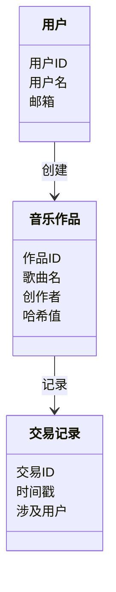
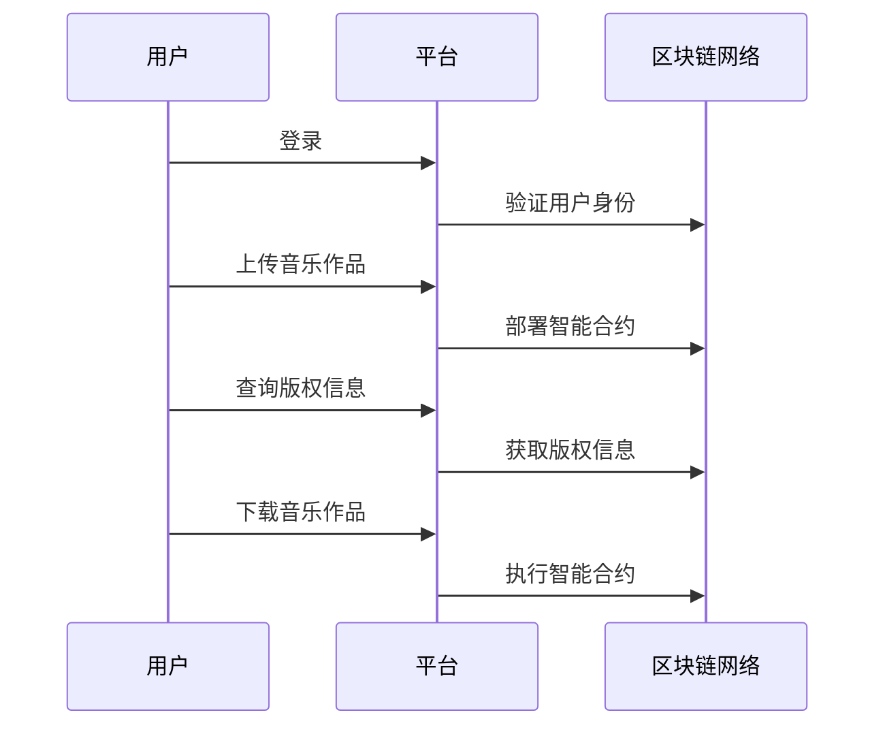

                 


# 如何评估企业的区块链数字版权保护平台

## 关键词：区块链，数字版权保护，智能合约，去中心化，版权管理

## 摘要：区块链技术在数字版权保护中的应用越来越广泛。本文将详细讲解如何评估企业的区块链数字版权保护平台，包括平台的核心功能、技术架构、安全性、合规性、用户体验、成本效益以及未来发展等方面。通过分析，读者可以全面了解如何选择和优化适合自己的区块链数字版权保护平台。

---

# 第一部分：区块链数字版权保护平台概述

## 第1章：区块链数字版权保护平台背景介绍

### 1.1 数字版权保护的现状与挑战

#### 1.1.1 数字版权保护的核心问题

数字版权保护的核心问题是确保创作者的知识产权不被侵权，同时保障合法用户能够方便地使用数字内容。传统的数字版权保护方式依赖于法律手段和技术手段的结合，但存在以下痛点：

1. **侵权行为难以追踪**：数字内容易于复制和传播，侵权行为难以追踪和证明。
2. **确权困难**：创作者的版权归属难以快速确认，尤其是在跨国或跨平台的情况下。
3. **信任缺失**：用户和创作者之间的信任缺失，导致交易成本增加。

区块链技术通过去中心化、不可篡改和可追溯的特性，为解决这些问题提供了新的可能性。

#### 1.1.2 当前数字版权保护的主要痛点

1. **中心化平台的不透明性**：传统的数字内容平台通常由中心化机构管理，创作者和用户对内容的使用和分发缺乏透明度。
2. **版权分发效率低下**：版权分发过程中，创作者和用户之间的交易往往需要通过中间商，导致效率低下且成本高昂。
3. **侵权行为难以追责**：由于数字内容易于复制，侵权行为难以追踪和追责。

#### 1.1.3 区块链技术如何解决数字版权问题

区块链技术通过以下方式解决数字版权问题：

1. **去中心化记录**：区块链可以提供一个去中心化的记录系统，确保版权信息不可篡改，且可追溯。
2. **智能合约**：通过智能合约自动执行版权授权和收益分配，减少中间环节。
3. **可追溯性**：区块链记录的每一条数据都带有时间戳，便于追踪侵权行为。

### 1.2 区块链技术的核心概念

#### 1.2.1 区块链的基本原理

区块链是一种分布式账本技术，由多个区块通过链式结构连接而成。每个区块包含一组交易数据，通过哈希值连接前后区块，确保数据不可篡改。

#### 1.2.2 区块链的去中心化特性

去中心化是区块链的核心特性之一。通过去中心化的网络结构，区块链能够避免单点故障，提高系统的可靠性和安全性。

#### 1.2.3 智能合约在数字版权中的应用

智能合约是区块链上的自动化程序，能够在满足特定条件时自动执行操作。在数字版权保护中，智能合约可以用于自动执行版权授权、收益分配等操作。

### 1.3 区块链数字版权保护的边界与外延

#### 1.3.1 数字版权保护的边界

数字版权保护的边界包括：

1. **内容类型**：适用于数字内容，如文本、图片、视频、音乐等。
2. **版权类型**：适用于著作权、商标权、专利权等。
3. **保护范围**：包括版权登记、侵权监测、收益分配等。

#### 1.3.2 区块链技术的外延应用

区块链技术在数字版权保护之外，还可以应用于供应链管理、金融支付、医疗数据共享等领域。

#### 1.3.3 平台的法律与伦理问题

区块链数字版权保护平台需要遵守相关法律法规，并确保数据隐私和用户权益。此外，还需要考虑平台的透明性和公正性，避免滥用技术。

---

## 第2章：区块链数字版权保护平台的核心概念与联系

### 2.1 核心概念原理

#### 2.1.1 区块链的分布式账本

分布式账本是区块链的核心数据结构，由多个节点共同维护，确保数据的完整性和一致性。

#### 2.1.2 区块链的去中心化特性

去中心化意味着区块链系统没有单一的控制中心，数据由多个节点共同维护，避免单点故障。

#### 2.1.3 智能合约在数字版权中的应用

智能合约可以用于自动执行版权授权、收益分配等操作，减少人为干预。

### 2.2 核心概念属性特征对比表格

| 特性       | 区块链技术          | 数字版权保护       |
|------------|--------------------|-------------------|
| 去中心化   | 是                 | 是                |
| 可追溯性   | 是                 | 是                |
| 不可篡改性  | 是                 | 是                |
| 自动执行   | 是                 | 是                |

### 2.3 ER实体关系图架构

```mermaid
erDiagram
    user {
        id
        name
    }
    content {
        id
        title
        hash
    }
    transaction {
        id
        timestamp
    }
    user --> content: 创建
    content --> transaction: 记录
```

---

## 第3章：区块链数字版权保护平台的算法原理

### 3.1 共识机制

#### 3.1.1 工作量证明（PoW）

工作量证明是一种通过计算哈希值来验证区块的算法，常见于比特币等区块链系统。

#### 3.1.2 权益证明（PoS）

权益证明是一种通过持有代币数量来决定验证区块的算法，相比PoW更加节能。

#### 3.1.3 拜占庭容错（BFT）

BFT是一种适用于联盟链的共识算法，通过投票机制达成共识。

### 3.2 智能合约

#### 3.2.1 智能合约的执行流程

智能合约的执行流程包括编译、部署、调用和触发等步骤。

#### 3.2.2 智能合约的编写与部署

智能合约通常使用Solidity等编程语言编写，并部署在区块链网络上。

#### 3.2.3 智能合约的安全性问题

智能合约的安全性问题包括代码漏洞、逻辑错误等，需要通过代码审计和测试来发现和修复。

### 3.3 哈希函数

#### 3.3.1 哈希函数的基本原理

哈希函数将输入数据映射为固定长度的哈希值，确保数据的唯一性和完整性。

#### 3.3.2 常见哈希函数

常见哈希函数包括MD5、SHA-256等。

---

## 第4章：区块链数字版权保护平台的系统分析与架构设计

### 4.1 问题场景介绍

假设我们有一个数字音乐版权保护平台，需要通过区块链技术实现音乐版权的登记、确权、授权和收益分配。

### 4.2 项目介绍

平台名称：音乐版权保护平台  
目标：保护音乐创作者的版权，实现音乐的合法分发和收益分配。

### 4.3 系统功能设计

#### 4.3.1 领域模型



#### 4.3.2 系统架构设计

```mermaid
rectangle 区块链网络 {
    用户节点
    区块链节点
    智能合约
}
rectangle 用户界面 {
    登录
    注册
    作品上传
    收益查询
}
```

#### 4.3.3 系统接口设计

系统接口包括用户注册、登录、作品上传、版权查询、收益分配等功能。

#### 4.3.4 系统交互设计



---

## 第5章：区块链数字版权保护平台的项目实战

### 5.1 环境安装

#### 5.1.1 安装以太坊环境

```bash
# 安装以太坊
curl -o- https://raw.githubusercontent.com/nate SOFTWARE/eth-node.sh | bash
```

#### 5.1.2 安装Solidity

```bash
npm install -g solidity
```

### 5.2 核心代码实现

#### 5.2.1 智能合约实现

```solidity
// SPDX-License-Identifier: MIT
pragma solidity ^0.8.0;

contract MusicCopyright {
    event CopyrightCreated(address indexed creator, string title, uint256 timestamp);

    function createCopyright(string memory title, address creator) public {
        emit CopyrightCreated(creator, title, block.timestamp);
    }
}
```

#### 5.2.2 后端实现

```python
from web3 import Web3

# 初始化以太坊节点
w3 = Web3(Web3.HTTPProvider('http://localhost:8545'))

# 智能合约地址
contract_address = '0x123456789abc'

# 调用createCopyright函数
contract = w3.eth.contract(contract_address, abi=abi)
tx = contract.functions.createCopyright('Sample Song', w3.eth.defaultAccount).transact()
```

### 5.3 实际案例分析

假设一个音乐创作者上传了一首歌曲到平台，通过智能合约记录版权信息。当用户下载这首歌曲时，智能合约自动执行，创作者获得收益。

### 5.4 项目小结

通过实际案例，我们可以看到区块链数字版权保护平台的强大功能和实际应用场景。

---

## 第6章：区块链数字版权保护平台的最佳实践

### 6.1 评估要点

1. **技术架构**：平台的技术架构是否合理，是否支持高并发和大流量。
2. **安全性**：平台的安全性如何，是否容易受到攻击。
3. **合规性**：平台是否符合相关法律法规。
4. **用户体验**：平台是否用户友好，操作是否简单。

### 6.2 注意事项

1. **技术选型**：选择适合的区块链技术和框架。
2. **团队能力**：确保团队具备区块链开发和运维能力。
3. **法律合规**：确保平台符合相关法律法规。

### 6.3 拓展阅读

1. **《区块链：分布式应用的设计与实现》**
2. **《智能合约开发指南》**
3. **《数字版权保护的法律与技术》**

---

## 作者：AI天才研究院/AI Genius Institute & 禅与计算机程序设计艺术/Zen And The Art of Computer Programming

---

通过以上步骤，我们可以全面评估企业的区块链数字版权保护平台，确保其技术先进、功能完善、安全可靠，能够满足企业的实际需求。

