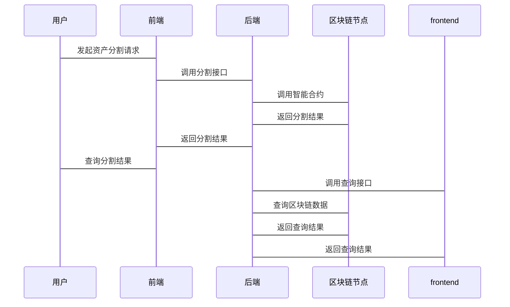

                 


# 如何评估企业的区块链数字资产分割平台

**关键词：** 区块链、数字资产、智能合约、共识算法、系统架构、安全性

**摘要：**  
随着区块链技术的快速发展，数字资产分割平台在企业中的应用越来越广泛。本文将从技术原理、系统架构、算法实现等多个维度，详细讲解如何评估企业的区块链数字资产分割平台。通过分析核心概念、应用场景、算法原理和系统设计，本文为读者提供一套全面的评估框架，帮助企业在实际应用中选择和优化适合的数字资产分割平台。

---

# 第一部分：区块链数字资产分割平台的背景与概念

## 第1章：区块链数字资产分割平台概述

### 1.1 区块链数字资产分割平台的定义与背景

区块链技术作为一种分布式账本技术，近年来在金融、供应链、数字资产管理等领域得到了广泛应用。数字资产的分割是指将一个数字资产（如代币、股权、积分等）按照一定规则分配给多个参与者。区块链技术的去中心化、不可篡改和透明性特点，使其成为实现数字资产分割的理想选择。

**区块链数字资产分割平台的核心目标：**  
- 提供安全、透明的数字资产分割机制。  
- 确保分割过程的公平性和可追溯性。  
- 支持多种应用场景，如股权分配、收益分成、积分分配等。

### 1.2 区块链数字资产分割平台的应用场景

区块链数字资产分割平台的应用场景非常广泛，以下是一些典型场景：

1. **企业内部股权分配：**  
   - 公司内部员工持股计划可以通过区块链平台实现股权的分割和管理。  
2. **供应链金融：**  
   - 通过区块链平台将应收账款分割为多个部分，实现供应链上下游企业的资金流转。  
3. **数字版权分配：**  
   - 作者可以通过区块链平台将版权分割给多个合作伙伴，确保权益分配的透明性和公平性。  
4. **积分与奖励分配：**  
   - 企业可以通过区块链平台将积分或奖励分割给多个用户，确保分配的公平性和透明性。

### 1.3 区块链数字资产分割平台的核心目标

1. **提高效率：**  
   - 通过自动化和智能化的分割流程，减少人为干预，提高分割效率。  
2. **确保安全性：**  
   - 利用区块链的去中心化和不可篡改特性，确保分割过程的安全性和数据的完整性。  
3. **实现透明性：**  
   - 分割过程和结果可以通过区块链浏览器进行查询，确保透明性。

---

# 第二部分：区块链数字资产分割平台的核心概念与技术原理

## 第2章：区块链技术的核心原理

### 2.1 区块链的基本结构与工作原理

区块链是一种分布式账本技术，由多个区块通过链式结构连接而成。每个区块包含以下内容：

1. **区块头：**  
   - 包含时间戳、前一区块的哈希值、随机数等信息。  
2. **交易数据：**  
   - 区块中记录的所有交易信息。  
3. **默克尔树根哈希：**  
   - 用于验证区块中所有交易数据的完整性。

区块链的工作流程如下：

1. **交易生成：**  
   - 用户发起交易请求，交易信息被广播到网络中。  
2. **区块验证：**  
   - 网络中的节点对交易进行验证，确保交易的合法性和有效性。  
3. **共识机制：**  
   - 根据共识算法（如PoW、PoS、BFT等）确定哪个节点有权将区块添加到链中。  
4. **区块添加：**  
   - 被选中的节点将区块添加到区块链中，形成新的链头。

### 2.2 智能合约的原理与实现

智能合约是一种运行在区块链上的自动执行程序，用于实现特定的业务逻辑。以下是智能合约的核心原理：

1. **智能合约的编译与部署：**  
   - 智能合约通常使用Solidity等编程语言编写，编译后部署到区块链网络中。  
2. **智能合约的执行流程：**  
   - 当触发条件满足时，智能合约自动执行预设的逻辑，如资产转移、权益分配等。  
3. **智能合约的存储与调用：**  
   - 智能合约的代码和状态存储在区块链中，其他节点可以通过调用智能合约的接口与之交互。

### 2.3 区块链数字资产的发行与转移

1. **数字资产的发行：**  
   - 发行方通过智能合约将数字资产发行到区块链网络中，记录资产的发行信息。  
2. **数字资产的转移：**  
   - 用户通过智能合约发起资产转移请求，区块链网络验证后完成资产转移。

---

# 第三部分：区块链数字资产分割平台的算法原理

## 第3章：共识算法与数字资产分割

### 3.1 共识算法的分类与选择

共识算法是区块链的核心机制，用于确保所有节点对链上数据的一致性。以下是几种常见的共识算法：

1. **工作量证明（PoW）：**  
   - 通过计算哈希值来竞争记账权，适用于比特币等公链。  
2. **权益证明（PoS）：**  
   - 根据节点持有的代币数量来分配记账权，适用于以太坊2.0等公链。  
3. **拜占庭容错（BFT）：**  
   - 通过投票机制达成共识，适用于联盟链场景。

在选择共识算法时，需要考虑以下因素：  
- 网络规模：大规模网络适合BFT，小规模网络适合PoW。  
- 安全性：PoW的安全性较高，但需要大量计算资源。  
- 延展性：BFT适合联盟链，适合企业内部的应用场景。

### 3.2 数字资产分割的算法实现

1. **数字资产分割的数学模型：**  
   - 分割算法需要满足公平性和可追溯性，可以通过数学模型确保分割的合理性。  
   - 例如，将一个资产分割为多个部分，每部分对应一个权重或比例。

2. **分割算法的流程图：**  
   - 用户发起分割请求，智能合约接收并验证请求。  
   - 验证通过后，智能合约根据预设的规则分配资产。  
   - 分割结果记录在区块链中，可供查询和追溯。

3. **分割算法的代码实现：**  
   - 使用Solidity编写智能合约，实现资产分割逻辑。  
   - 例如，以下代码片段展示了简单的资产分割逻辑：

```solidity
function splitAssets(address payable[] memory recipients, uint256[] memory amounts) public {
    for (uint256 i = 0; i < recipients.length; i++) {
        require(amounts[i] > 0, "Amount must be positive");
        _transfer(recipients[i], amounts[i]);
    }
}
```

### 3.3 算法的性能优化与安全性提升

1. **算法复杂度分析：**  
   - 分割算法的时间复杂度取决于参与节点的数量和交易的规模。  
   - 优化算法复杂度可以通过并行计算和分片技术实现。

2. **安全性提升：**  
   - 通过多重签名和权限控制确保智能合约的安全性。  
   - 定期进行安全审计和漏洞修复。

---

# 第四部分：区块链数字资产分割平台的系统分析与架构设计

## 第4章：系统分析与架构设计

### 4.1 问题场景介绍

在企业内部，数字资产分割平台需要解决以下问题：  
- 如何确保分割过程的公平性和透明性？  
- 如何实现资产的快速分割和转移？  
- 如何保证系统的安全性和可扩展性？

### 4.2 系统功能设计

1. **用户管理：**  
   - 管理用户权限，支持多角色（如管理员、普通用户）。  
2. **资产发行：**  
   - 支持多种数字资产的发行，记录发行信息。  
3. **资产分割：**  
   - 提供分割规则配置，支持多种分割方式（按比例、按人数等）。  
4. **资产转移：**  
   - 支持资产的转移和流转，记录转移历史。  
5. **监控与审计：**  
   - 实时监控系统状态，支持审计和追溯。

### 4.3 系统架构设计

1. **前端架构：**  
   - 提供用户友好的界面，支持资产分割的发起和查询。  
2. **后端架构：**  
   - 实现业务逻辑，与区块链节点进行交互。  
3. **区块链节点：**  
   - 部署多个节点，确保系统的去中心化和安全性。  
4. **数据库：**  
   - 存储用户信息、资产信息和交易记录。

### 4.4 接口设计

1. **API接口：**  
   - 提供RESTful API，支持资产分割、转移、查询等操作。  
2. **智能合约接口：**  
   - 提供智能合约的调用接口，实现资产的自动分配。

### 4.5 交互流程图

以下是一个简单的交互流程图：



---

# 第五部分：区块链数字资产分割平台的项目实战

## 第5章：项目实战

### 5.1 环境安装

1. **安装以太坊环境：**  
   - 安装Geth或其他以太坊客户端。  
2. **安装Solidity编译器：**  
   - 安装Node.js和Solidity编译器。  
3. **安装前端框架：**  
   - 使用React或Vue.js搭建前端界面。

### 5.2 核心实现

1. **智能合约实现：**  
   - 使用Solidity编写资产分割逻辑，部署到以太坊网络中。  
2. **后端实现：**  
   - 使用Node.js或其他语言编写API接口，与区块链节点交互。

### 5.3 代码应用解读

以下是一个简单的智能合约代码片段：

```solidity
pragma solidity ^0.8.0;

contract AssetSplitter {
    function split(address[] memory recipients, uint256[] memory amounts) public {
        for (uint256 i = 0; i < recipients.length; i++) {
            require(amounts[i] > 0, "Amount must be positive");
            payable(recipients[i]).transfer(amounts[i]);
        }
    }
}
```

### 5.4 实际案例分析

假设一家企业需要将100个代币分割给5个员工，每个员工分配20个代币。智能合约的实现如下：

1. **发起分割请求：**  
   - 用户调用`split`函数，传入员工地址和分配数量。  
2. **智能合约执行：**  
   - 合约根据传入的地址和数量，依次进行代币转移。  
3. **记录分割结果：**  
   - 分割结果记录在区块链中，可供查询和审计。

### 5.5 项目总结

通过实际案例分析，可以看出区块链数字资产分割平台的优势：  
- 分割过程自动化，减少人为干预。  
- 分割结果透明可追溯，确保公平性。  
- 系统安全性高，降低资产丢失风险。

---

# 第六部分：最佳实践与小结

## 第6章：最佳实践与小结

### 6.1 最佳实践

1. **选择合适的共识算法：**  
   - 根据应用场景选择适合的共识算法，平衡安全性与效率。  
2. **确保智能合约的安全性：**  
   - 定期进行智能合约的安全审计，避免漏洞。  
3. **优化系统架构：**  
   - 通过分片技术提升系统的可扩展性。  
4. **注重合规性：**  
   - 确保平台符合相关法律法规，避免法律风险。

### 6.2 小结

区块链数字资产分割平台的评估需要从技术、安全、效率等多个维度进行综合考量。通过选择合适的共识算法、优化系统架构、确保智能合约的安全性，可以有效提升平台的性能和安全性。同时，实际应用中需要注重合规性，确保平台的合法性和可持续性。

---

# 作者：AI天才研究院/AI Genius Institute & 禅与计算机程序设计艺术 /Zen And The Art of Computer Programming

---

**感谢您的阅读！**  
如果文章对您有所帮助，请点赞、收藏并转发，您的支持是我们创作的最大动力！

