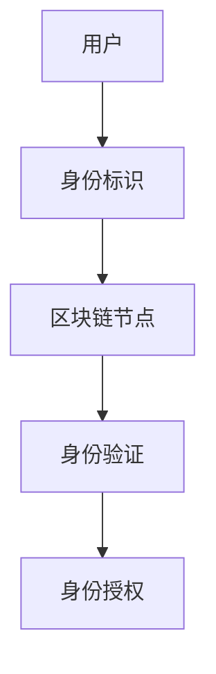
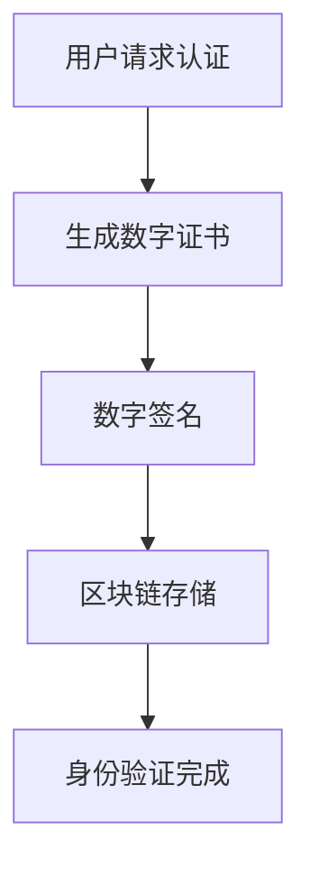
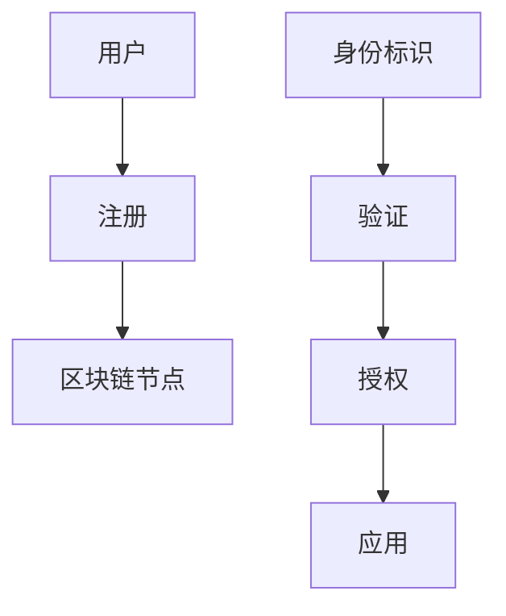
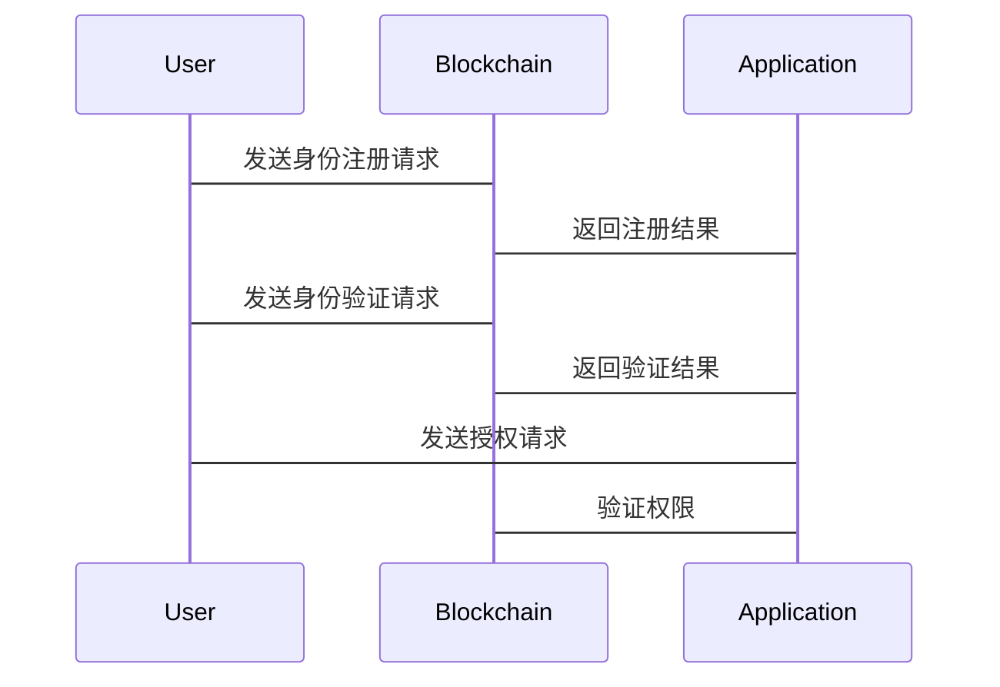

                 


# 如何评估企业的区块链数字身份认证应用

> 关键词：区块链，数字身份认证，身份验证，去中心化，共识机制，安全性

> 摘要：本文详细探讨了如何评估企业区块链数字身份认证应用的核心要素，包括数字身份认证的基本概念、区块链技术的基本原理、区块链数字身份认证的结合方式及其优势，以及具体的算法原理、系统架构设计和项目实战。文章通过理论与实践相结合的方式，帮助读者全面理解并正确评估企业区块链数字身份认证应用的可行性与效果。

---

## 第一部分: 区块链数字身份认证应用概述

### 第1章: 区块链与数字身份认证的背景介绍

#### 1.1 数字身份认证的定义与重要性
- 1.1.1 数字身份认证的核心概念  
  数字身份认证是指通过数字技术验证用户身份的过程，确保用户身份的唯一性和真实性。  
- 1.1.2 数字身份认证在企业中的应用场景  
  包括企业内部员工登录、客户身份验证、第三方服务访问控制等。  
- 1.1.3 区块链技术如何解决数字身份认证的问题  
  区块链的去中心化特性可以避免传统中心化身份认证的单点故障问题，提高安全性与隐私保护能力。

#### 1.2 区块链技术的基本原理
- 1.2.1 区块链的定义与特点  
  区块链是一种分布式账本技术，具有去中心化、不可篡改、可追溯等特点。  
- 1.2.2 区块链的共识机制  
  包括工作量证明（PoW）、权益证明（PoS）、拜占庭容错（BFT）等。  
- 1.2.3 区块链的安全性与去中心化特性  
  通过加密算法和分布式网络结构，确保数据的安全性和抗 tamper 性。

#### 1.3 区块链数字身份认证的结合与优势
- 1.3.1 区块链与数字身份认证的结合方式  
  区块链可以作为数字身份认证的底层技术，提供身份标识、存储和验证功能。  
- 1.3.2 区块链数字身份认证的优势  
  包括高安全性、去中心化、可追溯性等。  
- 1.3.3 区块链数字身份认证的潜在应用领域  
  包括金融、医疗、教育、政府服务等领域。

#### 1.4 本章小结  
  本章介绍了数字身份认证的基本概念、区块链技术的基本原理以及两者的结合方式和优势，为后续内容打下基础。

---

## 第二部分: 区块链数字身份认证的核心概念与联系

### 第2章: 区块链数字身份认证的核心概念与联系

#### 2.1 数字身份认证的核心要素
- 2.1.1 身份标识  
  用户在系统中的唯一标识，可以是用户名、邮箱或公钥等。  
- 2.1.2 身份验证  
  通过密码、生物特征等方式验证用户身份的真实性。  
- 2.1.3 身份授权  
  根据用户身份授予相应的访问权限。

#### 2.2 区块链技术在数字身份认证中的应用
- 2.2.1 区块链的去中心化特性  
  消除中心化机构的依赖，降低数据被篡改的风险。  
- 2.2.2 区块链的不可篡改性  
  通过区块链式结构和加密算法确保数据不可篡改。  
- 2.2.3 区块链的隐私保护  
  使用零知识证明等技术保护用户隐私。

#### 2.3 数字身份认证与区块链的实体关系图


#### 2.4 本章小结  
  本章详细探讨了数字身份认证的核心要素和区块链技术的应用特点，通过实体关系图展示了二者的结合方式。

---

## 第三部分: 区块链数字身份认证的算法原理

### 第3章: 区块链数字身份认证的算法原理

#### 3.1 共识机制的原理
- 3.1.1 工作量证明机制（PoW）  
  通过计算哈希值来证明计算工作量，确保网络安全。  
- 3.1.2 权益证明机制（PoS）  
  根据持有代币的数量分配记账权，降低能源消耗。  
- 3.1.3 拜占庭容错（BFT）  
  通过投票机制达成共识，适用于低延迟网络环境。

#### 3.2 区块链数字身份认证的实现流程


#### 3.3 数字签名算法的实现
```python
def generate_signature(message, private_key):
    # 使用 SHA-256 哈希函数生成签名
    import hashlib
    hash_object = hashlib.sha256(message.encode()).hexdigest()
    # 简单的签名算法示例，实际应用中需要使用加密算法
    return hash_object + private_key
```

#### 3.4 数学模型与公式
- 3.4.1 哈希函数  
$$ H(m) = \text{hash}(m) $$  
- 3.4.2 数字签名  
$$ S = \text{Sign}(K_{\text{priv}}, H(m)) $$  
- 3.4.3 验证签名  
$$ \text{Verify}(K_{\text{pub}}, H(m), S) = \text{True} $$  

#### 3.5 本章小结  
  本章通过算法流程图和代码示例，详细解释了区块链数字身份认证的实现原理和数学模型。

---

## 第四部分: 区块链数字身份认证的系统分析与架构设计

### 第4章: 区块链数字身份认证的系统分析与架构设计

#### 4.1 问题场景介绍
- 4.1.1 企业身份认证的痛点  
  包括数据泄露风险高、身份信息孤岛、第三方认证依赖性强等问题。  
- 4.1.2 区块链技术的应用需求  
  提高身份认证的安全性、去中心化和可扩展性。

#### 4.2 系统功能设计
- 4.2.1 用户身份注册  
  用户通过区块链生成数字证书并完成注册。  
- 4.2.2 用户身份验证  
  通过数字签名和区块链验证用户身份。  
- 4.2.3 用户权限管理  
  根据身份信息授予相应的访问权限。

#### 4.3 系统架构设计


#### 4.4 系统接口设计
- 4.4.1 注册接口  
  `POST /api/register`  
- 4.4.2 验证接口  
  `POST /api/verify`  
- 4.4.3 授权接口  
  `POST /api/authorize`  

#### 4.5 系统交互设计


#### 4.6 本章小结  
  本章通过系统功能设计和架构图，展示了区块链数字身份认证系统的整体架构和交互流程。

---

## 第五部分: 区块链数字身份认证的项目实战

### 第5章: 区块链数字身份认证的项目实战

#### 5.1 环境安装
- 5.1.1 安装区块链框架  
  例如以太坊、Hyperledger Fabric 等。  
- 5.1.2 安装开发工具  
  包括 IDE、命令行工具和调试器。  

#### 5.2 核心代码实现
```python
def register_identity(name, password):
    # 用户注册身份
    private_key = generate_private_key()
    public_key = generate_public_key(private_key)
    identity = {
        "name": name,
        "public_key": public_key
    }
    return register_blockchain(identity)
```

#### 5.3 案例分析
- 5.3.1 案例背景  
  某企业需要实现员工身份认证系统。  
- 5.3.2 实施过程  
  包括需求分析、系统设计、开发实现和测试优化。  
- 5.3.3 实施结果  
  成功实现安全、高效的员工身份认证系统。

#### 5.4 项目总结
- 5.4.1 项目目标的实现情况  
  成功实现了基于区块链的数字身份认证系统。  
- 5.4.2 项目中的挑战与解决方案  
  包括技术难点、资源限制和团队协作问题。  
- 5.4.3 项目经验总结  
  包括技术选型、开发流程和文档管理等方面的建议。

#### 5.5 本章小结  
  本章通过实际项目案例，展示了区块链数字身份认证系统的开发过程和实施经验。

---

## 第六部分: 区块链数字身份认证的最佳实践与注意事项

### 第6章: 区块链数字身份认证的最佳实践

#### 6.1 选择合适的区块链框架
- 6.1.1 根据需求选择适合的区块链框架  
  包括公有链、私有链和联盟链的选择。  
- 6.1.2 评估框架的性能和安全性  
  包括交易吞吐量、共识机制和安全性等指标。  

#### 6.2 数据隐私保护
- 6.2.1 使用零知识证明保护隐私  
  例如通过零知识证明实现隐私保护。  
- 6.2.2 数据加密存储  
  通过加密算法保护用户数据的安全性。  

#### 6.3 安全性与合规性
- 6.3.1 确保系统的安全性  
  包括防止恶意攻击、漏洞利用和数据泄露。  
- 6.3.2 确保系统的合规性  
  遵守相关法律法规，例如 GDPR、《网络安全法》等。  

#### 6.4 可扩展性与可维护性
- 6.4.1 设计可扩展的系统架构  
  包括模块化设计和微服务架构。  
- 6.4.2 确保系统的可维护性  
  包括日志记录、监控和备份恢复机制。  

#### 6.5 本章小结  
  本章总结了区块链数字身份认证系统在实际应用中的最佳实践，包括技术选型、数据隐私保护、系统安全性与合规性等方面。

---

## 第七部分: 总结与展望

### 第7章: 总结与展望

#### 7.1 本项目的核心总结
- 7.1.1 项目目标的实现  
  成功开发并部署了基于区块链的数字身份认证系统。  
- 7.1.2 关键技术的应用  
  包括区块链技术、数字签名算法和共识机制的实现。  

#### 7.2 项目实施的经验与教训
- 7.2.1 成功经验  
  包括团队协作、技术选型和项目管理等方面。  
- 7.2.2 教训与改进措施  
  包括需求变更、技术难点和资源限制等方面的总结。  

#### 7.3 未来的发展方向
- 7.3.1 技术发展  
  包括更高效共识机制、隐私保护技术的改进等。  
- 7.3.2 应用场景拓展  
  包括更多行业的应用，例如医疗、教育、政府服务等领域。  

#### 7.4 本章小结  
  本章总结了项目的整体实施情况，提出了未来的发展方向和改进措施。

---

## 作者：AI天才研究院/AI Genius Institute & 禅与计算机程序设计艺术/Zen And The Art of Computer Programming

---

通过以上目录大纲，您可以根据需要逐步展开每章内容，结合实际案例和详细的技术实现，撰写一篇完整的、有深度的、技术博客文章。

