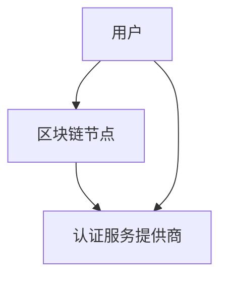
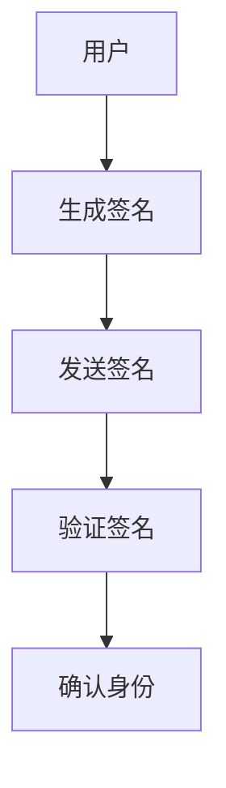
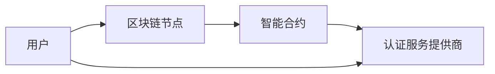
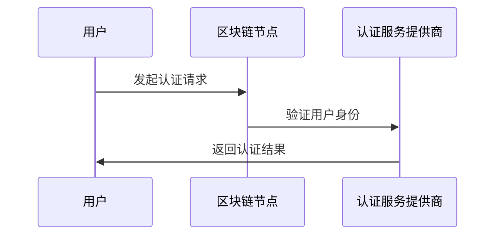

                 


# 如何评估企业的区块链数字身份跨平台认证应用

---

## 关键词

- 区块链技术
- 数字身份管理
- 跨平台认证
- 去中心化身份识别
- 分布式账本技术

---

## 摘要

在数字身份管理日益重要的今天，区块链技术为实现跨平台身份认证提供了新的解决方案。本文将从背景、技术原理、系统架构到实际案例，详细讲解如何评估企业的区块链数字身份跨平台认证应用。通过分析核心概念、算法原理、系统设计和项目实战，本文为读者提供从理论到实践的全面指导。

---

## 目录

1. 背景介绍
2. 核心概念与联系
3. 算法原理讲解
4. 系统分析与架构设计
5. 项目实战
6. 最佳实践
7. 总结

---

## 第一部分：背景介绍

### 第1章：区块链数字身份跨平台认证概述

#### 1.1 问题背景

- **1.1.1 数字身份管理的现状与挑战**
  - 当前数字身份管理存在数据孤岛、安全性差、效率低等问题。
  - 传统中心化身份认证系统面临信任缺失和数据泄露风险。

- **1.1.2 区块链技术在身份认证中的作用**
  - 区块链的去中心化特性解决了数据信任问题。
  - 提供了高效、安全的数字身份管理解决方案。

- **1.1.3 跨平台认证的必要性与痛点**
  - 跨平台认证需求日益增长，但现有方案难以满足互操作性。
  - 需要统一标准和协议以实现无缝认证。

#### 1.2 问题描述

- **1.2.1 数字身份认证的多平台兼容性问题**
  - 不同平台间的认证机制不兼容，导致用户重复注册和认证。
  - 增加了用户的使用成本和企业的运营负担。

- **1.2.2 数据孤岛与信任机制的缺失**
  - 各平台之间缺乏信任机制，数据难以共享。
  - 导致身份认证效率低下，用户体验差。

- **1.2.3 当前认证方式的安全性与效率问题**
  - 中心化认证方式易受攻击，数据泄露风险高。
  - 效率低下，难以满足高并发场景的需求。

#### 1.3 问题解决

- **1.3.1 区块链技术如何实现去中心化身份认证**
  - 利用区块链的分布式账本技术，实现去中心化的身份管理。
  - 通过智能合约确保数据的安全性和不可篡改性。

- **1.3.2 跨平台认证的实现方式**
  - 使用区块链作为信任基础，构建跨平台的认证机制。
  - 制定统一的标准和协议，实现不同平台间的身份互认。

- **1.3.3 数字身份的互操作性与可扩展性**
  - 通过互操作性协议，实现不同系统间的无缝对接。
  - 系统架构设计具备可扩展性，适应未来业务需求。

#### 1.4 边界与外延

- **1.4.1 区块链数字身份的边界**
  - 仅限于数字身份的管理，不涉及其他业务逻辑。
  - 边界清晰，确保系统的模块化和可维护性。

- **1.4.2 跨平台认证的适用范围**
  - 适用于多个平台间的身份认证，尤其适用于分布式系统。
  - 适用于需要高安全性和互操作性的场景。

- **1.4.3 相关技术的对比与选择**
  - 对比传统认证方式和区块链认证方式的优缺点。
  - 根据具体需求选择合适的技术方案。

#### 1.5 概念结构

- **核心要素组成**
  - 用户身份：用户在区块链上的唯一标识和权限信息。
  - 区块链节点：分布式账本的存储和验证节点。
  - 认证服务提供商：提供跨平台认证服务的机构。

---

## 第二部分：核心概念与联系

### 第2章：核心概念与联系

#### 2.1 核心概念原理

- **去中心化身份识别**
  - 用户拥有自己的身份私钥，通过区块链进行身份验证。
  - 消除了中心化机构的信任风险。

- **分布式账本技术**
  - 每个区块链节点都存储完整的账本副本。
  - 通过共识机制确保账本的一致性和可靠性。

- **跨平台认证机制**
  - 使用区块链作为信任基础，实现不同平台间的身份互认。
  - 通过智能合约实现跨平台的认证流程自动化。

#### 2.2 概念属性特征对比

| 概念                | 特征                          |
|---------------------|------------------------------|
| 去中心化身份识别    | 用户拥有私钥，无需依赖中心机构 |
| 分布式账本技术      | 多节点存储，去中心化          |
| 跨平台认证机制      | 支持多平台身份互认            |

#### 2.3 实体关系图



---

## 第三部分：算法原理讲解

### 第3章：算法原理讲解

#### 3.1 算法原理

- **零知识证明**
  - 用户在不透露私钥的情况下证明身份。
  - 使用zk-SNARKs等技术实现零知识验证。

- **椭圆曲线加密**
  - 基于椭圆曲线的公钥加密技术。
  - 实现身份验证和数据签名。

#### 3.2 算法流程



#### 3.3 代码实现

```python
import hashlib

def elliptic_curve_sign(private_key, message):
    # 使用椭圆曲线加密算法生成签名
    # 简化的示例代码
    hash_msg = hashlib.sha256(message.encode()).hexdigest()
    return hash_msg[-16:]  # 模拟签名
```

#### 3.4 数学模型

椭圆曲线加密的数学基础：

$$ y^2 = x^3 + ax + b \mod p $$

其中，\( p \) 是大质数，\( a \) 和 \( b \) 是曲线参数。

---

## 第四部分：系统分析与架构设计

### 第4章：系统分析与架构设计

#### 4.1 系统功能设计

- **用户身份管理**
  - 用户注册、登录、权限管理。
- **权限管理**
  - 基于角色的访问控制（RBAC）。
- **跨平台认证接口**
  - 提供RESTful API接口，支持外部平台调用。

#### 4.2 系统架构设计



#### 4.3 接口设计

- **RESTful API**
  - `/api/authenticate`：用户认证接口。
  - `/api/register`：用户注册接口。

#### 4.4 系统交互流程



---

## 第五部分：项目实战

### 第5章：项目实战

#### 5.1 环境安装

- 安装必要的区块链框架、数据库和开发工具。

#### 5.2 核心代码实现

```python
# 区块链节点代码示例
class BlockchainNode:
    def __init__(self):
        self.chain = []
        self.transactions = []
    
    def add_transaction(self, transaction):
        self.transactions.append(transaction)
    
    def mine(self):
        # 简化挖矿过程
        self.chain.append({
            'index': len(self.chain) + 1,
            'timestamp': time.time(),
            'transactions': self.transactions
        })
        self.transactions = []
```

#### 5.3 实际案例分析

- 案例：评估一个企业的跨平台认证系统。
- 分析系统的安全性、性能和可扩展性。

---

## 第六部分：最佳实践

### 第6章：最佳实践

#### 6.1 总结

- 本文详细讲解了区块链数字身份跨平台认证的评估方法。
- 从背景到实践，提供了全面的技术指导。

#### 6.2 注意事项

- 选择合适的区块链框架和协议。
- 确保系统的安全性，防止攻击。
- 定期维护和更新系统，适应业务需求。

#### 6.3 拓展阅读

- 推荐书籍：《区块链：分布式应用设计与实现》
- 推荐资源：区块链技术社区和论坛。

---

## 结语

区块链数字身份跨平台认证应用的评估是一个复杂而重要的任务。通过本文的指导，读者可以系统地评估和优化企业的区块链数字身份认证系统。未来，随着技术的发展，区块链在数字身份管理中的应用将更加广泛和深入。

---

## 作者

作者：AI天才研究院/AI Genius Institute & 禅与计算机程序设计艺术 /Zen And The Art of Computer Programming

