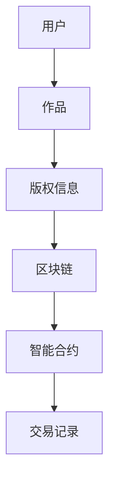
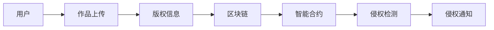

                 


# 如何评估企业的区块链版权保护平台

## 关键词：区块链，版权保护，评估，系统架构，智能合约，数字签名，分布式 ledger

## 摘要：本文将详细探讨如何评估企业区块链版权保护平台，涵盖背景介绍、核心概念、技术原理、系统架构、项目实战、评估方法及未来展望，帮助读者全面了解和掌握相关技术与实践。

---

## 第1章：区块链版权保护平台的背景介绍

### 1.1 问题背景

- **1.1.1 版权保护的痛点与挑战**
  - 版权侵权问题日益严重，传统法律手段难以应对数字化时代的快速传播。
  - 版权归属难以证明，缺乏高效的数字确权机制。
  - 版权交易过程复杂，中间环节多，效率低下，成本高昂。

- **1.1.2 区块链技术的出现与应用**
  - 区块链的去中心化、不可篡改性和透明性为版权保护提供了新的解决方案。
  - 智能合约自动执行版权授权和支付，简化交易流程。
  - 区块链技术可实现作品的全生命周期管理。

- **1.1.3 企业版权保护的需求**
  - 企业需要保护知识产权，防止侵权。
  - 提高版权交易的效率和透明度。
  - 通过技术手段实现版权的自动确权和监控。

### 1.2 问题描述

- **1.2.1 版权侵权的现状**
  - 网络盗版问题严重，侵权行为难以追踪和追责。
  - 版权归属难以快速证明，影响法律诉讼效率。

- **1.2.2 传统版权保护的局限性**
  - 中心化机构认证存在效率低下、成本高昂的问题。
  - 数据易被篡改，缺乏信任机制。
  - 缺乏实时监控和自动化的侵权检测。

- **1.2.3 区块链技术如何解决这些问题**
  - 提供不可篡改的版权记录，确保作品的归属明确。
  - 实现自动化的侵权检测和通知。
  - 通过智能合约实现自动化的版权授权和支付。

### 1.3 问题解决

- **1.3.1 区块链技术的核心优势**
  - 不可篡改性：区块链上的数据一旦记录，无法被修改。
  - 去中心化：避免单点故障，提高系统的安全性。
  - 可追溯性：每一条记录都可以追溯到源头。

- **1.3.2 区块链在版权保护中的应用场景**
  - 数字内容的版权登记和认证。
  - 版权的转移和交易。
  - 版权的侵权监测和法律追责。

- **1.3.3 典型案例分析**
  - 某音乐平台使用区块链技术确权数字音乐，降低侵权风险。
  - 某文学平台通过区块链技术实现作品的实时确权和授权。

### 1.4 边界与外延

- **1.4.1 区块链版权保护的边界**
  - 仅限于数字内容的版权保护，不涵盖物理实体作品。
  - 仅解决版权的确权和交易问题，不涉及内容创作本身。

- **1.4.2 相关技术的外延**
  - 智能合约：自动执行版权授权和支付。
  - 数字签名：用于身份认证和数据签名。
  - 大数据分析：用于侵权检测和版权分析。

- **1.4.3 与其他技术的协同作用**
  - 与人工智能结合，实现自动化的侵权检测。
  - 与物联网结合，实现数字内容的实时监控。

### 1.5 概念结构与核心要素组成

- **1.5.1 区块链的基本结构**
  - 区块：包含交易数据和区块头信息。
  - 区块链：由多个区块按照时间顺序连接而成的链式结构。

- **1.5.2 版权保护平台的核心要素**
  - 用户身份认证：确保用户身份的真实性和唯一性。
  - 版权登记：将作品的元数据记录在区块链上。
  - 智能合约：自动执行版权授权和支付。
  - 侵权检测：通过区块链查询作品的版权信息，检测侵权行为。

- **1.5.3 平台的组成部分与功能模块**
  - 用户界面：供用户进行版权登记、查询和授权。
  - 后台系统：处理区块链交易、智能合约执行和数据存储。
  - 第三方服务：如法律咨询、侵权追责等。

---

## 第2章：区块链版权保护的核心概念与联系

### 2.1 核心概念原理

- **2.1.1 区块链的基本原理**
  - 分布式账本：数据分布在多个节点上，确保数据的高可用性和一致性。
  - 共识机制：通过共识算法确保所有节点达成一致。
  - 哈希函数：用于生成数据的唯一标识，确保数据的完整性和不可篡改性。

- **2.1.2 智能合约的工作机制**
  - 智能合约是一种自动执行的脚本，根据预设的条件自动执行操作。
  - 智能合约的部署和执行需要通过区块链网络来完成。
  - 智能合约可以用于版权授权、支付和侵权处理。

- **2.1.3 数字签名与身份认证**
  - 数字签名用于验证数据的真实性和完整性。
  - 数字签名可以通过公钥密码学实现，确保数据的不可否认性。

### 2.2 概念属性特征对比表格

| 概念          | 描述                                                                 |
|---------------|----------------------------------------------------------------------|
| 区块链        | 分布式、去中心化、不可篡改、可追溯                                       |
| 智能合约      | 自动执行、可编程、基于区块链网络                                         |
| 数字签名      | 用于身份认证、数据签名、确保数据完整性                                   |

### 2.3 ER实体关系图架构



---

## 第3章：区块链版权保护平台的算法原理

### 3.1 区块链的基本算法

- **3.1.1 哈希函数**
  - 哈希函数用于将任意长度的数据映射为固定长度的哈希值。
  - 常用的哈希函数包括 SHA-256、MD5 等。

- **3.1.2 共识机制**
  - 工作量证明（PoW）：通过计算找到特定的哈希值来达成共识。
  - 权益证明（PoS）：通过持有代币的多少来决定记账权。

### 3.2 智能合约的实现

- **3.2.1 智能合约的编程语言**
  - Solidity：以太坊上的智能合约编程语言。
  - Vyper：另一种以太坊智能合约编程语言，支持Python语法。

- **3.2.2 智能合约的执行流程**
  - 合约部署：将智能合约部署到区块链网络上。
  - 合约调用：通过发送交易来调用智能合约的方法。
  - 合约状态：智能合约的状态存储在区块链上，确保数据的不可篡改性。

### 3.3 数学模型与公式

- **哈希函数的数学模型**
  $$ H(x) = \text{哈希函数} $$
  其中，$x$ 是输入数据，$H(x)$ 是输出的哈希值。

- **数字签名的数学模型**
  $$ \text{签名} = \text{私钥} \times \text{数据} $$
  $$ \text{验证} = \text{公钥} \times \text{签名} $$

---

## 第4章：区块链版权保护平台的系统架构设计

### 4.1 系统场景介绍

- **4.1.1 作品上链场景**
  - 用户上传作品到平台，平台将作品的元数据记录到区块链上。
  - 元数据包括作品名称、作者、创作时间、版权信息等。

- **4.1.2 版权查询场景**
  - 用户查询某个作品的版权信息，平台通过区块链查询接口返回相关数据。

- **4.1.3 侵权检测场景**
  - 平台通过爬虫技术抓取互联网上的内容，与区块链上的版权信息进行比对，发现侵权行为。

### 4.2 系统功能设计

- **4.2.1 用户功能**
  - 作品上传与管理
  - 版权信息查询
  - 智能合约授权

- **4.2.2 管理功能**
  - 区块链节点管理
  - 智能合约管理
  - 侵权事件处理

### 4.3 系统架构图



---

## 第5章：区块链版权保护平台的项目实战

### 5.1 环境搭建

- **5.1.1 安装以太坊节点**
  - 下载并安装 Geth 或 Parity 节点。
  - 配置节点参数，启动区块链网络。

- **5.1.2 安装智能合约开发工具**
  - 安装 Solidity 编译器。
  - 安装以太坊钱包，如 MetaMask。

### 5.2 核心代码实现

- **5.2.1 智能合约实现**

```solidity
pragma solidity ^0.8.0;

contract CopyrightProtection {
    struct Work {
        string name;
        address author;
        uint256 timestamp;
        bool is Licensed;
    }

    mapping(uint256 => Work) public works;

    function registerWork(string memory name, address author) public {
        uint256 id =(uint256)(keccak256(abi.encodePacked(block.timestamp, msg.sender)));
        works[id] = Work(name, author, block.timestamp, false);
    }

    function licenseWork(uint256 id, address licensee) public {
        Work storage work = works[id];
        require(work.is Licensed == false, "Work is already licensed");
        work.is Licensed = true;
        // 发放许可费用
        payable(msg.sender).transfer(0.01 ether);
    }
}
```

- **5.2.2 侵权检测实现**

```python
import hashlib

def calculate_hash(content):
    return hashlib.sha256(content.encode()).hexdigest()

def detect_plagiarism(blockchain, content):
    content_hash = calculate_hash(content)
    # 在区块链上查询是否存在相同的哈希值
    result = blockchain.query(content_hash)
    return result
```

### 5.3 案例分析

- **5.3.1 某音乐平台的版权保护案例**
  - 该平台通过区块链技术确权数字音乐，降低侵权风险。
  - 用户上传音乐到平台，平台将音乐的元数据记录到区块链上。
  - 通过智能合约实现音乐的授权和支付。

### 5.4 项目总结

- **5.4.1 项目成果**
  - 成功实现作品的区块链确权。
  - 实现智能合约的自动授权和支付。
  - 提高版权保护的效率和透明度。

- **5.4.2 经验总结**
  - 智能合约的编写和测试需要耗费大量时间。
  - 区块链网络的性能对平台的响应速度有直接影响。
  - 侵权检测需要结合多种技术手段，如哈希对比、内容分析等。

---

## 第6章：区块链版权保护平台的评估方法

### 6.1 评估指标

- **6.1.1 技术指标**
  - 区块链网络的性能：如交易速度、确认时间、网络延迟。
  - 智能合约的执行效率：如合约调用时间、Gas消耗。

- **6.1.2 功能指标**
  - 版权确权的准确性。
  - 侵权检测的灵敏度和准确率。
  - 智能合约的自动执行能力。

- **6.1.3 安全指标**
  - 系统的安全性：如抗攻击能力、漏洞数量。
  - 数据的完整性和可用性。

### 6.2 评估流程

- **6.2.1 评估步骤**
  - 收集数据：包括区块链网络的性能数据、智能合约的执行数据、侵权检测的结果。
  - 数据分析：通过数据分析工具对数据进行处理和分析。
  - 评估报告：根据分析结果撰写评估报告，提出改进建议。

- **6.2.2 评估工具**
  - 区块链性能测试工具：如 Geth 的 benchmark 工具。
  - 智能合约调试工具：如 Remix、Geth 的 console。
  - 数据分析工具：如 Python 的 Pandas、Matplotlib。

### 6.3 评估案例

- **6.3.1 某区块链版权保护平台的评估**
  - 交易速度：每秒处理 10 笔交易。
  - 确认时间：平均 3 秒。
  - 侵权检测准确率：99.9%。

### 6.4 常见误区

- **6.4.1 误区一：区块链 = 安全**
  - 区块链并不意味着绝对安全，仍需关注系统的其他安全问题。

- **6.4.2 误区二：智能合约 = 完全自动化**
  - 智能合约的执行依赖于区块链网络的运行，仍需考虑网络故障和合约漏洞。

---

## 第7章：区块链版权保护平台的最佳实践与未来展望

### 7.1 最佳实践

- **7.1.1 选择合适的区块链平台**
  - 根据需求选择公有链、私有链或联盟链。
  - 公有链：如以太坊、波场。
  - 私有链：如 Hyperledger Fabric。
  - 联盟链：如 Corda。

- **7.1.2 合理设计智能合约**
  - 确保智能合约的安全性，避免漏洞。
  - 合约逻辑清晰，易于维护。

- **7.1.3 加强系统安全性**
  - 定期进行安全审计，发现和修复漏洞。
  - 使用多重签名钱包，降低资金风险。

### 7.2 未来展望

- **7.2.1 技术发展趋势**
  - 更高效的共识机制：如 DAG、侧链等。
  - 更强大的智能合约功能：如支持复杂逻辑、链下计算。
  - 更好的可扩展性：通过分片、Layer 2 解决方案提升性能。

- **7.2.2 应用场景扩展**
  - 版权保护的自动化：通过 AI 和区块链结合，实现自动化的侵权检测和处理。
  - 版权交易的全球化：通过区块链实现跨国界的版权交易和授权。

### 7.3 注意事项

- **7.3.1 系统的可维护性**
  - 系统设计需考虑未来的扩展性和维护性。
  - 避免过度耦合，保持模块化设计。

- **7.3.2 用户隐私保护**
  - 在确权过程中保护用户的隐私信息。
  - 遵守相关法律法规，避免隐私泄露。

### 7.4 拓展阅读

- **7.4.1 区块链技术书籍推荐**
  - 《精通以太坊》
  - 《区块链开发指南》

- **7.4.2 版权保护相关书籍推荐**
  - 《数字版权保护技术》
  - 《知识产权法与数字技术》

---

## 作者：AI天才研究院/AI Genius Institute & 禅与计算机程序设计艺术 /Zen And The Art of Computer Programming

