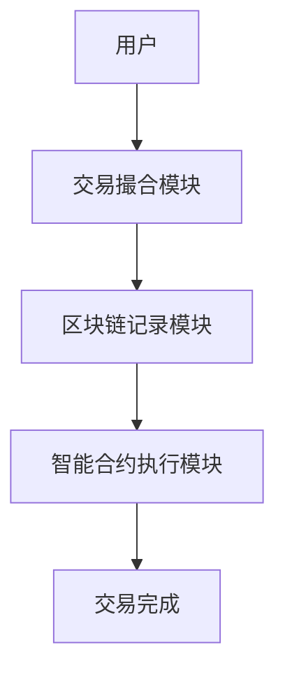

                 


# 如何评估企业的区块链能源交易平台

## 关键词：区块链、能源交易、交易平台、评估指标、技术实现、安全性、去中心化

## 摘要：  
本文将从技术实现、业务逻辑、系统架构和安全性等角度，系统性地分析和评估企业区块链能源交易平台的关键要素。通过详细阐述区块链技术的核心原理、能源交易平台的系统构成、算法实现和安全性设计，本文旨在为企业搭建和优化区块链能源交易平台提供全面的评估框架和实践指导。  

---

## 第一章：区块链能源交易平台的背景与核心概念

### 1.1 区块链能源交易平台的背景  
#### 1.1.1 区块链技术的发展与应用  
区块链技术自2008年比特币白皮书发布以来，逐步从数字货币领域扩展到供应链管理、金融支付、医疗健康等多个领域。在能源领域，区块链技术的应用主要集中在能源交易、能源计量和能源管理等方面。  

#### 1.1.2 能源交易的现状与痛点  
传统的能源交易模式存在以下问题：  
- 交易流程复杂，涉及多方协调，效率低。  
- 信息孤岛问题严重，数据不透明，难以信任。  
- 中心化机构的存在增加了交易成本和潜在的单点故障风险。  

#### 1.1.3 区块链在能源交易中的潜力  
区块链技术通过去中心化、不可篡改和透明性等特性，可以有效解决传统能源交易中的痛点，提升交易效率、降低信任成本并增强数据安全性。  

---

### 1.2 区块链能源交易平台的定义与问题描述  
#### 1.2.1 区块链能源交易平台的定义  
区块链能源交易平台是以区块链技术为基础，支持能源产品（如电能、天然气等）的在线交易和结算的数字化平台。平台通过智能合约实现自动化的交易流程和资金结算，同时通过区块链的去中心化特性确保数据的安全性和透明性。  

#### 1.2.2 问题背景分析  
- 如何确保交易数据的完整性和不可篡改性？  
- 如何实现多方参与者之间的信任机制？  
- 如何设计高效的共识机制以支持高频交易？  

#### 1.2.3 问题解决的必要性  
通过区块链技术，可以实现能源交易的透明化、自动化和去中心化，降低交易成本并提升系统安全性。  

---

## 第二章：区块链能源交易平台的核心概念与联系

### 2.1 区块链技术的核心原理  
区块链是一种去中心化的分布式账本技术，具有以下核心特征：  
- 分布式存储：数据分散存储在网络中的多个节点上。  
- 哈希指针：通过哈希值连接数据块，确保数据完整性。  
- 共识机制：通过特定算法（如PoW、PoS）达成全网一致的状态。  
- 智能合约：自动执行的代码脚本，用于实现复杂的业务逻辑。  

#### 2.1.1 区块链的核心数据结构  
- 数据块：包含交易数据、区块头、哈希指针等。  
- 链式结构：每个数据块都包含前一数据块的哈希值，形成一条链式结构。  

#### 2.1.2 区块链的共识机制  
- 工作量证明（PoW）：通过计算哈希值来证明工作量。  
- 权益证明（PoS）：根据持有的代币数量来决定记账权。  
- 拜占庭容错（BFT）：通过投票机制达成共识。  

---

### 2.2 区块链能源交易平台的系统构成  
#### 2.2.1 交易主体与角色  
- 用户：参与能源交易的个体或企业。  
- 交易机构：负责撮合交易的平台方。  
- 供电公司：提供能源资源的供应商。  
- 监管机构：负责平台的合规性和安全性监管。  

#### 2.2.2 交易流程与数据流  
1. 用户发起交易请求。  
2. 交易机构验证交易信息。  
3. 区块链网络记录交易数据并达成共识。  
4. 智能合约自动执行交易并完成资金结算。  
5. 监管机构监控交易过程并记录数据。  

#### 2.2.3 交易系统的功能模块  
- 用户身份认证模块：确保用户身份的真实性。  
- 交易撮合模块：匹配买卖双方的需求。  
- 区块链记录模块：记录交易数据并生成区块。  
- 智能合约执行模块：自动执行交易并完成资金结算。  

---

## 第三章：区块链能源交易平台的算法原理与数学模型

### 3.1 区块链共识机制的算法原理  
共识机制是区块链的核心算法之一。以下是工作量证明（PoW）的简要流程：  
1. 每个节点尝试计算一个满足特定条件的哈希值。  
2. 第一个找到解的节点向全网广播该区块。  
3. 其他节点验证该区块的有效性。  
4. 若有效，则该节点获得记账权并生成新块。  

#### 3.1.1 工作量证明（PoW）的数学模型  
$$ \text{哈希计算} = f(\text{区块头} + \text{随机数}) $$  
其中，$f$ 是哈希函数，$\text{区块头}$ 是区块头部数据，$\text{随机数}$ 是节点尝试的随机数。  

---

### 3.2 智能合约的数学模型与流程  
智能合约是一种基于区块链的自动执行程序，其核心逻辑可以用状态机模型表示。  

#### 3.2.1 智能合约的执行流程  
1. 用户触发合约执行。  
2. 合约状态机根据输入参数进行状态转换。  
3. 合约根据预设逻辑输出结果。  

#### 3.2.2 智能合约的数学模型  
$$ \text{智能合约} = \{ (P, C, E) \} $$  
其中：  
- $P$ 是智能合约的参与者。  
- $C$ 是智能合约的条件。  
- $E$ 是智能合约的执行结果。  

---

## 第四章：区块链能源交易平台的系统分析与架构设计

### 4.1 项目背景与目标  
本项目旨在搭建一个基于区块链的能源交易平台，实现能源资源的在线交易、结算和监管。  

### 4.2 系统功能设计  
#### 4.2.1 用户功能模块  
- 用户注册与登录：通过身份认证模块实现。  
- 交易信息发布：用户发布买卖需求。  
- 交易历史查询：查询历史交易记录。  

#### 4.2.2 交易撮合模块  
- 需求匹配：根据用户的买卖需求进行撮合。  
- 交易确认：双方确认交易后生成交易订单。  

#### 4.2.3 区块链记录模块  
- 区块生成：将交易数据打包成区块。  
- 共识达成：通过共识机制确认区块的有效性。  

#### 4.2.4 智能合约执行模块  
- 合约部署：将智能合约部署到区块链网络。  
- 合约执行：根据交易结果自动执行资金结算。  

### 4.3 系统架构设计  
#### 4.3.1 系统架构图  


#### 4.3.2 关键模块实现  
- 用户身份认证：通过加密算法确保用户身份的安全性。  
- 交易撮合：基于智能合约实现自动匹配。  
- 区块链记录：通过共识机制确保数据的不可篡改性。  

---

## 第五章：区块链能源交易平台的项目实战

### 5.1 环境安装与配置  
- 安装区块链框架（如Ethereum、FISCO）  
- 配置智能合约开发环境（如Solidity、Web3.js）  

### 5.2 核心代码实现  
#### 5.2.1 智能合约实现  
```solidity
// SPDX-License-Identifier: MIT
pragma solidity ^0.8.0;

contract EnergyTransaction {
    function tradeEnergy(address buyer, address seller, uint amount) public {
        // 模拟交易逻辑
        require(buyer != seller, "交易双方不能为同一人");
        // 资金划转逻辑
        payable(seller).transfer(amount);
    }
}
```

#### 5.2.2 交易撮合实现  
```javascript
const Web3 = require('web3');
const web3 = new Web3('http://localhost:8545');

async function matchTransaction(buyer, seller, amount) {
    const contract = new web3.eth.Contract(ABI, contractAddress);
    const tx = contract.methods.tradeEnergy(buyer, seller, amount).encodeABI();
    const signedTx = await web3.eth.accounts.signTransaction({ data: tx }, '0x123...');
    const receipt = await web3.eth.sendSignedTransaction(signedTx.rawTransaction);
    return receipt;
}
```

### 5.3 案例分析与实现  
- 案例：某用户购买100度电，通过智能合约自动完成交易和资金结算。  

---

## 第六章：总结与展望

### 6.1 评估的关键点  
- 技术实现：区块链框架选择、共识机制设计。  
- 业务逻辑：交易流程优化、智能合约实现。  
- 系统架构：模块划分、接口设计、系统交互。  
- 安全性：数据加密、权限管理、抗攻击能力。  

### 6.2 最佳实践与注意事项  
- 选择合适的区块链框架，结合项目需求进行优化。  
- 确保智能合约的安全性，避免逻辑漏洞。  
- 定期进行系统压力测试，确保高并发场景下的稳定性。  

### 6.3 拓展阅读  
- 区块链技术入门与应用  
- 智能合约开发指南  
- 区域链技术与能源互联网  

---

## 作者：AI天才研究院/AI Genius Institute & 禅与计算机程序设计艺术 /Zen And The Art of Computer Programming

