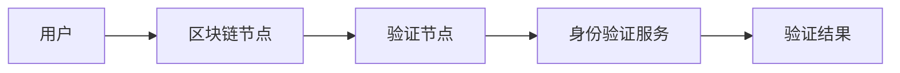
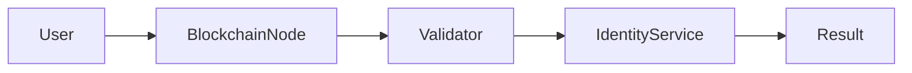

                 


# 如何评估企业的区块链身份验证应用

## 关键词：
区块链、身份验证、安全性、评估标准、企业应用、系统架构、数学模型

## 摘要：
区块链身份验证应用在企业中的安全性、效率和可扩展性是关键评估因素。本文详细探讨了区块链身份验证的核心原理、评估方法论、系统架构设计及实际案例分析，帮助读者全面理解并有效评估企业级区块链身份验证应用。

---

# 第一部分: 区块链身份验证应用概述

## 第1章: 区块链与身份验证的背景介绍

### 1.1 区块链技术的基本概念

#### 1.1.1 区块链的定义与核心特点
区块链是一种分布式账本技术，通过去中心化、不可篡改和可追溯的特性确保数据的安全性。其核心特点包括：
- **去中心化**：数据不依赖于单个中心节点，而是分布在网络的各个节点上。
- **不可篡改**：通过加密算法和共识机制确保数据的一致性和完整性。
- **可追溯**：每个交易都有唯一的标识符和时间戳，便于追踪。

#### 1.1.2 区块链的类型与应用场景
区块链主要有公链、私链和联盟链三种类型：
- **公链**（如比特币、以太坊）：面向公众，任何人都可以参与。
- **私链**：仅限于特定组织内部使用。
- **联盟链**：由多个机构共同维护，适用于特定行业。

区块链在身份验证中的应用场景包括：
- 身份信息管理
- 访问控制
- 跨机构身份共享

#### 1.1.3 区块链在身份验证中的优势
区块链技术在身份验证中的优势主要体现在：
- **安全性**：通过加密和共识机制防止数据篡改。
- **去中心化**：减少单点故障，提高系统的抗攻击能力。
- **透明性**：所有交易记录在区块链上，确保透明可追溯。

### 1.2 身份验证的基本原理

#### 1.2.1 身份验证的定义与分类
身份验证是指通过验证用户身份信息来确认其身份的过程。常见的身份验证方法包括：
- **知识验证**：基于用户知道的信息，如密码。
- **拥有物验证**：基于用户拥有的物品，如智能卡或手机。
- **生物特征验证**：基于用户的生物特征，如指纹或面部识别。

#### 1.2.2 常见的身份验证方法
- **密码验证**：最常用的验证方法，但安全性较低，容易被破解。
- **多因素认证（MFA）**：结合多种验证方法，提高安全性。
- **OAuth 2.0**：基于令牌的验证协议，广泛应用于Web应用。

#### 1.2.3 身份验证的安全性与可靠性
身份验证的安全性取决于以下几个因素：
- **加密算法**：如AES、RSA等，用于保护敏感信息。
- **验证机制**：如双因素认证，提高验证的可靠性。
- **风险管理**：及时识别和应对潜在的安全威胁。

### 1.3 区块链与身份验证的结合

#### 1.3.1 区块链在身份验证中的应用现状
目前，区块链技术在身份验证中的应用主要集中在：
- **去中心化身份认证（DID）**：用户可以完全控制自己的身份信息。
- **区块链身份钱包**：通过区块链钱包存储和管理身份信息。
- **跨机构身份共享**：在不同机构之间共享身份信息，减少重复验证。

#### 1.3.2 区块链身份验证的优势与挑战
优势：
- **安全性**：区块链技术确保身份信息的不可篡改。
- **去中心化**：减少对中心机构的依赖，提高系统的抗攻击能力。
- **透明性**：所有交易记录在区块链上，便于追踪和审计。

挑战：
- **技术复杂性**：区块链技术的实现相对复杂，需要较高的技术门槛。
- **性能瓶颈**：区块链的交易速度和扩展性可能无法满足大规模应用的需求。
- **合规性**：需要符合相关法律法规，特别是在数据隐私和保护方面。

#### 1.3.3 区块链身份验证的未来发展趋势
随着技术的进步和应用的推广，区块链身份验证的未来发展趋势包括：
- **智能化验证**：利用人工智能和大数据分析，提高身份验证的智能化水平。
- **跨链 interoperability**：实现不同区块链之间的互操作性，促进身份信息的广泛共享。
- **隐私保护**：通过零知识证明等技术，在保护隐私的同时实现身份验证。

### 1.4 本章小结
本章介绍了区块链和身份验证的基本概念，并重点讨论了区块链在身份验证中的应用现状、优势和挑战。区块链技术为身份验证提供了更高的安全性和去中心化的特性，但在实际应用中仍需克服技术和合规性方面的挑战。

---

# 第二部分: 区块链身份验证的核心概念与联系

## 第2章: 区块链身份验证的核心原理

### 2.1 区块链身份验证的原理

#### 2.1.1 区块链身份验证的基本流程
区块链身份验证的基本流程如下：
1. **用户提交验证请求**：用户向区块链节点提交身份验证请求。
2. **区块链节点验证**：区块链节点通过共识机制验证用户身份信息。
3. **身份验证服务反馈结果**：验证结果返回给用户或请求方。

#### 2.1.2 区块链身份验证的关键技术
- **加密算法**：如椭圆曲线加密（ECDSA），用于生成和验证数字签名。
- **智能合约**：在区块链上编写智能合约，自动执行验证逻辑。
- **共识机制**：如PoW（工作量证明）、PoS（权益证明），用于确保区块链的共识一致性。

#### 2.1.3 区块链身份验证的实现机制
区块链身份验证的实现机制包括：
- **身份信息存储**：将用户身份信息加密后存储在区块链上。
- **验证请求处理**：用户提交验证请求，区块链节点通过智能合约进行验证。
- **验证结果反馈**：验证结果通过区块链网络传播，并反馈给用户。

#### 2.1.4 区块链身份验证的数学模型
区块链身份验证的数学模型可以表示为：
$$ \text{验证结果} = f(\text{身份信息}, \text{区块链状态}) $$

其中，$\text{身份信息}$包括用户的密码、生物特征等，$\text{区块链状态}$包括当前区块链的区块高度、时间戳等。

### 2.2 区块链身份验证的核心要素

#### 2.2.1 区块链身份验证的实体关系图
区块链身份验证的实体关系图如下：


#### 2.2.2 区块链身份验证的流程图
区块链身份验证的流程图如下：
```mermaid
graph TD
    User->BlockchainNode: 提交身份验证请求
    BlockchainNode->Validator: 验证身份信息
    Validator->IdentityService: 获取验证结果
    IdentityService->User: 返回验证结果
```

### 2.3 区块链身份验证的数学模型

#### 2.3.1 区块链身份验证的数学模型概述
区块链身份验证的数学模型用于描述验证过程中的数据关系和逻辑关系。通过数学模型可以更好地理解验证过程的内在规律。

#### 2.3.2 数学模型的公式表示
区块链身份验证的数学模型可以表示为：
$$ \text{验证结果} = f(\text{身份信息}, \text{区块链状态}) $$

其中，$\text{身份信息}$包括用户的密码、生物特征等，$\text{区块链状态}$包括当前区块链的区块高度、时间戳等。

#### 2.3.3 数学模型的详细解释与举例说明
以用户提交密码验证为例：
- $\text{身份信息} = \{u, p\}$，其中$u$是用户名，$p$是密码。
- $\text{区块链状态} = \{h, t\}$，其中$h$是当前区块链的高度，$t$是当前时间戳。
- 验证过程可以表示为：
  $$ f(u, p, h, t) = \text{验证结果} $$

通过数学模型可以清晰地看到，验证结果不仅依赖于用户的身份信息，还依赖于区块链的状态信息。

### 2.4 本章小结
本章详细介绍了区块链身份验证的核心原理，包括基本流程、关键技术、实现机制和数学模型。通过数学模型和流程图的展示，读者可以更好地理解区块链身份验证的内在逻辑和实现细节。

---

# 第三部分: 区块链身份验证的评估方法论

## 第3章: 区块链身份验证的评估标准

### 3.1 评估标准的定义与分类

#### 3.1.1 安全性评估标准
安全性是区块链身份验证应用的核心评估标准，包括：
- **抗攻击性**：系统在遭受攻击时的防护能力。
- **数据完整性**：系统是否能确保数据的完整性和一致性。
- **隐私保护**：系统是否能有效保护用户的隐私信息。

#### 3.1.2 效率评估标准
效率评估标准主要关注系统的性能和响应速度，包括：
- **交易处理速度**：系统每秒可以处理的交易数量。
- **响应时间**：系统对验证请求的响应时间。
- **资源消耗**：系统在运行过程中消耗的计算资源。

#### 3.1.3 可扩展性评估标准
可扩展性评估标准关注系统在用户数量和交易量增加时的适应能力，包括：
- **网络扩展性**：系统是否能支持网络规模的扩大。
- **节点扩展性**：系统是否能支持节点数量的增加。
- **性能扩展性**：系统在节点和交易量增加时的性能表现。

### 3.2 评估指标的详细分析

#### 3.2.1 安全性指标
- **抗攻击性**：通过测试系统在遭受DDoS攻击、恶意攻击等时的防护能力。
- **数据完整性**：通过检查系统中的数据是否一致，是否被篡改。
- **隐私保护**：通过测试系统是否能有效保护用户的隐私信息，防止信息泄露。

#### 3.2.2 效率指标
- **交易处理速度**：通过测试系统在单位时间内的交易处理数量，通常使用TPS（Transactions Per Second）衡量。
- **响应时间**：通过测试系统对验证请求的平均响应时间，通常使用RT（Response Time）衡量。
- **资源消耗**：通过监控系统在运行过程中消耗的CPU、内存等资源，评估系统的资源利用效率。

#### 3.2.3 可扩展性指标
- **网络扩展性**：通过测试系统在网络规模扩大时的性能表现。
- **节点扩展性**：通过测试系统在节点数量增加时的性能表现。
- **性能扩展性**：通过测试系统在交易量增加时的性能表现。

### 3.3 评估工具与方法

#### 3.3.1 常见的评估工具
- **区块链测试框架**：如Ethereum的Geth、Hyperledger的Fabric等。
- **性能测试工具**：如JMeter、LoadRunner等。
- **安全测试工具**：如Metasploit、OWASP ZAP等。

#### 3.3.2 评估方法的选择与应用
评估方法的选择需要根据具体的评估目标和应用场景来决定。常见的评估方法包括：
- **基准测试**：在特定条件下测试系统的性能和安全性。
- **压力测试**：在极端条件下测试系统的稳定性和可扩展性。
- **安全性测试**：通过模拟攻击测试系统的抗攻击能力和防御机制。

### 3.4 本章小结
本章详细讨论了区块链身份验证应用的评估标准和指标，包括安全性、效率和可扩展性三个方面。通过选择合适的评估工具和方法，可以全面评估区块链身份验证应用的性能和安全性。

---

# 第四部分: 区块链身份验证的系统分析与架构设计

## 第4章: 区块链身份验证系统的架构设计

### 4.1 系统功能设计

#### 4.1.1 用户身份信息的存储与管理
- **身份信息存储**：将用户身份信息加密后存储在区块链上，确保数据的不可篡改性。
- **身份信息管理**：提供用户身份信息的查询、更新和删除功能。

#### 4.1.2 身份验证请求的处理流程
- **验证请求提交**：用户向区块链节点提交身份验证请求。
- **验证逻辑执行**：区块链节点通过智能合约执行验证逻辑。
- **验证结果反馈**：验证结果通过区块链网络传播，并反馈给用户或请求方。

#### 4.1.3 验证结果的反馈机制
- **结果反馈**：验证结果通过区块链网络传播，并反馈给用户或请求方。
- **结果存储**：验证结果存储在区块链上，确保结果的可追溯性。

### 4.2 系统架构设计

#### 4.2.1 分层架构设计
区块链身份验证系统的分层架构设计包括：
1. **用户层**：负责提交身份验证请求和接收验证结果。
2. **区块链节点层**：负责处理验证请求和维护区块链账本。
3. **验证服务层**：负责执行验证逻辑和管理验证结果。
4. **区块链账本层**：负责存储验证交易和维护区块链账本。

分层架构设计的类图如下：


#### 4.2.2 区块链身份验证系统的架构图
区块链身份验证系统的架构图如下：
```mermaid
graph TD
    User->BlockchainNode: 提交身份验证请求
    BlockchainNode->Validator: 验证身份信息
    Validator->IdentityService: 获取验证结果
    IdentityService->User: 返回验证结果
```

### 4.3 系统接口设计

#### 4.3.1 接口定义
- **提交验证请求接口**：用户通过该接口向区块链节点提交身份验证请求。
- **获取验证结果接口**：用户通过该接口从身份验证服务获取验证结果。

#### 4.3.2 接口交互流程
1. 用户通过提交验证请求接口向区块链节点提交身份验证请求。
2. 区块链节点接收到验证请求后，将其转发给验证节点。
3. 验证节点执行验证逻辑，并将验证结果反馈给身份验证服务。
4. 身份验证服务通过获取验证结果接口将结果返回给用户。

### 4.4 系统交互的详细分析

#### 4.4.1 用户与区块链节点的交互
用户与区块链节点之间的交互包括：
- 用户提交身份验证请求。
- 区块链节点验证用户身份信息。
- 区块链节点将验证结果反馈给用户。

#### 4.4.2 区块链节点与验证节点的交互
区块链节点与验证节点之间的交互包括：
- 区块链节点转发验证请求给验证节点。
- 验证节点执行验证逻辑，并将结果反馈给区块链节点。

#### 4.4.3 验证节点与身份验证服务的交互
验证节点与身份验证服务之间的交互包括：
- 验证节点向身份验证服务查询验证结果。
- 身份验证服务返回验证结果。

### 4.5 本章小结
本章详细讨论了区块链身份验证系统的架构设计，包括分层架构、系统接口设计和系统交互流程。通过分层架构和系统接口设计，可以更好地管理和维护系统的各个组成部分。

---

# 第五部分: 区块链身份验证的项目实战

## 第5章: 区块链身份验证应用的实现

### 5.1 项目环境安装

#### 5.1.1 安装区块链框架
以Hyperledger Fabric为例，安装步骤如下：
1. 安装Docker和Docker Compose。
2. 下载并安装Hyperledger Fabric的二进制文件。
3. 配置Hyperledger Fabric的环境变量。

#### 5.1.2 安装开发工具
安装Visual Studio Code和必要的开发插件，如Hyperledger Fabric Extension。

### 5.2 系统核心实现源代码

#### 5.2.1 身份验证请求的处理
以下是区块链节点处理身份验证请求的Python代码示例：
```python
class BlockchainNode:
    def __init__(self, peers):
        self.peers = peers
        self.current_height = 0

    def process_verification_request(self, request):
        # 检查请求是否有效
        if not request:
            return False
        # 将请求添加到区块链中
        self.current_height += 1
        # 广播交易到所有验证节点
        for peer in self.peers:
            peer.receive_verification_request(request)
        return True
```

#### 5.2.2 身份验证服务的实现
以下是身份验证服务的Python代码示例：
```python
class IdentityService:
    def __init__(self):
        self.results = {}

    def verify_identity(self, user_id, credential):
        # 执行身份验证逻辑
        result = self._perform_verification(user_id, credential)
        # 存储验证结果
        self.results[user_id] = result
        return result

    def _perform_verification(self, user_id, credential):
        # 模拟验证逻辑
        return credential == self._get_expected_credential(user_id)

    def _get_expected_credential(self, user_id):
        # 获取预期的凭证
        return "valid_credential_for_" + user_id
```

### 5.3 代码应用解读与分析

#### 5.3.1 身份验证请求的处理
- **代码解读**：`BlockchainNode`类负责处理身份验证请求，检查请求的有效性，并将其广播到所有验证节点。
- **代码分析**：通过`process_verification_request`方法，区块链节点将请求添加到区块链中，并广播到所有验证节点。

#### 5.3.2 身份验证服务的实现
- **代码解读**：`IdentityService`类负责执行身份验证逻辑，并存储验证结果。
- **代码分析**：通过`verify_identity`方法，身份验证服务检查用户的凭证是否与预期凭证匹配，并将结果存储在`results`字典中。

### 5.4 实际案例分析

#### 5.4.1 案例背景
假设我们有一个用户`user1`，其凭证为`credential1`。用户`user1`向区块链节点提交身份验证请求，区块链节点将请求广播到所有验证节点，验证节点执行验证逻辑，并将结果反馈给用户。

#### 5.4.2 验证过程分析
1. 用户`user1`提交身份验证请求，包括用户名和密码。
2. 区块链节点接收到请求后，将其广播到所有验证节点。
3. 验证节点执行身份验证逻辑，检查用户的凭证是否与预期凭证匹配。
4. 验证结果反馈给用户，用户收到验证结果。

#### 5.4.3 验证结果的存储与查询
- 验证结果存储在`IdentityService`的`results`字典中，可以通过用户ID查询验证结果。
- 验证结果包括验证状态和验证时间等信息。

### 5.5 本章小结
本章通过具体的代码实现和案例分析，展示了区块链身份验证应用的实现过程。通过实际案例的分析，读者可以更好地理解区块链身份验证的实现细节和应用流程。

---

# 第六部分: 区块链身份验证的最佳实践与总结

## 第6章: 最佳实践与总结

### 6.1 最佳实践

#### 6.1.1 安全性方面
- **使用强加密算法**：如椭圆曲线加密（ECDSA）。
- **实施多因素认证**：结合多种验证方式，提高安全性。
- **定期安全审计**：定期对系统进行安全审计，发现并修复潜在的安全漏洞。

#### 6.1.2 效率方面
- **优化区块链网络性能**：通过优化共识机制和网络架构，提高交易处理速度。
- **使用轻量级智能合约**：编写高效的智能合约，减少验证过程中的资源消耗。
- **实施缓存机制**：通过缓存机制减少重复计算，提高系统效率。

#### 6.1.3 可扩展性方面
- **设计可扩展的架构**：采用分层架构，便于系统的扩展和维护。
- **支持动态节点加入**：允许新的节点动态加入网络，提高网络的可扩展性。
- **优化网络通信**：通过优化网络通信协议，提高系统的可扩展性。

### 6.2 总结与展望

#### 6.2.1 本项目总结
通过本文的详细讨论，我们全面了解了区块链身份验证应用的评估方法、系统架构设计和实际实现。通过实际案例的分析，读者可以更好地理解区块链身份验证的实现细节和应用流程。

#### 6.2.2 未来展望
随着区块链技术的不断发展和应用的推广，区块链身份验证的应用前景将更加广阔。未来，区块链身份验证将更加智能化和自动化，通过结合人工智能和大数据分析，进一步提高系统的安全性和效率。

### 6.3 注意事项

#### 6.3.1 技术风险
- **技术复杂性**：区块链技术的实现相对复杂，需要较高的技术门槛。
- **性能瓶颈**：区块链的交易速度和扩展性可能无法满足大规模应用的需求。

#### 6.3.2 合规性风险
- **数据隐私**：需要符合相关法律法规，特别是在数据隐私和保护方面。
- **合规性要求**：不同国家和地区对区块链应用有不同的合规性要求，需要遵守相关法规。

#### 6.3.3 安全风险
- **恶意攻击**：区块链系统可能面临恶意攻击，如51%攻击、拒绝服务攻击等。
- **漏洞利用**：系统中的漏洞可能被攻击者利用，导致数据泄露或系统崩溃。

### 6.4 拓展阅读

#### 6.4.1 推荐的书籍与文章
- **《区块链：技术与应用》**：深入探讨区块链技术及其在不同领域的应用。
- **《加密与隐私保护》**：详细介绍加密算法及其在隐私保护中的应用。
- **《分布式系统：概念与设计》**：全面介绍分布式系统的概念、设计与实现。

#### 6.4.2 推荐的技术博客与资源
- **Hyperledger官方博客**：提供Hyperledger Fabric的最新技术动态和使用指南。
- **Ethereum官方文档**：详细介绍Ethereum区块链的技术细节和开发指南。
- **Solid官方博客**：探讨去中心化身份识别（DID）的技术与应用。

### 6.5 本章小结
本章总结了区块链身份验证应用的最佳实践，并对未来的发展趋势进行了展望。通过注意事项和拓展阅读部分，读者可以更好地理解区块链身份验证应用的潜在风险和未来发展方向。

---

# 结语

区块链身份验证应用的评估是一个复杂而重要的过程，需要从安全性、效率和可扩展性等多个方面进行全面考虑。通过本文的详细讨论，读者可以全面了解区块链身份验证的核心原理、评估方法论、系统架构设计和实际实现。未来，随着区块链技术的不断发展和应用的推广，区块链身份验证的应用前景将更加广阔。

---

# 作者：AI天才研究院/AI Genius Institute & 禅与计算机程序设计艺术 /Zen And The Art of Computer Programming

