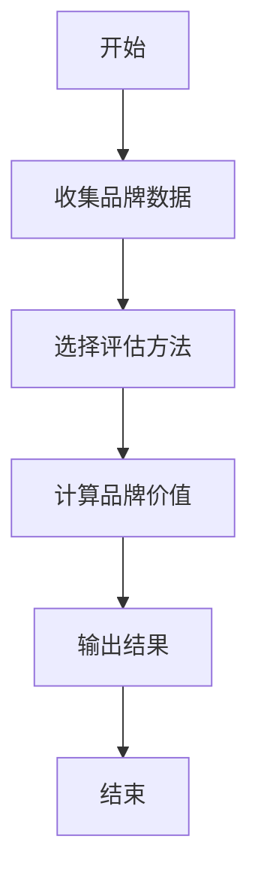

                 


# 如何评估企业的品牌价值

> 关键词：品牌价值评估、企业品牌、品牌强度、品牌忠诚度、品牌资产、品牌价值算法、品牌竞争力

> 摘要：品牌价值是衡量企业核心竞争力的重要指标，本文从品牌价值的核心概念出发，结合定性和定量分析方法，详细讲解了企业品牌价值的评估过程，包括品牌知名度、美誉度、忠诚度的量化分析，品牌价值数学模型的构建与实现，以及基于系统架构的评估工具设计。文章还通过实际案例分析，展示了品牌价值评估在企业战略决策中的应用价值，并提出了系统化的方法论和工具化的解决方案。

---

# 第一部分: 企业品牌价值评估的背景与核心概念

## 第1章: 企业品牌价值评估的背景与意义

### 1.1 品牌价值的重要性
- 品牌价值是企业在市场竞争中不可或缺的无形资产。
- 品牌价值直接影响企业的市场地位和客户忠诚度。
- 在数字化时代，品牌价值评估已成为企业战略决策的关键依据。

### 1.2 企业品牌价值评估的现状
- 当前品牌价值评估的主要方法及其优缺点。
- 数字化时代品牌价值评估的新挑战。
- 品牌价值评估工具和技术的发展趋势。

### 1.3 本文的核心目标
- 提供一套系统化的企业品牌价值评估方法论。
- 结合实际案例，详细讲解品牌价值评估的实现过程。
- 提供可落地的工具化解决方案。

---

## 第2章: 品牌价值评估的核心概念与联系

### 2.1 品牌价值的核心要素
- **品牌知名度**：品牌的市场认知度和曝光度。
- **品牌美誉度**：品牌在市场中的口碑和形象。
- **品牌忠诚度**：客户对品牌的忠诚程度。

### 2.2 品牌价值与其他相关概念的对比
- 品牌价值与企业价值的差异与联系。
- 品牌价值与市场价值的相互影响。
- 品牌价值与客户价值的协同关系。

### 2.3 品牌价值的ER实体关系图
```mermaid
er
  actor(评估主体)
  brand(品牌)
  attribute(品牌属性)
  relation(关系)
  actor -|评估| brand
  brand -|拥有| attribute
  attribute -|影响| relation
```

---

## 第3章: 品牌价值评估的算法原理

### 3.1 品牌价值评估的常用算法
- **基于财务数据的评估算法**：利用企业财务数据（如收入、利润）进行品牌价值估算。
- **基于市场数据的评估算法**：通过市场调研数据（如市场份额、客户满意度）进行品牌价值计算。
- **基于消费者行为数据的评估算法**：分析消费者行为数据（如购买频率、品牌偏好）来评估品牌价值。

### 3.2 品牌价值评估的数学模型
#### 3.2.1 品牌价值的线性回归模型
$$ y = \beta_0 + \beta_1x_1 + \beta_2x_2 + \dots + \beta_nx_n + \epsilon $$
其中：
- \( y \) 是品牌价值
- \( x_i \) 是品牌价值的驱动因素（如品牌知名度、美誉度等）
- \( \beta_i \) 是回归系数
- \( \epsilon \) 是误差项

#### 3.2.2 品牌强度的指数模型
$$ BV = A \times (P + M) \times \left( \frac{S}{C} \right) $$
其中：
- \( BV \) 是品牌价值
- \( A \) 是调整系数
- \( P \) 是品牌知名度
- \( M \) 是品牌美誉度
- \( S \) 是品牌忠诚度
- \( C \) 是品牌竞争力

### 3.3 算法流程图


---

## 第4章: 品牌价值评估的系统分析与架构设计

### 4.1 系统功能设计
- **数据采集模块**：负责收集品牌相关的数据（如市场数据、消费者行为数据等）。
- **数据分析模块**：对收集到的数据进行清洗、处理和分析，生成初步的评估结果。
- **评估报告生成模块**：根据分析结果生成详细的评估报告，包括品牌价值的量化结果、驱动因素分析等。

### 4.2 系统架构设计
```mermaid
arc
  client(用户)
  service(服务层)
  database(数据库)
  client --> service: 请求评估
  service --> database: 获取数据
  service --> service: 数据分析
  service --> client: 返回报告
```

---

## 第5章: 品牌价值评估的项目实战

### 5.1 环境安装与配置
- **工具安装**：安装必要的数据分析工具（如Python、Pandas、NumPy等）。
- **数据源准备**：收集相关品牌数据（如市场数据、消费者行为数据等）。

### 5.2 核心代码实现
```python
import pandas as pd
import numpy as np

# 示例数据加载
data = pd.read_csv('brand_data.csv')

# 品牌价值评估模型
from sklearn.linear_model import LinearRegression

model = LinearRegression()
X = data[['知名度', '美誉度', '忠诚度']]
y = data['品牌价值']
model.fit(X, y)

# 模型预测
predicted_value = model.predict(X)
print('预测品牌价值:', predicted_value)
```

### 5.3 案例分析与结果解读
- 以具体企业为例，展示品牌价值评估的过程。
- 分析评估结果对企业发展战略的影响。

### 5.4 项目小结
- 总结项目实施过程中的关键点。
- 提出改进建议和未来优化方向。

---

## 第6章: 总结与展望

### 6.1 总结
- 回顾品牌价值评估的核心概念和方法。
- 强调品牌价值评估在企业战略决策中的重要性。

### 6.2 展望
- 探讨品牌价值评估的未来发展趋势。
- 提出新的研究方向和应用前景。

### 6.3 最佳实践 tips
- 如何选择合适的评估方法。
- 数据采集和处理中的注意事项。
- 如何将品牌价值评估结果应用于实际业务。

---

## 作者：AI天才研究院/AI Genius Institute & 禅与计算机程序设计艺术 /Zen And The Art of Computer Programming

