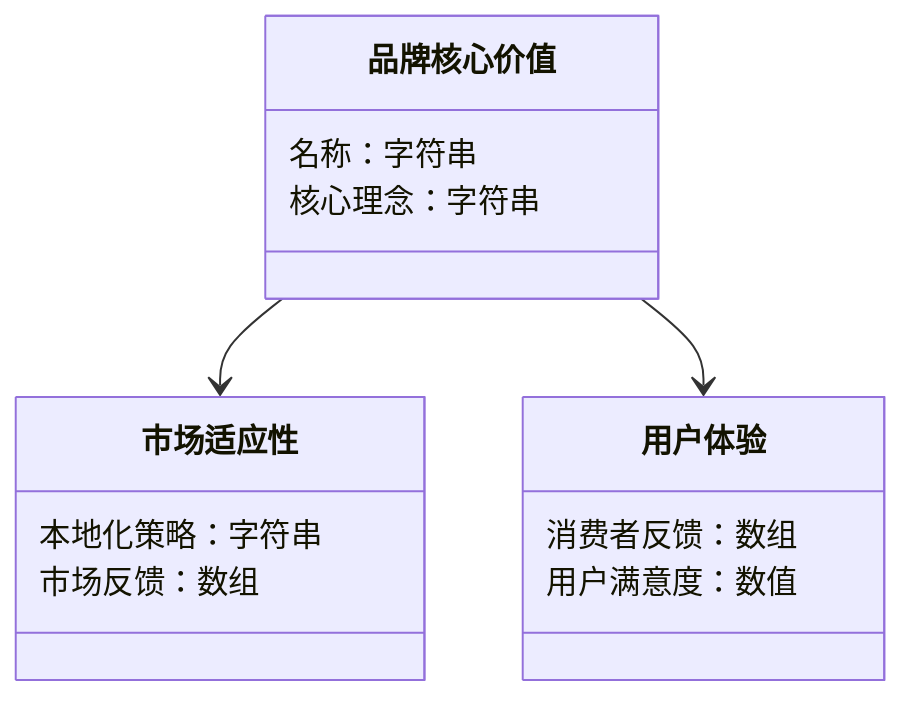

                 


# 如何评估企业的品牌延展能力

> 关键词：品牌延展能力、企业品牌管理、品牌评估模型、品牌一致性、市场适应性

> 摘要：本文详细探讨了如何评估企业的品牌延展能力，从核心概念、评估模型、系统架构到实际案例，为读者提供了一套完整的评估方法和工具。通过本文，读者将能够理解品牌延展能力的重要性，并掌握如何在实际中应用这些方法。

---

## 第一部分：品牌延展能力的背景与基础

### 第1章：品牌延展能力的背景与问题描述

#### 1.1 品牌延展能力的定义与重要性

##### 1.1.1 品牌延展能力的定义
品牌延展能力是指企业在不同市场、产品线或服务中扩展品牌的能力。它衡量了品牌在保持核心价值的同时，适应多样化市场需求的能力。

##### 1.1.2 品牌延展能力的重要性
- 品牌延展能力决定了企业能否在多个市场中成功推广产品。
- 优秀的品牌延展能力能够降低市场进入成本，提高品牌知名度。
- 它是企业在复杂市场环境中保持竞争力的关键因素。

##### 1.1.3 品牌延展能力的核心要素
- **品牌核心价值**：品牌的核心理念和价值观。
- **品牌识别系统**：包括品牌名称、标志、口号等。
- **品牌传播渠道**：如广告、社交媒体等。
- **品牌用户体验**：消费者对品牌的感知和体验。

#### 1.2 企业品牌延展能力的背景与现状

##### 1.2.1 当前市场环境对企业品牌延展能力的影响
- 全球化市场要求企业具备更强的跨文化适应能力。
- 消费者需求多样化，品牌需要快速调整策略。

##### 1.2.2 企业品牌延展能力的现状分析
- 许多企业面临品牌一致性与市场多样性的平衡问题。
- 技术驱动的品牌管理工具为企业提供了新的解决方案。

#### 1.3 品牌延展能力的关键问题与挑战

##### 1.3.1 品牌一致性与多样性的平衡
- 品牌在不同市场中需要保持一致性，同时又要适应当地文化。

##### 1.3.2 市场适应性与品牌核心价值的冲突
- 过度适应市场可能导致品牌核心价值的淡化。

##### 1.3.3 品牌延展能力的测量与评估难题
- 缺乏统一的评估标准和方法。
- 数据收集和分析的复杂性。

---

## 第二部分：品牌延展能力的核心概念与模型

### 第2章：品牌延展能力的核心概念与原理

#### 2.1 品牌延展能力的核心要素

##### 2.1.1 品牌核心价值
- **定义**：品牌的核心价值是品牌存在的根本原因，例如“环保”或“创新”。
- **影响**：核心价值决定了品牌在延展过程中的方向和边界。

##### 2.1.2 品牌识别系统
- **定义**：包括品牌名称、标志、口号等视觉和语言元素。
- **影响**：识别系统是品牌在市场中被识别和记忆的关键。

##### 2.1.3 品牌传播渠道
- **定义**：品牌通过哪些渠道与消费者互动，如社交媒体、广告等。
- **影响**：渠道的选择直接影响品牌信息的传播效率和效果。

##### 2.1.4 品牌用户体验
- **定义**：消费者在与品牌互动中的整体体验，包括购买、使用和服务过程。
- **影响**：良好的用户体验是品牌延展的基础。

#### 2.2 品牌延展能力的属性与特征

##### 2.2.1 品牌延展能力的可扩展性
- **定义**：品牌在不同市场中扩展的能力。
- **特征**：灵活性、适应性。

##### 2.2.2 品牌延展能力的适应性
- **定义**：品牌在不同市场中调整策略的能力。
- **特征**：快速响应、本地化能力。

##### 2.2.3 品牌延展能力的稳定性
- **定义**：品牌在扩展过程中保持核心价值的能力。
- **特征**：品牌忠诚度、品牌认知度。

#### 2.3 品牌延展能力的层次结构

##### 2.3.1 品牌延展能力的层次划分
- **基础层**：品牌核心价值和识别系统。
- **中间层**：传播渠道和用户体验。
- **顶层**：品牌一致性与市场适应性。

##### 2.3.2 各层次之间的关系
- 基础层是品牌延展的核心，中间层是实现延展的手段，顶层是最终目标。

##### 2.3.3 层次结构对品牌延展能力的影响
- 通过层次结构，企业可以系统性地管理品牌延展过程。

---

### 第3章：品牌延展能力的核心模型与框架

#### 3.1 品牌延展能力的评估模型

##### 3.1.1 模型的构建与核心要素
- **模型构建**：基于层次分析法（AHP），结合品牌核心价值、传播渠道和用户体验。
- **核心要素**：品牌一致性、市场适应性、品牌忠诚度。

##### 3.1.2 模型的输入与输出
- **输入**：品牌核心价值、市场数据、消费者反馈。
- **输出**：品牌延展能力的综合评分。

##### 3.1.3 模型的验证与优化
- **验证方法**：通过案例分析和数据对比。
- **优化方向**：根据实际结果调整权重和参数。

#### 3.2 品牌延展能力的框架体系

##### 3.2.1 框架的组成与功能
- **组成**：品牌核心价值、传播渠道、用户体验、市场适应性。
- **功能**：为品牌延展提供系统性指导。

##### 3.2.2 框架的实施步骤
- **步骤一**：明确品牌核心价值。
- **步骤二**：选择合适的传播渠道。
- **步骤三**：优化用户体验。
- **步骤四**：评估市场适应性。

##### 3.2.3 框架对品牌延展能力的影响
- 提供了系统化的品牌管理方法，提高了品牌延展的效率。

---

## 第三部分：品牌延展能力的算法与系统设计

### 第4章：品牌延展能力的算法原理讲解

#### 4.1 基于层次分析法（AHP）的评估模型

##### 4.1.1 算法原理
- **层次分析法**：通过构建层次结构，计算各要素的权重，得出综合评分。
- **公式**：$$A(w) = \sum_{i=1}^{n} w_i x_i$$，其中 \(w_i\) 是权重，\(x_i\) 是要素评分。

##### 4.1.2 算法实现
```python
def ahp评估(w, x):
    return sum(w[i] * x[i] for i in range(len(w)))

# 示例权重和评分
权重 = [0.4, 0.3, 0.2, 0.1]
评分 = [0.8, 0.7, 0.6, 0.5]
结果 = ahp评估(权重, 评分)
print(结果)
```

#### 4.2 基于因子分析法的优化

##### 4.2.1 算法原理
- **因子分析法**：通过主成分分析提取关键因子，优化评估模型。
- **公式**：$$F = \sum_{j=1}^{m} a_j y_j$$，其中 \(a_j\) 是因子载荷，\(y_j\) 是观测变量。

##### 4.2.2 算法实现
```python
import numpy as np
from sklearn.decomposition import PCA

# 示例数据矩阵
X = np.array([[2.5, 2.4],
              [1.7, 1.6],
              [3.6, 3.5]])
# PCA降维
pca = PCA(n_components=2)
principal_components = pca.fit_transform(X)
print(principal_components)
```

---

## 第四部分：品牌延展能力的系统分析与架构设计

### 第5章：系统分析与架构设计方案

#### 5.1 问题场景介绍

##### 5.1.1 企业品牌延展问题场景
- 企业需要在多个市场中推广品牌，面临品牌一致性与市场多样性的挑战。

#### 5.2 系统功能设计

##### 5.2.1 领域模型类图


#### 5.3 系统架构设计

##### 5.3.1 系统架构图


#### 5.4 系统接口设计

##### 5.4.1 API接口设计
- **输入接口**：接收品牌核心价值和市场数据。
- **输出接口**：返回品牌延展能力的综合评分。

#### 5.5 系统交互流程图

```mermaid
sequenceDiagram
    用户 --> 前端：提交品牌数据
    前端 --> 后端服务：处理数据
    后端服务 --> 数据库：查询历史数据
    数据库 --> 后端服务：返回结果
    后端服务 --> 用户：显示评估结果
```

---

## 第五部分：品牌延展能力的项目实战

### 第6章：项目实战与案例分析

#### 6.1 环境安装与数据准备

##### 6.1.1 环境安装
- 安装Python和相关库（如numpy、pandas、sklearn）。

##### 6.1.2 数据准备
- 收集品牌核心价值、市场数据和消费者反馈。

#### 6.2 核心代码实现

##### 6.2.1 基于层次分析法的评估代码
```python
def ahp评估(w, x):
    return sum(w[i] * x[i] for i in range(len(w)))

权重 = [0.4, 0.3, 0.2, 0.1]
评分 = [0.8, 0.7, 0.6, 0.5]
结果 = ahp评估(权重, 评分)
print(结果)
```

##### 6.2.2 基于因子分析法的优化代码
```python
import numpy as np
from sklearn.decomposition import PCA

X = np.array([[2.5, 2.4],
              [1.7, 1.6],
              [3.6, 3.5]])
pca = PCA(n_components=2)
principal_components = pca.fit_transform(X)
print(principal_components)
```

#### 6.3 项目小结

##### 6.3.1 实战总结
- 通过代码实现，读者可以掌握品牌延展能力的评估方法。
- 通过实际案例分析，读者可以理解理论在实践中的应用。

---

## 第六部分：品牌延展能力的最佳实践与总结

### 第7章：最佳实践、小结与展望

#### 7.1 最佳实践 tips

##### 7.1.1 理论与实践结合
- 在实际工作中，灵活运用品牌延展能力的评估方法。

##### 7.1.2 数据驱动决策
- 通过数据分析优化品牌延展策略。

##### 7.1.3 持续优化
- 定期评估品牌延展能力，根据市场反馈进行优化。

#### 7.2 小结与注意事项

##### 7.2.1 小结
- 本文从理论到实践，全面介绍了品牌延展能力的评估方法。
- 通过系统化的模型和工具，企业可以有效提升品牌延展能力。

##### 7.2.2 注意事项
- 数据的准确性和完整性是评估的基础。
- 在实际应用中，需结合企业实际情况调整模型。

#### 7.3 拓展阅读与深入学习

##### 7.3.1 拓展阅读
- 建议阅读《品牌管理》相关书籍，深入理解品牌管理的核心理论。
- 学习更多品牌评估模型，如BrandZ模型。

##### 7.3.2 深入学习方向
- 研究品牌延展能力的动态评估方法。
- 探索人工智能在品牌管理中的应用。

---

## 作者：AI天才研究院/AI Genius Institute & 禅与计算机程序设计艺术 /Zen And The Art of Computer Programming

