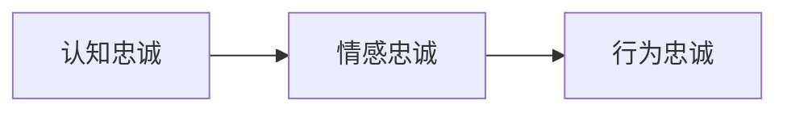
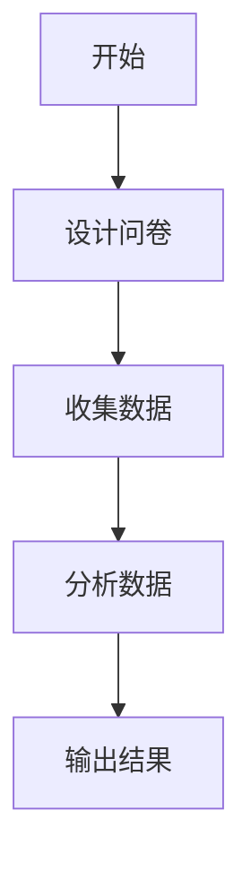
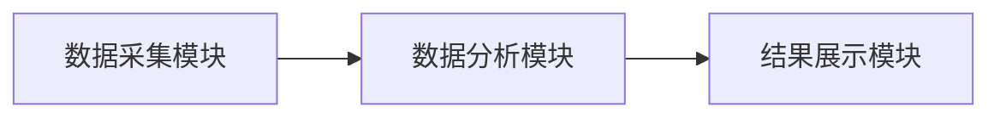
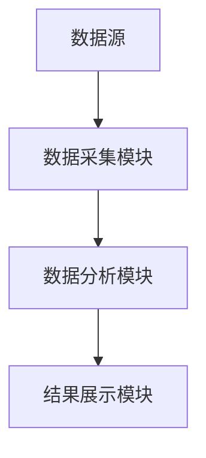

                 


# 如何评估企业的品牌忠诚度价值

## 关键词：品牌忠诚度，客户价值，数据分析，数学模型，系统架构，商业价值

## 摘要：  
品牌忠诚度是企业在市场竞争中不可或缺的核心资产之一。本文将系统地探讨如何评估企业的品牌忠诚度价值，涵盖品牌忠诚度的定义、评估方法、数学模型、系统架构以及实际应用。通过分析品牌忠诚度与客户生命周期、企业价值之间的关系，本文将为读者提供一套科学的评估体系，帮助企业更好地管理和提升品牌忠诚度价值。

---

## 第一章：品牌忠诚度的定义与重要性

### 1.1 品牌忠诚度的定义

品牌忠诚度是指消费者对企业品牌的一种持久的偏好和信任，表现为消费者在面对竞争产品时，仍选择购买该品牌产品或服务的行为。  

#### 1.1.1 品牌忠诚度的层次模型  
品牌忠诚度可以分为以下三个层次：  
1. **认知忠诚**：消费者对品牌的初步认可，基于品牌知名度和初步信任。  
2. **情感忠诚**：消费者对品牌产生情感上的依赖，基于品牌情感价值和用户体验。  
3. **行为忠诚**：消费者在实际购买行为中持续选择该品牌，基于品牌满意度和长期信任。  

**Mermaid 图表：品牌忠诚度层次模型**  


### 1.2 品牌忠诚度的重要性

品牌忠诚度是企业长期发展的核心驱动力之一，其重要性体现在以下几个方面：  
1. **客户获取成本降低**：忠诚客户更愿意回购，减少企业的营销成本。  
2. **客户生命周期价值提升**：忠诚客户往往为企业创造更高的收入和利润。  
3. **市场竞争优势**：在激烈的市场竞争中，品牌忠诚度高的企业更容易吸引新客户并抵御竞争对手。  

---

## 第二章：品牌忠诚度价值的评估方法

### 2.1 定性评估方法

#### 2.1.1 问卷调查法  
通过设计科学的问卷，收集消费者对品牌的认知、情感和行为忠诚度数据。问卷内容包括：  
- 消费者对品牌的满意度评分（如1-5分）。  
- 消费者对品牌的推荐意愿调查。  
- 消费者对品牌竞争对手的认知和态度。  

**Mermaid 图表：问卷调查流程图**  


#### 2.1.2 深度访谈法  
通过与消费者进行一对一访谈，深入了解其品牌偏好和购买决策过程。这种方法适用于获取深层次的情感和行为数据。

### 2.2 定量评估方法

#### 2.2.1 数据分析法  
通过分析企业的销售数据、客户行为数据和市场数据，计算品牌忠诚度价值。常用的数据分析方法包括：  
- **客户留存率分析**：计算客户在一定时间内的留存率。  
- **客户购买频率分析**：分析客户购买品牌产品的频率。  
- **客户满意度分析**：基于客户反馈数据，计算品牌满意度指数。  

**公式：客户留存率计算公式**  
$$ 客户留存率 = \frac{\text{老客户数量}}{\text{老客户数量 + 新客户数量}} $$  

---

## 第三章：品牌忠诚度价值的数学模型

### 3.1 客户生命周期价值模型

客户生命周期价值（CLV）是衡量品牌忠诚度的重要指标之一。其计算公式为：  

$$ CLV = \frac{\text{客户年度贡献毛利}}{\text{客户流失率}} $$  

#### 3.1.1 基于客户满意度的模型  
客户满意度（CSAT）与品牌忠诚度密切相关。可以通过以下公式进行估算：  

$$ 品牌忠诚度 = \alpha \times CSAT + \beta \times \text{客户留存率} $$  

**Mermaid 图表：客户生命周期价值模型**  


### 3.2 基于机器学习的模型

#### 3.2.1 随机森林模型  
随机森林是一种常用的机器学习算法，可以用于预测客户忠诚度。以下是实现步骤：  

1. 数据预处理：清洗数据，处理缺失值和异常值。  
2. 特征选择：选取影响品牌忠诚度的关键特征（如客户满意度、购买频率等）。  
3. 模型训练：使用随机森林算法进行训练。  
4. 模型评估：通过准确率、召回率等指标评估模型性能。  

**Python 实现代码示例**  
```python
from sklearn.ensemble import RandomForestClassifier
from sklearn.metrics import accuracy_score

# 数据预处理
data = [...]  # 数据集
X = data.drop('忠诚度', axis=1)
y = data['忠诚度']

# 模型训练
model = RandomForestClassifier(n_estimators=100)
model.fit(X, y)

# 模型评估
y_pred = model.predict(X)
print("准确率:", accuracy_score(y, y_pred))
```

---

## 第四章：系统架构设计

### 4.1 系统架构设计

#### 4.1.1 系统功能模块  
1. 数据采集模块：负责收集客户数据（如购买记录、反馈数据等）。  
2. 数据分析模块：对数据进行清洗、建模和分析。  
3. 结果展示模块：将分析结果以可视化形式呈现给用户。  

**Mermaid 图表：系统架构图**  


### 4.2 数据流设计

#### 4.2.1 数据流流程  
1. 数据采集模块通过API接口获取客户数据。  
2. 数据分析模块对数据进行处理，生成品牌忠诚度报告。  
3. 结果展示模块将报告以图表形式展示给用户。  

**Mermaid 图表：数据流设计**  


---

## 第五章：项目实战与案例分析

### 5.1 项目背景与目标

#### 5.1.1 项目背景  
假设我们是一家电商平台，希望通过评估品牌忠诚度价值，优化客户 retention 策略。  

### 5.2 数据收集与处理

#### 5.2.1 数据来源  
- 线上销售数据：包括订单号、客户ID、购买时间、金额等。  
- 客户反馈数据：包括客户满意度评分、推荐意愿等。  

**Python 实现代码示例**  
```python
import pandas as pd

# 数据读取
data = pd.read_csv('customer_data.csv')

# 数据清洗
data.dropna(inplace=True)  # 删除缺失值
data['购买频率'] = data['购买频率'].astype(int)  # 转换数据类型
```

### 5.3 模型实现与结果分析

#### 5.3.1 模型实现  
使用随机森林模型预测客户忠诚度。以下是代码示例：  

**Python 实现代码示例**  
```python
from sklearn.ensemble import RandomForestClassifier
from sklearn.metrics import classification_report

# 数据分割
X_train, X_test, y_train, y_test = train_test_split(X, y, test_size=0.2)

# 模型训练
model = RandomForestClassifier()
model.fit(X_train, y_train)

# 模型预测
y_pred = model.predict(X_test)

# 模型评估
print(classification_report(y_test, y_pred))
```

---

## 第六章：总结与展望

### 6.1 总结

品牌忠诚度是企业在市场竞争中的一项重要资产。本文通过定性与定量相结合的方法，探讨了品牌忠诚度的评估方法，并结合数学模型和系统架构设计，提供了科学的评估体系。  

### 6.2 展望

未来，品牌忠诚度的评估可以结合更多的新兴技术，如人工智能和大数据分析，进一步提升评估的精准度和实时性。此外，动态品牌忠诚度模型的研究也将成为未来的重要方向。

---

## 作者：AI天才研究院/AI Genius Institute & 禅与计算机程序设计艺术 /Zen And The Art of Computer Programming

---

以上是关于《如何评估企业的品牌忠诚度价值》的完整内容。希望对您有所帮助！

