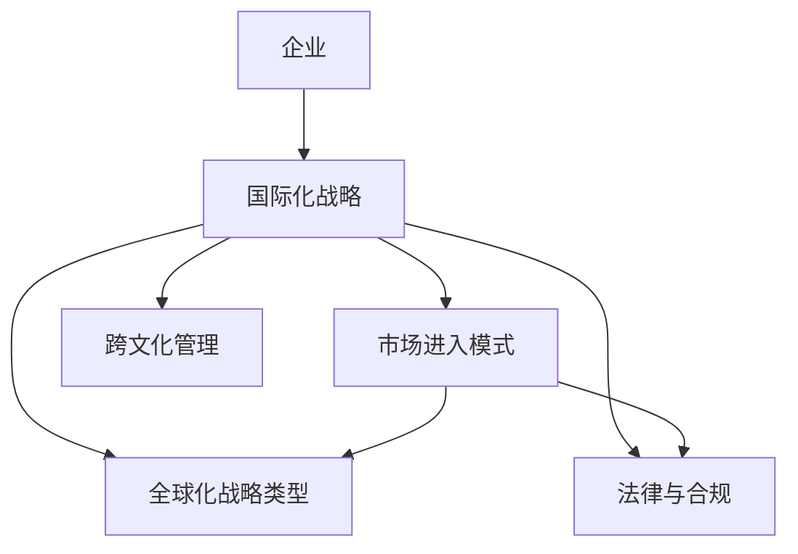
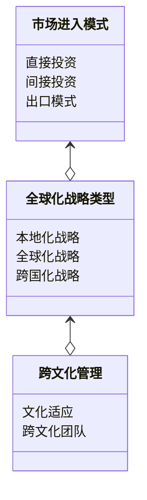
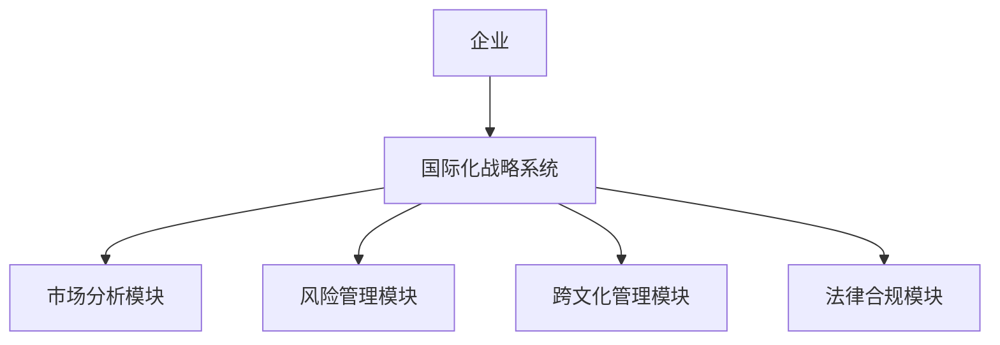
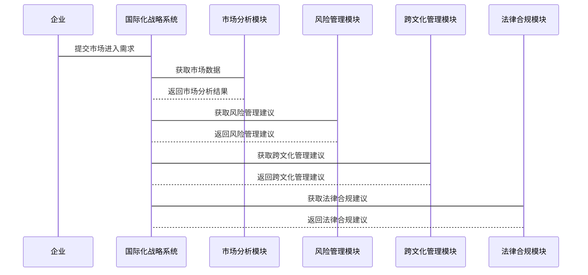

                 


# 如何评估企业的国际化战略

## 关键词：企业国际化战略、全球化、市场进入、竞争分析、风险管理、文化适应

## 摘要：  
企业在全球化背景下制定和实施国际化战略，是提升竞争力和扩大市场的重要途径。本文从核心概念、评估模型、系统架构、项目实战等多维度，详细阐述如何科学评估企业国际化战略。通过背景分析、理论探讨、算法设计和案例分析，帮助读者全面理解国际化战略的评估方法，为企业制定和优化国际化战略提供实践指导。

---

# 第1章: 企业国际化战略的背景介绍

## 1.1 什么是企业国际化战略  
企业国际化战略是指企业在全球范围内扩展业务、优化资源配置、提升竞争力的一系列战略规划。它涵盖了市场进入、产品定位、跨文化管理、法律合规等多个方面。

### 1.1.1 国际化战略的定义  
企业国际化战略是企业在全球化市场中，通过跨国经营、资源整合和文化适应，实现全球竞争力提升的战略。

### 1.1.2 国际化战略的核心要素  
1. **市场定位**：选择目标市场并进行深入分析。
2. **进入模式**：包括直接投资、合资合作、特许经营等。
3. **文化适应**：理解并适应目标市场的文化差异。
4. **法律合规**：遵守当地法律法规，规避法律风险。
5. **风险管理**：识别并应对国际化过程中的潜在风险。

### 1.1.3 国际化战略的演进历程  
1. **本地化阶段**：企业仅关注本地市场需求。
2. **全球化阶段**：企业采取统一的全球战略。
3. **跨国化阶段**：企业根据不同市场调整策略，实现本地化与全球化的结合。

## 1.2 企业国际化战略的重要性  
### 1.2.1 国际化对企业发展的意义  
1. 拓展市场空间，降低单一市场的风险。
2. 提升品牌影响力，增强企业竞争力。
3. 优化资源配置，降低生产成本。

### 1.2.2 全球化背景下国际化战略的必要性  
1. 全球化趋势不可逆转，企业必须适应这一趋势。
2. 全球市场分工协作，企业需要在全球范围内优化资源。

### 1.2.3 国际化战略与企业竞争力的关系  
国际化战略是提升企业竞争力的关键路径，通过拓展市场、优化资源配置和提升品牌影响力，企业能够在全球市场中占据更有利的位置。

## 1.3 当前企业国际化战略的现状  
### 1.3.1 全球化趋势下的国际化战略特点  
1. 多元化：企业根据不同市场特点制定差异化战略。
2. 数字化：利用数字化工具提升国际化效率。
3. 灵活性：快速响应市场变化，调整战略。

### 1.3.2 不同行业国际化战略的差异  
1. 制造业：注重成本控制和全球供应链。
2. 服务业：注重跨文化管理和本地化服务。
3. 高 tech行业：注重技术创新和全球专利布局。

### 1.3.3 国际化战略面临的挑战与机遇  
1. 机遇：拓展新市场，获取新资源。
2. 挑战：文化差异、法律风险、竞争压力。

## 1.4 企业国际化战略的关键成功因素  
### 1.4.1 市场因素  
1. 目标市场的潜力和竞争状况。
2. 市场进入的难易程度。

### 1.4.2 文化因素  
1. 语言、习俗、价值观对企业运营的影响。
2. 跨文化管理的能力。

### 1.4.3 法律与政策因素  
1. 目标市场的法律法规。
2. 政治经济环境的稳定性。

### 1.4.4 竞争因素  
1. 目标市场的竞争格局。
2. 竞争对手的策略。

### 1.4.5 企业内部能力因素  
1. 财务实力。
2. 管理能力。
3. 技术创新能力。

## 1.5 本章小结  
本章介绍了企业国际化战略的定义、核心要素、演进历程、重要性、现状及成功因素。通过这些分析，读者可以全面理解国际化战略的基本框架。

---

# 第2章: 企业国际化战略的核心概念与联系

## 2.1 国际化战略的核心概念  
### 2.1.1 市场进入模式  
1. **直接投资**：通过建立子公司或分公司进入市场。
2. **间接投资**：通过合资合作、特许经营等方式进入市场。
3. **出口模式**：通过贸易出口进入市场。

### 2.1.2 全球化战略类型  
1. **本地化战略**：根据目标市场的特点调整产品和服务。
2. **全球化战略**：在全球范围内采用统一的策略。
3. **跨国化战略**：根据不同市场特点制定差异化策略。

### 2.1.3 跨文化管理  
1. 理解并适应目标市场的文化差异。
2. 建立跨文化团队，提升沟通效率。

### 2.1.4 法律与合规  
1. 遵守目标市场的法律法规。
2. 处理跨国经营中的法律问题。

## 2.2 核心概念之间的关系  
### 2.2.1 市场进入模式与全球化战略的关系  
1. 市场进入模式是全球化战略的基础。
2. 全球化战略决定了市场进入的具体方式。

### 2.2.2 跨文化管理与企业内部能力的关系  
1. 跨文化管理能力是企业内部能力的重要组成部分。
2. 企业内部能力决定了跨文化管理的深度和效果。

### 2.2.3 法律合规与市场进入策略的关系  
1. 法律合规是市场进入的前提条件。
2. 市场进入策略需要考虑法律环境的影响。

## 2.3 概念属性特征对比表格  
下表展示了不同市场进入模式的特点对比：

| 模式           | 特点                       |
|----------------|---------------------------|
| 直接投资       | 高风险、高控制            |
| 间接投资       | 低风险、较低控制          |
| 出口模式       | 无资产投入、灵活性高        |

## 2.4 实体关系图  
使用 Mermaid 绘制核心概念的关系图：



---

# 第3章: 企业国际化战略的评估模型与方法论

## 3.1 评估模型的构建  
企业国际化战略的评估可以分为以下几个步骤：  
1. **确定目标**：明确评估的目的和范围。  
2. **收集数据**：收集与目标市场相关的数据。  
3. **分析数据**：对数据进行分析和处理。  
4. **评估结果**：根据分析结果进行评估。

### 3.1.1 评估指标体系  
1. **市场潜力**：目标市场的规模、增长潜力。  
2. **竞争能力**：企业在目标市场的竞争优势。  
3. **风险因素**：目标市场的法律、政治、经济风险。  
4. **文化适应能力**：企业在目标市场的文化适应能力。

### 3.1.2 评估方法  
1. **SWOT分析**：分析目标市场的优势、劣势、机会和威胁。  
2. **加权评分法**：根据各项指标的权重进行评分。  
3. **情景分析法**：模拟不同情景下的战略效果。

### 3.1.3 数学模型  
评估模型可以用加权评分法表示：

$$ \text{总评分} = \sum (\text{权重}_i \times \text{评分}_i) $$

其中，权重 \( \text{权重}_i \) 是各项指标的权重，评分 \( \text{评分}_i \) 是各项指标的评分。

---

## 3.2 算法实现  

### 3.2.1 算法原理  
加权评分法是一种常用的评估方法，通过给每个指标分配权重，计算总评分来评估目标市场的吸引力。

### 3.2.2 算法流程  
1. 确定评估指标和权重。  
2. 根据指标对目标市场进行评分。  
3. 计算总评分，确定最优目标市场。

### 3.2.3 代码实现  

```python
def calculate_weighted_score(criteria_weights, market_scores):
    total_score = 0
    for weight, score in zip(criteria_weights, market_scores):
        total_score += weight * score
    return total_score

# 示例：评估两个目标市场的总评分
criteria_weights = [0.4, 0.3, 0.2, 0.1]
market1_scores = [9, 8, 7, 6]
market2_scores = [8, 7, 9, 5]

score1 = calculate_weighted_score(criteria_weights, market1_scores)
score2 = calculate_weighted_score(criteria_weights, market2_scores)

print(f"Market 1 总评分: {score1}")
print(f"Market 2 总评分: {score2}")
```

---

## 3.3 本章小结  
本章介绍了企业国际化战略的评估模型和方法论，包括指标体系、评估方法和数学模型。通过加权评分法和SWOT分析，企业可以科学地评估目标市场的潜力和风险。

---

# 第4章: 企业国际化战略的系统分析与架构设计

## 4.1 系统分析  
### 4.1.1 问题场景  
企业在制定国际化战略时，需要考虑市场进入模式、文化适应和风险管理等多个方面。

### 4.1.2 项目介绍  
以一家科技企业为例，分析其制定国际化战略的过程。

---

## 4.2 系统功能设计  
### 4.2.1 领域模型  
使用 Mermaid 绘制领域模型类图：



---

## 4.3 系统架构设计  
### 4.3.1 系统架构图  
使用 Mermaid 绘制系统架构图：



---

## 4.4 系统交互设计  
### 4.4.1 序列图  
使用 Mermaid 绘制系统交互序列图：



---

## 4.5 本章小结  
本章从系统分析的角度，详细探讨了企业国际化战略的架构设计和交互流程，为企业制定和实施国际化战略提供了系统化的指导。

---

# 第5章: 企业国际化战略的项目实战

## 5.1 环境安装与工具准备  
### 5.1.1 安装 Python 和相关库  
1. 安装 Python：[Python 官网](https://www.python.org/)  
2. 安装 Mermaid：使用 VSCode 插件或在线工具。

### 5.1.2 数据收集与处理工具  
1. 使用 Excel 或 Python 的 Pandas 库进行数据处理。

---

## 5.2 核心代码实现  

### 5.2.1 数据处理代码  

```python
import pandas as pd

# 示例数据：目标市场的市场分析数据
data = {
    '市场': ['市场A', '市场B', '市场C'],
    '市场规模': [100, 200, 150],
    '竞争强度': [0.8, 0.6, 0.7],
    '法律风险': [0.2, 0.3, 0.1],
    '文化适应度': [0.9, 0.5, 0.8]
}

df = pd.DataFrame(data)

print(df)
```

---

## 5.3 代码应用解读  
### 5.3.1 数据分析与处理  
1. 使用 Pandas 进行数据清洗和转换。
2. 使用 Matplotlib 或 Seaborn 进行数据可视化。

---

## 5.4 案例分析与详细解读  
### 5.4.1 案例背景  
以一家科技企业为例，分析其在新兴市场的国际化战略。

### 5.4.2 实施步骤  
1. 数据收集：市场规模、竞争强度、法律风险、文化适应度。  
2. 数据分析：使用加权评分法评估目标市场。  
3. 战略制定：根据评估结果制定市场进入策略。

---

## 5.5 本章小结  
本章通过实际案例，详细展示了企业国际化战略的实施过程，从数据收集到战略制定，帮助读者理解理论与实践的结合。

---

# 第6章: 企业国际化战略的最佳实践与小结

## 6.1 最佳实践 tips  
1. **充分调研**：深入了解目标市场的情况。  
2. **风险管理**：制定应对潜在风险的策略。  
3. **文化适应**：建立跨文化团队，提升文化敏感性。  
4. **法律合规**：遵守当地法律法规，避免法律风险。  
5. **持续优化**：根据市场变化不断调整战略。

## 6.2 本章小结  
企业国际化战略的评估需要从市场、文化、法律等多个方面进行综合考量。通过科学的评估模型和系统的架构设计，企业可以制定出最优的国际化战略。

## 6.3 未来趋势  
随着全球化的深入，企业国际化战略将更加注重数字化转型和可持续发展。企业需要结合技术创新和绿色发展战略，制定更具前瞻性的国际化战略。

---

# 附录: 工具与资源

## 附录1: 工具安装指南  
1. **Python 安装**：[Python 官网](https://www.python.org/)  
2. **Mermaid 使用**：[Mermaid 官网](https://mermaid-js.github.io/mermaid-live-editor/)  
3. **Pandas 数据处理**：[Pandas 官网](https://pandas.pydata.org/)

## 附录2: 术语表  
1. **国际化战略**：企业在全球范围内扩展业务的战略。  
2. **加权评分法**：根据指标权重计算总评分的方法。  
3. **跨文化管理**：在不同文化背景下进行管理的策略。

## 附录3: 参考文献  
1. 马云. (2018). 《创业者的思考》. 北京: 中信出版社.  
2. 约翰逊, J. (2020). Global Business Strategy. Cambridge University Press.

---

# 作者：AI天才研究院/AI Genius Institute & 禅与计算机程序设计艺术 /Zen And The Art of Computer Programming

---

**全文完**。

