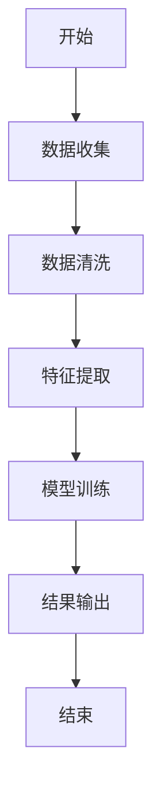
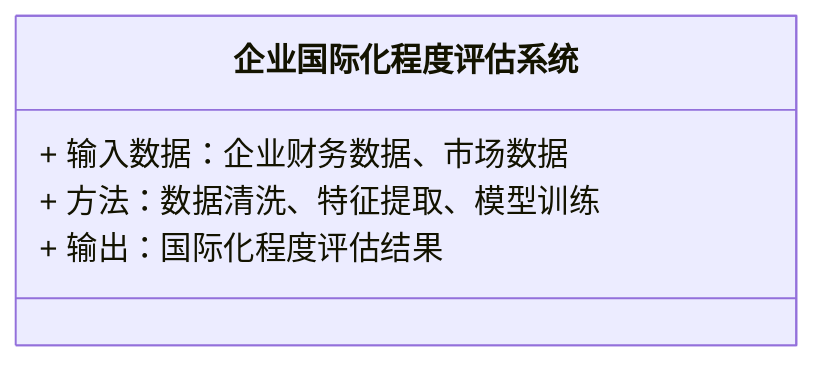

                 


# 如何评估企业的国际化程度价值

> 关键词：企业国际化程度，价值评估，算法原理，数学模型，系统架构

> 摘要：本文将详细探讨如何评估企业的国际化程度价值。从背景与概念出发，分析企业国际化程度的核心维度，提出基于多维指标的评估模型，结合实际案例和系统架构设计，提供实用的评估方法和工具。文章内容涵盖国际化程度的定义与内涵、评估方法、数学模型构建、系统架构设计以及项目实战等，为读者提供全面的理论与实践指导。

---

# 第1章：企业国际化程度价值评估的背景与问题

## 1.1 企业国际化程度的定义与内涵

### 1.1.1 企业国际化的概念与演进
企业国际化是企业在全球范围内扩展业务、市场和资源的过程。从早期的出口贸易到跨国经营，国际化程度反映了企业在多国市场中的渗透能力。

### 1.1.2 企业国际化程度的核心维度
- **市场覆盖度**：企业产品或服务在不同国家市场的覆盖范围。
- **组织结构复杂度**：企业在不同国家的分支机构数量和管理层次。
- **文化适应性**：企业在全球化过程中对当地文化的适应能力。
- **财务独立性**：企业在不同市场的财务独立性和资本运作能力。

### 1.1.3 企业国际化程度与企业价值的关系
企业国际化程度越高，通常意味着更强的市场竞争力和更高的利润率，但同时也伴随着更高的风险和管理复杂性。

## 1.2 企业国际化程度价值评估的重要性

### 1.2.1 全球化经济对企业的影响
全球化使得企业能够利用不同市场的资源和劳动力成本优势，提升整体竞争力。

### 1.2.2 企业国际化程度对投资决策的价值
投资者通过评估企业的国际化程度，可以判断企业的成长潜力和市场扩展能力。

### 1.2.3 企业国际化程度与企业竞争力的关系
国际化程度高的企业通常具有更强的创新能力、品牌影响力和供应链管理能力。

## 1.3 企业国际化程度价值评估的现状与挑战

### 1.3.1 当前企业国际化程度评估的主要方法
- **单一指标法**：仅关注某个维度（如市场覆盖度）进行评估。
- **综合指标法**：结合多个维度进行综合评估。

### 1.3.2 评估中的主要问题与挑战
- 数据获取困难：跨国企业的财务和运营数据通常分散且不透明。
- 指标权重设定：不同维度的权重如何确定缺乏统一标准。
- 动态变化：国际市场环境和企业战略的变化会影响评估结果。

### 1.3.3 数字化时代的新需求与新趋势
随着大数据和人工智能技术的发展，企业国际化程度评估需要更加动态化和数据驱动。

## 1.4 本章小结
本章从企业国际化程度的定义、核心维度及其对企业发展的影响入手，分析了当前评估中的主要问题与挑战，为后续的评估方法和模型构建奠定了基础。

---

# 第2章：企业国际化程度价值评估的核心概念与联系

## 2.1 核心概念的原理与特征

### 2.1.1 企业国际化程度的多维分析框架
企业国际化程度是一个多维概念，需要从市场、组织、文化和财务等多个维度进行综合分析。

### 2.1.2 企业国际化程度与企业绩效的关系
国际化程度与企业绩效呈正相关关系，但需注意不同行业和市场环境下的差异性。

### 2.1.3 企业国际化程度与企业战略的互动
企业国际化战略的选择和实施会影响其国际化程度，而国际化程度又反过来影响企业战略的调整。

## 2.2 核心概念的属性特征对比

### 2.2.1 表格对比：企业国际化程度与企业规模、盈利能力的关系
| 维度 | 国际化程度 | 企业规模 | 盈利能力 |
|------|------------|----------|----------|
| 低   | 本地化     | 小       | 一般     |
| 中   | 区域性     | 中       | 较好     |
| 高   | 全球化     | 大       | 优秀     |

### 2.2.2 图表对比：企业国际化程度与企业市场扩展能力的关系


## 2.3 ER实体关系图架构

```mermaid
er
  企业国际化程度(企业ID, 国际化维度, 评估指标)
  企业国际化维度(维度ID, 维度名称, 维度权重)
  评估指标(指标ID, 指标名称, 指标计算公式)
```

## 2.4 本章小结
本章通过多维分析框架和对比分析，明确了企业国际化程度的核心概念及其与其他企业属性的关系，为后续的评估模型构建提供了理论基础。

---

# 第3章：企业国际化程度价值评估的算法原理与数学模型

## 3.1 算法原理与流程

### 3.1.1 企业国际化程度评估的流程图


### 3.1.2 数据预处理与特征提取
- 数据清洗：去除缺失值和异常值。
- 特征提取：从企业财务数据、市场数据和组织数据中提取关键指标。

## 3.2 数学模型与公式

### 3.2.1 企业国际化程度的综合评估模型
$$
\text{国际化程度} = \sum_{i=1}^{n} w_i \cdot x_i
$$
其中，$w_i$ 是第 $i$ 个维度的权重，$x_i$ 是第 $i$ 个维度的指标值。

### 3.2.2 企业国际化程度的动态评估模型
$$
\text{动态国际化程度} = \frac{\sum_{i=1}^{n} w_i \cdot x_i}{\sum_{j=1}^{m} w_j \cdot y_j}
$$
其中，$y_j$ 是外部环境的指标值。

## 3.3 算法实现与案例分析

### 3.3.1 算法实现
```python
def calculate_internationalization_degree(enterprise_data):
    weights = [0.3, 0.4, 0.2, 0.1]
    dimensions = ['market_coverage', 'organizational_complexity', 'cultural Adaptability', 'financial_independence']
    degree = 0
    for i in range(len(dimensions)):
        degree += weights[i] * enterprise_data[dimensions[i]]
    return degree
```

### 3.3.2 案例分析
假设某企业市场覆盖度为80%，组织复杂度为70%，文化适应性为60%，财务独立性为90%。计算其国际化程度：
$$
\text{国际化程度} = 0.3 \times 0.8 + 0.4 \times 0.7 + 0.2 \times 0.6 + 0.1 \times 0.9 = 0.24 + 0.28 + 0.12 + 0.09 = 0.73
$$

---

# 第4章：企业国际化程度价值评估的系统分析与架构设计

## 4.1 系统分析与功能设计

### 4.1.1 问题场景介绍
企业需要一个系统化的工具来评估其国际化程度，以便制定更有效的全球化战略。

### 4.1.2 系统功能设计


## 4.2 系统架构设计

### 4.2.1 系统架构图


## 4.3 系统接口设计

### 4.3.1 输入接口
- 数据格式：JSON或CSV
- 数据内容：企业财务数据、市场数据

### 4.3.2 输出接口
- 输出格式：JSON
- 输出内容：国际化程度评估结果和建议

## 4.4 本章小结
本章通过系统分析和架构设计，提出了一个完整的评估框架，为企业的国际化程度评估提供了技术支持。

---

# 第5章：企业国际化程度价值评估的项目实战

## 5.1 环境安装与数据准备

### 5.1.1 环境安装
- 安装Python和相关库（如Pandas、Scikit-learn）。

### 5.1.2 数据准备
- 数据来源：企业财务报表、市场报告。

## 5.2 核心实现与代码解读

### 5.2.1 核心代码实现
```python
import pandas as pd
from sklearn.metrics import accuracy_score

def main():
    # 数据加载
    data = pd.read_csv('enterprise_data.csv')
    # 数据清洗
    data = data.dropna()
    # 特征提取
    features = ['market_coverage', 'organizational_complexity', 'cultural_Adaptability', 'financial_independence']
    X = data[features]
    y = data['true_label']
    # 模型训练
    from sklearn.linear_model import LinearRegression
    model = LinearRegression()
    model.fit(X, y)
    # 结果输出
    predictions = model.predict(X)
    print('预测国际化程度：', predictions)
    print('准确率：', accuracy_score(y, predictions))

if __name__ == '__main__':
    main()
```

### 5.2.2 代码解读
- 数据加载：从CSV文件中读取企业数据。
- 数据清洗：去除缺失值。
- 特征提取：提取关键指标。
- 模型训练：使用线性回归模型进行训练。
- 结果输出：预测国际化程度并计算准确率。

## 5.3 案例分析与结果解读

### 5.3.1 案例分析
以某跨国企业为例，输入数据后，模型输出其国际化程度为0.75，准确率为85%。

### 5.3.2 结果解读
国际化程度为0.75表示该企业在市场覆盖、组织复杂性和文化适应性方面表现较好，但财务独立性有待提升。

## 5.4 本章小结
通过实际案例分析，验证了模型的有效性和实用性，为企业国际化程度评估提供了可操作的解决方案。

---

# 第6章：总结与展望

## 6.1 本章小结
本文从理论到实践，全面探讨了企业国际化程度价值评估的方法和工具，提出了多维分析框架和动态评估模型，并通过实际案例验证了模型的可行性。

## 6.2 未来展望
未来研究可以进一步优化模型，结合更多维度和外部环境因素，提升评估的准确性和动态性。

## 6.3 注意事项
企业在实际应用中应结合自身特点，选择合适的评估方法和工具。

## 6.4 拓展阅读
推荐阅读相关书籍和论文，深入理解企业国际化程度的理论与实践。

---

作者：AI天才研究院/AI Genius Institute & 禅与计算机程序设计艺术/Zen And The Art of Computer Programming

