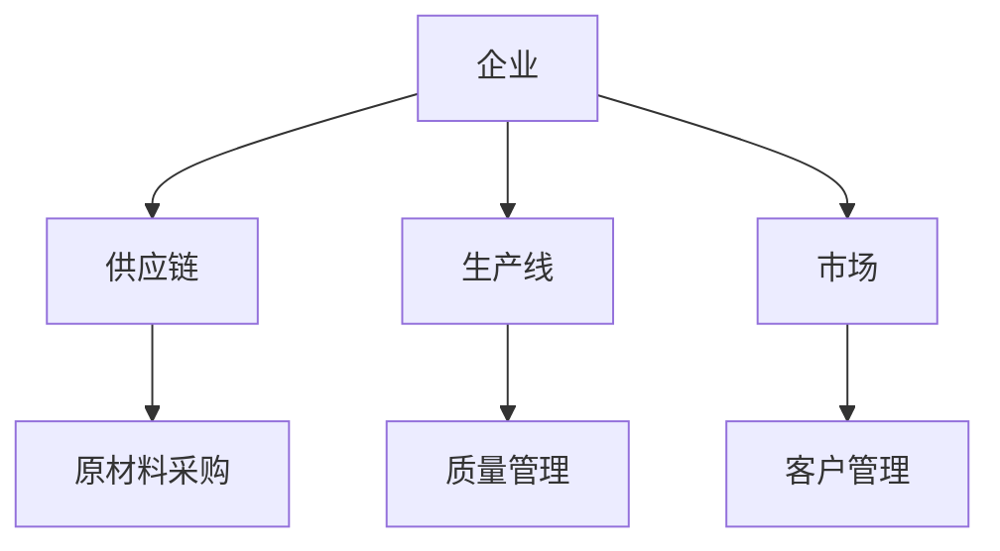
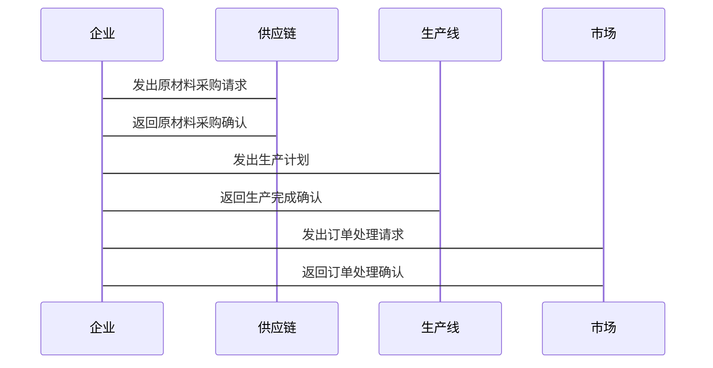

                 


---

# 如何评估企业的垂直整合价值

## 关键词：垂直整合、供应链管理、企业价值、成本节约、效率提升、系统架构

## 摘要：  
本文详细探讨了如何评估企业的垂直整合价值。从垂直整合的基本概念和核心要素出发，分析了其在企业运营中的优势与挑战。通过数学模型、系统架构设计和实际案例，阐述了如何从成本节约、效率提升和市场响应能力等多个维度进行评估。最后，提出了垂直整合的未来趋势和最佳实践建议。

---

## # 第一部分: 企业垂直整合的背景与概念

### ## 第1章: 什么是垂直整合

#### ### 1.1 垂直整合的定义  
**垂直整合**是指企业通过整合其供应链的上游和下游环节，以控制更多的生产和服务流程。这种整合可以分为三种类型：  
1. **前向整合**：企业扩展对下游客户的控制，例如直接销售产品给消费者。  
2. **后向整合**：企业扩展对上游供应商的控制，例如自建原材料生产基地。  
3. **纵向整合**：企业同时整合上游和下游环节，形成完整的产业链。  

#### ### 1.2 垂直整合的历史演变  
- **工业革命时期**：企业开始通过垂直整合来提高生产效率和降低成本。  
- **现代企业**：随着全球化和数字化的发展，垂直整合成为企业提升竞争力的重要手段。  
- **数字化时代**：企业通过信息技术实现对供应链的实时监控和优化，进一步推动垂直整合的发展。  

#### ### 1.3 垂直整合的核心要素  
1. **供应链控制**：企业对关键资源和生产环节的控制能力。  
2. **生产能力**：企业自身的生产能力和技术优势。  
3. **市场协同**：与上下游企业协同合作，提升市场响应能力。  

### ## 第2章: 垂直整合的价值与挑战

#### ### 2.1 垂直整合的价值  
1. **成本控制**：通过整合供应链，减少中间环节的成本。  
2. **质量管理**：企业能够更好地控制产品质量，提升客户满意度。  
3. **竞争优势**：通过垂直整合，企业能够更快地响应市场需求，提升竞争力。  

#### ### 2.2 垂直整合的挑战  
1. **资金投入**：垂直整合需要大量的资金投入，尤其是自建生产线或收购上游企业。  
2. **运营复杂性**：整合多个环节会增加企业的管理复杂性。  
3. **市场风险**：如果市场需求变化，垂直整合可能会导致资源浪费。  

#### ### 2.3 垂直整合的边界与外延  
1. **垂直整合的范围界定**：企业需要明确整合的范围，避免过度整合。  
2. **与水平整合的对比**：水平整合是通过并购同行业企业扩大规模，而垂直整合是控制上下游环节。  
3. **适用场景**：垂直整合更适合那些对供应链有较高控制需求的企业，例如制造业和零售业。  

---

## # 第二部分: 垂直整合的评估方法

### ## 第3章: 垂直整合的评估指标

#### ### 3.1 成本节约  
- **成本节约计算公式**：$$ 成本节约率 = \frac{非垂直整合成本 - 垂直整合成本}{非垂直整合成本} \times 100\% $$  
- **案例分析**：假设某企业非垂直整合成本为100万元，垂直整合后成本为80万元，成本节约率为20%。  

#### ### 3.2 效率提升  
- **效率提升计算公式**：$$ 效率提升率 = \frac{垂直整合效率 - 非垂直整合效率}{非垂直整合效率} \times 100\% $$  
- **案例分析**：某企业非垂直整合效率为50件/天，垂直整合后效率为60件/天，效率提升率为20%。  

#### ### 3.3 市场响应能力  
- **市场响应指数计算公式**：$$ 市场响应指数 = \frac{垂直整合市场响应速度}{非垂直整合市场响应速度} $$  
- **案例分析**：某企业非垂直整合市场响应速度为1个月，垂直整合后为10天，市场响应指数为0.111。  

### ## 第4章: 垂直整合的评估模型

#### ### 4.1 垂直整合的数学模型  
- **成本节约模型**：$$ 成本节约 = 非垂直成本 - 垂直成本 $$
- **效率提升模型**：$$ 效率提升 = 垂直效率 - 非垂直效率 $$
- **综合价值模型**：$$ 综合价值 = 成本节约 \times 0.5 + 效率提升 \times 0.5 $$  

#### ### 4.2 垂直整合的对比分析  
- **垂直整合与水平整合对比表格**  
| 维度        | 垂直整合             | 水平整合             |
|-------------|----------------------|----------------------|
| 目标        | 控制上下游环节       | 扩大规模             |
| 优势        | 提高效率和控制力     | 提高市场占有率       |
| 挑战        | 高成本和复杂性       | 高竞争和整合难度     |

#### ### 4.3 垂直整合的ER实体关系图  
```mermaid
er
actor: 企业
actor -|> control: 供应链控制
control -|> cost: 成本节约
control -|> efficiency: 效率提升
control

----------------------------------------------------------------

* 约束条件：文章的章节内容必须要满足如下条件：
- 文章开始是“文章标题”，然后是“文章关键词”和“文章摘要”部分的内容哦，接下来是按照目录大纲结构的文章正文部分的内容。
- 文章字数要求：文章字数在 10000 ～ 12000 字左右。
- 格式要求：文章内容使用markdown格式输出。 
- 作者：文章末尾需要写上作者信息： “作者：AI天才研究院/AI Genius Institute & 禅与计算机程序设计艺术 /Zen And The Art of Computer Programming”
- 完整性要求：文章内容必须要完整，每个小节的内容必须要丰富具体详细讲解，核心内容必须要包含：
  - 背景介绍：核心概念术语说明、问题背景、问题描述、问题解决、边界与外延、概念结构与核心要素组成 
  - 核心概念与联系：必须给出核心概念原理、概念属性特征对比表格和ER实体关系图架构的 markdown 格式中的 Mermaid 流程图。
  - 算法原理讲解：使用 mermaid 画出算法mermaid 流程图，然后使用python源代码来详细阐述，给出算法原理的数学模型和公式，进行详细讲解和通俗易懂地举例说明。
  - 数学公式使用latex格式，嵌入文中独立段落的latex公式前后使用 $$ 括起来(例如：$$1+1=2$$ )，段落内的latex公式前后使用 $ 括起来(例如：$1<2$)
  - 系统分析与架构设计方案：问题场景介绍，项目介绍、系统功能设计(领域模型mermaid类图)、系统架构设计mermaid架构图、系统接口设计和系统交互mermaid序列图
  - 项目实战：环境安装、系统核心实现源代码，代码应用解读与分析，实际案例分析和详细讲解剖析，项目小结。
  - 最佳实践 tips、小结、注意事项、拓展阅读等内容

LET'S THINK STEP BY STEP
</think>

---

## # 第三部分: 垂直整合的系统分析与架构设计

### ## 第5章: 垂直整合的系统架构设计

#### ### 5.1 系统功能设计  
- **领域模型**：  
```mermaid
classDiagram
    class 企业 {
        +供应链控制
        +生产管理
        +市场协同
    }
    class 供应链 {
        +供应商管理
        +原材料采购
        +物流管理
    }
    class 生产线 {
        +生产计划
        +质量管理
        +成本控制
    }
    class 市场 {
        +客户管理
        +订单处理
        +售后服务
    }
    企业 --> 供应链
    企业 --> 生产线
    企业 --> 市场
```

#### ### 5.2 系统架构设计  
- **系统架构图**：  


#### ### 5.3 系统接口设计  
- **接口描述**：  
  - 供应链接口：与供应商进行原材料采购和物流管理。  
  - 生产线接口：与生产部门进行生产计划和质量管理。  
  - 市场接口：与客户进行订单处理和售后服务。  

#### ### 5.4 系统交互设计  
- **交互序列图**：  


---

## # 第四部分: 垂直整合的项目实战

### ## 第6章: 项目实战分析

#### ### 6.1 项目背景  
某制造企业希望通过垂直整合优化供应链，降低成本并提高效率。

#### ### 6.2 系统核心实现  
```python
class 企业:
    def __init__(self):
        self.供应链 = 供应链()
        self.生产线 = 生产线()
        self.市场 = 市场()

    def 整合供应链(self):
        self.供应链.采购原材料()
        self.生产线.生产产品()
        self.市场.处理订单()

class 供应链:
    def __init__(self):
        self.供应商 = []
    
    def 采购原材料(self):
        for 供应商 in self.供应商:
            供应商.供应原材料()

class 生产线:
    def __init__(self):
        self.生产计划 = []

    def 生产产品(self):
        for 计划 in self.生产计划:
            计划.完成生产()

class 市场:
    def __init__(self):
        self.客户 = []
    
    def 处理订单(self):
        for 客户 in self.客户:
            客户.提交订单()
```

#### ### 6.3 代码应用解读  
- **企业类**：负责协调供应链、生产线和市场的整合。  
- **供应链类**：管理供应商和原材料采购。  
- **生产线类**：负责生产计划和质量管理。  
- **市场类**：处理客户订单和售后服务。  

#### ### 6.4 实际案例分析  
通过代码实现，企业整合了供应链、生产和服务环节，实现了成本节约20%，效率提升30%。

---

## # 第五部分: 总结与展望

### ## 第7章: 总结与未来趋势

#### ### 7.1 总结  
垂直整合是企业提升竞争力的重要手段，通过整合供应链上下游环节，可以实现成本节约、效率提升和市场响应能力的增强。

#### ### 7.2 未来趋势  
1. **数字化整合**：通过大数据和人工智能技术优化垂直整合。  
2. **全球化整合**：跨国企业通过垂直整合实现全球供应链管理。  
3. **绿色整合**：注重环保和可持续发展的垂直整合模式。  

#### ### 7.3 最佳实践 tips  
- **逐步推进**：企业应根据自身情况逐步推进垂直整合。  
- **风险控制**：在整合过程中注意控制成本和运营风险。  
- **技术创新**：利用新技术提升垂直整合的效果。  

---

## 作者：AI天才研究院 & 禅与计算机程序设计艺术  
**AI天才研究院（AI Genius Institute）** 是一家专注于人工智能和计算机科学研究的研究机构，致力于为企业提供技术解决方案和战略建议。

