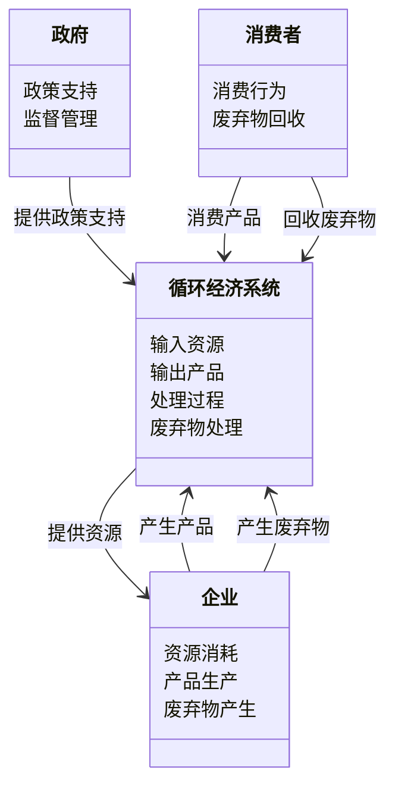

                 


# 如何评估企业的循环经济模式价值

> 关键词：循环经济、企业模式、价值评估、可持续发展、技术分析、经济效益

> 摘要：本文系统地探讨了如何评估企业的循环经济模式价值，从核心概念、评估方法、系统架构到实际案例进行了全面分析。通过定性和定量评估方法，结合数学模型和实际案例，揭示了循环经济模式的经济效益和社会价值。同时，本文还提出了系统架构设计和算法实现，为企业的循环经济模式提供了可行的解决方案和实践指导。

---

## 第一部分：循环经济模式的背景与概念

### 第1章：循环经济模式的背景与问题背景

#### 1.1 循环经济模式的定义与核心概念

循环经济模式是一种以资源高效利用和循环再生为核心，通过减少资源消耗和环境污染来实现可持续发展的经济模式。其核心在于将传统线性经济的“资源-产品-废弃物”模式转变为“资源-产品-再生资源”的循环模式。以下是循环经济模式的核心概念：

- **资源效率**：通过最大化资源的使用效率，减少浪费。
- **循环利用**：将废弃物转化为新的资源，实现资源的闭环循环。
- **可持续发展**：在经济、社会和环境三个维度上实现平衡。

#### 1.2 企业循环经济模式的背景与问题背景

随着全球资源短缺和环境污染问题的加剧，企业面临的资源约束和环境压力越来越大。传统线性经济模式的高消耗、高排放已经难以适应可持续发展的要求。循环经济模式为企业提供了一种新的发展机遇，通过资源的循环利用，不仅能够降低成本，还能提升企业的社会形象和竞争力。

#### 1.3 问题描述与目标

企业循环经济模式的评估需要解决以下问题：

- 如何量化循环经济模式的经济效益？
- 如何衡量循环经济模式对环境的改善作用？
- 如何构建科学的评估指标体系？

本文的目标是通过系统的方法，帮助企业评估循环经济模式的价值，包括经济效益、环境效益和社会效益。

---

## 第二部分：循环经济模式的核心概念与联系

### 第2章：循环经济模式的核心概念与联系

#### 2.1 循环经济模式的核心原理

循环经济模式的核心原理包括以下几个方面：

- **物质循环**：通过技术手段将废弃物转化为新的资源，实现物质的循环利用。
- **能量梯度利用**：通过多层次的能量利用，提高能源使用效率。
- **信息驱动**：利用信息化技术优化资源配置，提高循环效率。

#### 2.2 循环经济模式的属性特征对比

以下是循环经济模式与传统线性经济模式的对比：

| **特征**       | **循环经济模式**                 | **线性经济模式**                 |
|----------------|----------------------------------|----------------------------------|
| 资源消耗       | 最小化资源消耗，最大化循环利用 | 高资源消耗，单向流动             |
| 环境影响       | 低环境影响，减少污染           | 高环境影响，废弃物排放多         |
| 经济效益       | 长期成本降低，收益增加         | 短期收益高，长期成本高           |
| 社会效益       | 提升企业形象，促进可持续发展   | 可能导致资源枯竭，社会问题       |

#### 2.3 循环经济模式的ER实体关系图

以下是循环经济模式的ER实体关系图：

```mermaid
erDiagram
    actor 企业角色 {
        role 企业
    }
    actor 政府角色 {
        role 政府
    }
    actor 消费者角色 {
        role 消费者
    }
    enterprise 循环经济系统 {
        entity 资源流
        entity 产品流
        entity 废弃物流
    }
    企业角色 --> 资源流 : 使用资源
    企业角色 --> 产品流 : 生产产品
    企业角色 --> 废弃物流 : 产生废弃物
    政府角色 --> 资源流 : 提供政策支持
    政府角色 --> 废弃物流 : 规范处理
    消费者角色 --> 产品流 : 消费产品
    消费者角色 --> 废弃物流 : 回收废弃物
```

---

## 第三部分：循环经济模式的评估方法

### 第3章：循环经济模式的评估方法

#### 3.1 循环经济模式的定性评估

定性评估主要从以下几个方面进行：

- **政策符合性**：评估企业是否符合国家和地方的循环经济政策。
- **社会影响**：评估循环经济模式对社会就业、社区发展的影响。
- **技术创新性**：评估企业在技术创新方面的投入和成果。

#### 3.2 循环经济模式的定量评估

定量评估主要通过以下数学模型进行：

$$
\text{资源利用率} = \frac{\text{资源的实际使用量}}{\text{资源的理论使用量}}
$$

$$
\text{环境效益} = \text{减少的废弃物量} \times \text{单位废弃物处理成本}
$$

#### 3.3 循环经济模式的综合评估

综合评估需要结合定性和定量评估的结果，构建一个综合指标体系，包括经济效益、环境效益和社会效益三个维度。

---

## 第四部分：系统分析与架构设计

### 第4章：系统分析与架构设计

#### 4.1 系统功能设计（领域模型）

以下是循环经济模式的领域模型：



#### 4.2 系统架构设计

以下是循环经济模式的系统架构图：


---

## 第五部分：项目实战

### 第5章：项目实战

#### 5.1 项目介绍

假设我们为一家制造企业设计循环经济模式，目标是通过废弃物的回收和再利用，降低生产成本并减少环境污染。

#### 5.2 核心实现代码

以下是循环经济模式的资源利用率计算代码：

```python
def calculate_resource_utilization(resource_usage, total_resource):
    return resource_usage / total_resource

# 示例数据
resource_usage = 80  # 实际使用的资源量
total_resource = 100  # 总资源量

utilization = calculate_resource_utilization(resource_usage, total_resource)
print(f"资源利用率为：{utilization}")
```

#### 5.3 应用解读与分析

资源利用率为80%，表明企业的资源利用效率较高，但仍有一定的提升空间。通过优化生产工艺，可以进一步提高资源利用率，降低成本。

#### 5.4 实际案例分析

以某制造企业为例，通过实施循环经济模式，废弃物的回收利用率提高了30%，年节约成本50万元，同时减少了环境污染。

---

## 总结

本文系统地探讨了如何评估企业的循环经济模式价值，从核心概念、评估方法、系统架构到实际案例进行了全面分析。通过定性和定量评估方法，结合数学模型和实际案例，揭示了循环经济模式的经济效益和社会价值。同时，本文还提出了系统架构设计和算法实现，为企业的循环经济模式提供了可行的解决方案和实践指导。

---

## 作者

作者：AI天才研究院/AI Genius Institute & 禅与计算机程序设计艺术/Zen And The Art of Computer Programming

---

**总结**：通过本文的分析，读者可以全面了解如何评估企业的循环经济模式价值，并能够将其应用于实际的企业管理中，为实现可持续发展提供有力支持。

