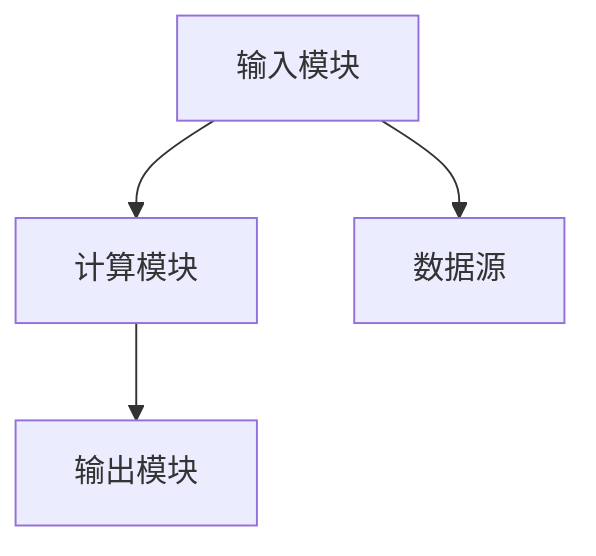
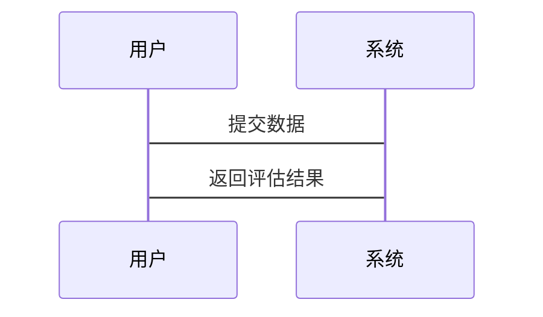

                 


# 如何评估企业的战略联盟价值

## 关键词：战略联盟、企业价值、价值评估、合作模型、数学建模

## 摘要：  
本文将系统性地探讨如何评估企业的战略联盟价值。首先，从战略联盟的基本概念和重要性入手，详细阐述其与企业价值的关系。接着，分析战略联盟价值评估的核心要素和维度，包括经济价值、战略价值和无形价值。随后，结合层次分析法（AHP）和模糊综合评价法，详细讲解数学建模的方法与实现。最后，通过实际案例分析，总结战略联盟价值评估的关键点和最佳实践，为企业的战略决策提供有力支持。

---

# 第一部分：战略联盟价值评估的背景与概念

## 第1章：战略联盟的基本概念

### 1.1 战略联盟的定义与特点

战略联盟是一种企业间合作的形式，通过资源共享、优势互补，实现共同目标。其特点包括：  
- **临时性**：合作通常基于特定目标，而非长期绑定。  
- **灵活性**：合作模式可以根据市场变化进行调整。  
- **协作性**：强调双方在资源、信息和技术上的协同。

### 1.2 战略联盟的重要性

战略联盟的重要性体现在以下方面：  
- **提升竞争力**：通过合作获取对方的核心能力，增强市场地位。  
- **降低风险**：分担开发和市场拓展的成本与风险。  
- **创新推动**：合作有助于加速技术与商业模式的创新。

### 1.3 战略联盟与企业合作的区别

- **企业合作**：通常指短期交易或合作项目，缺乏战略一致性。  
- **战略联盟**：注重长期目标的一致性和资源共享，具有更强的战略性。

## 第2章：战略联盟的历史与发展

### 2.1 战略联盟的起源

战略联盟的概念起源于20世纪60年代的“企业合作”思想，早期形式包括技术授权和联合研发。  

### 2.2 战略联盟的演变

随着市场竞争加剧，企业逐渐从单纯的分工合作转向深度的战略协同。现代战略联盟更加注重生态系统建设，例如苹果与多家供应商的合作模式。

## 第3章：战略联盟与企业价值的关系

### 3.1 战略联盟对企业价值的影响

战略联盟通过资源整合和协同效应，显著提升企业的市场影响力和盈利能力。例如，某科技公司通过与芯片制造商合作，成功降低了生产成本，提升了产品性能。

### 3.2 战略联盟的边界与外延

- **边界**：战略联盟通常以明确的目标为导向，超出目标的合作可能不被纳入联盟范围。  
- **外延**：战略联盟可以扩展至供应链、分销渠道等多个领域，形成完整的生态系统。

---

# 第二部分：战略联盟价值评估的核心概念与联系

## 第4章：战略联盟价值评估的核心要素

### 4.1 战略联盟价值的构成要素

- **资源互补性**：双方是否在技术、市场或生产资源上具有互补性。  
- **风险分担机制**：合作中如何分配风险和收益，是否具备合理的激励机制。  
- **价值共创潜力**：双方合作是否能够创造新的价值，超越单独行动的成果。

### 4.2 战略联盟价值评估的维度

- **经济价值**：包括成本节约、收入增长等可量化的指标。  
- **战略价值**：如市场地位提升、技术领先性等非量化因素。  
- **无形价值**：品牌影响力、企业声誉等长期效益。

## 第5章：战略联盟价值评估的核心原理

### 5.1 战略联盟价值评估的理论基础

- **资源基础视角**：企业价值来源于核心资源的优化配置。  
- **交易成本理论**：通过合作降低交易成本，提升效率。  
- **协作优势理论**：合作带来的协同效应超过个体能力的总和。

### 5.2 战略联盟价值评估的模型

- **资源互补模型**：通过评估双方资源匹配度，预测合作效果。  
- **协作效率模型**：基于合作过程中的效率指标，量化合作价值。  
- **价值共创模型**：关注合作双方如何共同创造新价值，评估其对双方的长期影响。

---

# 第三部分：战略联盟价值评估的算法与数学模型

## 第6章：战略联盟价值评估的算法原理

### 6.1 层次分析法（AHP）

层次分析法是一种定性与定量相结合的决策分析方法。其步骤如下：

1. **构建层次结构**：明确目标层、准则层和方案层。  
2. **确定各层权重**：通过专家评分，计算各准则的相对权重。  
3. **计算方案得分**：结合权重和方案在各准则上的表现，得出最终得分。

**公式示例**：  
层次分析法中，权重计算公式为：  
$$ A = \frac{w_i}{\sum w_j} $$  

### 6.2 模糊综合评价法

模糊综合评价法适用于评估对象具有模糊性的场景。其步骤如下：

1. **建立评价指标体系**：确定关键评价指标。  
2. **构建模糊关系矩阵**：用模糊语言变量描述各指标的隶属度。  
3. **计算综合评价结果**：通过模糊运算，得出最终评价结果。

**公式示例**：  
模糊综合评价法中，综合指数计算公式为：  
$$ F = \sum_{i=1}^{n} w_i \cdot R_i $$  

---

## 第7章：战略联盟价值评估的系统分析与架构设计

### 7.1 系统功能设计

- **输入模块**：接收企业战略联盟的相关数据。  
- **计算模块**：执行层次分析法或模糊综合评价法的计算。  
- **输出模块**：生成评估报告和可视化结果。

### 7.2 系统架构设计

使用Mermaid绘制系统架构图：



### 7.3 系统接口设计

- **输入接口**：提供API供企业导入数据。  
- **输出接口**：生成评估报告并导出为可读格式。

### 7.4 系统交互设计

使用Mermaid绘制交互流程图：



---

## 第8章：战略联盟价值评估的项目实战

### 8.1 环境安装

需要安装Python和相关库（如`numpy`、`pandas`、`scipy`）。

### 8.2 核心实现代码

以下是层次分析法的Python实现示例：

```python
import numpy as np

def calculate_weights(matrix):
    # 计算权重向量
    max_eigenvalue = np.linalg.eigvals(matrix).max()
    weights = (matrix.max(axis=1) / max_eigenvalue)
    return weights

# 示例矩阵
matrix = np.array([[1, 2, 3],
                   [2, 1, 4],
                   [3, 4, 1]])

weights = calculate_weights(matrix)
print("权重向量为：", weights)
```

### 8.3 案例分析

以某科技公司与芯片制造商的合作为例，使用层次分析法评估合作价值，得出双方的权重分布，进而确定合作的潜在价值。

### 8.4 结果解读

通过代码输出结果，分析权重分布，为企业决策提供数据支持。

---

## 第9章：战略联盟价值评估的最佳实践

### 9.1 小结

战略联盟价值评估需要结合定性和定量方法，确保评估的全面性和准确性。

### 9.2 注意事项

- 确保数据的准确性和完整性。  
- 合理选择评估模型，避免复杂度过高。  
- 定期更新评估结果，适应市场变化。

### 9.3 拓展阅读

推荐阅读《企业合作与战略管理》和《战略联盟的经济学分析》。

---

# 第四部分：结论与展望

## 第10章：战略联盟价值评估的未来趋势

随着数字化转型的深入，战略联盟的价值评估将更加依赖大数据和人工智能技术。未来，实时动态评估和预测分析将成为趋势，帮助企业更灵活地应对市场变化。

---

# 作者

作者：AI天才研究院/AI Genius Institute & 禅与计算机程序设计艺术 /Zen And The Art of Computer Programming

