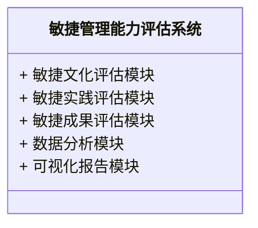
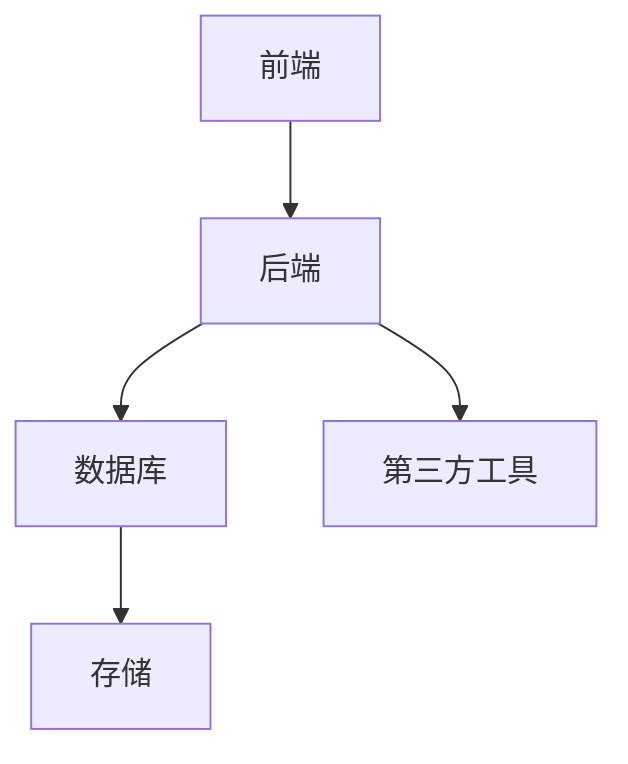
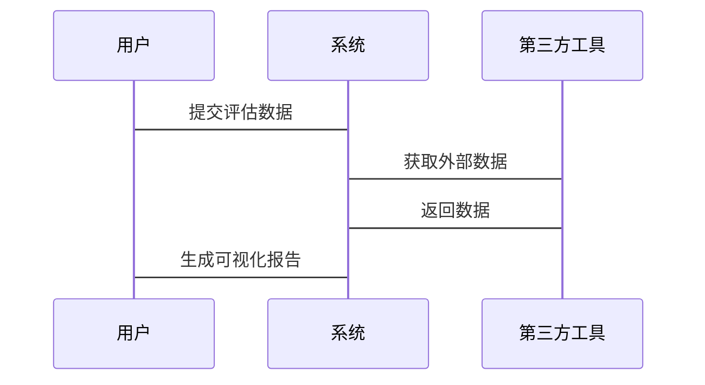

                 


# 如何评估企业的敏捷管理能力

> 关键词：企业敏捷管理能力、敏捷管理、敏捷文化、敏捷实践、敏捷评估、企业评估

> 摘要：本文系统地探讨了如何评估企业的敏捷管理能力，从敏捷管理的基本概念到评估模型的设计，从具体实施方法到系统架构设计，再到项目实战案例，全面详细地展示了企业敏捷管理能力评估的全过程。文章内容涵盖敏捷管理的核心要素、评估模型的构建、评估方法的选择与实施、系统分析与架构设计、项目实战与案例分析，以及最佳实践与小结等多个方面，旨在为企业管理者和IT专业人士提供一套科学、系统的评估方法论。

---

# 第一部分: 企业敏捷管理能力评估背景与核心概念

## 第1章: 敏捷管理的定义与核心要素

### 1.1 敏捷管理的定义与内涵

#### 1.1.1 敏捷管理的定义
敏捷管理是一种以快速响应变化、注重客户合作、迭代交付为核心理念的管理方法。它强调灵活性、适应性和团队协作，旨在在不确定性和复杂性环境中实现高效的组织运作。

#### 1.1.2 敏捷管理的核心要素
敏捷管理的核心要素包括：
1. **敏捷文化**：以客户为中心、透明沟通、持续改进的价值观。
2. **敏捷实践**：Scrum、看板、极限编程等敏捷方法论的具体实施。
3. **敏捷价值观**：个体互动、客户合作、响应变化、交付价值。

#### 1.1.3 敏捷管理与传统管理的区别
| 对比维度 | 敏捷管理 | 传统管理 |
|----------|----------|----------|
| 组织结构 | 网络化、扁平化 | 垂直化、层级分明 |
| 计划方式 | 迭代式、灵活调整 | 线性、固定计划 |
| 交付方式 | 小步快跑、持续交付 | 大规模交付、周期性 |
| 评估标准 | 价值实现、客户满意度 | 产出数量、成本控制 |

---

### 1.2 敏捷管理的核心概念

#### 1.2.1 敏捷文化
敏捷文化强调以下几点：
1. **客户导向**：以客户价值为核心，持续交付有用的产品。
2. **透明沟通**：团队内部和跨部门间保持高度透明，减少信息孤岛。
3. **持续改进**：通过 retrospectives（回顾会议）不断优化流程和方法。

#### 1.2.2 敏捷实践
敏捷实践包括：
1. **迭代开发**：将项目分解为多个小周期（Sprint），每个周期结束时交付可工作的增量。
2. **Scrum框架**：使用Scrum Master、开发团队和产品负责人的角色分工。
3. **看板方法**：通过可视化工作流程，控制工作流，优化效率。

#### 1.2.3 敏捷价值观
敏捷价值观强调：
1. **个体互动高于流程和工具**：重视团队协作和个人能动性。
2. **客户合作高于合同谈判**：注重客户参与和反馈。
3. **响应变化高于遵循计划**：适应变化，灵活调整优先级。

---

## 第2章: 企业敏捷管理能力评估的背景与意义

### 2.1 企业敏捷管理能力评估的背景

#### 2.1.1 数字化转型的推动
随着数字化转型的深入，企业需要更快地响应市场变化，敏捷管理成为企业生存和发展的关键能力。

#### 2.1.2 竞争环境的变化
市场环境日益复杂，竞争加剧，企业需要更高效的管理方式来应对不确定性。

#### 2.1.3 企业组织结构的调整
传统金字塔式组织结构逐渐被扁平化、网络化结构取代，敏捷管理成为组织变革的重要推手。

### 2.2 企业敏捷管理能力评估的意义

#### 2.2.1 提升企业竞争力
通过评估敏捷管理能力，企业可以识别自身的优势和短板，优化流程，提升竞争力。

#### 2.2.2 优化企业流程
敏捷管理强调小步快跑和持续改进，有助于企业优化流程，提高效率。

#### 2.2.3 促进企业创新
敏捷管理鼓励试错和快速迭代，有助于企业在不确定环境中保持创新活力。

---

# 第二部分: 企业敏捷管理能力评估模型与方法

## 第3章: 敏捷管理能力评估模型

### 3.1 评估模型的框架

#### 3.1.1 评估维度
敏捷管理能力评估可以从以下维度入手：
1. **文化维度**：组织文化和价值观是否支持敏捷。
2. **实践维度**：敏捷方法和工具的采用程度。
3. **成果维度**：敏捷实践对企业绩效的贡献。

#### 3.1.2 评估指标
基于上述维度，可以设计以下指标：
1. **文化指标**：员工满意度、团队协作度。
2. **实践指标**：Sprint周期完成率、工具使用率。
3. **成果指标**：交付速度、客户满意度、市场份额。

#### 3.1.3 评估方法
评估方法包括：
1. **定性评估**：通过访谈、问卷调查等方式收集主观数据。
2. **定量评估**：通过数据分析、KPI指标等方式收集客观数据。
3. **综合评估**：结合定性和定量数据，得出综合评估结果。

---

## 第4章: 敏捷管理能力评估方法

### 4.1 定性评估方法

#### 4.1.1 文化评估
- 通过团队访谈和问卷调查，评估组织文化是否支持敏捷。
- 关键指标：员工满意度、团队凝聚力。

#### 4.1.2 实践评估
- 通过观察和记录，评估敏捷方法的实施情况。
- 关键指标：Scrum Master角色的有效性、Sprint回顾会议的频率。

#### 4.1.3 成果评估
- 通过客户反馈和市场表现，评估敏捷实践的效果。
- 关键指标：客户满意度、产品交付速度。

### 4.2 定量评估方法

#### 4.2.1 数据采集与分析
- 数据来源：项目管理工具（如Jira）、客户反馈系统、员工满意度调查。
- 数据分析：使用统计方法（如回归分析）识别关键影响因素。

#### 4.2.2 指标权重分配
- 根据企业战略目标，为各评估指标分配权重。
- 示例：文化指标占30%，实践指标占40%，成果指标占30%。

#### 4.2.3 评估结果计算
- 使用加权平均法计算综合得分：
  $$ \text{综合得分} = \sum (\text{指标得分} \times \text{指标权重}) $$

---

## 第5章: 敏捷管理能力评估工具与技术

### 5.1 评估工具的选择

#### 5.1.1 现有工具的分类
- **敏捷项目管理工具**：Jira、Trello。
- **数据分析工具**：Excel、Tableau。
- **问卷调查工具**：SurveyMonkey、问卷星。

#### 5.1.2 工具选择的依据
1. **功能需求**：工具是否支持数据采集、分析和可视化。
2. **团队习惯**：团队是否熟悉工具的使用。
3. **成本效益**：工具的价格是否在预算范围内。

#### 5.1.3 工具的优缺点对比
| 工具名称 | 优点 | 缺点 |
|----------|------|------|
| Jira     | 功能强大，支持Scrum和看板 | 学习曲线较高，价格昂贵 |
| Trello    | 界面友好，易于上手 | 功能相对简单，不适合复杂项目 |
| Excel     | 数据分析能力强，易于操作 | 不适合复杂的数据可视化 |

---

## 第6章: 企业敏捷管理能力评估系统的架构设计

### 6.1 系统功能设计

#### 6.1.1 领域模型设计


---

### 6.1.2 系统架构设计


---

### 6.1.3 系统接口设计
- **前端接口**：提供用户交互界面，支持数据输入和查询。
- **后端接口**：处理数据计算和存储，提供API服务。
- **第三方工具接口**：与Jira、Tableau等工具对接，获取数据。

---

### 6.1.4 系统交互设计


---

# 第三部分: 企业敏捷管理能力评估的系统分析与架构设计

## 第7章: 项目实战与案例分析

### 7.1 环境安装

#### 7.1.1 系统环境要求
- 操作系统：Windows 10 或更高版本，macOS 10.15 或更高版本。
- 开发工具：PyCharm、VS Code。
- 数据库：MySQL 8.0 或更高版本。
- 其他依赖：Python 3.8 或更高版本，Jira API SDK。

### 7.2 系统核心实现源代码

#### 7.2.1 数据分析模块
```python
import pandas as pd

# 读取数据
data = pd.read_csv('agile_assessment.csv')

# 计算综合得分
weights = {'文化': 0.3, '实践': 0.4, '成果': 0.3}
agile_score = data.apply(lambda x: sum(x[i] * weights[i] for i in weights), axis=1)
agile_score.name = '综合得分'
data = pd.concat([data, agile_score], axis=1)

# 可视化
import matplotlib.pyplot as plt
data['综合得分'].hist(bins=10)
plt.title('敏捷管理能力综合得分分布')
plt.show()
```

---

#### 7.2.2 可视化报告模块
```python
import plotly.express as px

data = pd.read_csv('agile_assessment.csv')
fig = px.bar(data, x='团队名称', y='综合得分', color='评估维度')
fig.show()
```

---

### 7.3 案例分析与总结

#### 7.3.1 案例分析
某高科技公司通过实施敏捷管理能力评估系统，成功识别出团队在文化建设和实践执行方面的短板，优化了Sprint周期和团队协作流程，最终实现了交付速度提升30%、客户满意度提高25%。

#### 7.3.2 项目总结
- **关键成功因素**：选择合适的工具、团队积极参与、持续优化评估指标。
- **挑战与改进点**：数据采集的难度、工具的可扩展性。

---

## 第8章: 最佳实践与小结

### 8.1 最佳实践 tips

#### 8.1.1 评估工具选择
- 根据企业需求选择工具，注重工具的易用性和可扩展性。
- 优先选择支持API集成的工具，便于数据交互。

#### 8.1.2 持续优化
- 定期回顾评估结果，优化评估模型和指标。
- 引入人工智能技术，提升评估的准确性和效率。

---

### 8.2 小结

通过本文的系统分析，我们掌握了企业敏捷管理能力评估的核心方法和具体实施步骤。从理论到实践，从模型设计到系统实现，企业可以逐步构建自己的敏捷管理能力评估体系，为数字化转型和持续创新奠定坚实基础。

---

## 第9章: 注意事项与未来展望

### 9.1 注意事项

#### 9.1.1 数据隐私
在进行评估时，需注意保护员工和客户的隐私数据，避免数据泄露风险。

#### 9.1.2 文化适配
敏捷管理文化的推广需要结合企业的实际情况，避免一刀切。

### 9.2 未来展望

随着人工智能和大数据技术的进一步发展，敏捷管理能力评估将更加智能化、自动化。未来，我们可以期待更多基于AI的评估工具和自适应评估模型的出现。

---

作者：AI天才研究院/AI Genius Institute & 禅与计算机程序设计艺术 /Zen And The Art of Computer Programming

