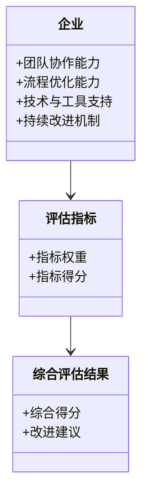
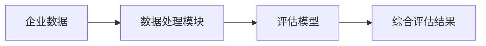
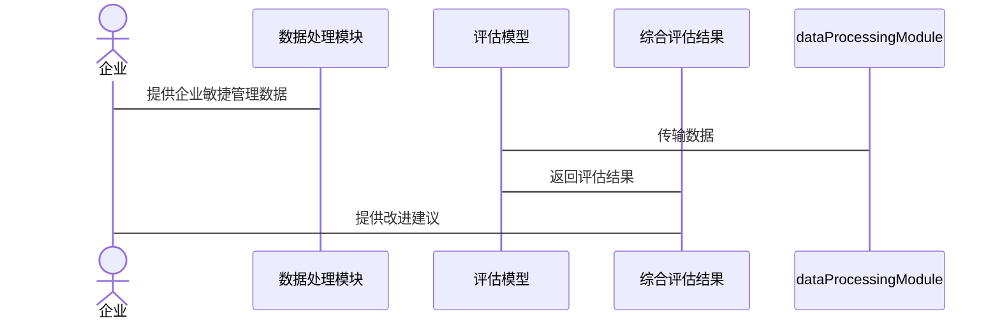

                 


# 如何评估企业的敏捷管理能力价值

## 关键词：敏捷管理、管理能力、企业价值、评估模型、系统架构、项目实战

## 摘要：  
本文旨在探讨如何评估企业的敏捷管理能力，并通过系统的分析与实践，揭示敏捷管理能力对企业价值的提升路径。文章从敏捷管理的背景与核心概念出发，构建了完整的评估模型，详细分析了系统的架构设计，并通过实际案例展示了如何将评估结果应用于项目管理实践中。通过本文的指导，企业能够更好地优化其敏捷管理能力，从而在快速变化的商业环境中保持竞争优势。

---

# 第一部分: 背景介绍与核心概念

## 第1章: 敏捷管理能力评估的背景与意义

### 1.1 敏捷管理的定义与内涵
#### 1.1.1 敏捷管理的核心概念
敏捷管理是一种以快速响应变化、注重团队协作和持续改进为核心理念的管理方法。它强调灵活性、客户合作和个体互动，与传统的命令式管理方式形成鲜明对比。

#### 1.1.2 敏捷管理与传统管理的区别
| 方面 | 敏捷管理 | 传统管理 |
|------|----------|----------|
| 结构 | 扁平化 | 垂直化 |
| 决策 | 分权式 | 集权式 |
| 重点 | 迭代交付 | 一次性交付 |
| 反馈 | 快速 | 延时 |

#### 1.1.3 敏捷管理能力对企业价值的影响
- 提高团队协作效率
- 加快产品交付速度
- 提升客户满意度
- 增强企业的市场竞争力

### 1.2 企业敏捷管理能力评估的必要性
#### 1.2.1 当前企业面临的管理挑战
- 市场需求快速变化
- 团队协作效率低下
- 流程僵化，难以适应变化

#### 1.2.2 敏捷管理能力评估的意义
- 量化管理能力的优劣势
- 为管理优化提供数据支持
- 帮助企业制定科学的管理策略

---

## 第2章: 敏捷管理能力评估的核心要素

### 2.1 敏捷管理能力的维度分解
#### 2.1.1 团队协作能力
团队协作能力是敏捷管理的核心，包括团队成员的沟通效率、任务分配的合理性以及团队凝聚力的强弱。

#### 2.1.2 流程优化能力
流程优化能力是指企业在业务流程设计上是否能够快速响应变化，流程是否高效且灵活。

#### 2.1.3 技术与工具支持
技术与工具支持是敏捷管理的基石，包括使用的项目管理工具、代码管理工具、测试工具等。

#### 2.1.4 持续改进机制
持续改进机制是指企业是否有系统化的办法来不断优化其管理流程和方法。

### 2.2 核心概念与联系
#### 2.2.1 敏捷管理能力的实体关系图


#### 2.2.2 核心要素对比分析表
| 要素 | 描述 | 关键指标 |
|------|------|----------|
| 团队协作能力 | 团队成员的沟通与协作效率 | 沟通频率、任务完成率 |
| 流程优化能力 | 业务流程的效率与灵活性 | 流程执行时间、变更频率 |
| 技术与工具支持 | 技术平台与工具的支撑能力 | 工具使用率、技术支持响应时间 |
| 持续改进机制 | 持续优化管理过程的能力 | 改进周期、改进效果 |

---

# 第二部分: 敏捷管理能力评估模型

## 第3章: 敏捷管理能力评估模型构建

### 3.1 评估模型的设计原理
#### 3.1.1 模型设计的目标
- 量化企业的敏捷管理能力
- 识别管理中的瓶颈与改进点
- 为管理优化提供数据支持

#### 3.1.2 模型的输入与输出
- 输入：企业敏捷管理能力的各维度数据
- 输出：综合评估结果及改进建议

#### 3.1.3 模型的适用范围
适用于各类企业，尤其是需要快速响应市场变化的企业。

### 3.2 评估指标体系的构建
#### 3.2.1 指标体系的设计原则
- 全面性：涵盖敏捷管理的各个维度
- 可量化：指标能够被量化和测量
- 可操作性：便于数据收集和分析

#### 3.2.2 指标权重的确定方法
- 采用层次分析法（AHP）确定各指标的权重。

#### 3.2.3 指标数据的采集方式
- 调查问卷
- 数据分析
- 面谈访谈

### 3.3 数学模型与公式
#### 3.3.1 综合评估公式
$$ \text{综合评估值} = \sum_{i=1}^{n} w_i \cdot x_i $$
其中，$w_i$ 为第 $i$ 个指标的权重，$x_i$ 为第 $i$ 个指标的得分。

#### 3.3.2 示例计算
假设某企业的敏捷管理能力评估指标包括团队协作能力（权重0.3）、流程优化能力（权重0.3）、技术与工具支持（权重0.2）、持续改进机制（权重0.2）。各项指标的得分为80、75、85、90。

综合评估值 = (0.3×80) + (0.3×75) + (0.2×85) + (0.2×90) = 24 + 22.5 + 17 + 18 = 81.5

---

## 第4章: 系统分析与架构设计方案

### 4.1 问题场景介绍
企业在进行敏捷管理能力评估时，通常面临数据采集困难、评估标准不统一、结果难以量化等问题。

### 4.2 系统功能设计
#### 4.2.1 领域模型mermaid类图


### 4.3 系统架构设计
#### 4.3.1 系统架构图


### 4.4 系统接口设计
- 输入接口：企业敏捷管理能力的各维度数据
- 输出接口：综合评估结果及改进建议

### 4.5 系统交互mermaid序列图


---

## 第5章: 项目实战

### 5.1 环境安装
- 安装Python编程语言
- 安装Jupyter Notebook用于数据分析
- 安装Mermaid工具用于绘制图表

### 5.2 系统核心实现源代码
```python
# 示例代码：计算综合评估值
def calculate_composite_score(weights, scores):
    return sum(w * s for w, s in zip(weights, scores))

# 示例使用
weights = [0.3, 0.3, 0.2, 0.2]
scores = [80, 75, 85, 90]
composite_score = calculate_composite_score(weights, scores)
print(f"综合评估值为：{composite_score}")
```

### 5.3 代码应用解读与分析
- 上述代码定义了一个计算综合评估值的函数，并通过示例展示了其使用方法。
- 输入参数包括权重和各指标的得分。
- 输出结果为综合评估值。

### 5.4 实际案例分析
某企业经过评估后，综合评估值为81.5分，属于中等偏上水平。评估结果表明，该企业在持续改进机制方面表现较好，但在团队协作能力方面存在改进空间。

### 5.5 项目小结
通过实际案例分析，验证了评估模型的有效性和实用性。企业在实际应用中，可以根据评估结果制定针对性的改进计划。

---

## 第6章: 总结与最佳实践

### 6.1 小结
- 敏捷管理能力评估是企业优化管理的重要工具。
- 通过科学的评估模型和系统的架构设计，企业可以更精准地识别管理中的问题，并制定有效的改进措施。

### 6.2 注意事项
- 数据采集的准确性和完整性是评估结果可靠性的关键。
- 在实际应用中，应根据企业的实际情况调整评估指标和权重。

### 6.3 拓展阅读
- 推荐阅读《敏捷宣言》和《敏捷项目管理》等相关书籍，深入理解敏捷管理的核心思想。

---

# 作者：AI天才研究院/AI Genius Institute & 禅与计算机程序设计艺术 /Zen And The Art of Computer Programming

---

通过以上目录结构，您可以逐步撰写出一篇逻辑清晰、内容丰富的技术博客文章。

