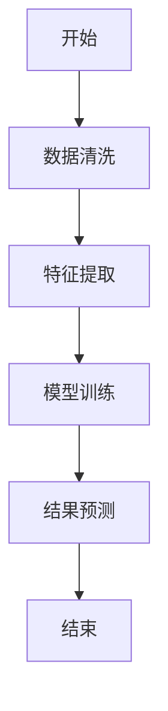
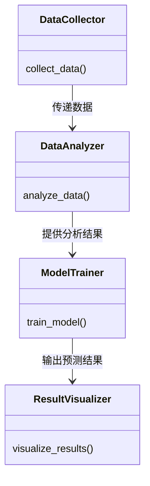
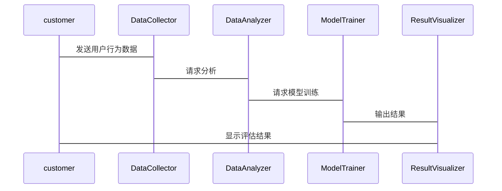

                 


```markdown
# 如何评估企业的数字化营销效果

> 关键词：数字化营销效果评估、数据分析、KPI、渠道评估、用户行为分析

> 摘要：本文详细探讨了如何系统地评估企业的数字化营销效果，从核心概念的理解、数据分析方法的应用、算法原理的解析到实际案例的分析，层层深入，为读者提供全面的指导。通过科学的方法和工具，帮助企业在数字化营销中做出更明智的决策。

---

## 第1章 数字化营销效果评估概述

### 1.1 数字化营销的定义与特点
1.1.1 数字化营销的定义  
1.1.2 数字化营销的核心特点  
1.1.3 数字化营销与传统营销的区别  

### 1.2 数字化营销效果评估的重要性
1.2.1 数字化营销对企业的影响  
1.2.2 评估数字化营销效果的意义  
1.2.3 数字化营销效果评估的边界与外延  

### 1.3 数字化营销效果评估的挑战
1.3.1 数据收集的复杂性  
1.3.2 数据分析的难度  
1.3.3 评估指标的选择与权重  

## 第2章 数字化营销效果评估的核心概念与联系

### 2.1 核心概念原理
2.1.1 数据驱动的营销分析  
2.1.2 多维度评估指标  
2.1.3 数据分析与决策优化  

### 2.2 核心概念对比表
2.2.1 不同评估指标的对比分析  
2.2.2 不同渠道效果的对比分析  
2.2.3 不同时间段表现的对比分析  

### 2.3 实体关系图
```mermaid
erDiagram
    customer [顾客] {
        id : int
        name : string
        email : string
    }
    campaign [营销活动] {
        id : int
        name : string
        start_date : date
        end_date : date
    }
    interaction [用户行为] {
        id : int
        type : string
        timestamp : datetime
    }
    conversion [转化行为] {
        id : int
        type : string
        value : float
    }
    customer --> interaction : 产生
    campaign --> interaction : 触发
    interaction --> conversion : 导致
```

## 第3章 数字化营销效果评估的算法原理

### 3.1 算法原理概述
3.1.1 数据预处理与特征工程  
3.1.2 模型选择与训练  
3.1.3 模型评估与优化  

### 3.2 典型算法解析


### 3.3 Python实现示例
```python
import pandas as pd
from sklearn.model import LinearRegression

# 数据预处理
data = pd.read_csv('marketing_data.csv')
data_cleaned = data.dropna()

# 特征提取
features = data_cleaned[['age', 'income', 'clicks']]
target = data_cleaned['conversion']

# 模型训练
model = LinearRegression()
model.fit(features, target)

# 模型预测
predictions = model.predict(features)
```

### 3.4 数学模型与公式
$$ R^2 = 1 - \frac{\sum (y_i - \hat{y}_i)^2}{\sum (y_i - \bar{y})^2} $$

---

## 第4章 系统分析与架构设计

### 4.1 问题场景介绍
4.1.1 数据来源与整合  
4.1.2 系统功能需求  
4.1.3 系统性能需求  

### 4.2 系统架构设计


### 4.3 系统交互流程


## 第5章 项目实战：数字化营销效果评估案例

### 5.1 环境安装与数据准备
5.1.1 安装必要的库（如Python、Pandas、Scikit-learn）  
5.1.2 数据集下载与预处理  

### 5.2 系统核心实现
```python
from sklearn.metrics import accuracy_score

# 数据准备
X_train, y_train, X_test, y_test = prepare_data()

# 模型训练
model = DecisionTreeClassifier()
model.fit(X_train, y_train)

# 模型评估
y_pred = model.predict(X_test)
print("准确率：", accuracy_score(y_test, y_pred))
```

### 5.3 案例分析与结果解读
5.3.1 数据可视化结果  
5.3.2 模型评估指标分析  
5.3.3 实际应用中的注意事项  

## 第6章 最佳实践与小结

### 6.1 最佳实践 tips
6.1.1 数据质量管理的重要性  
6.1.2 模型选择与调优的技巧  
6.1.3 结果解释与沟通的技巧  

### 6.2 小结
总结全文内容，强调数字化营销效果评估的重要性与实际应用价值。

### 6.3 注意事项
6.3.1 数据隐私与合规性  
6.3.2 模型的可解释性  
6.3.3 持续优化与改进  

### 6.4 拓展阅读
推荐相关书籍、论文和在线资源，供读者进一步学习。

---

## 作者：AI天才研究院 & 禅与计算机程序设计艺术
```

