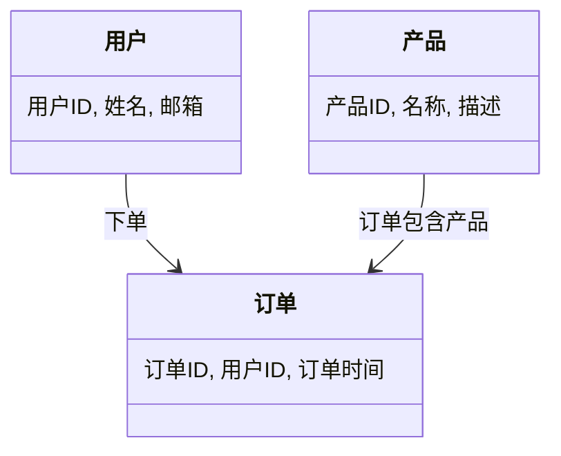
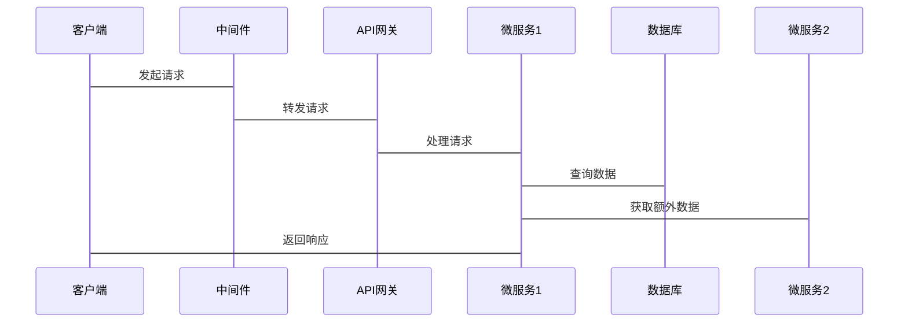
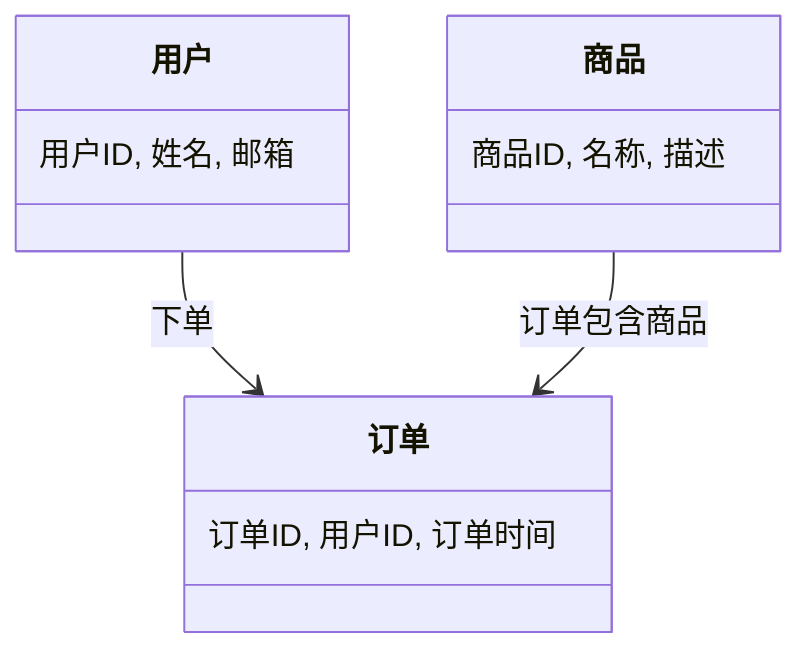

                 

# 如何评估企业的数字化转型价值

> 关键词：企业数字化转型，价值评估，数字化转型框架，成本与收益分析，系统架构设计，数字化战略

> 摘要：本文深入探讨了如何评估企业的数字化转型价值，从数字化转型的背景、核心概念到价值评估的方法论，再到系统架构设计和实际案例分析，为企业提供全面的指导和实用的建议。

---

# 第一部分: 企业数字化转型的背景与核心概念

## 第1章: 数字化转型的背景与问题背景

### 1.1 什么是数字化转型

#### 1.1.1 数字化转型的定义
数字化转型（Digital Transformation）是指通过利用数字技术（如大数据、人工智能、云计算等）重新设计业务模式、流程、文化和工具，以实现业务创新和价值提升的过程。数字化转型不仅仅是技术的更新，更是对整个组织的重构和优化。

#### 1.1.2 数字化转型的核心概念
- **技术驱动**：数字化转型依赖于先进的数字技术，如大数据、人工智能、物联网等。
- **业务重构**：通过数字化技术改变传统的业务流程和模式，创造新的价值。
- **组织变革**：数字化转型需要组织结构、文化和员工能力的全面调整。

#### 1.1.3 数字化转型的边界与外延
数字化转型的边界包括企业的业务流程、组织结构和技术架构，外延则涉及客户体验、供应链管理、产品创新等多个方面。

### 1.2 数字化转型的必要性

#### 1.2.1 传统企业面临的挑战
- 传统业务模式逐渐被数字化竞争对手取代。
- 数据孤岛问题导致效率低下。
- 客户需求变化快，传统模式难以快速响应。

#### 1.2.2 数字化转型对企业发展的推动作用
- 提高业务效率和客户满意度。
- 创新商业模式，开拓新的市场机会。
- 提升企业的竞争力和可持续发展能力。

#### 1.2.3 数字化转型的行业背景与趋势
- 全球化和数字化浪潮的推动。
- 技术进步（如AI、大数据）为企业转型提供了强大工具。
- 客户需求日益个性化和多样化。

---

## 第2章: 数字化转型的核心要素与概念结构

### 2.1 数字化转型的核心要素

#### 2.1.1 技术要素
- 大数据技术：帮助企业分析海量数据，提取有价值的信息。
- 人工智能：通过AI技术优化决策和自动化流程。
- 云计算：提供弹性计算资源，支持企业的灵活扩展。

#### 2.1.2 流程要素
- 业务流程优化：通过数字化技术重新设计流程，提高效率。
- 数据流管理：确保数据在企业内部高效流动。
- 知识管理：通过数字化手段优化知识共享和利用。

#### 2.1.3 组织要素
- 组织结构调整：从传统金字塔式结构向扁平化、网络化转变。
- 文化变革：鼓励创新、协作和数据驱动的决策文化。
- 人员能力提升：通过培训提升员工的数字化技能。

### 2.2 数字化转型的概念结构

#### 2.2.1 业务模式的转变
- 从产品导向转向服务导向。
- 从单一业务转向多元化、生态化业务模式。

#### 2.2.2 技术架构的演进
- 从传统IT架构转向微服务架构。
- 从孤岛式系统转向集成化、平台化架构。

#### 2.2.3 组织文化的变革
- 从命令式管理转向敏捷、协作式管理。
- 从经验驱动转向数据驱动。

---

# 第二部分: 数字化转型价值的评估方法论

## 第3章: 数字化转型价值的评估框架

### 3.1 价值评估的维度

#### 3.1.1 经济价值
- 收益增加：通过数字化转型带来的收入增长。
- 成本降低：通过自动化和流程优化减少运营成本。

#### 3.1.2 社会价值
- 创新能力提升：通过数字化转型推动产品和服务创新。
- 客户满意度提升：通过个性化服务提高客户忠诚度。

#### 3.1.3 组织价值
- 组织效率提升：通过数字化流程优化提高内部效率。
- 员工能力提升：通过数字化工具和培训提升员工技能。

### 3.2 价值评估的指标体系

#### 3.2.1 经济指标
- 投资回报率（ROI）：衡量数字化转型的投资收益。
- 净现值（NPV）：评估项目的经济价值。

#### 3.2.2 运营指标
- 流程效率提升：衡量业务流程的优化效果。
- 系统可用性：评估数字化系统的稳定性。

#### 3.2.3 创新指标
- 新产品开发周期：衡量数字化技术对产品创新的支持。
- 创新成功案例数量：评估数字化转型带来的创新成果。

---

## 第4章: 数字化转型的成本与收益分析

### 4.1 数字化转型的成本构成

#### 4.1.1 技术成本
- 硬件和软件投资：购买和维护数字化系统的成本。
- 数据分析和AI模型开发成本。

#### 4.1.2 人力成本
- 员工培训成本：提升员工数字化技能所需的投资。
- 数字化人才招聘成本：引进高端技术人才的支出。

#### 4.1.3 运营成本
- 系统维护成本：确保数字化系统的稳定运行。
- 数据存储和处理成本：管理海量数据所需的资源。

### 4.2 数字化转型的收益来源

#### 4.2.1 业务效率提升
- 自动化流程减少人工干预，提高效率。
- 数据驱动的决策优化业务表现。

#### 4.2.2 产品创新加速
- 利用数字化技术快速迭代和优化产品。
- 数据分析支持精准的产品定位和市场推广。

#### 4.2.3 客户体验改善
- 个性化服务提升客户满意度。
- 智能客服系统提高客户支持效率。

---

## 第5章: 数字化转型的投资回报分析

### 5.1 投资回报的计算方法

#### 5.1.1 净现值法（NPV）
$$ NPV = \sum_{t=1}^{n} \frac{现金流_t}{(1 + r)^t} $$
其中，$r$为折现率，$n$为项目周期。

#### 5.1.2 内部收益率法（IRR）
$$ IRR 是使 NPV = 0 的折现率 $$

#### 5.1.3 投资回收期法（Payback Period）
$$ 投资回收期 = \frac{初始投资}{年现金流} $$

### 5.2 投资回报的影响因素

#### 5.2.1 行业特性
不同行业的数字化转型投资回报差异较大，例如金融行业和制造业的回报可能不同。

#### 5.2.2 企业规模
大企业通常有更多的资源进行数字化转型，但中小企业的回报可能更显著。

#### 5.2.3 数字化程度
企业现有的数字化基础也会影响投资回报，数字化基础较好的企业可能更容易实现更高的回报。

---

# 第三部分: 数字化转型的系统分析与架构设计

## 第6章: 数字化转型的系统分析

### 6.1 系统分析方法

#### 6.1.1 需求分析
通过访谈、问卷调查等方式收集企业数字化转型的需求。

#### 6.1.2 业务流程分析
使用流程图（Flowchart）分析企业现有业务流程，识别瓶颈和优化点。

#### 6.1.3 系统功能分析
通过功能需求说明书（SRS）明确系统需要实现的功能。

### 6.2 领域模型设计

#### 6.2.1 领域模型的构建
使用Mermaid绘制领域模型图，展示系统的核心实体和关系。

#### 6.2.2 领域模型的验证
通过业务专家评审和用户反馈不断优化领域模型。

#### 6.2.3 领域模型的优化
根据实际使用情况，动态调整模型，确保其与业务需求保持一致。

---

## 第7章: 数字化转型的系统架构设计

### 7.1 系统架构设计

#### 7.1.1 系统架构概述
系统架构是数字化转型的核心，决定了系统的整体结构和组件之间的关系。

#### 7.1.2 使用Mermaid绘制系统架构图

#### 7.1.3 系统组件的交互设计
通过Mermaid绘制系统组件的交互序列图，展示系统运行时的交互流程。

---

## 第8章: 数字化转型的系统接口设计

### 8.1 系统接口设计

#### 8.1.1 API接口设计
使用RESTful API设计接口，确保系统的可扩展性和灵活性。

#### 8.1.2 接口文档编写
编写详细的API文档，包括请求格式、响应格式和错误码说明。

#### 8.1.3 接口测试
通过自动化测试工具（如Postman）对API接口进行功能测试和性能测试。

---

## 第9章: 数字化转型的系统交互设计

### 9.1 系统交互设计

#### 9.1.1 用户角色与权限设计
通过RBAC（基于角色的访问控制）模型设计系统的权限体系。

#### 9.1.2 用户界面设计
使用UI设计工具（如Figma）设计简洁直观的用户界面。

#### 9.1.3 交互流程设计
通过流程图（Flowchart）设计用户与系统的交互流程。

---

# 第四部分: 数字化转型的项目实战

## 第10章: 数字化转型的实战案例分析

### 10.1 项目介绍

#### 10.1.1 项目背景
某零售企业希望通过数字化转型提升客户体验和运营效率。

#### 10.1.2 项目目标
- 实现线上线下的融合，提升客户购物体验。
- 优化库存管理，降低运营成本。

### 10.2 系统功能设计

#### 10.2.1 领域模型设计

#### 10.2.2 系统架构设计

### 10.3 项目实施与优化

#### 10.3.1 系统实施
- 开发团队按照设计文档进行系统开发。
- 使用敏捷开发方法，确保项目按时交付。

#### 10.3.2 系统优化
- 根据用户反馈优化系统性能和用户体验。
- 定期更新系统，修复 bugs 并添加新功能。

---

## 第11章: 数字化转型项目的小结

### 11.1 项目成果
- 客户满意度显著提升。
- 运营成本降低，业务效率提高。

### 11.2 项目经验总结
- 重视需求分析，确保系统设计与业务需求一致。
- 系统架构设计要灵活，适应未来的变化。

---

# 第五部分: 数字化转型的最佳实践与总结

## 第12章: 数字化转型的最佳实践

### 12.1 价值评估

#### 12.1.1 定期评估
企业应定期对数字化转型的进展和价值进行评估，确保投资回报符合预期。

#### 12.1.2 建立KPI
通过KPI（关键绩效指标）量化数字化转型的成果。

### 12.2 系统架构设计

#### 12.2.1 采用微服务架构
微服务架构能够提高系统的可扩展性和灵活性。

#### 12.2.2 确保数据安全
在系统设计中，必须重视数据安全，防止数据泄露和攻击。

### 12.3 人员能力提升

#### 12.3.1 员工培训
通过培训提升员工的数字化技能，确保团队能够适应数字化转型的要求。

#### 12.3.2 引入外部专家
引入外部数字化转型专家，提供专业的指导和支持。

---

## 第13章: 数字化转型的总结与展望

### 13.1 总结
数字化转型不仅是企业生存和发展的需要，更是企业实现价值创新的重要途径。通过科学的评估方法和合理的系统设计，企业可以实现数字化转型的预期目标，提升竞争力和可持续发展能力。

### 13.2 展望
随着技术的不断进步和数字化转型的深入推进，未来的企业将更加依赖数字化能力来应对市场变化和客户需求。数字化转型的价值评估和系统设计也将更加精细化和智能化。

---

# 作者

作者：AI天才研究院/AI Genius Institute & 禅与计算机程序设计艺术 /Zen And The Art of Computer Programming

