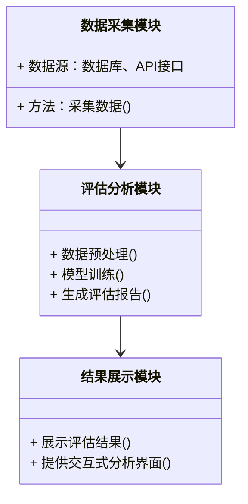

                 


# 如何评估企业的数字化转型成效

## 关键词：数字化转型、评估框架、KPI指标、技术实现、系统架构、案例分析

## 摘要：  
企业在数字化转型过程中面临着诸多挑战，如何有效评估转型成效是企业决策者和IT管理者关注的核心问题。本文从理论到实践，系统地阐述了数字化转型评估的核心概念、算法原理、系统架构以及实战案例，帮助企业全面理解并实施有效的评估方法。通过技术与业务的深度融合，本文为企业提供了切实可行的评估策略和优化建议。

---

## 第1章：企业数字化转型的背景与意义

### 1.1 数字化转型的定义与核心概念  
数字化转型（Digital Transformation，简称DX）是指企业利用数字技术（如大数据、人工智能、云计算等）重新设计或优化业务流程、组织结构、文化模式，以实现业务创新和效率提升的过程。其核心在于通过数字化手段，将企业的各个业务环节无缝连接，形成数据驱动的决策机制。

#### 1.1.1 数字化转型的核心要素  
- **技术驱动**：依赖大数据、AI、区块链、物联网等技术实现业务创新。  
- **业务重塑**：通过数字化手段优化或重构业务流程，提升用户体验。  
- **组织变革**：打破传统组织结构，形成扁平化、敏捷化的组织模式。  
- **数据价值**：以数据为驱动，提升决策的科学性和精准性。  

#### 1.1.2 数字化转型与企业发展的关系  
数字化转型不仅是技术的升级，更是企业商业模式和运营方式的根本性变革。通过数字化转型，企业能够：  
1. 提升运营效率，降低运营成本；  
2. 增强客户体验，提高客户满意度；  
3. 拓展新的业务模式，创造新的收入来源；  
4. 建立数据驱动的决策文化，提升企业竞争力。  

### 1.2 数字化转型的背景与意义  
随着全球数字化浪潮的推进，企业数字化转型已成为必然趋势。  

#### 1.2.1 数字化转型的背景  
- **技术进步**：云计算、AI、5G等技术的快速发展为企业提供了强大的技术支撑。  
- **市场竞争**：数字化转型已成为企业差异化竞争的关键因素。  
- **客户需求**：消费者对个性化、智能化服务的需求日益增长，推动企业加速数字化转型。  

#### 1.2.2 数字化转型的意义  
1. **提升企业竞争力**：通过数字化转型，企业能够更快速地响应市场变化，提供个性化服务。  
2. **优化资源配置**：数字化转型能够帮助企业更高效地利用资源，降低运营成本。  
3. **推动业务创新**：通过数据驱动的决策，企业能够发现新的业务机会，创造新的价值。  

### 1.3 评估数字化转型成效的重要性  
评估数字化转型成效是确保转型成功的关键环节。  

#### 1.3.1 评估数字化转型的必要性  
- **验证转型成果**：通过评估，企业可以验证数字化转型是否达到了预期目标。  
- **发现改进方向**：评估结果能够帮助企业识别转型中的不足，及时调整策略。  
- **建立数据驱动的决策文化**：评估过程本身就是数据驱动决策的实践，能够推动企业内部文化变革。  

#### 1.3.2 评估对企业战略决策的价值  
评估结果能够为企业的下一步战略规划提供数据支持，帮助企业制定更科学的决策。例如：  
- 通过评估发现某业务环节效率低下，企业可以优先优化该环节。  
- 通过评估发现客户体验存在瓶颈，企业可以针对性地进行服务创新。  

#### 1.3.3 评估与企业绩效提升的关系  
数字化转型的最终目标是提升企业绩效。通过评估，企业能够量化转型带来的实际收益，例如：  
- 营收增长  
- 成本降低  
- 用户满意度提升  

---

## 第2章：数字化转型评估的核心概念与联系  

### 2.1 评估框架与模型  

#### 2.1.1 评估框架的构建  
数字化转型评估框架通常包括以下几个维度：  
1. **业务绩效**：评估转型对企业营收、利润等财务指标的影响。  
2. **技术实现**：评估技术实施的成熟度和稳定性。  
3. **组织变革**：评估组织结构调整和文化变革的成效。  
4. **用户体验**：评估客户满意度和用户参与度。  

#### 2.1.2 常用的评估模型  
- **平衡计分卡（BSC）**：从财务、客户、内部流程、学习与成长四个维度评估企业绩效。  
- **数字成熟度模型**：从技术、数据、组织、文化等多个维度评估企业的数字化成熟度。  
- **KPI模型**：基于关键绩效指标（KPI）进行评估。  

#### 2.1.3 框架与模型的对比分析  
以下表格对比了三种评估模型的优缺点：

| 模型名称       | 优点                                   | 缺点                                   |
|----------------|--------------------------------------|--------------------------------------|
| 平衡计分卡（BSC） | 全面性高，涵盖财务、客户、内部流程等多个维度 | 实施复杂，需要大量数据支持           |
| 数字成熟度模型 | 能够量化企业的数字化成熟度，便于制定分阶段目标 | 需要专业团队进行评估和分析           |
| KPI模型        | 简单易懂，便于快速实施                | 可能忽略非财务性指标                   |

---

### 2.2 评估指标与维度  

#### 2.2.1 核心评估指标  
- **技术指标**：系统可用性、响应时间、数据准确性等。  
- **业务指标**：营收增长、成本降低、客户满意度等。  
- **组织指标**：员工满意度、组织结构灵活性、团队协作效率等。  
- **用户指标**：用户活跃度、用户留存率、用户反馈满意度等。  

#### 2.2.2 指标之间的关系  
以下是一个简单的指标关系图，展示各个维度之间的关联：


---

## 第3章：数字化转型评估的算法原理  

### 3.1 数据分析与机器学习算法  

#### 3.1.1 数据预处理  
在评估数字化转型成效时，通常需要对数据进行清洗和特征工程。例如，处理缺失值、异常值，以及进行特征提取。  

#### 3.1.2 特征工程  
以下是常见的特征工程方法：  
- **特征选择**：通过统计方法或模型筛选重要特征。  
- **特征变换**：将非数值型特征转换为数值型特征（如One-Hot编码）。  
- **特征组合**：将多个特征组合成一个新的特征（如用户行为特征）。  

#### 3.1.3 模型选择  
常用的机器学习模型包括：  
1. **线性回归**：用于预测连续型变量，如营收增长。  
2. **随机森林**：用于分类问题，如用户满意度分类。  
3. **神经网络**：用于复杂非线性关系的预测，如用户行为预测。  

#### 3.1.4 模型评估  
模型评估通常采用以下指标：  
- **均方误差（MSE）**：衡量预测值与真实值的差距。  
- **准确率（Accuracy）**：分类模型的正确预测比例。  
- **召回率（Recall）**：模型识别正类的能力。  

以下是一个简单的KPI分析和预测模型的Python代码示例：

```python
import pandas as pd
from sklearn.model_selection import train_test_split
from sklearn.linear_model import LinearRegression
from sklearn.metrics import mean_squared_error

# 数据加载与预处理
data = pd.read_csv('digital_transformation.csv')
data = data.dropna()  # 删除缺失值
X = data[['技术成熟度', '业务流程优化度', '用户参与度']]
y = data['营收增长']

# 划分训练集和测试集
X_train, X_test, y_train, y_test = train_test_split(X, y, test_size=0.2, random_state=42)

# 模型训练
model = LinearRegression()
model.fit(X_train, y_train)

# 模型预测
y_pred = model.predict(X_test)

# 模型评估
mse = mean_squared_error(y_test, y_pred)
print(f"均方误差: {mse}")
```

---

## 第4章：系统分析与架构设计  

### 4.1 评估系统功能设计  

#### 4.1.1 系统功能模块  
- **数据采集模块**：从企业系统中采集业务数据。  
- **评估分析模块**：对数据进行分析和建模，生成评估结果。  
- **结果展示模块**：以可视化形式展示评估结果。  

#### 4.1.2 系统类图  
以下是系统类图的Mermaid表示：



---

## 第5章：项目实战与案例分析  

### 5.1 项目实施步骤  

#### 5.1.1 环境配置  
- **安装Python**：建议使用最新版本的Python 3.x。  
- **安装依赖库**：如Pandas、Scikit-learn、Matplotlib等。  

#### 5.1.2 核心代码实现  
以下是一个完整的评估系统实现示例：

```python
import pandas as pd
from sklearn.metrics import accuracy_score
from sklearn.ensemble import RandomForestClassifier

# 数据加载与预处理
data = pd.read_csv('digital_transformation.csv')
data = data.dropna()
X = data[['技术成熟度', '业务流程优化度', '用户参与度']]
y = data['用户满意度分类']

# 划分训练集和测试集
X_train, X_test, y_train, y_test = train_test_split(X, y, test_size=0.2, random_state=42)

# 模型训练
model = RandomForestClassifier()
model.fit(X_train, y_train)

# 模型预测
y_pred = model.predict(X_test)

# 模型评估
accuracy = accuracy_score(y_test, y_pred)
print(f"准确率: {accuracy}")
```

---

## 第6章：总结与展望  

### 6.1 最佳实践与注意事项  
1. **数据质量**：数据的准确性和完整性是评估的基础。  
2. **模型选择**：根据具体问题选择合适的模型，避免盲目使用复杂算法。  
3. **持续优化**：评估是一个动态过程，需要持续监控和优化。  

### 6.2 未来展望  
随着AI和大数据技术的不断发展，数字化转型评估将更加智能化和自动化。未来，企业可以通过实时数据分析和自适应模型优化，实现更精准的评估和决策。

---

## 作者：AI天才研究院 & 禅与计算机程序设计艺术

