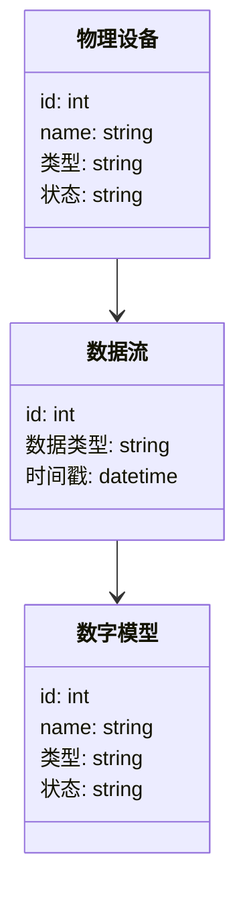
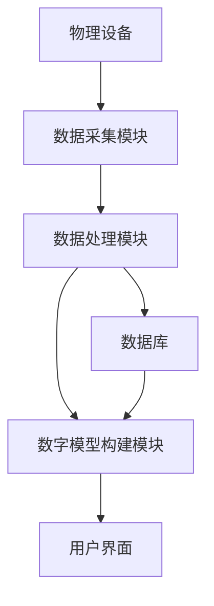
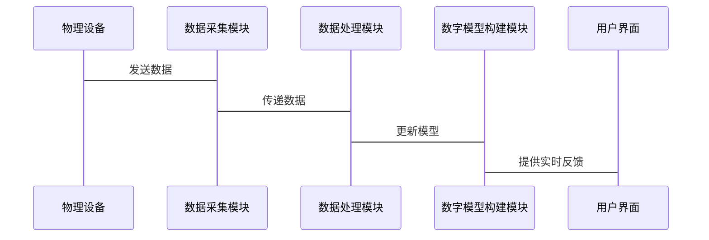

                 


# 如何评估企业的数字孪生技术应用

## 关键词：数字孪生，企业评估，技术应用，系统架构，算法原理，项目实战

## 摘要：  
数字孪生技术作为一种新兴的信息化技术，正在为企业数字化转型提供强大的支持。然而，如何有效评估数字孪生技术的应用效果，成为了企业在实践中面临的重要挑战。本文从数字孪生的核心概念出发，结合实际应用场景，系统地分析了数字孪生技术的评估方法。通过对数字孪生的定义、原理、算法、系统架构以及项目实战的深入探讨，本文为企业提供了全面的评估框架和实践指导，帮助企业更好地应用数字孪生技术，实现业务目标。

---

# 正文

## 第1章: 数字孪生技术概述

### 1.1 数字孪生的定义与演进
数字孪生（Digital Twin）是一种将物理世界与数字世界进行实时映射和交互的技术，它通过构建物理对象或系统的虚拟模型，实现实时数据的采集、分析和反馈。数字孪生的演进经历了从简单的虚拟模型到动态、实时的数字孪生系统的转变。

#### 1.1.1 数字孪生的定义
数字孪生是指在数字空间中创建与物理世界完全一致的虚拟模型，并通过实时数据更新，实现对物理世界的动态仿真和预测的技术。数字孪生的核心在于数据的实时同步和模型的动态更新。

#### 1.1.2 从虚拟模型到数字孪生的演进
传统的虚拟模型主要用于静态展示和简单的交互，而数字孪生则通过引入实时数据和智能算法，实现了对物理世界的动态模拟和预测。这种演进使得数字孪生在企业中的应用更加广泛和深入。

#### 1.1.3 数字孪生的核心要素与特点
- **核心要素**：
  1. 物理实体：数字孪生的映射对象。
  2. 数字模型：虚拟世界的数字化表示。
  3. 数据流：连接物理实体和数字模型的实时数据。
  4. 智能算法：实现数据处理和模型更新的工具。
- **特点**：
  1. 实时性：数据实时更新，模型动态调整。
  2. 可视化：通过图形界面直观展示物理世界的状态。
  3. 预测性：基于历史数据和算法模型，预测未来趋势。

### 1.2 数字孪生的应用场景
数字孪生技术在企业中的应用范围非常广泛，主要包括以下几个方面：

#### 1.2.1 制造业中的数字孪生应用
在制造业中，数字孪生可以用于设备的实时监控、生产流程的优化以及产品质量的预测。例如，通过数字孪生技术，企业可以实时监控生产线上的设备状态，提前发现潜在故障，减少停机时间。

#### 1.2.2 城市规划与数字孪生
在城市规划领域，数字孪生技术可以帮助城市管理者进行城市布局的优化、交通流量的预测以及灾害应急的模拟。例如，通过数字孪生技术，可以模拟城市交通在不同情况下的流量变化，优化交通信号灯的设置。

#### 1.2.3 数字孪生在企业运营中的潜力
在企业运营中，数字孪生可以用于优化供应链管理、提升客户体验以及降低运营成本。例如，通过数字孪生技术，企业可以实时监控供应链中的库存状态，优化物流路径，减少资源浪费。

### 1.3 数字孪生与企业信息化的关系
数字孪生作为企业信息化的重要组成部分，通过与企业现有的信息系统（如ERP、CRM等）集成，可以实现企业数据的共享和协同。数字孪生不仅能够提升企业的信息化水平，还能够为企业决策提供更精准的支持。

---

## 第2章: 数字孪生技术的核心概念与联系

### 2.1 数字孪生的核心原理
数字孪生的核心原理在于通过实时数据的采集和分析，构建动态更新的数字模型，并通过模型与物理世界的互动，实现对物理世界的预测和优化。

#### 2.1.1 模型构建与数据驱动
数字孪生的模型构建需要基于物理世界的实际情况，通过数据驱动的方式，不断优化模型的准确性。例如，在制造业中，数字孪生模型需要基于设备的实际运行数据进行调整，以更准确地反映设备的状态。

#### 2.1.2 实时同步与动态更新
数字孪生的实时同步是指物理世界中的数据能够实时更新到数字模型中，而动态更新则是指数字模型能够根据实时数据的变化，自动调整自身的状态。

#### 2.1.3 多维度数据融合
数字孪生需要整合来自不同来源的数据，例如传感器数据、历史数据、外部环境数据等，通过多维度数据的融合，提升模型的预测精度。

### 2.2 数字孪生与相关技术的对比
数字孪生与虚拟化技术、物联网（IoT）、大数据分析等技术有着密切的联系，但也存在显著的区别。

#### 2.2.1 数字孪生与虚拟化技术的区别
虚拟化技术主要用于创建虚拟环境，而数字孪生则是虚拟环境与物理世界的动态映射。数字孪生不仅关注虚拟模型的构建，还强调模型与物理世界的实时互动。

#### 2.2.2 数字孪生与物联网的关系
物联网提供了数据采集的基础，而数字孪生则基于物联网采集的数据，构建动态的数字模型。数字孪生可以看作是物联网技术的延伸和深化。

#### 2.2.3 数字孪生与大数据分析的联系
数字孪生需要大数据分析技术来处理和分析海量数据，从而优化模型的预测能力。大数据分析是数字孪生实现精准预测的重要支撑。

### 2.3 数字孪生的实体关系架构
数字孪生的实体关系架构可以通过实体关系图（ER图）来展示。以下是数字孪生系统中实体关系的示例：

```mermaid
erd
    title 实体关系图
    entity 物理设备 {
        id: int
        name: string
        类型: string
        状态: string
    }
    entity 数字模型 {
        id: int
        name: string
        类型: string
        状态: string
    }
    entity 数据流 {
        id: int
        数据类型: string
        时间戳: datetime
    }
    relationship 数据流连接物理设备和数字模型 {
        物理设备 -> 数据流 -> 数字模型
    }
```

---

## 第3章: 数字孪生技术的算法原理

### 3.1 数据融合算法
数据融合算法是数字孪生技术的核心之一，主要用于整合来自不同来源的数据，提升模型的预测精度。

#### 3.1.1 数据融合的基本原理
数据融合的基本原理是通过加权平均、主成分分析（PCA）等方法，将多个数据源的数据进行融合，得到一个更准确的结果。

#### 3.1.2 基于加权平均的数据融合算法
以下是一个基于加权平均的数据融合算法的实现代码：

```python
def weighted_average(data_points, weights):
    total = sum(weights)
    result = 0.0
    for i in range(len(data_points)):
        result += (data_points[i] * weights[i]) / total
    return result

# 示例数据
data_points = [10, 20, 30]
weights = [1, 2, 3]

# 计算加权平均
result = weighted_average(data_points, weights)
print("加权平均结果:", result)
```

#### 3.1.3 数据融合的优化方法
数据融合的优化方法主要包括：

1. **权重调整**：根据数据源的可靠性调整权重。
2. **数据清洗**：去除异常值和噪声数据。
3. **模型优化**：通过机器学习算法优化数据融合的模型。

### 3.2 模型构建与优化算法
模型构建是数字孪生技术的关键步骤，需要基于物理世界的实际数据，构建动态更新的数字模型。

#### 3.2.1 基于机器学习的模型构建
以下是一个基于机器学习的模型构建的代码示例：

```python
import numpy as np
from sklearn.linear_model import LinearRegression

# 示例数据
X = np.array([[1], [2], [3], [4], [5]])
y = np.array([2, 4, 6, 8, 10])

# 创建线性回归模型
model = LinearRegression()
model.fit(X, y)

# 预测结果
new_X = np.array([[6]])
predicted_y = model.predict(new_X)
print("预测结果:", predicted_y)
```

#### 3.2.2 模型优化的数学原理
模型优化的数学原理主要基于最小二乘法，通过最小化预测值与实际值之间的平方差，优化模型的参数。

$$
\text{目标函数} = \sum_{i=1}^{n} (y_i - \hat{y}_i)^2
$$

其中，$y_i$ 是实际值，$\hat{y}_i$ 是预测值。

---

## 第4章: 数字孪生技术的系统分析与架构设计

### 4.1 问题场景介绍
数字孪生技术的应用需要考虑以下问题场景：

1. **数据采集**：如何实时采集物理设备的数据？
2. **数据处理**：如何处理海量数据，确保数据的准确性和完整性？
3. **模型构建**：如何基于数据构建动态更新的数字模型？
4. **系统集成**：如何将数字孪生系统与企业现有系统集成？

### 4.2 系统功能设计
系统功能设计需要涵盖以下方面：

#### 4.2.1 领域模型构建
领域模型是数字孪生系统的核心，需要基于具体业务需求进行构建。以下是一个领域模型的类图示例：



#### 4.2.2 系统架构设计
系统架构设计需要考虑系统的可扩展性、可维护性和性能优化。以下是一个数字孪生系统的架构图示例：



#### 4.2.3 系统接口设计
系统接口设计需要考虑与企业现有系统的集成，例如ERP、CRM等。以下是系统接口的交互流程图：



---

## 第5章: 数字孪生技术的项目实战

### 5.1 环境安装
在进行数字孪生项目之前，需要确保环境配置正确：

1. **安装Python**：推荐使用Python 3.8及以上版本。
2. **安装相关库**：例如`numpy`, `pandas`, `scikit-learn`等。
3. **安装Mermaid**：用于绘制图表。

### 5.2 系统核心实现源代码
以下是一个数字孪生系统的核心实现代码示例：

```python
import numpy as np
import pandas as pd
from sklearn.linear_model import LinearRegression

# 示例数据
data = pd.DataFrame({
    '时间': [1, 2, 3, 4, 5],
    '温度': [20, 22, 24, 26, 28],
    '湿度': [50, 55, 60, 65, 70]
})

# 创建线性回归模型
model = LinearRegression()
model.fit(data[['时间']], data['温度'])

# 预测结果
new_data = pd.DataFrame({'时间': [6]})
predicted_temp = model.predict(new_data[['时间']])
print("预测温度:", predicted_temp[0])
```

### 5.3 代码应用解读与分析
上述代码实现了一个简单的数字孪生模型，用于预测设备的温度变化。通过线性回归算法，模型能够根据时间数据预测温度的变化趋势。

### 5.4 实际案例分析
以制造业中的设备监控为例，数字孪生技术可以帮助企业实时监控设备状态，预测设备故障，从而减少停机时间。以下是具体步骤：

1. **数据采集**：通过传感器采集设备的运行数据。
2. **数据处理**：清洗和整合数据，去除异常值。
3. **模型构建**：基于数据构建设备状态的数字模型。
4. **实时监控**：通过用户界面实时显示设备状态，并提供预测结果。

### 5.5 项目小结
通过上述案例分析，我们可以看到数字孪生技术在企业中的巨大潜力。通过实时数据的采集和分析，企业可以实现对设备的智能化监控，从而提高生产效率，降低运营成本。

---

## 第6章: 数字孪生技术的最佳实践与总结

### 6.1 小结
数字孪生技术作为一种新兴的信息化技术，正在为企业数字化转型提供强有力的支持。通过对数字孪生技术的深入分析和实践，我们可以看到，数字孪生不仅能够帮助企业实现物理世界与数字世界的动态互动，还能够为企业决策提供更精准的支持。

### 6.2 注意事项
在实际应用中，需要注意以下几点：

1. **数据安全**：确保数据的安全性和隐私性。
2. **模型优化**：不断优化模型的预测能力。
3. **系统集成**：确保数字孪生系统与企业现有系统的顺利集成。

### 6.3 拓展阅读
对于感兴趣的研究者和企业，可以进一步阅读以下内容：

1. 数字孪生在不同行业的应用案例。
2. 数字孪生与人工智能的结合。
3. 数字孪生系统的性能优化方法。

---

## 作者：AI天才研究院 & 禅与计算机程序设计艺术

