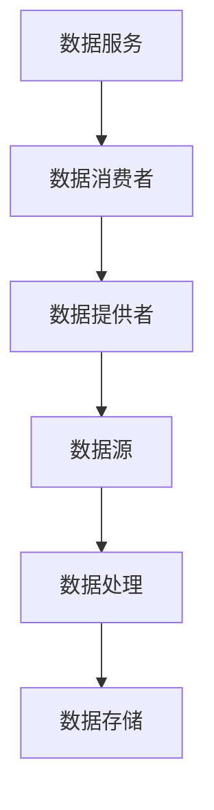
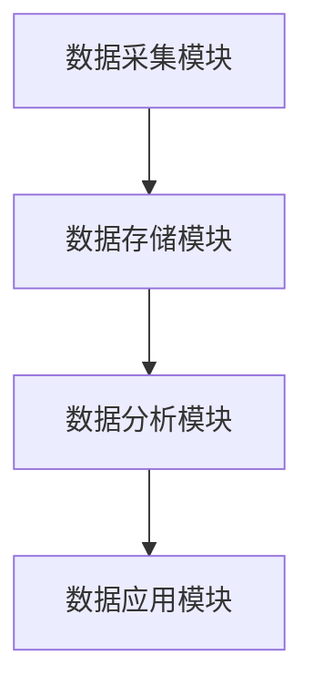
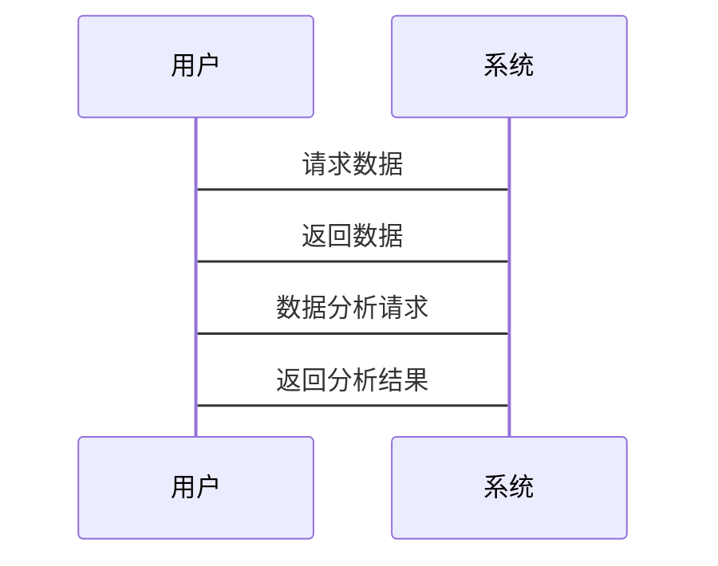

                 


# 如何评估企业的数据变现能力

## 关键词：数据变现能力、数据分析、数据资产化、数据产品化、数据服务化

## 摘要：  
数据在当今数字经济时代已成为最重要的生产资料，企业数据变现能力直接关系到企业的核心竞争力和未来生存能力。本文将从数据的重要性与价值、数据资产化与数据产品化的区别与联系、数据服务化的系统架构设计、数据驱动的算法原理等方面进行详细阐述，帮助企业全面评估和提升数据变现能力。通过实际案例分析和项目实战，深入探讨如何将数据转化为实际商业价值，为企业制定数据驱动的战略提供参考。

---

## 第一部分: 数据变现能力的背景与概念

### 第1章: 数据变现能力的背景介绍

#### 1.1 数据的重要性与价值
- 数据在现代企业中的地位：数据是企业决策的核心依据，也是企业差异化竞争的关键要素。企业通过数据收集、分析和应用，可以优化运营流程、提升用户体验、创造新的收入来源。
- 数据驱动的商业模式：数据驱动的商业模式正在改变传统的企业运作方式。通过数据，企业可以实现精准营销、个性化服务、自动化运营，从而提高效率、降低成本、增加收入。
- 数据变现的定义与范围：数据变现是指通过收集、处理和分析数据，将其转化为具有商业价值的产品或服务，从而为企业创造收入的过程。数据变现可以分为数据资产化、数据产品化和数据服务化三种模式。

#### 1.2 数据变现能力的关键影响因素
- 数据质量：数据的质量直接影响数据变现的效率和效果。高质量的数据能够提高分析结果的准确性，从而为企业创造更大的价值。
- 数据处理能力：数据处理能力是数据变现的基础。企业需要具备强大的数据采集、存储和处理能力，才能将数据转化为可用的信息。
- 数据分析能力：数据分析能力是数据变现的核心。通过先进的数据分析技术，企业可以挖掘数据中的潜在价值，发现新的商业机会。

### 第2章: 数据变现能力的核心概念与联系

#### 2.1 数据资产化与数据产品化的对比
- 数据资产化的特点：数据资产化是将数据视为企业的资产，通过数据治理、数据清洗和数据建模等手段，提升数据的可用性和价值。
- 数据产品化的特点：数据产品化是将数据转化为具体的商品或服务，例如数据报告、数据分析工具、数据API等。
- 对比分析：数据资产化注重数据的内部管理和价值提升，而数据产品化则注重数据的外部应用和商业化。两者相辅相成，共同构成了数据变现的完整体系。

#### 2.2 数据服务化的实体关系图


### 第3章: 数据变现能力的算法原理

#### 3.1 数据分析与预测算法
- 线性回归模型：线性回归是一种常用的数据预测算法，适用于线性关系的数据分析。通过最小化预测值与实际值之间的平方差，找到最佳拟合直线。
- 分类算法：分类算法用于将数据划分为不同的类别，例如决策树、随机森林等算法。
- 聚类算法：聚类算法用于将数据分成不同的簇，发现数据中的潜在模式和结构。

#### 3.2 数据变现的数学模型
- 线性回归模型：
$$ y = a + bx + \epsilon $$
- 逻辑回归模型：
$$ P(y=1|x) = \frac{e^{\beta x}}{1 + e^{\beta x}} $$

#### 3.3 算法流程
- 数据清洗与预处理
- 特征工程
- 模型训练
- 模型评估与优化
- 模型部署与应用

---

## 第二部分: 系统分析与架构设计

### 第4章: 企业数据变现的系统架构设计

#### 4.1 问题场景介绍
- 数据采集：通过多种渠道收集数据，包括网站、移动应用、传感器等。
- 数据存储：将数据存储在数据库中，支持结构化和非结构化数据的存储。
- 数据分析：对存储的数据进行分析，提取有价值的信息。
- 数据应用：将分析结果应用于实际业务中，例如精准营销、风险控制等。

#### 4.2 系统功能设计
- 数据采集模块：负责数据的采集和预处理。
- 数据存储模块：负责数据的存储和管理。
- 数据分析模块：负责数据的分析和挖掘。
- 数据应用模块：负责将分析结果应用于实际业务。

#### 4.3 系统架构设计


#### 4.4 系统接口设计
- 用户登录接口
- 数据查询接口
- 数据分析接口
- 数据应用接口

#### 4.5 系统交互流程


---

## 第三部分: 项目实战

### 第5章: 数据变现能力的项目实战

#### 5.1 电商企业的数据变现项目
- 项目背景：某电商企业希望通过数据分析提高销售额，优化用户体验。
- 数据处理：对销售数据、用户行为数据进行清洗和预处理。
- 数据建模：使用机器学习算法预测用户购买行为，优化营销策略。
- 数据分析：分析用户行为，发现潜在客户，提高转化率。

#### 5.2 项目实现
```python
# 数据处理
import pandas as pd

data = pd.read_csv('sales_data.csv')
data_cleaned = data.dropna()

# 数据建模
from sklearn.linear_model import LinearRegression

model = LinearRegression()
model.fit(X_train, y_train)

# 数据分析
import matplotlib.pyplot as plt

plt.scatter(X_train, y_train)
plt.plot(X_train, model.predict(X_train))
plt.show()
```

#### 5.3 项目小结
- 项目成果：通过数据分析，企业提高了销售额，优化了用户体验。
- 项目经验：数据处理是数据分析的基础，数据分析是数据变现的核心，数据应用是数据变现的关键。

---

## 第四部分: 最佳实践与小结

### 第6章: 数据变现能力的最佳实践

#### 6.1 数据治理
- 数据质量管理
- 数据安全与隐私保护

#### 6.2 技术选型
- 数据分析工具的选择
- 数据存储解决方案的选择

#### 6.3 团队协作
- 数据分析师与业务团队的协作
- 技术团队与业务团队的协作

### 6.4 小结
数据变现能力是企业核心竞争力的重要组成部分。通过数据资产化、数据产品化和数据服务化，企业可以将数据转化为实际的商业价值。在实际应用中，企业需要注重数据质量、数据分析能力和数据应用能力的提升。

---

## 结语

数据变现能力是企业在数字经济时代的核心竞争力。通过本文的详细讲解，企业可以全面评估和提升数据变现能力，将数据转化为实际的商业价值。未来，随着数据技术的不断发展，数据变现能力的重要性将更加凸显，企业需要持续关注数据技术的发展，不断提升数据变现能力。

---

## 作者

作者：AI天才研究院/AI Genius Institute & 禅与计算机程序设计艺术 /Zen And The Art of Computer Programming

