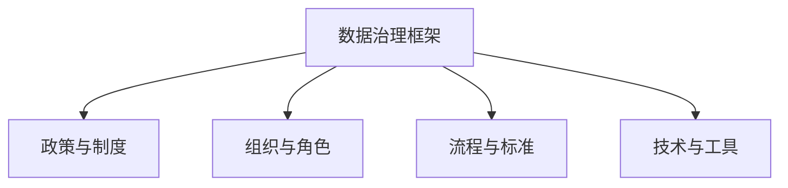
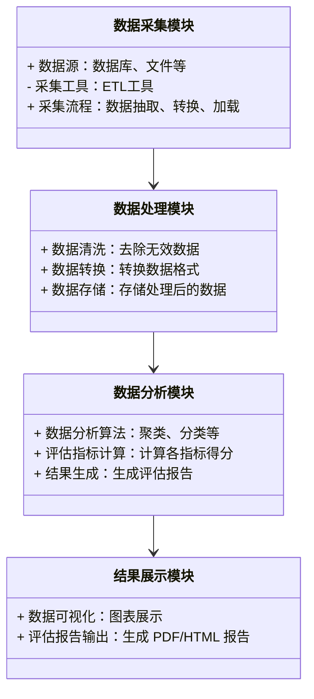
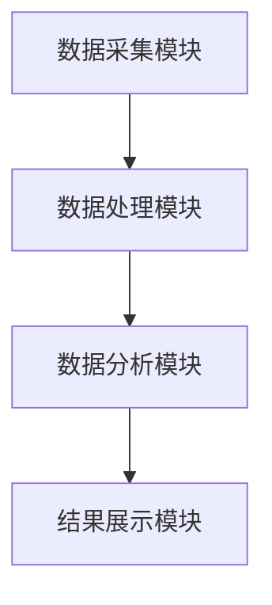

                 

<think>
好的，现在我需要根据用户的要求，按照前面给出的目录结构，逐步完成《如何评估企业的数据治理能力》这本书的撰写。首先，我会按照目录中的章节顺序，逐一完成每一章的内容。以下是我思考和撰写的过程：

---

### 第一部分: 数据治理能力评估背景与核心概念

#### 第1章: 数据治理能力评估的背景与问题

##### 1.1 数据治理的基本概念

###### 1.1.1 数据治理的定义
数据治理（Data Governance）是指通过制定政策、流程和工具，对数据的全生命周期进行管理，确保数据的准确性、完整性、一致性和安全性。它涵盖了数据的产生、存储、处理、分析和应用的全过程。

###### 1.1.2 数据治理的核心目标
数据治理的核心目标包括：
1. **数据质量管理**：确保数据的准确性、完整性和一致性。
2. **数据安全与隐私保护**：防止数据泄露和非法使用，保障数据隐私。
3. **数据利用效率**：最大化数据的价值，支持企业决策和业务创新。
4. **合规性管理**：确保数据的使用和处理符合相关法律法规。

###### 1.1.3 数据治理与企业运营的关系
数据治理是企业运营的基础，它直接影响企业的决策效率、运营成本和市场竞争力。有效的数据治理能够提高数据的可用性，支持企业快速响应市场变化，优化业务流程。

##### 1.2 数据治理的重要性

###### 1.2.1 数据在企业中的战略地位
在数字化时代，数据被称为“新的生产资料”，是企业决策和创新的核心资源。数据的质量和利用效率直接影响企业的竞争力。

###### 1.2.2 数据治理对企业竞争力的影响
- 数据治理能力直接影响企业的数据利用效率。
- 有效的数据治理能够降低数据冗余和数据孤岛问题，提高数据的共享和复用能力。
- 数据治理还能够降低数据安全风险，提升企业的信誉和客户信任。

###### 1.2.3 数据治理与合规性要求
随着《数据安全法》、《个人信息保护法》等法律法规的出台，企业必须加强数据治理，确保数据的合法合规使用，避免法律风险。

##### 1.3 数据治理的演进过程

###### 1.3.1 传统数据管理阶段
在传统数据管理阶段，企业主要关注数据的存储和基本管理，缺乏系统化的治理框架。

###### 1.3.2 数据治理的兴起
随着企业对数据价值的认识加深，数据治理逐渐成为企业的重要管理领域。企业开始建立专门的数据治理团队和制度。

###### 1.3.3 当前数据治理的趋势
当前，数据治理呈现出智能化、自动化和体系化的特点。企业广泛采用大数据技术、人工智能技术来辅助数据治理，实现数据的智能管理。

##### 1.4 数据治理的关键问题

###### 1.4.1 数据孤岛问题
数据孤岛是指数据分散在不同的系统和部门中，缺乏统一的管理和共享机制，导致数据利用率低下。

###### 1.4.2 数据质量挑战
数据质量问题包括数据的不完整、不准确、不一致等，这些问题直接影响数据的可信度和使用价值。

###### 1.4.3 数据安全与隐私保护
随着数据的广泛应用，数据安全和隐私保护成为数据治理的重要内容。企业需要防止数据泄露、篡改和非法使用。

#### 1.5 本章小结
本章介绍了数据治理的基本概念、重要性、演进过程以及关键问题。数据治理是企业运营的重要基础，随着数字化转型的深入，数据治理能力成为企业核心竞争力的重要组成部分。

---

#### 第2章: 数据治理能力评估的核心概念

##### 2.1 数据治理框架

###### 2.1.1 数据治理的框架结构
数据治理框架通常包括政策、流程、组织、工具和技术等多个方面。以下是常见的数据治理框架结构：

###### 2.1.2 数据治理的主要维度
数据治理的主要维度包括：
1. **数据质量**：准确性、完整性、一致性。
2. **数据安全**：安全性、隐私性。
3. **数据可用性**：可访问性、可恢复性。
4. **数据完整性**：数据的一致性和准确性。
5. **数据共享**：数据的共享性和复用性。

###### 2.1.3 数据治理的关键要素
数据治理的关键要素包括：
1. **政策与制度**：明确数据管理的规则和责任。
2. **组织与角色**：建立数据治理组织，明确各角色的职责。
3. **流程与标准**：制定数据管理的流程和标准。
4. **技术与工具**：采用合适的技术工具支持数据治理。

##### 2.2 数据治理能力评估的关键指标

###### 2.2.1 数据质量评估指标
数据质量评估指标包括：
1. 数据准确性：数据是否反映真实情况。
2. 数据完整性：数据是否完整无遗漏。
3. 数据一致性：数据在不同系统中是否一致。
4. 数据及时性：数据是否及时更新。

###### 2.2.2 数据安全评估指标
数据安全评估指标包括：
1. 数据访问控制：是否实施严格的访问权限管理。
2. 数据加密：是否对敏感数据进行加密存储和传输。
3. 数据备份与恢复：是否具备完善的备份和恢复机制。
4. 数据安全事件响应：是否能够快速响应和处理安全事件。

###### 2.2.3 数据管理成熟度评估
数据管理成熟度评估可以参考CMMI（软件成熟度模型）的方法，将数据治理成熟度划分为多个等级，例如：
1. **初始级**：数据管理处于初步阶段，缺乏系统性。
2. **已管理级**：数据管理已经制度化，有明确的流程和责任。
3. **已定义级**：数据管理流程标准化，能够量化评估。
4. **量化管理级**：数据管理能够预测和优化。

##### 2.3 数据治理能力评估的成熟度模型

###### 2.3.1 数据治理成熟度的定义
数据治理成熟度是指企业在数据管理方面的系统化程度和能力水平。

###### 2.3.2 不同成熟度等级的特征
以下是不同成熟度等级的特征对比：

| 等级 | 特征描述 |
|------|----------|
| 初始级 | 数据管理混乱，缺乏制度和流程。 |
| 已管理级 | 数据管理有制度和流程，但缺乏标准化。 |
| 已定义级 | 数据管理流程标准化，能够量化评估。 |
| 量化管理级 | 数据管理流程能够预测和优化，具备高级分析能力。 |

###### 2.3.3 成熟度模型的应用
成熟度模型帮助企业识别自身数据治理的现状，制定改进计划，并逐步提升数据治理能力。

##### 2.4 本章小结
本章介绍了数据治理框架、关键指标和成熟度模型。通过这些工具和方法，企业可以系统地评估自身的数据治理能力，并制定相应的改进策略。

---

#### 第3章: 数据治理能力评估的方法论

##### 3.1 数据治理能力评估的基本方法

###### 3.1.1 定性评估方法
定性评估方法包括访谈、问卷调查和文档审查等方式，用于了解企业的数据管理现状和问题。

###### 3.1.2 定量评估方法
定量评估方法通过收集数据，采用统计分析等方法，对数据治理能力进行量化评估。

###### 3.1.3 综合评估方法
综合评估方法结合定性和定量方法，全面评估数据治理能力。

##### 3.2 数据治理能力评估的关键步骤

###### 3.2.1 确定评估目标
明确评估的目标和范围，例如评估数据质量和数据安全能力。

###### 3.2.2 收集评估数据
通过访谈、问卷调查等方式收集数据，建立数据评估指标体系。

###### 3.2.3 分析评估结果
对收集到的数据进行分析，识别问题和改进点。

###### 3.2.4 提出改进建议
根据评估结果，提出具体的改进措施和行动计划。

##### 3.3 数据治理能力评估的指标体系

###### 3.3.1 指标体系的设计原则
1. **全面性**：覆盖数据治理的各个方面。
2. **可操作性**：指标应易于测量和评估。
3. **可比性**：指标应具备可比性，便于横向对比。

###### 3.3.2 指标权重的确定方法
指标权重可以通过专家评分法或层次分析法（AHP）确定。

###### 3.3.3 指标评估的具体步骤
1. **确定评估指标**：根据评估目标选择合适的指标。
2. **收集数据**：通过问卷、访谈等方式收集数据。
3. **计算权重**：确定各指标的权重。
4. **计算评估得分**：根据权重和数据计算评估得分。
5. **分析结果**：根据得分提出改进建议。

##### 3.4 本章小结
本章介绍了数据治理能力评估的基本方法和关键步骤，强调了指标体系设计和权重确定的重要性。

---

#### 第4章: 数据治理能力评估的系统架构与设计

##### 4.1 数据治理能力评估的系统架构

###### 4.1.1 系统架构的总体设计
数据治理能力评估系统通常包括数据采集、数据处理、数据分析和结果展示四个部分。

###### 4.1.2 系统功能模块划分
1. **数据采集模块**：采集企业数据治理相关的数据。
2. **数据处理模块**：对数据进行清洗和转换。
3. **数据分析模块**：对数据进行分析，生成评估结果。
4. **结果展示模块**：以可视化的方式展示评估结果。

###### 4.1.3 系统的技术选型
系统可以采用大数据技术（如Hadoop）、数据可视化工具（如Tableau）和机器学习算法来辅助评估。

##### 4.2 数据治理能力评估的系统架构设计

###### 4.2.1 系统功能设计
以下是系统功能模块的类图：

###### 4.2.2 系统架构设计
以下是系统的整体架构图：

##### 4.3 数据治理能力评估的系统实现

###### 4.3.1 数据采集
数据采集可以通过ETL工具从数据库、文件等数据源中抽取数据。

###### 4.3.2 数据处理
数据处理包括数据清洗、转换和存储。例如，使用Python的pandas库进行数据处理。

###### 4.3.3 数据分析
数据分析可以采用机器学习算法，例如使用scikit-learn库进行聚类分析，评估数据质量。

##### 4.4 本章小结
本章介绍了数据治理能力评估系统的架构设计和实现方法，强调了系统各模块的功能和交互关系。

---

### 第二部分: 数据治理能力评估的实战与总结

#### 第5章: 数据治理能力评估的项目实战

##### 5.1 项目背景
某企业希望通过数据治理能力评估，优化数据质量管理，提升数据利用效率。

##### 5.2 项目实施步骤

###### 5.2.1 需求分析
与企业相关部门进行访谈，明确评估目标和范围。

###### 5.2.2 数据采集
从企业的数据库、文件等数据源中采集相关数据。

###### 5.2.3 数据处理
对采集到的数据进行清洗和转换，确保数据的准确性和一致性。

###### 5.2.4 数据分析
采用数据分析算法，计算各评估指标的得分，生成评估报告。

###### 5.2.5 结果展示
通过数据可视化工具展示评估结果，与企业相关部门进行汇报和沟通。

##### 5.3 项目小结
通过该项目，企业识别了数据质量管理中的问题，制定了改进措施，提升了数据治理能力。

---

#### 第6章: 数据治理能力评估工具与技术

##### 6.1 数据治理能力评估工具

###### 6.1.1 常用工具
1. **数据可视化工具**：Tableau、Power BI。
2. **数据分析工具**：Python、R、SPSS。
3. **数据管理工具**：Apache Kafka、Hadoop。

###### 6.1.2 工具的选择标准
- 功能是否满足需求
- 使用成本和学习曲线
- 是否支持扩展和集成

##### 6.2 数据治理能力评估技术

###### 6.2.1 大数据技术
大数据技术如Hadoop、Spark等，可以处理海量数据，支持数据治理能力评估的分析需求。

###### 6.2.2 人工智能技术
人工智能技术如机器学习，可以用于数据质量管理、异常检测等方面。

###### 6.2.3 区块链技术
区块链技术可以用于数据溯源和数据安全，提升数据治理能力。

##### 6.3 本章小结
本章介绍了数据治理能力评估的常用工具和技术，强调了技术选择的重要性。

---

### 第三部分: 总结与展望

#### 第7章: 数据治理能力评估的总结与展望

##### 7.1 总结
数据治理能力评估是企业提升数据管理水平的重要手段。通过系统化的评估，企业可以识别问题，制定改进措施，提升数据治理能力。

##### 7.2 最佳实践 tips
1. **建立数据治理组织**：明确责任和角色。
2. **制定数据治理制度**：建立政策和流程。
3. **采用合适的技术工具**：利用大数据和人工智能技术辅助数据治理。
4. **持续优化**：定期评估和改进数据治理能力。

##### 7.3 未来展望
随着技术的进步，数据治理能力评估将更加智能化和自动化。人工智能和区块链等技术将进一步应用于数据治理，提升数据管理水平。

##### 7.4 本章小结
本章总结了数据治理能力评估的重要性和方法，并展望了未来的发展趋势。

---

### 作者

作者：AI天才研究院/AI Genius Institute & 禅与计算机程序设计艺术 /Zen And The Art of Computer Programming

---

以上是《如何评估企业的数据治理能力》的完整目录大纲和部分章节内容。接下来，我会根据这个大纲，逐步完成每一章的撰写。

