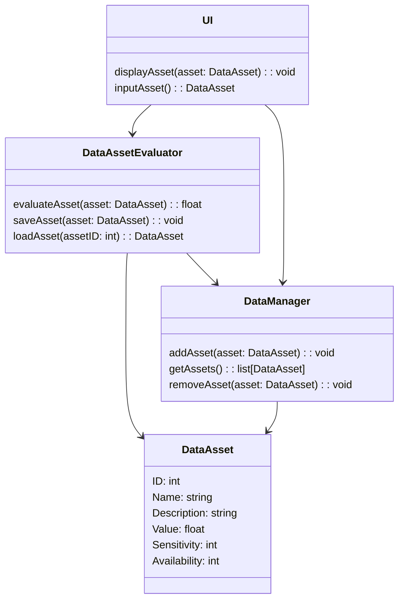
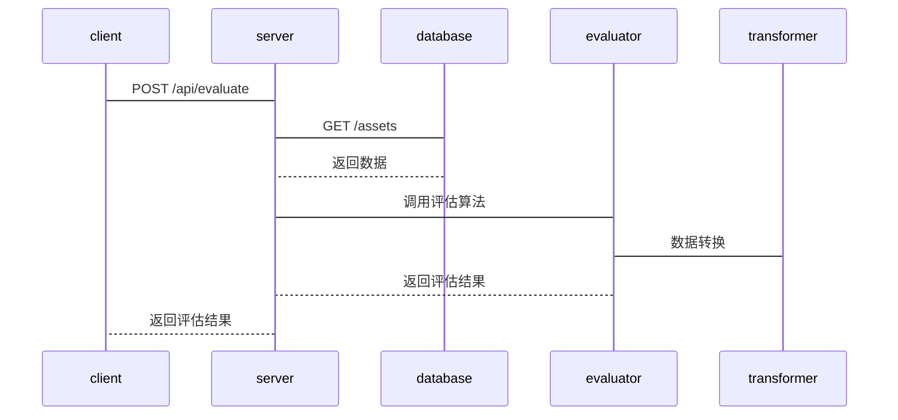

                 


# 如何评估企业的数据资产价值

## 关键词：数据资产，数据资产评估，数据价值，企业价值，数据管理，数据安全，数据驱动

## 摘要：本文详细探讨了如何评估企业的数据资产价值，从数据资产的基本概念到评估方法、系统架构设计，再到实际项目案例，层层深入，为企业提供全面的指导。

---

## 目录大纲

### 第一部分：数据资产价值评估的背景与概念

#### 第1章：数据资产的基本概念

##### 1.1 数据资产的定义与特征

- **1.1.1 数据资产的定义**  
  数据资产是指企业拥有或控制的，能够为企业创造价值的数据资源，包括结构化数据、非结构化数据和半结构化数据。

- **1.1.2 数据资产的特征分析**  
  - **多样性**：数据可以来自多个来源，包括交易数据、日志数据、社交媒体数据等。
  - **动态性**：数据不断变化，需要实时更新和管理。
  - **共享性**：数据可以在不同部门和系统间共享使用。
  - **潜在价值**：数据本身可能不具备直接价值，但通过分析和利用可以创造价值。

- **1.1.3 数据资产与传统资产的对比**  
  传统的资产如土地、设备等是实物资产，而数据资产是无形的，具有高度的流动性和可扩展性。

##### 1.2 数据资产价值评估的必要性

- **1.2.1 数字化转型对企业数据资产的重视**  
  随着数字化转型的推进，数据已成为企业的重要资产，尤其是在大数据和人工智能驱动的时代。

- **1.2.2 数据资产对企业核心竞争力的影响**  
  数据资产的价值直接影响企业的决策能力和竞争优势。

- **1.2.3 数据资产价值评估的现实意义**  
  通过评估数据资产的价值，企业可以更好地管理和利用数据，提升数据驱动的决策能力。

#### 第2章：数据资产价值评估的背景与问题

##### 2.1 数据资产价值评估的背景分析

- **2.1.1 企业数字化转型的浪潮**  
  数字化转型使得数据成为企业核心竞争力的重要组成部分。

- **2.1.2 数据驱动决策的兴起**  
  数据分析和挖掘技术的发展，使得数据驱动决策成为可能。

- **2.1.3 数据安全与隐私保护的挑战**  
  数据资产的保护成为企业和个人关注的重点。

##### 2.2 数据资产价值评估的主要问题

- **2.2.1 数据资产的识别与分类困难**  
  数据资产种类繁多，识别和分类需要明确的标准和方法。

- **2.2.2 数据资产价值评估的复杂性**  
  数据资产的价值不仅取决于数据本身，还与数据的质量、可用性和安全性密切相关。

- **2.2.3 数据资产的动态变化与更新**  
  数据资产的价值会随着业务环境的变化而变化，需要动态评估。

---

### 第二部分：数据资产价值评估的核心概念与方法

#### 第3章：数据资产评估的核心概念

##### 3.1 数据资产评估的基本原理

- **3.1.1 数据资产价值的影响因素**  
  包括数据的完整性、准确性、及时性、一致性、可用性、机密性、安全性等。

- **3.1.2 数据资产评估的基本方法**  
  包括定性和定量评估方法，如成本法、市场法和收益法。

- **3.1.3 数据资产评估的指标体系**  
  包括数据的业务价值、技术价值、战略价值等。

##### 3.2 数据资产价值的分类与层次

- **3.2.1 数据资产的分类标准**  
  按照数据类型、数据来源、数据用途等进行分类。

- **3.2.2 数据资产价值的层次分析**  
  包括数据的直接价值、间接价值和潜在价值。

- **3.2.3 数据资产价值的评估维度**  
  包括数据的质量、数量、敏感性、可用性、战略重要性等。

#### 第4章：数据资产评估的核心方法

##### 4.1 数据资产评估的主要方法

- **4.1.1 市场法**  
  基于市场上类似数据资产的交易价格进行评估。

- **4.1.2 收益法**  
  基于数据资产为企业带来的未来收益进行评估。

- **4.1.3 成本法**  
  基于数据资产的获取和维护成本进行评估。

##### 4.2 数据资产评估方法的优缺点分析

- **4.2.1 各种方法的适用场景**  
  市场法适用于有活跃交易的数据资产，收益法适用于长期产生收益的数据资产，成本法适用于需要控制成本的情况。

- **4.2.2 各种方法的优缺点对比**  
  市场法具有客观性，但需要市场数据支持；收益法考虑了时间价值，但需要预测未来收益；成本法简单易行，但可能低估数据资产的真实价值。

- **4.2.3 综合评估方法的应用**  
  综合考虑多种方法，得出更准确的评估结果。

---

### 第三部分：数据资产价值评估的算法与模型

#### 第5章：数据资产评估的算法原理

##### 5.1 数据资产评估的算法概述

- **5.1.1 数据资产评估算法的基本原理**  
  数据资产评估算法通过分析数据的质量、数量、用途、敏感性等多方面因素，综合计算数据资产的价值。

- **5.1.2 数据资产评估算法的分类**  
  包括基于统计的方法、基于机器学习的方法和混合方法。

- **5.1.3 数据资产评估算法的实现步骤**  
  数据清洗、特征提取、模型训练、价值预测、结果分析。

##### 5.2 数据资产评估的数学模型

- **5.2.1 数据资产评估的线性回归模型**  
  $$ Value = \beta_0 + \beta_1 \times Quality + \beta_2 \times Quantity + \beta_3 \times Sensitivity + \epsilon $$

- **5.2.2 数据资产评估的随机森林模型**  
  使用随机森林算法进行非线性关系建模，考虑多个特征的交互作用。

##### 5.3 数据资产评估算法的Python实现

```python
import pandas as pd
from sklearn.ensemble import RandomForestRegressor
from sklearn.metrics import mean_squared_error

# 加载数据
data = pd.read_csv('data.csv')

# 特征工程
features = ['Quality', 'Quantity', 'Sensitivity', 'Availability']
target = 'Value'

# 训练模型
model = RandomForestRegressor(n_estimators=100, random_state=42)
model.fit(data[features], data[target])

# 预测
predicted_value = model.predict(data[features])

# 评估
mse = mean_squared_error(data[target], predicted_value)
print(f"均方误差：{mse}")
```

##### 5.4 数据资产评估算法的优缺点分析

- **优点**：模型化方法能够捕捉复杂的数据资产价值关系，提供更精确的评估结果。
- **缺点**：需要大量的数据和特征工程，模型的可解释性较差。

---

### 第四部分：数据资产价值评估的系统分析与架构设计

#### 第6章：数据资产评估的系统分析

##### 6.1 数据资产评估系统的需求分析

- **问题场景**：企业需要对海量数据进行价值评估，但缺乏系统化的工具和方法。
- **项目介绍**：构建一个数据资产评估系统，帮助企业在数字化转型中更好地管理和利用数据资产。

##### 6.2 数据资产评估系统的功能设计

- **领域模型（Mermaid 类图）**



##### 6.3 数据资产评估系统的架构设计

- **系统架构图（Mermaid 架构图）**


##### 6.4 数据资产评估系统的接口设计

- **数据接口**：API 接口用于数据的输入和输出。
- **评估接口**：API 接口用于数据资产评估算法的调用。

##### 6.5 数据资产评估系统的交互流程

- **交互流程图（Mermaid 序列图）**



---

### 第五部分：数据资产价值评估的项目实战

#### 第7章：数据资产价值评估的项目实战

##### 7.1 项目环境安装

- **工具安装**：安装 Python、Jupyter Notebook、Pandas、Scikit-learn、Mermaid、Docker。
- **数据准备**：收集企业的数据资产，包括交易数据、日志数据、客户数据等。

##### 7.2 项目核心代码实现

- **数据清洗代码**

```python
import pandas as pd

# 读取数据
data = pd.read_csv('assets.csv')

# 删除缺失值
data.dropna(inplace=True)

# 处理异常值
data = data[data['Value'] > 0]
```

- **特征工程代码**

```python
from sklearn.preprocessing import StandardScaler

# 标准化处理
scaler = StandardScaler()
features = ['Quality', 'Quantity', 'Sensitivity', 'Availability']
data[features] = scaler.fit_transform(data[features])
```

- **模型训练代码**

```python
from sklearn.ensemble import GradientBoostingRegressor

# 训练模型
model = GradientBoostingRegressor(n_estimators=100, learning_rate=0.1, random_state=42)
model.fit(data[features], data['Value'])
```

##### 7.3 项目案例分析与解读

- **案例分析**：以某企业为例，分析其数据资产的价值分布和评估结果。
- **结果解读**：解释评估结果的意义，帮助企业优化数据管理策略。

##### 7.4 项目小结

- **项目总结**：通过实际项目，验证了数据资产评估方法的有效性和实用性。
- **经验教训**：总结在项目实施过程中遇到的问题和解决方法。

---

### 第六部分：数据资产价值评估的最佳实践、小结、注意事项与拓展阅读

#### 第8章：数据资产价值评估的注意事项与最佳实践

##### 8.1 数据资产价值评估的注意事项

- **数据质量的重要性**：数据质量直接影响评估结果的准确性。
- **数据安全的保护**：在评估过程中，必须确保数据的安全性和隐私性。
- **模型的可解释性**：选择合适的模型，确保评估结果的可解释性和合理性。

##### 8.2 数据资产价值评估的最佳实践

- **建立数据资产评估的标准和流程**：制定统一的评估标准和流程，确保评估的规范性和一致性。
- **结合业务需求进行评估**：根据企业的具体业务需求，选择合适的评估方法和模型。
- **动态更新评估结果**：定期更新数据资产的价值评估结果，适应业务变化和数据更新。

#### 第9章：数据资产价值评估的小结与拓展阅读

##### 9.1 数据资产价值评估的小结

- 通过本文的详细讲解，读者可以系统地了解数据资产评估的核心概念、方法和实现步骤。
- 数据资产价值评估是企业数字化转型的重要组成部分，需要结合企业的实际情况，选择合适的评估方法和工具。

##### 9.2 数据资产价值评估的拓展阅读

- **推荐书籍**：《数据驱动的决策：如何利用大数据推动业务增长》、《数据仓库与数据挖掘》。
- **推荐博客和网站**：技术博客、数据分析社区、行业报告网站。

---

## 作者：AI天才研究院/AI Genius Institute & 禅与计算机程序设计艺术 /Zen And The Art of Computer Programming

